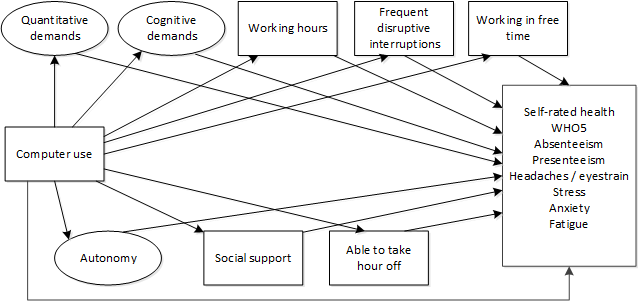

# ICT and occupational health
Short analysis of the Eurofound European Working Conditions Survey (EWCS) on the link between ICT and health outcomes of workers in the EU28. Using the R package 'lavaan', a structural equation model (SEM) is estimated that hypothesises the structure in the image below. 

The plot below summarises the results of the SEM, showing the indirect effect of ICT use mediated through job demands and resources as well as the direct effects of ICT on health in addition to that. Those using ICTs tend to report more negative health outcomes, most of which is mediated through their job demands and resources. In addition, some direct effects also remain particularly the effect on headaches or eyestrain stand out.

**Effect of the frequency of using ICT on health outcome**

Looking under the hood we can see that for most indicators the overall indirect effect is the aggregate of both positive and negative effects. This illustrates that the effect of ICT on health is both positive and negative at the same time. Frequent disruptive interruptions, the cognitive dimension and quantitative demands seem to have the strongest effect on health outcomes. ICT works through the mediators more selectively.

**Indirect effects of the frequency of using ICT on health outcome, mediated throug job demands and resources**

See the full code and results in the [R markdown html](http://htmlpreview.github.io/?https://raw.githubusercontent.com/mwilkens1/ICT_health_short_analysis/master/SEM.html?token=AHCPWBJOWZEI42DS62FUFK25CB7NM)

Note: uses 'data/Step 2 - after_recodes_incl_JQI_2703.sav' version of 14/11/2017 as input data (not in Git repository)
