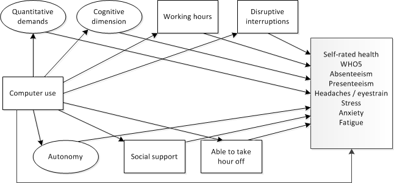

```{r include=FALSE}
library(lavaan)
library(semTools)
library(ggplot2)
library(knitr)
library(survey)
library(scales)
source("EF_colours.R")
```

```{r}
load("data/EWCS_EU28.Rda")
```

#Introduction

Wat is the link between ICT use and health and wellbeing? Some argue that the rise in intensification is due to technological change (e.g. Green, 2002). Chesley (2014) links the ICT use to working to three elements of job strain: working at high speed, interruptions and multitasking. She finds positive associations based on a US sample of employees. Salanova et al. (2013) argue that the use of ICTs is associated with technostrain (anxiety, fatigue, scepticism and inefficacy beliefs) and technoaddition. A systematic review by Berg-Beckhoff et al. (2017) shows that ICT use is associated with stress in cross-sectional studies, although not in intervention studies. Also, they find evidence for a link between ICT and burnout, but no links between ICT use and anxiety or mental health. Stadin et al (2016) use a longitudinal survey to show links between ICT demands with job strain, effort reward imbalance and lower self-rated health. Supporting a more favourable view on the effects of ICT use, Charalampous at al. (2018) show in a systematic review of the literature that teleworking is related to more positive emotions, higher job satisfaction, more autonomy andcommitment and amerioralte feelings of emotional exhaustion.

Ter Hoeven et al. (2016) suggest a more nuanced view and focus not only on the negative but also on the positive aspects of ICT use, arguing that focusing on job demands only will show negative links between ICT use and health while focusing on job resources only will show positive links. They analyse the effect of ICT use by estimating a JD-R (job demands - resources) model that hypothesises that ICT use enhances effective communication and accessibilty as well as makes work more unpredictable and causes more interruptions. This model is supported by a sample of Dutch employees and also inlcudes links to burnout and engagement, showing that advantages and disadvantages of ICT use are equally strong with regards to burnout while the positive effects on engagements are bigger than the negative effects.  

Eurofound (2019) applies a job demands - job resources model on the EWCS and shows how various working conditions hypothesised to be job demands and resources are related to health outcomes. The following analysis buils on this model by including job demands and resources in a model that also includes how ICT usage is related to these. This allows for an broad scoped investigation of the link between ICT and health. The following analysis differs also from Eurofound (2019) because it focuses on the job demands and resources that are more relevant in the context of using ICTs, as found in the literature. 

When analying how ICT is associated with health and wellbeing in the EWCS, both positive and negative pathways are taken into account. The goal is to estimate a structural equation model that measures the effect of computer use on health outcomes. We are testing the hypothesis that this effect is mediated through both job demands and job resources. From the literature it follows that from what is available in the EWCS; quantitative demands, working time, frequent disruptive interruptions, working in the free time and cognitive demands can be considered relevant job demands. Relevant job resources are autonomy, social support and working time flexibilty. Health and wellbeing in the EWCS is measured by general self-rated health, the WHO-5 mental wellbeing scale, fatigue, anxiety, stress, headaches or eyestrain and absenteeism and presenteeism (working while sick).

The graph below shows the struture of the model that is estimated for this project. The frequency of using computers is hypthesised to have an effect on job demands (above) and job resources (below) which in turn have an effect on a range of health outcomes. Also, we allow for a direct effect of computer use on health outcomes to see if there is still an effect having controlled for all the mediators. It includes (not shown) controls for age, gender, ISCO1, NACE10, education, year and country. These controls are active in the regressions of the effect of computer use on the mediators, as well as the effect of the mediators on the outcomes.  The data are from 2010 and 2015. 

```{r echo=FALSE, out.width = "70%"}

```

It is important to note that the EWCS is cross sectional data. Although the models assumes a causal structure, we cannot test whether any association is in fact the result of a causal process. Structural equation modelling based on cross sectional data casts doubt on these causal assumptions if the model does not fit the data and makes them tentatively more plausible otherwise (Bollen and Pearl, 2013). 

#Descriptive statistics and index check

The following section shows descriptive statistics of the mediators by computer use as well as the mediators by the health outcomes. Some of these mediators in the model are constructed by means of latent variables. In this part several indexes or latent variables are created that will feed into the model. These latent variables are checked first to see if they have a good fit and reliability. Sometimes this is not possible when they are to small to be identified in an estimation. 

##Quantiative demands

To capture quantitative demands, we use the quantitative demands index as formulated in Eurofound (2017). The idea is that computer use will lead to more intensity. It includes the variables working at high speed and tight deadlines. 

Questions included: 

* Q49a: Does your job involve working at high speed? (Never - ... - All of the time)
* Q49b: Does your job involve working to tight deadlines? (Never - ... - All of the time)

The fit of the CFA cannot be tested because there are no degrees of freedom left.

```{r}

QD_m <- 'QD =~ y15_Q49a + y15_Q49b '  

```

The chart below shows that quantitative demands follow a U-shaped pattern when plotted by computer use - working at high speed or tight deadlines are most commmon for those who either use computers all of the time or never. 

```{r, fig.height= 3.15, fig.width=4.5}
df <- subset(EWCS_EU28, select=c(y15_Q30i,w5_EU28,y15_Q49a,y15_Q49b), year==2015)
df$highspeed <- as.numeric(df$y15_Q49a=="All of the time        " | df$y15_Q49a=="Almost all of the time ")
df$tightdead <- as.numeric(df$y15_Q49b=="All of the time        " | df$y15_Q49b=="Almost all of the time ")

svydes <- svydesign(ids=~1, data=df, weights=~w5_EU28)

df1 <- svyby(~highspeed, ~y15_Q30i, svydes, svymean, na.rm = TRUE)
df1 <- cbind(df1, confint(df1))
df1$value <- df1$highspeed 
df1$variable <- "High speed"
df1 <- df1[,-2]

df2 <- svyby(~tightdead, ~y15_Q30i, svydes, svymean, na.rm = TRUE)
df2 <- cbind(df2, confint(df2))
df2$value <- df2$tightdead
df2$variable <- "Tight deadlines"
df2 <- df2[,-2]

df <- rbind(df1,df2)

p <- ggplot(df, aes(x=y15_Q30i, y=value, colour=variable)) +
      geom_errorbar(aes(ymin=`2.5 %`, ymax=`97.5 %`), width=0.2) +
      geom_point(size=2) +
      coord_flip() +
      scale_colour_manual(NULL, values=EF_2c) +
      scale_y_continuous(expand = c(0, 0), limit = c(0.1,0.42), breaks = seq(0.1, 0.4, 0.1), labels = percent_format(accuracy = 1)) +
      labs(title = "Quantitative demands by computer use",
           caption = "Source: EWCS, EU28 in 2015. Bars indicate 95% confidence interval. \nShowing those working at high speed or having tight deadlines 'All or most of the time'",
           x="Computer use",
           y=NULL) +
      theme_minimal(base_size = 8) + 
      theme(legend.position="bottom",
            axis.line = element_line(colour="grey"),
            plot.title = element_text(size=8))

p

ggsave("Quantitative demands by computer use.eps", plot = p, device = "eps", path="charts/",
       scale = 1, width = 8, height = 8, units = "cm")
write.csv(df, file="charts/Quantitative demands by computer use.csv")

```

##Autonomy

The latent variable measuring autonomy is based on Eurofound (2017), except for 'having a say in the choice of colleagues' because that lowers model fit (not shown). Having a computer would be a resources that allows for more autonomy in the job, which could in turn be associated with better health outcomes. 

Questions included:

* Q54a: Are you able to choose or change your order of tasks? (Y/N)
* Q54b: Are you able to choose or change your methods of work? (Y/N)
* Q54c: Are you able to choose or change your speed or rate of work? (Y/N)

The fit of the CFA cannot be tested because there are no degrees of freedom left. Reliability is looking good however.

```{r}

AUT_m <- 'AUT =~ y15_Q54a + y15_Q54b + y15_Q54c'  

fit <- sem(AUT_m, data=subset(EWCS_EU28,year>=2005))
reliability(fit)

```

The chart below shows autonomy by computer use and shows a positive correlation, although there is little difference after 'around 1/4th of the time'

```{r, fig.height= 3.15, fig.width=4.5}
df <- subset(EWCS_EU28, select=c(y15_Q30i,w5_EU28,y15_Q54a,y15_Q54b,y15_Q54c), year==2015)
df$tasks <- as.numeric(df$y15_Q54a)-1
df$methods <- as.numeric(df$y15_Q54b)-1
df$rate <- as.numeric(df$y15_Q54c)-1

svydes <- svydesign(ids=~1, data=df, weights=~w5_EU28)

df1 <- svyby(~tasks, ~y15_Q30i, svydes, svymean, na.rm = TRUE)
df1 <- cbind(df1, confint(df1))
df1$value <- df1$tasks 
df1$variable <- "Tasks"
df1 <- df1[,-2]

df2 <- svyby(~methods, ~y15_Q30i, svydes, svymean, na.rm = TRUE)
df2 <- cbind(df2, confint(df2))
df2$value <- df2$methods
df2$variable <- "Methods"
df2 <- df2[,-2]

df3 <- svyby(~rate, ~y15_Q30i, svydes, svymean, na.rm = TRUE)
df3 <- cbind(df3, confint(df3))
df3$value <- df3$rate
df3$variable <- "Speed or rate"
df3 <- df3[,-2]

df <- rbind(df1,df2)
df <- rbind(df,df3)

p <- ggplot(df, aes(x=y15_Q30i, y=value, colour=variable)) +
      geom_errorbar(aes(ymin=`2.5 %`, ymax=`97.5 %`), width=0.3, position = position_dodge(width=0.5)) +
      geom_point(size=2, position = position_dodge(width=0.5)) +
      coord_flip() +
      scale_colour_manual(NULL, values=EF_3c) +
      scale_y_continuous(expand = c(0, 0),
                         limit = c(0.5,0.85), 
                         breaks = seq(0.5, 0.85, 0.1), 
                         labels = percent_format(accuracy = 1)) +
      labs(title = "Autonomy by computer use",
           caption = "Source: EWCS, EU28 in 2015. Bars indicate 95% confidence interval.",
           x="Computer use",
           y=NULL) +
        theme_minimal(base_size = 8) + 
        theme(legend.position="bottom",
            axis.line = element_line(colour="grey"),
            plot.title = element_text(size=8))

p

ggsave("Autonomy by computer use.eps", plot = p, device = "eps", path="charts/",
       scale = 1, width = 8, height = 8, units = "cm")
write.csv(df, file="charts/Autonomy by computer use.csv")

```

##Cognitive demands

Based on EWCS6 overview report job quality index. It measures the extent to which workers apply their skills in the job and the extent to which they can learn on the job. This would impact their health positively and is seen as a resource. However, we find negative associations with health, so here it is framed as a demand. Cognitive aspects of the job are likely to be a double edged sword - on the one hand they provide the worker with more learning opportunties and interesting work, while on the other hand it also brings more responsibility. 

Questions included:

* Q53c: Generally, does your main paid job involve solving unforeseen problems on your own? (Y/N)
* Q53e: Generally, does your main paid job involve complex tasks? (Y/N)
* Q53f: Generally, does your main paid job involve learning new things? (Y/N)

The fit cant be tested in isolation, but when combining it with other models it shows that 'ability to apply own ideas' which is originally part of this index does not fit very well so that item is dropped. The reliability is on the low side. 

```{r}

CD_m <- 'CD =~ y15_Q53c + y15_Q53e + y15_Q53f'  

fit <- sem(CD_m, data=subset(EWCS_EU28,year>=2005))
reliability(fit)

```

Chart shows a positive relation with computer use, although the effect is stronger at the bottom. 

```{r, fig.height= 3.15, fig.width=4.5}
df <- subset(EWCS_EU28, select=c(y15_Q30i,w5_EU28,y15_Q53c,y15_Q53e,y15_Q53f), year==2015)
df$problems <- as.numeric(df$y15_Q53c)-1
df$complex <- as.numeric(df$y15_Q53e)-1
df$newthings <- as.numeric(df$y15_Q53f)-1

svydes <- svydesign(ids=~1, data=df, weights=~w5_EU28)

df1 <- svyby(~problems, ~y15_Q30i, svydes, svymean, na.rm = TRUE)
df1 <- cbind(df1, confint(df1))
df1$value <- df1$problems 
df1$variable <- "Solving unforeseen \nproblems"
df1 <- df1[,-2]

df2 <- svyby(~complex, ~y15_Q30i, svydes, svymean, na.rm = TRUE)
df2 <- cbind(df2, confint(df2))
df2$value <- df2$complex
df2$variable <- "Complex \ntasks"
df2 <- df2[,-2]

df3 <- svyby(~newthings, ~y15_Q30i, svydes, svymean, na.rm = TRUE)
df3 <- cbind(df3, confint(df3))
df3$value <- df3$newthings
df3$variable <- "Learning \nnew things"
df3 <- df3[,-2]

df <- rbind(df1,df2)
df <- rbind(df,df3)

p <- ggplot(df, aes(x=y15_Q30i, y=value, colour=variable)) +
      geom_errorbar(aes(ymin=`2.5 %`, ymax=`97.5 %`), width=0.3) +
      geom_point(size=2) +
      coord_flip() +
      scale_colour_manual(NULL, values=EF_3c) +
      scale_y_continuous(expand = c(0, 0),
                         limit = c(0.4,0.95), 
                         breaks = seq(0.4, 0.95, 0.1), 
                         labels = percent_format(accuracy = 1)) +
      labs(title = "Cognitive demands by computer use",
           caption = "Source: EWCS, EU28 in 2015. Bars indicate 95% confidence interval.",
           x="Computer use",
           y=NULL) +
      theme_minimal(base_size = 8) + 
      theme(legend.position="bottom",
            axis.line = element_line(colour="grey"),
            plot.title = element_text(size=8))

p

ggsave("Cognitive demands by computer use.eps", plot = p, device = "eps", path="charts/",
       scale = 1, width = 8, height = 8, units = "cm")
write.csv(df, file="charts/cognitive demands by computer use.csv")

```


##Social support

Social support is a latent variable that is measured by two questions:

* Q61a: Your colleagues help and support you (Never - ... - Always)
* Q61b: Your manager helps and supports you (Never - ... - Always)

Q61b is the only variable in the analysis asked to employees only. So to be able to include self-employed this item is excluded. 

Chart below shows a positive association of computer use and social support. Again, the correlation is mostly concentrated around the bottom. 

```{r, fig.height= 3.15, fig.width=4.5}
df <- subset(EWCS_EU28, select=c(y15_Q30i,w5_EU28,y15_Q61a,y15_Q61b), year==2015)
df$colleagues <- as.numeric(df$y15_Q61a=="Most of the time             " | df$y15_Q61a=="Always                       ")
df$manager    <- as.numeric(df$y15_Q61b=="Most of the time             " | df$y15_Q61b=="Always                       ")

svydes <- svydesign(ids=~1, data=df, weights=~w5_EU28)

df1 <- svyby(~colleagues, ~y15_Q30i, svydes, svymean, na.rm = TRUE)
df1 <- cbind(df1, confint(df1))
df1$value <- df1$colleagues 
df1$variable <- "Colleagues"
df1 <- df1[,-2]

df2 <- svyby(~manager, ~y15_Q30i, svydes, svymean, na.rm = TRUE)
df2 <- cbind(df2, confint(df2))
df2$value <- df2$manager
df2$variable <- "Manager"
df2 <- df2[,-2]

df <- rbind(df1,df2)

p <- ggplot(df, aes(x=y15_Q30i, y=value, colour=variable)) +
      geom_errorbar(aes(ymin=`2.5 %`, ymax=`97.5 %`), width=0.3) +
      geom_point(size=2) +
      coord_flip() +
      scale_colour_manual(NULL, values=EF_2c) +
      scale_y_continuous(expand = c(0, 0),
                         limit = c(0.5,0.82), 
                         breaks = seq(0.5, 0.8, 0.1), 
                         labels = percent_format(accuracy = 1)) +
      labs(title = "Social support by computer use",
           caption = "Source: EWCS, EU28 in 2015. Bars indicate 95% confidence interval. \nShowing those who answer 'allmost or all of the time'",
           x="Computer use",
           y=NULL) +
      theme_minimal(base_size = 8) + 
      theme(legend.position="bottom",
            axis.line = element_line(colour="grey"),
            plot.title = element_text(size=8))

p

ggsave("Social support by computer use.eps", plot = p, device = "eps", path="charts/",
       scale = 1, width = 8, height = 8, units = "cm")
write.csv(df, file="charts/Social support by computer use.csv")

```

##Working hours

Positive relation between working hours and ICT use, again most strong correlation at the bottom. 

```{r, fig.height= 3.15, fig.width=4.5}
df <- subset(EWCS_EU28, select=c(y15_Q30i,w5_EU28,totalhour), year==2015)

svydes <- svydesign(ids=~1, data=df, weights=~w5_EU28)

df <- svyby(~totalhour, ~y15_Q30i, svydes, svyquantile, quantiles=c(.05,.25,.50,.75,.95), na.rm = TRUE, keep.var=FALSE)

p <- ggplot(df) +
      geom_boxplot(aes(x = y15_Q30i, 
                       lower = statistic2, 
                       middle=statistic3,
                       upper=statistic4,
                       ymin=statistic1,
                       ymax=statistic5), 
                    stat="identity", fill=EF_orange) +
      coord_flip() +
      scale_y_continuous(expand = c(0, 0),
                         limit = c(0,65), 
                         breaks = seq(0, 60, 10)) +
      labs(title = "Usual working hours by computer use",
           caption = "Source: EWCS, EU28 in 2015.",
           x="Computer use",
           y=NULL) +
      theme_minimal(base_size = 8) + 
      theme(legend.position="bottom",
            axis.line = element_line(colour="grey"),
            plot.title = element_text(size=8))

p

colnames(df)[-1] <- c("5%","25%","50%","75%","95%")

ggsave("Working hours by computer use.eps", plot = p, device = "eps", path="charts/",
       scale = 1, width = 8, height = 8, units = "cm")
write.csv(df, file="charts/Working hours by computer use.csv")

```

##Frequent disruptive interruptions

Shows a positive correlation in a quite linear way. 

```{r, fig.height= 3.15, fig.width=4.5}
df <- subset(EWCS_EU28, select=c(y15_Q30i,w5_EU28,freq_dis_int), year==2015)
df$freq_dis_int <- as.numeric(df$freq_dis_int)-1

svydes <- svydesign(ids=~1, data=df, weights=~w5_EU28)

df1 <- svyby(~freq_dis_int, ~y15_Q30i, svydes, svymean, na.rm = TRUE)
df1 <- cbind(df1, confint(df1))
df1$value <- df1$freq_dis_int 
df1$variable <- "freq_dis_int"
df <- df1[,-2]

p <- ggplot(df, aes(x=y15_Q30i, y=value)) +
      geom_errorbar(aes(ymin=`2.5 %`, ymax=`97.5 %`), width=0.3, colour=EF_blue) +
      geom_point(size=2, colour=EF_blue) +
      coord_flip() +
      scale_y_continuous(expand = c(0, 0),
                         limit = c(0.0,0.3), 
                         breaks = seq(0.0, 0.3, 0.1), 
                         labels = percent_format(accuracy = 1)) +
      labs(title = "Frequent disruptive interruptions by computer use",
           caption = "Source: EWCS, EU28 in 2015. Bars indicate 95% confidence interval.",
           x="Computer use",
           y=NULL) +
      theme_minimal(base_size = 8) + 
      theme(legend.position="bottom",
            axis.line = element_line(colour="grey"),
            plot.title = element_text(size=8))

p

ggsave("Frequent disruptive interruptions by computer use.eps", plot = p, device = "eps", path="charts/",
       scale = 1, width = 8, height = 8, units = "cm")
write.csv(df, file="charts/Frequent disruptive interruptions by computer use.csv")

```

##Working in free time

The question in the EWCS is: "Over the last 12 months, how often have you worked in your free time to meet work demands?". It shows a positive correlation, although mostly between 'never' and 'almost never' and the rest. 

```{r, fig.height= 3.15, fig.width=4}
df <- subset(EWCS_EU28, select=c(y15_Q30i,w5_EU28,y15_Q46), year==2015)
df$freetime <- as.numeric(df$y15_Q46=="Daily                        " | df$y15_Q46=="Several times a week         ")

svydes <- svydesign(ids=~1, data=df, weights=~w5_EU28)

df1 <- svyby(~freetime, ~y15_Q30i, svydes, svymean, na.rm = TRUE)
df1 <- cbind(df1, confint(df1))
df1$value <- df1$freetime 
df1$variable <- "Working in free time"
df <- df1[,-2]

p <- ggplot(df, aes(x=y15_Q30i, y=value)) +
      geom_errorbar(aes(ymin=`2.5 %`, ymax=`97.5 %`), width=0.3, colour=EF_blue) +
      geom_point(size=2, colour=EF_blue) +
      coord_flip() +
      scale_y_continuous(expand = c(0, 0),
                         limit = c(0.0,0.3), 
                         breaks = seq(0.0, 0.3, 0.1), 
                         labels = percent_format(accuracy = 1)) +
      labs(title = "Working in the free time for work demands by computer use",
           caption = "Source: EWCS, EU28 in 2015. Bars indicate 95% confidence interval. \nShowing those who respond 'Daily' or 'Several times a week'",
           x="Computer use",
           y=NULL) +
      theme_minimal(base_size = 8) + 
      theme(legend.position="bottom",
            axis.line = element_line(colour="grey"),
            plot.title = element_text(size=8))
p

ggsave("Working in the free time for work demands by computer use.eps", plot = p, device = "eps", path="charts/",
       scale = 1, width = 8, height = 8, units = "cm")
write.csv(df, file="charts/Working in the free time for work demands by computer use.csv")

```

##Able to take an hour off

The question in the EWCS is 'Would you say that for you arranging to take an hour or two off during working hours to take care of personal or family matters is...?'. The chart below shows a positive correlation between computer use and this question. The relationship seems to be quite linear. 

```{r, fig.height= 3.15, fig.width=4}
df <- subset(EWCS_EU28, select=c(y15_Q30i,w5_EU28,y15_Q47), year==2015)
df$able <- as.numeric(df$y15_Q47=="Fairly easy                 " | df$y15_Q47=="Very easy                   ")

svydes <- svydesign(ids=~1, data=df, weights=~w5_EU28)

df1 <- svyby(~able, ~y15_Q30i, svydes, svymean, na.rm = TRUE)
df1 <- cbind(df1, confint(df1))
df1$value <- df1$able 
df1$variable <- "Able to take an hour off"
df <- df1[,-2]

p <- ggplot(df, aes(x=y15_Q30i, y=value)) +
      geom_errorbar(aes(ymin=`2.5 %`, ymax=`97.5 %`), width=0.3, colour=EF_blue) +
      geom_point(size=2, colour=EF_blue) +
      coord_flip() +
      scale_y_continuous(expand = c(0, 0),
                         limit = c(0.5,0.8), 
                         breaks = seq(0.5, 0.8, 0.05), 
                         labels = percent_format(accuracy = 1)) +
      labs(title = "Ability to take an hour off by computer use",
           caption = "Source: EWCS, EU28 in 2015. Bars indicate 95% confidence interval. \nShowing those who respond fairly or very easy",
           x="Computer use",
           y=NULL) +
      theme_minimal(base_size = 8) + 
      theme(legend.position="bottom",
            axis.line = element_line(colour="grey"),
            plot.title = element_text(size=8))

p

ggsave("Ability to take an hour off by computer use.eps", plot = p, device = "eps", path="charts/",
       scale = 1, width = 8, height = 8, units = "cm")
write.csv(df, file="charts/Ability to take an hour off by computer use.csv")

```

##WHO5

Turning now to the health outcomes. WHO-5 is the measurement of mental wellbeing and is considered as an outcome variable in this analysis. The data fits the CFA very well and the index shows a high degree of reliability. 

```{r}

WHO5 <- 'WHO5 =~ y15_Q87a + y15_Q87b + y15_Q87c + y15_Q87d + y15_Q87e'

fit <- sem(WHO5, data=subset(EWCS_EU28,year>=2005))
reliability(fit)

```

The chart below shows there is hardly any difference in WHO5 by computer use. So we wouldn't expect to find strong effects of computer use on WHO5, mediated or not. 

```{r, fig.height= 3.15, fig.width=4}
idx <- lavInspect(fit,"case.idx")
scores <- lavPredict(fit)
df <- subset(EWCS_EU28,year>=2005)
df[idx,"WHO5"] <- scores[,"WHO5"]

df <- subset(df, select=c(y15_Q30i,w5_EU28,WHO5), year==2015)

svydes <- svydesign(ids=~1, data=df, weights=~w5_EU28)

df1 <- svyby(~WHO5, ~y15_Q30i, svydes, svymean, na.rm = TRUE)
df1 <- cbind(df1, confint(df1))
df1$value <- df1$WHO5 
df1$variable <- "WHO5"
df <- df1[,-2]

p <- ggplot(df, aes(x=y15_Q30i, y=value)) +
      geom_errorbar(aes(ymin=`2.5 %`, ymax=`97.5 %`), width=0.3, colour=EF_blue) +
      geom_point(size=2, colour=EF_blue) +
      coord_flip() +
      labs(title = "WHO5 by computer use",
           caption = "Source: EWCS, EU28 in 2015. Bars indicate 95% confidence interval.",
           x="Computer use",
           y=NULL) +
      theme(legend.position="bottom",
            axis.line = element_line(colour="grey"),
            plot.title = element_text(size=8))
p

ggsave("Ability to take an hour off by computer use.eps", plot = p, device = "eps", path="charts/",
       scale = 1, width = 8, height = 8, units = "cm")
write.csv(df, file="charts/Ability to take an hour off by computer use.csv")

```

##Self rated health

The question in the EWCS is How is your health in general? Would you say it is … (very good - ... - very bad). The chart below shows the proportion of workers reporting 'bad' or 'very bad' health and it shows that those using a computer more often tend to report less often they have a bad health. Especially those who never use computers tend to report a bad health. Probably a lot of this is due to selection - those in manual occupations tend to use computers less and also tend to be of lower socio economic status, both of which is negatively related to health.


```{r, fig.height= 3.15, fig.width=4}
df <- subset(EWCS_EU28, select=c(y15_Q30i,w5_EU28,y15_Q75), year==2015)
df$badhealth <- as.numeric(df$y15_Q75=="Very bad                    " | df$y15_Q75=="Bad                         ")

svydes <- svydesign(ids=~1, data=df, weights=~w5_EU28)

df1 <- svyby(~badhealth, ~y15_Q30i, svydes, svymean, na.rm = TRUE)
df1 <- cbind(df1, confint(df1))
df1$value <- df1$badhealth 
df1$variable <- "Bad health"
df <- df1[,-2]

p <- ggplot(df, aes(x=y15_Q30i, y=value)) +
      geom_errorbar(aes(ymin=`2.5 %`, ymax=`97.5 %`), width=0.3, colour=EF_blue) +
      geom_point(size=2, colour=EF_blue) +
      coord_flip() +
      labs(title = "Bad self reported health by computer use",
           caption = "Source: EWCS, EU28 in 2015. Bars indicate 95% confidence interval.",
           x="Computer use",
           y=NULL) +
      theme(legend.position="bottom",
            axis.line = element_line(colour="grey"),
            plot.title = element_text(size=8))
p

ggsave("Bad self reported health by computer use.eps", plot = p, device = "eps", path="charts/",
       scale = 1, width = 8, height = 8, units = "cm")
write.csv(df, file="charts/Bad self reported health by computer use.csv")

```

##Absenteeism and presenteeism 

Chart below shows the proportion of workers who report being absent from work due to sick leave or health-related leave at least one day in the past 12 months. Also, it shows presenteeism - working while sick at least once in the past 12 months. Both show a positive correlation with computer use - the more frequent computer use, the more absenteeism as well as presenteeism. Being absent for at least 5 days shows no correlation with computer use. 

```{r, fig.height= 3.15, fig.width=4.5}
df <- subset(EWCS_EU28, select=c(y15_Q30i,w5_EU28,absenteeism,presenteeism,absent_ESAW), year==2015)
df$abs <- as.numeric(df$absenteeism)-1
df$pre <- as.numeric(df$presenteeism)-1
df$abs5 <- as.numeric(df$absent_ESAW)-1

svydes <- svydesign(ids=~1, data=df, weights=~w5_EU28)

df1 <- svyby(~abs, ~y15_Q30i, svydes, svymean, na.rm = TRUE)
df1 <- cbind(df1, confint(df1))
df1$value <- df1$abs 
df1$variable <- "Absenteeism"
df1 <- df1[,-2]

df2 <- svyby(~pre, ~y15_Q30i, svydes, svymean, na.rm = TRUE)
df2 <- cbind(df2, confint(df2))
df2$value <- df2$pre
df2$variable <- "Presenteeism"
df2 <- df2[,-2]

df3 <- svyby(~abs5, ~y15_Q30i, svydes, svymean, na.rm = TRUE)
df3 <- cbind(df3, confint(df3))
df3$value <- df3$abs5
df3$variable <- "Absent >4 days"
df3 <- df3[,-2]

df <- rbind(df1,df2)
df <- rbind(df,df3)

p <- ggplot(df, aes(x=y15_Q30i, y=value, colour=variable)) +
      geom_errorbar(aes(ymin=`2.5 %`, ymax=`97.5 %`), width=0.2, position = position_dodge(width=0.5)) +
      geom_point(size=2, position = position_dodge(width=0.5)) +
      coord_flip() +
      scale_colour_manual(NULL, values=EF_3c) +
      scale_y_continuous(expand = c(0, 0), limit = c(0.2,0.55), breaks = seq(0.2, 0.55, 0.05), labels = percent_format(accuracy = 1)) +
      labs(title = "Absenteeism and presenteeism by computer use",
           caption = "Source: EWCS, EU28 in 2015. Bars indicate 95% confidence interval.",
           x="Computer use",
           y=NULL) +
      theme_minimal(base_size = 8) + 
      theme(legend.position="bottom",
            axis.line = element_line(colour="grey"),
            plot.title = element_text(size=8))

p

ggsave("Absenteeism and presenteeism by computer use.eps", plot = p, device = "eps", path="charts/",
       scale = 1, width = 8, height = 8, units = "cm")
write.csv(df, file="charts/Absenteeism and presenteeism by computer use.csv")

```

##Headaches / eyestrain

Having headaches or eyestrain in the 12 months prior to the survey is reported mroe often by those who use computers. There is quite a linear positive correlation between the two.  

```{r, fig.height= 3.15, fig.width=4}
df <- subset(EWCS_EU28, select=c(y15_Q30i,w5_EU28,headeye), year==2015)
df$headache <- as.numeric(df$headeye)-1

svydes <- svydesign(ids=~1, data=df, weights=~w5_EU28)

df1 <- svyby(~headache, ~y15_Q30i, svydes, svymean, na.rm = TRUE)
df1 <- cbind(df1, confint(df1))
df1$value <- df1$headache 
df1$variable <- "Headache / eyestrain"
df <- df1[,-2]

p <- ggplot(df, aes(x=y15_Q30i, y=value)) +
      geom_errorbar(aes(ymin=`2.5 %`, ymax=`97.5 %`), width=0.3, colour=EF_blue) +
      geom_point(size=2, colour=EF_blue) +
      coord_flip() +
      scale_y_continuous(expand = c(0, 0), limit = c(0.25,0.50), breaks = seq(0.25, 0.50, 0.05), labels = percent_format(accuracy = 1)) +
      labs(title = "Headaches or eystrain by computer use",
           caption = "Source: EWCS, EU28 in 2015. Bars indicate 95% confidence interval.",
           x="Computer use",
           y=NULL) +
      theme_minimal(base_size = 8) + 
      theme(legend.position="bottom",
            axis.line = element_line(colour="grey"),
            plot.title = element_text(size=8))

p

ggsave("Headaches or eystrain by computer use.eps", plot = p, device = "eps", path="charts/",
       scale = 1, width = 8, height = 8, units = "cm")
write.csv(df, file="charts/Headaches or eystrain by computer use.csv")

```

##Anxiety, stress and fatigue

Chart shows that anxiety and stress are correlated to computer use, but fatigue is not. 

```{r, fig.height= 3.15, fig.width=4.5}
df <- subset(EWCS_EU28, select=c(y15_Q30i,w5_EU28,anxiety,fatigue,stress), year==2015)
df$anxiety <- as.numeric(df$anxiety)-1
df$fatigue <- as.numeric(df$fatigue)-1
df$stress <- as.numeric(df$stress=="Most of the time             " | df$stress=="Always                       ")

svydes <- svydesign(ids=~1, data=df, weights=~w5_EU28)

df1 <- svyby(~anxiety, ~y15_Q30i, svydes, svymean, na.rm = TRUE)
df1 <- cbind(df1, confint(df1))
df1$value <- df1$anxiety 
df1$variable <- "Anxiety"
df1 <- df1[,-2]

df2 <- svyby(~fatigue, ~y15_Q30i, svydes, svymean, na.rm = TRUE)
df2 <- cbind(df2, confint(df2))
df2$value <- df2$fatigue
df2$variable <- "Fatigue"
df2 <- df2[,-2]

df3 <- svyby(~stress, ~y15_Q30i, svydes, svymean, na.rm = TRUE)
df3 <- cbind(df3, confint(df3))
df3$value <- df3$stress
df3$variable <- "Stress"
df3 <- df3[,-2]

df <- rbind(df1,df2)
df <- rbind(df,df3)

p <- ggplot(df, aes(x=y15_Q30i, y=value, colour=variable)) +
      geom_errorbar(aes(ymin=`2.5 %`, ymax=`97.5 %`), width=0.2, position = position_dodge(width=0.5)) +
      geom_point(size=2, position = position_dodge(width=0.5)) +
      coord_flip() +
      scale_colour_manual(NULL, values=EF_3c) +
      scale_y_continuous(expand = c(0, 0), limit = c(0,0.42), breaks = seq(0, 0.4, 0.1), labels = percent_format(accuracy = 1)) +
      labs(title = "Anxiety, stress and fatigue by computer use",
           caption = "Source: EWCS, EU28 in 2015. Bars indicate 95% confidence interval.",
           x="Computer use",
           y=NULL) +
      theme_minimal(base_size = 8) + 
      theme(legend.position="bottom",
            axis.line = element_line(colour="grey"),
            plot.title = element_text(size=8))

p

ggsave("Anxiety, stress and fatigue by computer use.eps", plot = p, device = "eps", path="charts/",
       scale = 1, width = 8, height = 8, units = "cm")
write.csv(df, file="charts/Anxiety, stress and fatigue by computer use.csv")

```

##Overall reliability check

Most of the latent variables mentioned above cannot be identified in isolation. They can, however, if they are inlcuded in a larger structure. The output below shows that overall the fit as well as the reliabilty looks good (omega >0.7) except for the reliability of the congnitive dimension. 

```{r}

model <-   'QD   =~ y15_Q49a + y15_Q49b
            AUT  =~ y15_Q54a + y15_Q54b + y15_Q54c
            CD   =~ y15_Q53c + y15_Q53e + y15_Q53f
            SS   =~ y15_Q61a + y15_Q61b
            WHO5 =~ y15_Q87a + y15_Q87b + y15_Q87c + y15_Q87d + y15_Q87e '

fit <- sem(model,data=subset(EWCS_EU28,year>=2010))
fitmeasures(fit,fit.measures=c("tli","cfi","rni","rmsea"))
reliability(fit)
    
```

#Structural model

##Model estimation

Creating a variable that is the interaction between the year 2015 and computer use. This should reflect the change in the question and control the other coefficients for that effect. Its equal to computer in 2015, and zero otherwise. 

```{r}
EWCS_EU28$comp15 <- EWCS_EU28$computer*EWCS_EU28$w2015
```

The actual definition of the model in R is hidden because of the amount of text. 

```{r include=FALSE}

sm1  <- '#Measurement models
           QD   =~ y15_Q49a + y15_Q49b
           AUT  =~ y15_Q54a + y15_Q54b + y15_Q54c
           CD   =~ y15_Q53c + y15_Q53e + y15_Q53f
           WHO5 =~ y15_Q87a + y15_Q87b + y15_Q87c + y15_Q87d + y15_Q87e 
     
         #JDR regressions
           QD           ~ a0*computer + age + woman + ISCO_d2 + ISCO_d3 + ISCO_d4 + ISCO_d5 + ISCO_d6 + ISCO_d7 + ISCO_d8 + ISCO_d9 + edu_low + edu_high + w2015 + comp15 +
                          nace_d2 + nace_d3 + nace_d4 + nace_d5 + nace_d6 + nace_d7 + nace_d8 + nace_d9 + nace_d10 +
                          countidBulgaria + countidCzech_Republic + countidDenmark + countidGermany + countidEstonia +
                          countidGreece + countidSpain + countidFrance + countidIreland + countidItaly +
                          countidCyprus + countidLatvia + countidLithuania + countidLuxembourg +
                          countidHungary + countidMalta + countidNetherlands + countidAustria +
                          countidPoland + countidPortugal + countidRomania + countidSlovenia +
                          countidSlovakia + countidFinland + countidSweden + countidUnited_Kingdom +
                          countidCroatia 

           AUT          ~ b0*computer + age + woman + ISCO_d2 + ISCO_d3 + ISCO_d4 + ISCO_d5 + ISCO_d6 + ISCO_d7 + ISCO_d8 + ISCO_d9 + edu_low + edu_high + w2015 + comp15 +
                          nace_d2 + nace_d3 + nace_d4 + nace_d5 + nace_d6 + nace_d7 + nace_d8 + nace_d9 + nace_d10 +
                          countidBulgaria + countidCzech_Republic + countidDenmark + countidGermany + countidEstonia +
                          countidGreece + countidSpain + countidFrance + countidIreland + countidItaly +
                          countidCyprus + countidLatvia + countidLithuania + countidLuxembourg +
                          countidHungary + countidMalta + countidNetherlands + countidAustria +
                          countidPoland + countidPortugal + countidRomania + countidSlovenia +
                          countidSlovakia + countidFinland + countidSweden + countidUnited_Kingdom +
                          countidCroatia 

           CD           ~ c0*computer + age + woman + ISCO_d2 + ISCO_d3 + ISCO_d4 + ISCO_d5 + ISCO_d6 + ISCO_d7 + ISCO_d8 + ISCO_d9 + edu_low + edu_high + w2015 + comp15 +
                          nace_d2 + nace_d3 + nace_d4 + nace_d5 + nace_d6 + nace_d7 + nace_d8 + nace_d9 + nace_d10 +
                          countidBulgaria + countidCzech_Republic + countidDenmark + countidGermany + countidEstonia +
                          countidGreece + countidSpain + countidFrance + countidIreland + countidItaly +
                          countidCyprus + countidLatvia + countidLithuania + countidLuxembourg +
                          countidHungary + countidMalta + countidNetherlands + countidAustria +
                          countidPoland + countidPortugal + countidRomania + countidSlovenia +
                          countidSlovakia + countidFinland + countidSweden + countidUnited_Kingdom +
                          countidCroatia 

           SS           ~ d0*computer + age + woman + ISCO_d2 + ISCO_d3 + ISCO_d4 + ISCO_d5 + ISCO_d6 + ISCO_d7 + ISCO_d8 + ISCO_d9 + edu_low + edu_high + w2015 + comp15 +
                          nace_d2 + nace_d3 + nace_d4 + nace_d5 + nace_d6 + nace_d7 + nace_d8 + nace_d9 + nace_d10 +
                          countidBulgaria + countidCzech_Republic + countidDenmark + countidGermany + countidEstonia +
                          countidGreece + countidSpain + countidFrance + countidIreland + countidItaly +
                          countidCyprus + countidLatvia + countidLithuania + countidLuxembourg +
                          countidHungary + countidMalta + countidNetherlands + countidAustria +
                          countidPoland + countidPortugal + countidRomania + countidSlovenia +
                          countidSlovakia + countidFinland + countidSweden + countidUnited_Kingdom +
                          countidCroatia 

           freq_dis_int ~ e0*computer + age + woman + ISCO_d2 + ISCO_d3 + ISCO_d4 + ISCO_d5 + ISCO_d6 + ISCO_d7 + ISCO_d8 + ISCO_d9 + edu_low + edu_high + w2015 + comp15 +
                          nace_d2 + nace_d3 + nace_d4 + nace_d5 + nace_d6 + nace_d7 + nace_d8 + nace_d9 + nace_d10 +
                          countidBulgaria + countidCzech_Republic + countidDenmark + countidGermany + countidEstonia +
                          countidGreece + countidSpain + countidFrance + countidIreland + countidItaly +
                          countidCyprus + countidLatvia + countidLithuania + countidLuxembourg +
                          countidHungary + countidMalta + countidNetherlands + countidAustria +
                          countidPoland + countidPortugal + countidRomania + countidSlovenia +
                          countidSlovakia + countidFinland + countidSweden + countidUnited_Kingdom +
                          countidCroatia 

           totalhour    ~ f0*computer + age + woman + ISCO_d2 + ISCO_d3 + ISCO_d4 + ISCO_d5 + ISCO_d6 + ISCO_d7 + ISCO_d8 + ISCO_d9 + edu_low + edu_high + w2015 + comp15 +
                          nace_d2 + nace_d3 + nace_d4 + nace_d5 + nace_d6 + nace_d7 + nace_d8 + nace_d9 + nace_d10 +
                          countidBulgaria + countidCzech_Republic + countidDenmark + countidGermany + countidEstonia +
                          countidGreece + countidSpain + countidFrance + countidIreland + countidItaly +
                          countidCyprus + countidLatvia + countidLithuania + countidLuxembourg +
                          countidHungary + countidMalta + countidNetherlands + countidAustria +
                          countidPoland + countidPortugal + countidRomania + countidSlovenia +
                          countidSlovakia + countidFinland + countidSweden + countidUnited_Kingdom +
                          countidCroatia 

           y15_Q47      ~ g0*computer + age + woman + ISCO_d2 + ISCO_d3 + ISCO_d4 + ISCO_d5 + ISCO_d6 + ISCO_d7 + ISCO_d8 + ISCO_d9 + edu_low + edu_high + w2015 + comp15 +
                          nace_d2 + nace_d3 + nace_d4 + nace_d5 + nace_d6 + nace_d7 + nace_d8 + nace_d9 + nace_d10 +
                          countidBulgaria + countidCzech_Republic + countidDenmark + countidGermany + countidEstonia +
                          countidGreece + countidSpain + countidFrance + countidIreland + countidItaly +
                          countidCyprus + countidLatvia + countidLithuania + countidLuxembourg +
                          countidHungary + countidMalta + countidNetherlands + countidAustria +
                          countidPoland + countidPortugal + countidRomania + countidSlovenia +
                          countidSlovakia + countidFinland + countidSweden + countidUnited_Kingdom +
                          countidCroatia 
    
          y15_Q46_r  ~    z0*computer + age + woman + ISCO_d2 + ISCO_d3 + ISCO_d4 + ISCO_d5 + ISCO_d6 + ISCO_d7 + ISCO_d8 + ISCO_d9 + edu_low + edu_high + w2015 + comp15 +
                          nace_d2 + nace_d3 + nace_d4 + nace_d5 + nace_d6 + nace_d7 + nace_d8 + nace_d9 + nace_d10 +
                          countidBulgaria + countidCzech_Republic + countidDenmark + countidGermany + countidEstonia +
                          countidGreece + countidSpain + countidFrance + countidIreland + countidItaly +
                          countidCyprus + countidLatvia + countidLithuania + countidLuxembourg +
                          countidHungary + countidMalta + countidNetherlands + countidAustria +
                          countidPoland + countidPortugal + countidRomania + countidSlovenia +
                          countidSlovakia + countidFinland + countidSweden + countidUnited_Kingdom +
                          countidCroatia 


         #outcome regressions 

           WHO5         ~ a1*QD + b1*AUT + c1*CD + d1*SS + e1*freq_dis_int + f1*totalhour + g1*y15_Q47 + z1*y15_Q46_r + h1*computer + 
                          age + woman + ISCO_d2 + ISCO_d3 + ISCO_d4 + ISCO_d5 + ISCO_d6 + ISCO_d7 + ISCO_d8 + ISCO_d9 + edu_low + edu_high + w2015 + comp15 +
                          nace_d2 + nace_d3 + nace_d4 + nace_d5 + nace_d6 + nace_d7 + nace_d8 + nace_d9 + nace_d10 +
                          countidBulgaria + countidCzech_Republic + countidDenmark + countidGermany + countidEstonia +
                          countidGreece + countidSpain + countidFrance + countidIreland + countidItaly +
                          countidCyprus + countidLatvia + countidLithuania + countidLuxembourg +
                          countidHungary + countidMalta + countidNetherlands + countidAustria +
                          countidPoland + countidPortugal + countidRomania + countidSlovenia +
                          countidSlovakia + countidFinland + countidSweden + countidUnited_Kingdom +
                          countidCroatia 

           y15_Q75      ~ a2*QD + b2*AUT + c2*CD + d2*SS + e2*freq_dis_int + f2*totalhour + g2*y15_Q47 + z2*y15_Q46_r + h2*computer + 
                          age + woman + ISCO_d2 + ISCO_d3 + ISCO_d4 + ISCO_d5 + ISCO_d6 + ISCO_d7 + ISCO_d8 + ISCO_d9 + edu_low + edu_high + w2015 + comp15 +
                          nace_d2 + nace_d3 + nace_d4 + nace_d5 + nace_d6 + nace_d7 + nace_d8 + nace_d9 + nace_d10 +
                          countidBulgaria + countidCzech_Republic + countidDenmark + countidGermany + countidEstonia +
                          countidGreece + countidSpain + countidFrance + countidIreland + countidItaly +
                          countidCyprus + countidLatvia + countidLithuania + countidLuxembourg +
                          countidHungary + countidMalta + countidNetherlands + countidAustria +
                          countidPoland + countidPortugal + countidRomania + countidSlovenia +
                          countidSlovakia + countidFinland + countidSweden + countidUnited_Kingdom +
                          countidCroatia 

           anxiety      ~ a3*QD + b3*AUT + c3*CD + d3*SS + e3*freq_dis_int + f3*totalhour + g3*y15_Q47 + z3*y15_Q46_r + h3*computer + 
                          age + woman + ISCO_d2 + ISCO_d3 + ISCO_d4 + ISCO_d5 + ISCO_d6 + ISCO_d7 + ISCO_d8 + ISCO_d9 + edu_low + edu_high + w2015 + comp15 +
                          nace_d2 + nace_d3 + nace_d4 + nace_d5 + nace_d6 + nace_d7 + nace_d8 + nace_d9 + nace_d10 +
                          countidBulgaria + countidCzech_Republic + countidDenmark + countidGermany + countidEstonia +
                          countidGreece + countidSpain + countidFrance + countidIreland + countidItaly +
                          countidCyprus + countidLatvia + countidLithuania + countidLuxembourg +
                          countidHungary + countidMalta + countidNetherlands + countidAustria +
                          countidPoland + countidPortugal + countidRomania + countidSlovenia +
                          countidSlovakia + countidFinland + countidSweden + countidUnited_Kingdom +
                          countidCroatia 

           fatigue      ~ a4*QD + b4*AUT + c4*CD + d4*SS + e4*freq_dis_int + f4*totalhour + g4*y15_Q47 + z4*y15_Q46_r + h4*computer + 
                          age + woman + ISCO_d2 + ISCO_d3 + ISCO_d4 + ISCO_d5 + ISCO_d6 + ISCO_d7 + ISCO_d8 + ISCO_d9 + edu_low + edu_high + w2015 +  comp15 +
                          nace_d2 + nace_d3 + nace_d4 + nace_d5 + nace_d6 + nace_d7 + nace_d8 + nace_d9 + nace_d10 +
                          countidBulgaria + countidCzech_Republic + countidDenmark + countidGermany + countidEstonia +
                          countidGreece + countidSpain + countidFrance + countidIreland + countidItaly +
                          countidCyprus + countidLatvia + countidLithuania + countidLuxembourg +
                          countidHungary + countidMalta + countidNetherlands + countidAustria +
                          countidPoland + countidPortugal + countidRomania + countidSlovenia +
                          countidSlovakia + countidFinland + countidSweden + countidUnited_Kingdom +
                          countidCroatia 

           stress       ~ a5*QD + b5*AUT + c5*CD + d5*SS + e5*freq_dis_int + f5*totalhour + g5*y15_Q47 + z5*y15_Q46_r + h5*computer + 
                          age + woman + ISCO_d2 + ISCO_d3 + ISCO_d4 + ISCO_d5 + ISCO_d6 + ISCO_d7 + ISCO_d8 + ISCO_d9 + edu_low + edu_high + w2015 + comp15 +
                          nace_d2 + nace_d3 + nace_d4 + nace_d5 + nace_d6 + nace_d7 + nace_d8 + nace_d9 + nace_d10 +
                          countidBulgaria + countidCzech_Republic + countidDenmark + countidGermany + countidEstonia +
                          countidGreece + countidSpain + countidFrance + countidIreland + countidItaly +
                          countidCyprus + countidLatvia + countidLithuania + countidLuxembourg +
                          countidHungary + countidMalta + countidNetherlands + countidAustria +
                          countidPoland + countidPortugal + countidRomania + countidSlovenia +
                          countidSlovakia + countidFinland + countidSweden + countidUnited_Kingdom +
                          countidCroatia 

           absenteeism  ~ a6*QD + b6*AUT + c6*CD + d6*SS + e6*freq_dis_int + f6*totalhour + g6*y15_Q47 + z6*y15_Q46_r + h6*computer + 
                          age + woman + ISCO_d2 + ISCO_d3 + ISCO_d4 + ISCO_d5 + ISCO_d6 + ISCO_d7 + ISCO_d8 + ISCO_d9 + edu_low + edu_high + w2015 + comp15 +
                          nace_d2 + nace_d3 + nace_d4 + nace_d5 + nace_d6 + nace_d7 + nace_d8 + nace_d9 + nace_d10 +
                          countidBulgaria + countidCzech_Republic + countidDenmark + countidGermany + countidEstonia +
                          countidGreece + countidSpain + countidFrance + countidIreland + countidItaly +
                          countidCyprus + countidLatvia + countidLithuania + countidLuxembourg +
                          countidHungary + countidMalta + countidNetherlands + countidAustria +
                          countidPoland + countidPortugal + countidRomania + countidSlovenia +
                          countidSlovakia + countidFinland + countidSweden + countidUnited_Kingdom +
                          countidCroatia 

           presenteeism ~ a7*QD + b7*AUT + c7*CD + d7*SS + e7*freq_dis_int + f7*totalhour + g7*y15_Q47 + z7*y15_Q46_r + h7*computer + 
                          age + woman + ISCO_d2 + ISCO_d3 + ISCO_d4 + ISCO_d5 + ISCO_d6 + ISCO_d7 + ISCO_d8 + ISCO_d9 + edu_low + edu_high + w2015 + comp15 +
                          nace_d2 + nace_d3 + nace_d4 + nace_d5 + nace_d6 + nace_d7 + nace_d8 + nace_d9 + nace_d10 +
                          countidBulgaria + countidCzech_Republic + countidDenmark + countidGermany + countidEstonia +
                          countidGreece + countidSpain + countidFrance + countidIreland + countidItaly +
                          countidCyprus + countidLatvia + countidLithuania + countidLuxembourg +
                          countidHungary + countidMalta + countidNetherlands + countidAustria +
                          countidPoland + countidPortugal + countidRomania + countidSlovenia +
                          countidSlovakia + countidFinland + countidSweden + countidUnited_Kingdom +
                          countidCroatia 
    
           headeye      ~ a8*QD + b8*AUT + c8*CD + d8*SS + e8*freq_dis_int + f8*totalhour + g8*y15_Q47 + z8*y15_Q46_r + h8*computer + 
                          age + woman + ISCO_d2 + ISCO_d3 + ISCO_d4 + ISCO_d5 + ISCO_d6 + ISCO_d7 + ISCO_d8 + ISCO_d9 + edu_low + edu_high + w2015 + comp15 +
                          nace_d2 + nace_d3 + nace_d4 + nace_d5 + nace_d6 + nace_d7 + nace_d8 + nace_d9 + nace_d10 +
                          countidBulgaria + countidCzech_Republic + countidDenmark + countidGermany + countidEstonia +
                          countidGreece + countidSpain + countidFrance + countidIreland + countidItaly +
                          countidCyprus + countidLatvia + countidLithuania + countidLuxembourg +
                          countidHungary + countidMalta + countidNetherlands + countidAustria +
                          countidPoland + countidPortugal + countidRomania + countidSlovenia +
                          countidSlovakia + countidFinland + countidSweden + countidUnited_Kingdom +
                          countidCroatia 

         #Covariances
           #Allow the outcomes to correlate with each other
           headeye     ~~ WHO5 + y15_Q75 + anxiety + fatigue + stress + absenteeism + presenteeism        
           WHO5        ~~        y15_Q75 + anxiety + fatigue + stress + absenteeism + presenteeism
           y15_Q75     ~~                  anxiety + fatigue + stress + absenteeism + presenteeism
           anxiety     ~~                            fatigue + stress + absenteeism + presenteeism
           fatigue     ~~                                      stress + absenteeism + presenteeism
           stress      ~~                                               absenteeism + presenteeism
           absenteeism ~~                                                             presenteeism  

          #Allow the mediators to correlate with each other
           QD           ~~ AUT + CD + SS + freq_dis_int + totalhour + y15_Q47 + y15_Q46_r
           AUT          ~~ CD + SS + freq_dis_int + totalhour + y15_Q47 + y15_Q46_r
           CD           ~~ SS + freq_dis_int + totalhour + y15_Q47 + y15_Q46_r
           SS           ~~ freq_dis_int + totalhour + y15_Q47 + y15_Q46_r
           freq_dis_int ~~ totalhour + y15_Q47 + y15_Q46_r
           totalhour    ~~ y15_Q47 + y15_Q46_r
           y15_Q47      ~~ y15_Q46_r

         #Indirect effects
           
           QD0_WHO5         := a0*a1
           QD0_y15_Q75      := a0*a2
           QD0_anxiety      := a0*a3
           QD0_fatigue      := a0*a4
           QD0_stress       := a0*a5
           QD0_absenteeism  := a0*a6
           QD0_presenteeism := a0*a7
           QD0_headeye      := a0*a8

           AUT0_WHO5         := b0*b1
           AUT0_y15_Q75      := b0*b2
           AUT0_anxiety      := b0*b3
           AUT0_fatigue      := b0*b4
           AUT0_stress       := b0*b5
           AUT0_absenteeism  := b0*b6
           AUT0_presenteeism := b0*b7
           AUT0_headeye      := b0*b8

           CD0_WHO5         := c0*c1
           CD0_y15_Q75      := c0*c2
           CD0_anxiety      := c0*c3
           CD0_fatigue      := c0*c4
           CD0_stress       := c0*c5
           CD0_absenteeism  := c0*c6
           CD0_presenteeism := c0*c7
           CD0_headeye      := c0*c8

           SS0_WHO5         := d0*d1
           SS0_y15_Q75      := d0*d2
           SS0_anxiety      := d0*d3
           SS0_fatigue      := d0*d4
           SS0_stress       := d0*d5
           SS0_absenteeism  := d0*d6
           SS0_presenteeism := d0*d7
           SS0_headeye      := d0*d8

           freq_dis_int0_WHO5         := e0*e1
           freq_dis_int0_y15_Q75      := e0*e2
           freq_dis_int0_anxiety      := e0*e3
           freq_dis_int0_fatigue      := e0*e4
           freq_dis_int0_stress       := e0*e5
           freq_dis_int0_absenteeism  := e0*e6
           freq_dis_int0_presenteeism := e0*e7
           freq_dis_int0_headeye      := e0*e8

           totalhour0_WHO5         := f0*f1
           totalhour0_y15_Q75      := f0*f2
           totalhour0_anxiety      := f0*f3
           totalhour0_fatigue      := f0*f4
           totalhour0_stress       := f0*f5
           totalhour0_absenteeism  := f0*f6
           totalhour0_presenteeism := f0*f7
           totalhour0_headeye      := f0*f8

           y15_Q470_WHO5         := g0*g1
           y15_Q470_y15_Q75      := g0*g2
           y15_Q470_anxiety      := g0*g3
           y15_Q470_fatigue      := g0*g4
           y15_Q470_stress       := g0*g5
           y15_Q470_absenteeism  := g0*g6
           y15_Q470_presenteeism := g0*g7
           y15_Q470_headeye      := g0*g8

           y15_Q46_r0_WHO5         := z0*z1
           y15_Q46_r0_y15_Q75      := z0*z2
           y15_Q46_r0_anxiety      := z0*z3
           y15_Q46_r0_fatigue      := z0*z4
           y15_Q46_r0_stress       := z0*z5
           y15_Q46_r0_absenteeism  := z0*z6
           y15_Q46_r0_presenteeism := z0*z7
           y15_Q46_r0_headeye      := z0*z8

         #Direct effects
           computer0_WHO5         := h1
           computer0_y15_Q75      := h2
           computer0_anxiety      := h3
           computer0_fatigue      := h4
           computer0_stress       := h5
           computer0_absenteeism  := h6
           computer0_presenteeism := h7
           computer0_headeye      := h8

         #Total indirect effects
           T0__totalindirect0_WHO5         := QD0_WHO5         + AUT0_WHO5         + CD0_WHO5         + SS0_WHO5         + freq_dis_int0_WHO5         + totalhour0_WHO5         + y15_Q470_WHO5         + y15_Q46_r0_WHO5           
           T0__totalindirect0_y15_Q75      := QD0_y15_Q75      + AUT0_y15_Q75      + CD0_y15_Q75      + SS0_y15_Q75      + freq_dis_int0_y15_Q75      + totalhour0_y15_Q75      + y15_Q470_y15_Q75      + y15_Q46_r0_y15_Q75       
           T0__totalindirect0_anxiety      := QD0_anxiety      + AUT0_anxiety      + CD0_anxiety      + SS0_anxiety      + freq_dis_int0_anxiety      + totalhour0_anxiety      + y15_Q470_anxiety      + y15_Q46_r0_anxiety       
           T0__totalindirect0_fatigue      := QD0_fatigue      + AUT0_fatigue      + CD0_fatigue      + SS0_fatigue      + freq_dis_int0_fatigue      + totalhour0_fatigue      + y15_Q470_fatigue      + y15_Q46_r0_fatigue       
           T0__totalindirect0_stress       := QD0_stress       + AUT0_stress       + CD0_stress       + SS0_stress       + freq_dis_int0_stress       + totalhour0_stress       + y15_Q470_stress       + y15_Q46_r0_stress        
           T0__totalindirect0_absenteeism  := QD0_absenteeism  + AUT0_absenteeism  + CD0_absenteeism  + SS0_absenteeism  + freq_dis_int0_absenteeism  + totalhour0_absenteeism  + y15_Q470_absenteeism  + y15_Q46_r0_absenteeism   
           T0__totalindirect0_presenteeism := QD0_presenteeism + AUT0_presenteeism + CD0_presenteeism + SS0_presenteeism + freq_dis_int0_presenteeism + totalhour0_presenteeism + y15_Q470_presenteeism + y15_Q46_r0_presenteeism  
           T0__totalindirect0_headeye      := QD0_headeye      + AUT0_headeye      + CD0_headeye      + SS0_headeye      + freq_dis_int0_headeye      + totalhour0_headeye      + y15_Q470_headeye      + y15_Q46_r0_headeye      

         #Total effects
           T0__total0_WHO5         := T0__totalindirect0_WHO5         + computer0_WHO5         
           T0__total0_y15_Q75      := T0__totalindirect0_y15_Q75      + computer0_y15_Q75      
           T0__total0_anxiety      := T0__totalindirect0_anxiety      + computer0_anxiety      
           T0__total0_fatigue      := T0__totalindirect0_fatigue      + computer0_fatigue      
           T0__total0_stress       := T0__totalindirect0_stress       + computer0_stress       
           T0__total0_absenteeism  := T0__totalindirect0_absenteeism  + computer0_absenteeism  
           T0__total0_presenteeism := T0__totalindirect0_presenteeism + computer0_presenteeism 
           T0__total0_headeye      := T0__totalindirect0_headeye      + computer0_headeye

'

fit1 <- sem(sm1, data=subset(EWCS_EU28,year>=2010))
fit1_sol <- standardizedsolution(fit1)

```

## Model fit 
From SEM course by Bollen:

* TLI should be >.9 and not too much above 1
* CFI should be >.9 and not too much above 1
* RNI should be >.9 and not too much above 1
* RMSEA should be <0.05. 0.05-0.08 is OK fit and >0.10 is bad fit
* BIC should be < 0. BIC differnence between 0-2: weak evidence, 2-6 is positive, 6-10 strong and >10 very strong

Note: BIC can't be computed with DWLS estimator

The model fit is very good.

```{r}
fitmeasures(fit1,fit.measures=c("tli","cfi","rni","rmsea"))
```

##Results

The first plot below shows the total direct and indirect (mediated) effect of computer use. The sum of the two would be the total effect. Generally the effect of computer use is unfavourable for the health and wellbeing outcomes, although there is no effect for WHO5, and small effects for self-rated health and absenteeism. Interestingly, the positive effect of computer use on presenteeism is much larger than the effect on absenteeism. This might support the hypothesis that digital work is more prone to presenteeism, i.e. its easier to work while sick the more work is done on a computer. 

The direct negative effect of computer use on fatigue is almost as big as the positive indirect effect through the job demands and resources. Adding these up hardly leaves any total effect. It is not clear, however, what this reflects. It signals selection effects, i.e. despite controls for personal characteristics and occupational groups perhaps those who have are less fatigued tend to use computers more often. Alternatively or additionally, it could also reflect any positive effects of ICT use on job resources not included in the model. 

The strong direct effect of ICT use and headache / eyestrain is to be expected. This may reflect the effect of computers that is not mediated through the other variables; headaches and eyestrain from looking at a screen for example. 

Ter Hoeven et al (2016) find no direct effects of computer use on engagement and burnout, but find evidence for a fully mediated model. Chesley (2014) does find some direct negative effects of ICT use on stress after controlling for the mediation through working at high speed, interruptions and multitasking. 

```{r echo=FALSE, fig.height=3.5, fig.width=8}

df2 <- subset(fit1_sol, op==":=")

x <- t(as.data.frame(strsplit(gsub('T0__','', df2$lhs),"0_")))
df2 <- cbind(df2,as.data.frame(x[,1], stringsAsFactors = FALSE))
df2 <- cbind(df2,as.data.frame(x[,2], stringsAsFactors = FALSE))
rm(x)

colnames(df2)[10] <- "Mediator"
colnames(df2)[11] <- "Outcome"

df2$x[grepl("total0",df2$lhs)==TRUE] <- "Total"
df2$x[grepl("totalindirect0",df2$lhs)==TRUE] <- "Indirect"
df2$x[grepl("computer0",df2$lhs)==TRUE] <- "Direct"

df2$Mediator[df2$Mediator=="y15_Q46_r"] <- "Work in free time"
df2$Mediator[df2$Mediator=="y15_Q47"] <- "Take hour off"
df2$Mediator[df2$Mediator=="totalhour"] <- "Weekly working hours"
df2$Mediator[df2$Mediator=="SS"] <- "Social support"
df2$Mediator[df2$Mediator=="QD"] <- "Quantitative demands"
df2$Mediator[df2$Mediator=="freq_dis_int"] <- "Frequent disruptive interruptions"
df2$Mediator[df2$Mediator=="CD"] <- "Cognitive dimension"
df2$Mediator[df2$Mediator=="AUT"] <- "Autonomy"
df2$Mediator[df2$Mediator=="computer"] <- "Computer (direct)"

df2$Mediator <- factor(df2$Mediator, levels=c("Weekly working hours","Work in free time","Quantitative demands","Frequent disruptive interruptions",
                                    "Take hour off","Cognitive dimension","Autonomy","Social support","Computer (direct)"))
df2$Mediator <- factor(df2$Mediator, levels=rev(levels(df2$Mediator)))

df2$Outcome[df2$Outcome=="y15_Q75"] <- "Self-rated health"
df2$Outcome[df2$Outcome=="anxiety"] <- "Anxiety"
df2$Outcome[df2$Outcome=="fatigue"] <- "Fatigue"
df2$Outcome[df2$Outcome=="stress"] <- "Stress"
df2$Outcome[df2$Outcome=="absenteeism"] <- "Absenteeism"
df2$Outcome[df2$Outcome=="presenteeism"] <- "Presenteeism"
df2$Outcome[df2$Outcome=="headeye"] <- "Headache / eyestrain"

df2$sig[df2$pvalue<0.01] <- "p<0.01"
df2$sig[df2$pvalue>=0.01] <- "p>=0.01"

ggplot(subset(df2,x=="Indirect" | x=="Direct"), aes(x=Outcome, y=est.std, fill=x)) + 
  geom_bar(stat="identity") + 
#  geom_errorbar(aes(ymin=ci.lower, ymax=ci.upper), colour="black", width=.1) +
  scale_fill_manual("Effect", values=EF_2c) +
  coord_flip() + 
  labs(title = "Effect of computer use on health indicators",
       subtitle = "Standardised coefficients, direct and mediated through job demands and resources",
       caption = "Source: EWCS 2010 and 2015", 
       x= "Indicator", y = "Standardised coefficient") +
  theme_minimal()

```

The plot below shows the indirect effect of computer use by mediator and by outcome variable. This is thus limited to the effect of computer use mediated through the job demands and resources. Looking under the hood we can see that for most indicators the overall indirect effect is the aggregate of both positive and negative effects. This illustrates that the effect of ICT on health is both positive and negative at the same time. Frequent disruptive interruptions, the cognitive dimension and quantitative demands seem to have the strongest effect on health outcomes. ICT works through the mediators more selectively.  

```{r echo=FALSE, fig.height=4.5, fig.width=8.5}

df2$x2 <- "Direct"
df2$x2[is.na(df2$x)] <- "Indirect"

ggplot(subset(df2,is.na(x) | Mediator== "Computer (direct)"), aes(x=Mediator, y=est.std, fill=x2)) + 
  facet_wrap( ~ Outcome , nrow=2  ) +
  geom_bar(stat="identity") + 
  scale_fill_manual("Effect", values=EF_2c) +
  geom_errorbar(aes(ymin=ci.lower, ymax=ci.upper), colour="black", width=.1) +
  labs(title = "Effect of ICT use mediated through job demands and resources",
       subtitle = "Standardised coefficients, error bar showing 95% confidence interval",
       caption = "Source: EWCS 2010 and 2015", 
       y = "Standardised coefficient") +
  coord_flip() + 
  theme_bw() 

```

The next plot shows the effect of the mediator variable on the outcomes in general, regardless of computer use. All variables are of similar size, except for the effects of autonomy. The indicators behave as expected: job resources have a positive effect and job demands a negative effect, supporting the JD-R theory. The exception is the cognitive dimension. The cognitive dimension has a negative connotation, which may reflect the increased responsibility or cognitive demands that come with that. 


```{r echo=FALSE, fig.height=4, fig.width=8}

df3 <- subset(fit1_sol, op=="~" & 
                (lhs=="absenteeism" | lhs=="presenteeism" | lhs=="anxiety" | lhs=="y15_Q75" | lhs=="WHO5" | lhs=="stress" | lhs=="fatigue" | lhs=="headeye") & 
                (rhs=="QD" | rhs=="AUT" | rhs=="CD" | rhs=="SS" | rhs=="freq_dis_int" | rhs=="totalhour" | rhs=="y15_Q47" | rhs=="y15_Q46_r" ))

df3$lhs[df3$lhs=="y15_Q75"] <- "Self-rated health"
df3$lhs[df3$lhs=="anxiety"] <- "Anxiety"
df3$lhs[df3$lhs=="fatigue"] <- "Fatigue"
df3$lhs[df3$lhs=="stress"] <- "Stress"
df3$lhs[df3$lhs=="absenteeism"] <- "Absenteeism"
df3$lhs[df3$lhs=="presenteeism"] <- "Presenteeism"
df3$lhs[df3$lhs=="headeye"] <- "Headache / eyestrain"

df3$rhs[df3$rhs=="y15_Q46_r"] <- "Work in free time"
df3$rhs[df3$rhs=="y15_Q47"] <- "Take hour off"
df3$rhs[df3$rhs=="totalhour"] <- "Weekly working hours"
df3$rhs[df3$rhs=="SS"] <- "Social support"
df3$rhs[df3$rhs=="QD"] <- "Quantitative demands"
df3$rhs[df3$rhs=="freq_dis_int"] <- "Frequent disruptive interruptions"
df3$rhs[df3$rhs=="CD"] <- "Cognitive dimension"
df3$rhs[df3$rhs=="AUT"] <- "Autonomy"
df3$rhs[df3$rhs=="computer"] <- "Computer (direct)"

df3$rhs <- factor(df3$rhs, levels=c("Weekly working hours","Work in free time","Quantitative demands","Frequent disruptive interruptions",
                                    "Take hour off","Cognitive dimension","Autonomy","Social support","Computer"))
df3$rhs <- factor(df3$rhs, levels=rev(levels(df3$rhs)))

ggplot(df3, aes(x=rhs, y=est.std)) + 
  facet_wrap(~ lhs, nrow=2) +
  geom_bar(stat="identity", fill=EF_blue) + 
  geom_errorbar(aes(ymin=ci.lower, ymax=ci.upper), colour="black", width=.1) +
  coord_flip() + 
  labs(title = "Job demands and resources and health outcomes",
       subtitle = "Standardised coefficients, error bar showing 95% confidence interval",
       caption = "Source: EWCS 2010 and 2015", 
       y = "Standardised coefficient") +
  theme_bw()  + theme(axis.title.y=element_blank())

```


#Model with ICT mobile workers

This model takes structural model 1, but then replaces ICT use with the categories of ICT mobile workers. So we are hypothesising that ICT mobile worker categories have an effect on mediators, which in trun have an effect on health outcomes. Also, we hypothesise a direct effect of ICT mobile worker on health in addition. 

```{r}
EWCS_EU28$alwaysoffice_1 <- as.numeric((EWCS_EU28$cat_ictmob=="Always Office, self-employed" & EWCS_EU28$computer<=5) | EWCS_EU28$cat_ictmob=="Always at employers premise w/o ICT, employee")
EWCS_EU28$alwaysofficeICT_1 <-  as.numeric(EWCS_EU28$cat_ictmob=="Always at employers premise with ICT, employee")
EWCS_EU28$teleworker_1 <- as.numeric(EWCS_EU28$cat_ictmob=="Home-based teleworker, employee")
EWCS_EU28$highmob_1 <- as.numeric(EWCS_EU28$cat_ictmob=="High mobile T/ICTM, employee")
EWCS_EU28$lowmob_1 <- as.numeric( EWCS_EU28$cat_ictmob=="Occasional T/ICTM, employee")
EWCS_EU28$selfICTM <- as.numeric((EWCS_EU28$cat_ictmob=="Always Office, self-employed" & EWCS_EU28$computer>5) | EWCS_EU28$cat_ictmob=="Home-based ICT, self-employed" | EWCS_EU28$cat_ictmob=="High mobile ICT, self-employed" | EWCS_EU28$cat_ictmob=="Low-mobile ICT, self-employed" )

```

```{r include=FALSE}

sm9  <- '#Measurement models
           QD   =~ y15_Q49a + y15_Q49b
           AUT  =~ y15_Q54a + y15_Q54b + y15_Q54c
           CD   =~ y15_Q53c + y15_Q53e + y15_Q53f
           WHO5 =~ y15_Q87a + y15_Q87b + y15_Q87c + y15_Q87d + y15_Q87e 
     
         #JDR regressions
           QD           ~ a0i0*alwaysoffice_1 +
                          a0i1*alwaysofficeICT_1 +
                          a0i2*teleworker_1 +
                          a0i3*highmob_1 +
                          a0i4*lowmob_1 +
                          a0i5*selfICTM +
                          age + woman + ISCO_d2 + ISCO_d3 + ISCO_d4 + ISCO_d5 + ISCO_d6 + ISCO_d7 + ISCO_d8 + ISCO_d9 + edu_low + edu_high + 
                          nace_d2 + nace_d3 + nace_d4 + nace_d5 + nace_d6 + nace_d7 + nace_d8 + nace_d9 + nace_d10 +
                          countidBulgaria + countidCzech_Republic + countidDenmark + countidGermany + countidEstonia +
                          countidGreece + countidSpain + countidFrance + countidIreland + countidItaly +
                          countidCyprus + countidLatvia + countidLithuania + countidLuxembourg +
                          countidHungary + countidMalta + countidNetherlands + countidAustria +
                          countidPoland + countidPortugal + countidRomania + countidSlovenia +
                          countidSlovakia + countidFinland + countidSweden + countidUnited_Kingdom +
                          countidCroatia 

           AUT          ~ b0i0*alwaysoffice_1 +
                          b0i1*alwaysofficeICT_1 +
                          b0i2*teleworker_1 +
                          b0i3*highmob_1 +
                          b0i4*lowmob_1 +
                          b0i5*selfICTM +
                          age + woman + ISCO_d2 + ISCO_d3 + ISCO_d4 + ISCO_d5 + ISCO_d6 + ISCO_d7 + ISCO_d8 + ISCO_d9 + edu_low + edu_high  +
                          nace_d2 + nace_d3 + nace_d4 + nace_d5 + nace_d6 + nace_d7 + nace_d8 + nace_d9 + nace_d10 +
                          countidBulgaria + countidCzech_Republic + countidDenmark + countidGermany + countidEstonia +
                          countidGreece + countidSpain + countidFrance + countidIreland + countidItaly +
                          countidCyprus + countidLatvia + countidLithuania + countidLuxembourg +
                          countidHungary + countidMalta + countidNetherlands + countidAustria +
                          countidPoland + countidPortugal + countidRomania + countidSlovenia +
                          countidSlovakia + countidFinland + countidSweden + countidUnited_Kingdom +
                          countidCroatia 

           CD           ~ c0i0*alwaysoffice_1 +
                          c0i1*alwaysofficeICT_1 +
                          c0i2*teleworker_1 +
                          c0i3*highmob_1 +
                          c0i4*lowmob_1 + 
                          c0i5*selfICTM +
                          age + woman + ISCO_d2 + ISCO_d3 + ISCO_d4 + ISCO_d5 + ISCO_d6 + ISCO_d7 + ISCO_d8 + ISCO_d9 + edu_low + edu_high  +
                          nace_d2 + nace_d3 + nace_d4 + nace_d5 + nace_d6 + nace_d7 + nace_d8 + nace_d9 + nace_d10 +
                          countidBulgaria + countidCzech_Republic + countidDenmark + countidGermany + countidEstonia +
                          countidGreece + countidSpain + countidFrance + countidIreland + countidItaly +
                          countidCyprus + countidLatvia + countidLithuania + countidLuxembourg +
                          countidHungary + countidMalta + countidNetherlands + countidAustria +
                          countidPoland + countidPortugal + countidRomania + countidSlovenia +
                          countidSlovakia + countidFinland + countidSweden + countidUnited_Kingdom +
                          countidCroatia 

           SS           ~ d0i0*alwaysoffice_1 +
                          d0i1*alwaysofficeICT_1 +
                          d0i2*teleworker_1 +
                          d0i3*highmob_1 +
                          d0i4*lowmob_1 +
                          d0i5*selfICTM +
                          age + woman + ISCO_d2 + ISCO_d3 + ISCO_d4 + ISCO_d5 + ISCO_d6 + ISCO_d7 + ISCO_d8 + ISCO_d9 + edu_low + edu_high +
                          nace_d2 + nace_d3 + nace_d4 + nace_d5 + nace_d6 + nace_d7 + nace_d8 + nace_d9 + nace_d10 +
                          countidBulgaria + countidCzech_Republic + countidDenmark + countidGermany + countidEstonia +
                          countidGreece + countidSpain + countidFrance + countidIreland + countidItaly +
                          countidCyprus + countidLatvia + countidLithuania + countidLuxembourg +
                          countidHungary + countidMalta + countidNetherlands + countidAustria +
                          countidPoland + countidPortugal + countidRomania + countidSlovenia +
                          countidSlovakia + countidFinland + countidSweden + countidUnited_Kingdom +
                          countidCroatia 

           freq_dis_int ~ e0i0*alwaysoffice_1 +
                          e0i1*alwaysofficeICT_1 +
                          e0i2*teleworker_1 +
                          e0i3*highmob_1 +
                          e0i4*lowmob_1 +
                          e0i5*selfICTM +
                          age + woman + ISCO_d2 + ISCO_d3 + ISCO_d4 + ISCO_d5 + ISCO_d6 + ISCO_d7 + ISCO_d8 + ISCO_d9 + edu_low + edu_high  +
                          nace_d2 + nace_d3 + nace_d4 + nace_d5 + nace_d6 + nace_d7 + nace_d8 + nace_d9 + nace_d10 +
                          countidBulgaria + countidCzech_Republic + countidDenmark + countidGermany + countidEstonia +
                          countidGreece + countidSpain + countidFrance + countidIreland + countidItaly +
                          countidCyprus + countidLatvia + countidLithuania + countidLuxembourg +
                          countidHungary + countidMalta + countidNetherlands + countidAustria +
                          countidPoland + countidPortugal + countidRomania + countidSlovenia +
                          countidSlovakia + countidFinland + countidSweden + countidUnited_Kingdom +
                          countidCroatia 

           totalhour    ~ f0i0*alwaysoffice_1 +
                          f0i1*alwaysofficeICT_1 +
                          f0i2*teleworker_1 +
                          f0i3*highmob_1 +
                          f0i4*lowmob_1 +
                          f0i5*selfICTM +
                          f0i8*LowMobSE + age + woman + ISCO_d2 + ISCO_d3 + ISCO_d4 + ISCO_d5 + ISCO_d6 + ISCO_d7 + ISCO_d8 + ISCO_d9 + edu_low + edu_high + 
                          nace_d2 + nace_d3 + nace_d4 + nace_d5 + nace_d6 + nace_d7 + nace_d8 + nace_d9 + nace_d10 +
                          countidBulgaria + countidCzech_Republic + countidDenmark + countidGermany + countidEstonia +
                          countidGreece + countidSpain + countidFrance + countidIreland + countidItaly +
                          countidCyprus + countidLatvia + countidLithuania + countidLuxembourg +
                          countidHungary + countidMalta + countidNetherlands + countidAustria +
                          countidPoland + countidPortugal + countidRomania + countidSlovenia +
                          countidSlovakia + countidFinland + countidSweden + countidUnited_Kingdom +
                          countidCroatia 

           y15_Q47      ~ g0i0*alwaysoffice_1 +
                          g0i1*alwaysofficeICT_1 +
                          g0i2*teleworker_1 +
                          g0i3*highmob_1 +
                          g0i4*lowmob_1 +
                          g0i5*selfICTM +
                          age + woman + ISCO_d2 + ISCO_d3 + ISCO_d4 + ISCO_d5 + ISCO_d6 + ISCO_d7 + ISCO_d8 + ISCO_d9 + edu_low + edu_high + 
                          nace_d2 + nace_d3 + nace_d4 + nace_d5 + nace_d6 + nace_d7 + nace_d8 + nace_d9 + nace_d10 +
                          countidBulgaria + countidCzech_Republic + countidDenmark + countidGermany + countidEstonia +
                          countidGreece + countidSpain + countidFrance + countidIreland + countidItaly +
                          countidCyprus + countidLatvia + countidLithuania + countidLuxembourg +
                          countidHungary + countidMalta + countidNetherlands + countidAustria +
                          countidPoland + countidPortugal + countidRomania + countidSlovenia +
                          countidSlovakia + countidFinland + countidSweden + countidUnited_Kingdom +
                          countidCroatia 
    
           y15_Q46_r    ~ z0i0*alwaysoffice_1 +
                          z0i1*alwaysofficeICT_1 +
                          z0i2*teleworker_1 +
                          z0i3*highmob_1 +
                          z0i4*lowmob_1 +
                          z0i5*selfICTM +
                          age + woman + ISCO_d2 + ISCO_d3 + ISCO_d4 + ISCO_d5 + ISCO_d6 + ISCO_d7 + ISCO_d8 + ISCO_d9 + edu_low + edu_high + 
                          nace_d2 + nace_d3 + nace_d4 + nace_d5 + nace_d6 + nace_d7 + nace_d8 + nace_d9 + nace_d10 +
                          countidBulgaria + countidCzech_Republic + countidDenmark + countidGermany + countidEstonia +
                          countidGreece + countidSpain + countidFrance + countidIreland + countidItaly +
                          countidCyprus + countidLatvia + countidLithuania + countidLuxembourg +
                          countidHungary + countidMalta + countidNetherlands + countidAustria +
                          countidPoland + countidPortugal + countidRomania + countidSlovenia +
                          countidSlovakia + countidFinland + countidSweden + countidUnited_Kingdom +
                          countidCroatia 
    

         #outcome regressions 

           WHO5         ~ a1*QD + b1*AUT + c1*CD + d1*SS + e1*freq_dis_int + f1*totalhour + g1*y15_Q47 + z1*y15_Q46_r +
                          h1i0*alwaysoffice_1 +
                          h1i1*alwaysofficeICT_1 +
                          h1i2*teleworker_1 +
                          h1i3*highmob_1 +
                          h1i4*lowmob_1 +
                          h1i5*selfICTM +
                          age + woman + ISCO_d2 + ISCO_d3 + ISCO_d4 + ISCO_d5 + ISCO_d6 + ISCO_d7 + ISCO_d8 + ISCO_d9 + edu_low + edu_high +
                          nace_d2 + nace_d3 + nace_d4 + nace_d5 + nace_d6 + nace_d7 + nace_d8 + nace_d9 + nace_d10 +
                          countidBulgaria + countidCzech_Republic + countidDenmark + countidGermany + countidEstonia +
                          countidGreece + countidSpain + countidFrance + countidIreland + countidItaly +
                          countidCyprus + countidLatvia + countidLithuania + countidLuxembourg +
                          countidHungary + countidMalta + countidNetherlands + countidAustria +
                          countidPoland + countidPortugal + countidRomania + countidSlovenia +
                          countidSlovakia + countidFinland + countidSweden + countidUnited_Kingdom +
                          countidCroatia 

           y15_Q75      ~ a2*QD + b2*AUT + c2*CD + d2*SS + e2*freq_dis_int + f2*totalhour + g2*y15_Q47 +  z2*y15_Q46_r +
                          h2i0*alwaysoffice_1 +
                          h2i1*alwaysofficeICT_1 +
                          h2i2*teleworker_1 +
                          h2i3*highmob_1 +
                          h2i4*lowmob_1 +
                          h2i5*selfICTM +
                          age + woman + ISCO_d2 + ISCO_d3 + ISCO_d4 + ISCO_d5 + ISCO_d6 + ISCO_d7 + ISCO_d8 + ISCO_d9 + edu_low + edu_high  +
                          nace_d2 + nace_d3 + nace_d4 + nace_d5 + nace_d6 + nace_d7 + nace_d8 + nace_d9 + nace_d10 +
                          countidBulgaria + countidCzech_Republic + countidDenmark + countidGermany + countidEstonia +
                          countidGreece + countidSpain + countidFrance + countidIreland + countidItaly +
                          countidCyprus + countidLatvia + countidLithuania + countidLuxembourg +
                          countidHungary + countidMalta + countidNetherlands + countidAustria +
                          countidPoland + countidPortugal + countidRomania + countidSlovenia +
                          countidSlovakia + countidFinland + countidSweden + countidUnited_Kingdom +
                          countidCroatia 

           anxiety      ~ a3*QD + b3*AUT + c3*CD + d3*SS + e3*freq_dis_int + f3*totalhour + g3*y15_Q47 +  z3*y15_Q46_r +
                          h3i0*alwaysoffice_1 +
                          h3i1*alwaysofficeICT_1 +
                          h3i2*teleworker_1 +
                          h3i3*highmob_1 +
                          h3i4*lowmob_1 +
                          h3i5*selfICTM +
                          age + woman + ISCO_d2 + ISCO_d3 + ISCO_d4 + ISCO_d5 + ISCO_d6 + ISCO_d7 + ISCO_d8 + ISCO_d9 + edu_low + edu_high  +
                          nace_d2 + nace_d3 + nace_d4 + nace_d5 + nace_d6 + nace_d7 + nace_d8 + nace_d9 + nace_d10 +
                          countidBulgaria + countidCzech_Republic + countidDenmark + countidGermany + countidEstonia +
                          countidGreece + countidSpain + countidFrance + countidIreland + countidItaly +
                          countidCyprus + countidLatvia + countidLithuania + countidLuxembourg +
                          countidHungary + countidMalta + countidNetherlands + countidAustria +
                          countidPoland + countidPortugal + countidRomania + countidSlovenia +
                          countidSlovakia + countidFinland + countidSweden + countidUnited_Kingdom +
                          countidCroatia 

           fatigue      ~ a4*QD + b4*AUT + c4*CD + d4*SS + e4*freq_dis_int + f4*totalhour + g4*y15_Q47 +  z4*y15_Q46_r +
                          h4i0*alwaysoffice_1 +
                          h4i1*alwaysofficeICT_1 +
                          h4i2*teleworker_1 +
                          h4i3*highmob_1 +
                          h4i4*lowmob_1 +
                          h4i5*selfICTM +
                          age + woman + ISCO_d2 + ISCO_d3 + ISCO_d4 + ISCO_d5 + ISCO_d6 + ISCO_d7 + ISCO_d8 + ISCO_d9 + edu_low + edu_high + 
                          nace_d2 + nace_d3 + nace_d4 + nace_d5 + nace_d6 + nace_d7 + nace_d8 + nace_d9 + nace_d10 +
                          countidBulgaria + countidCzech_Republic + countidDenmark + countidGermany + countidEstonia +
                          countidGreece + countidSpain + countidFrance + countidIreland + countidItaly +
                          countidCyprus + countidLatvia + countidLithuania + countidLuxembourg +
                          countidHungary + countidMalta + countidNetherlands + countidAustria +
                          countidPoland + countidPortugal + countidRomania + countidSlovenia +
                          countidSlovakia + countidFinland + countidSweden + countidUnited_Kingdom +
                          countidCroatia 

           stress       ~ a5*QD + b5*AUT + c5*CD + d5*SS + e5*freq_dis_int + f5*totalhour + g5*y15_Q47 +  z5*y15_Q46_r +
                          h5i0*alwaysoffice_1 +
                          h5i1*alwaysofficeICT_1 +
                          h5i2*teleworker_1 +
                          h5i3*highmob_1 +
                          h5i4*lowmob_1 +
                          h5i5*selfICTM +
                          age + woman + ISCO_d2 + ISCO_d3 + ISCO_d4 + ISCO_d5 + ISCO_d6 + ISCO_d7 + ISCO_d8 + ISCO_d9 + edu_low + edu_high  +
                          nace_d2 + nace_d3 + nace_d4 + nace_d5 + nace_d6 + nace_d7 + nace_d8 + nace_d9 + nace_d10 +
                          countidBulgaria + countidCzech_Republic + countidDenmark + countidGermany + countidEstonia +
                          countidGreece + countidSpain + countidFrance + countidIreland + countidItaly +
                          countidCyprus + countidLatvia + countidLithuania + countidLuxembourg +
                          countidHungary + countidMalta + countidNetherlands + countidAustria +
                          countidPoland + countidPortugal + countidRomania + countidSlovenia +
                          countidSlovakia + countidFinland + countidSweden + countidUnited_Kingdom +
                          countidCroatia 

           absenteeism  ~ a6*QD + b6*AUT + c6*CD + d6*SS + e6*freq_dis_int + f6*totalhour + g6*y15_Q47 +  z6*y15_Q46_r +
                          h6i0*alwaysoffice_1 +
                          h6i1*alwaysofficeICT_1 +
                          h6i2*teleworker_1 +
                          h6i3*highmob_1 +
                          h6i4*lowmob_1 +
                          h6i5*selfICTM +
                          age + woman + ISCO_d2 + ISCO_d3 + ISCO_d4 + ISCO_d5 + ISCO_d6 + ISCO_d7 + ISCO_d8 + ISCO_d9 + edu_low + edu_high  +
                          nace_d2 + nace_d3 + nace_d4 + nace_d5 + nace_d6 + nace_d7 + nace_d8 + nace_d9 + nace_d10 +
                          countidBulgaria + countidCzech_Republic + countidDenmark + countidGermany + countidEstonia +
                          countidGreece + countidSpain + countidFrance + countidIreland + countidItaly +
                          countidCyprus + countidLatvia + countidLithuania + countidLuxembourg +
                          countidHungary + countidMalta + countidNetherlands + countidAustria +
                          countidPoland + countidPortugal + countidRomania + countidSlovenia +
                          countidSlovakia + countidFinland + countidSweden + countidUnited_Kingdom +
                          countidCroatia 

           presenteeism ~ a7*QD + b7*AUT + c7*CD + d7*SS + e7*freq_dis_int + f7*totalhour + g7*y15_Q47 +  z7*y15_Q46_r +
                          h7i0*alwaysoffice_1 +
                          h7i1*alwaysofficeICT_1 +
                          h7i2*teleworker_1 +
                          h7i3*highmob_1 +
                          h7i4*lowmob_1 + 
                          h7i5*selfICTM +
                          age + woman + ISCO_d2 + ISCO_d3 + ISCO_d4 + ISCO_d5 + ISCO_d6 + ISCO_d7 + ISCO_d8 + ISCO_d9 + edu_low + edu_high  +
                          nace_d2 + nace_d3 + nace_d4 + nace_d5 + nace_d6 + nace_d7 + nace_d8 + nace_d9 + nace_d10 +
                          countidBulgaria + countidCzech_Republic + countidDenmark + countidGermany + countidEstonia +
                          countidGreece + countidSpain + countidFrance + countidIreland + countidItaly +
                          countidCyprus + countidLatvia + countidLithuania + countidLuxembourg +
                          countidHungary + countidMalta + countidNetherlands + countidAustria +
                          countidPoland + countidPortugal + countidRomania + countidSlovenia +
                          countidSlovakia + countidFinland + countidSweden + countidUnited_Kingdom +
                          countidCroatia 
    
           headeye      ~ a8*QD + b8*AUT + c8*CD + d8*SS + e8*freq_dis_int + f8*totalhour + g8*y15_Q47 +  z8*y15_Q46_r +
                          h8i0*alwaysoffice_1 +
                          h8i1*alwaysofficeICT_1 +
                          h8i2*teleworker_1 +
                          h8i3*highmob_1 +
                          h8i4*lowmob_1 +
                          h8i5*selfICTM +
                          age + woman + ISCO_d2 + ISCO_d3 + ISCO_d4 + ISCO_d5 + ISCO_d6 + ISCO_d7 + ISCO_d8 + ISCO_d9 + edu_low + edu_high +
                          nace_d2 + nace_d3 + nace_d4 + nace_d5 + nace_d6 + nace_d7 + nace_d8 + nace_d9 + nace_d10 +
                          countidBulgaria + countidCzech_Republic + countidDenmark + countidGermany + countidEstonia +
                          countidGreece + countidSpain + countidFrance + countidIreland + countidItaly +
                          countidCyprus + countidLatvia + countidLithuania + countidLuxembourg +
                          countidHungary + countidMalta + countidNetherlands + countidAustria +
                          countidPoland + countidPortugal + countidRomania + countidSlovenia +
                          countidSlovakia + countidFinland + countidSweden + countidUnited_Kingdom +
                          countidCroatia 

         #Covariances
           #Allow the outcomes to correlate with each other
           headeye     ~~ WHO5 + y15_Q75 + anxiety + fatigue + stress + absenteeism + presenteeism        
           WHO5        ~~        y15_Q75 + anxiety + fatigue + stress + absenteeism + presenteeism
           y15_Q75     ~~                  anxiety + fatigue + stress + absenteeism + presenteeism
           anxiety     ~~                            fatigue + stress + absenteeism + presenteeism
           fatigue     ~~                                      stress + absenteeism + presenteeism
           stress      ~~                                               absenteeism + presenteeism
           absenteeism ~~                                                             presenteeism  

          #Allow the mediators to correlate with each other
           QD           ~~ AUT + CD + SS + freq_dis_int + totalhour + y15_Q47 + y15_Q46_r
           AUT          ~~ CD + SS + freq_dis_int + totalhour + y15_Q47 + y15_Q46_r
           CD           ~~ SS + freq_dis_int + totalhour + y15_Q47 + y15_Q46_r
           SS           ~~ freq_dis_int + totalhour + y15_Q47 + y15_Q46_r
           freq_dis_int ~~ totalhour + y15_Q47 + y15_Q46_r
           totalhour    ~~ y15_Q47 + y15_Q46_r
           y15_Q47      ~~ y15_Q46_r

         #Indirect effects
           
           QD0_WHO5         := a0i0*a1 + a0i1*a1 + a0i2*a1 + a0i3*a1 + a0i4*a1 + a0i5*a1
           QD0_y15_Q75      := a0i0*a2 + a0i1*a2 + a0i2*a2 + a0i3*a2 + a0i4*a2 + a0i5*a2
           QD0_anxiety      := a0i0*a3 + a0i1*a3 + a0i2*a3 + a0i3*a3 + a0i4*a3 + a0i5*a3
           QD0_fatigue      := a0i0*a4 + a0i1*a4 + a0i2*a4 + a0i3*a4 + a0i4*a4 + a0i5*a4
           QD0_stress       := a0i0*a5 + a0i1*a5 + a0i2*a5 + a0i3*a5 + a0i4*a5 + a0i5*a5
           QD0_absenteeism  := a0i0*a6 + a0i1*a6 + a0i2*a6 + a0i3*a6 + a0i4*a6 + a0i5*a6
           QD0_presenteeism := a0i0*a7 + a0i1*a7 + a0i2*a7 + a0i3*a7 + a0i4*a7 + a0i5*a7
           QD0_headeye      := a0i0*a8 + a0i1*a8 + a0i2*a8 + a0i3*a8 + a0i4*a8 + a0i5*a8

           AUT0_WHO5         := b0i0*b1 + b0i1*b1 + b0i2*b1 + b0i3*b1 + b0i4*b1 + b0i5*b1
           AUT0_y15_Q75      := b0i0*b2 + b0i1*b2 + b0i2*b2 + b0i3*b2 + b0i4*b2 + b0i5*b2
           AUT0_anxiety      := b0i0*b3 + b0i1*b3 + b0i2*b3 + b0i3*b3 + b0i4*b3 + b0i5*b3
           AUT0_fatigue      := b0i0*b4 + b0i1*b4 + b0i2*b4 + b0i3*b4 + b0i4*b4 + b0i5*b4
           AUT0_stress       := b0i0*b5 + b0i1*b5 + b0i2*b5 + b0i3*b5 + b0i4*b5 + b0i5*b5
           AUT0_absenteeism  := b0i0*b6 + b0i1*b6 + b0i2*b6 + b0i3*b6 + b0i4*b6 + b0i5*b6
           AUT0_presenteeism := b0i0*b7 + b0i1*b7 + b0i2*b7 + b0i3*b7 + b0i4*b7 + b0i5*b7
           AUT0_headeye      := b0i0*b8 + b0i1*b8 + b0i2*b8 + b0i3*b8 + b0i4*b8 + b0i5*b8

           CD0_WHO5         := c0i0*c1 + c0i1*c1 + c0i2*c1 + c0i3*c1 + c0i4*c1 + c0i5*c1
           CD0_y15_Q75      := c0i0*c2 + c0i1*c2 + c0i2*c2 + c0i3*c2 + c0i4*c2 + c0i5*c2
           CD0_anxiety      := c0i0*c3 + c0i1*c3 + c0i2*c3 + c0i3*c3 + c0i4*c3 + c0i5*c3
           CD0_fatigue      := c0i0*c4 + c0i1*c4 + c0i2*c4 + c0i3*c4 + c0i4*c4 + c0i5*c4
           CD0_stress       := c0i0*c5 + c0i1*c5 + c0i2*c5 + c0i3*c5 + c0i4*c5 + c0i5*c5
           CD0_absenteeism  := c0i0*c6 + c0i1*c6 + c0i2*c6 + c0i3*c6 + c0i4*c6 + c0i5*c6
           CD0_presenteeism := c0i0*c7 + c0i1*c7 + c0i2*c7 + c0i3*c7 + c0i4*c7 + c0i5*c7
           CD0_headeye      := c0i0*c8 + c0i1*c8 + c0i2*c8 + c0i3*c8 + c0i4*c8 + c0i5*c8

           SS0_WHO5         := d0i0*d1 + d0i1*d1 + d0i2*d1 + d0i3*d1 + d0i4*d1 + d0i5*d1
           SS0_y15_Q75      := d0i0*d2 + d0i1*d2 + d0i2*d2 + d0i3*d2 + d0i4*d2 + d0i5*d2
           SS0_anxiety      := d0i0*d3 + d0i1*d3 + d0i2*d3 + d0i3*d3 + d0i4*d3 + d0i5*d3
           SS0_fatigue      := d0i0*d4 + d0i1*d4 + d0i2*d4 + d0i3*d4 + d0i4*d4 + d0i5*d4
           SS0_stress       := d0i0*d5 + d0i1*d5 + d0i2*d5 + d0i3*d5 + d0i4*d5 + d0i5*d5
           SS0_absenteeism  := d0i0*d6 + d0i1*d6 + d0i2*d6 + d0i3*d6 + d0i4*d6 + d0i5*d6
           SS0_presenteeism := d0i0*d7 + d0i1*d7 + d0i2*d7 + d0i3*d7 + d0i4*d7 + d0i5*d7
           SS0_headeye      := d0i0*d8 + d0i1*d8 + d0i2*d8 + d0i3*d8 + d0i4*d8 + d0i5*d8

           freq_dis_int0_WHO5         := e0i0*e1 + e0i1*e1 + e0i2*e1 + e0i3*e1 + e0i4*e1 + e0i5*e1
           freq_dis_int0_y15_Q75      := e0i0*e2 + e0i1*e2 + e0i2*e2 + e0i3*e2 + e0i4*e2 + e0i5*e2
           freq_dis_int0_anxiety      := e0i0*e3 + e0i1*e3 + e0i2*e3 + e0i3*e3 + e0i4*e3 + e0i5*e3
           freq_dis_int0_fatigue      := e0i0*e4 + e0i1*e4 + e0i2*e4 + e0i3*e4 + e0i4*e4 + e0i5*e4
           freq_dis_int0_stress       := e0i0*e5 + e0i1*e5 + e0i2*e5 + e0i3*e5 + e0i4*e5 + e0i5*e5
           freq_dis_int0_absenteeism  := e0i0*e6 + e0i1*e6 + e0i2*e6 + e0i3*e6 + e0i4*e6 + e0i5*e6
           freq_dis_int0_presenteeism := e0i0*e7 + e0i1*e7 + e0i2*e7 + e0i3*e7 + e0i4*e7 + e0i5*e7
           freq_dis_int0_headeye      := e0i0*e8 + e0i1*e8 + e0i2*e8 + e0i3*e8 + e0i4*e8 + e0i5*e8

           totalhour0_WHO5         := f0i0*f1 + f0i1*f1 + f0i2*f1 + f0i3*f1 + f0i4*f1 + f0i5*f1
           totalhour0_y15_Q75      := f0i0*f2 + f0i1*f2 + f0i2*f2 + f0i3*f2 + f0i4*f2 + f0i5*f2
           totalhour0_anxiety      := f0i0*f3 + f0i1*f3 + f0i2*f3 + f0i3*f3 + f0i4*f3 + f0i5*f3
           totalhour0_fatigue      := f0i0*f4 + f0i1*f4 + f0i2*f4 + f0i3*f4 + f0i4*f4 + f0i5*f4
           totalhour0_stress       := f0i0*f5 + f0i1*f5 + f0i2*f5 + f0i3*f5 + f0i4*f5 + f0i5*f5
           totalhour0_absenteeism  := f0i0*f6 + f0i1*f6 + f0i2*f6 + f0i3*f6 + f0i4*f6 + f0i5*f6
           totalhour0_presenteeism := f0i0*f7 + f0i1*f7 + f0i2*f7 + f0i3*f7 + f0i4*f7 + f0i5*f7
           totalhour0_headeye      := f0i0*f8 + f0i1*f8 + f0i2*f8 + f0i3*f8 + f0i4*f8 + f0i5*f8

           y15_Q470_WHO5         := g0i0*g1 + g0i1*g1 + g0i2*g1 + g0i3*g1 + g0i4*g1 + g0i5*g1
           y15_Q470_y15_Q75      := g0i0*g2 + g0i1*g2 + g0i2*g2 + g0i3*g2 + g0i4*g2 + g0i5*g2
           y15_Q470_anxiety      := g0i0*g3 + g0i1*g3 + g0i2*g3 + g0i3*g3 + g0i4*g3 + g0i5*g3
           y15_Q470_fatigue      := g0i0*g4 + g0i1*g4 + g0i2*g4 + g0i3*g4 + g0i4*g4 + g0i5*g4
           y15_Q470_stress       := g0i0*g5 + g0i1*g5 + g0i2*g5 + g0i3*g5 + g0i4*g5 + g0i5*g5
           y15_Q470_absenteeism  := g0i0*g6 + g0i1*g6 + g0i2*g6 + g0i3*g6 + g0i4*g6 + g0i5*g6
           y15_Q470_presenteeism := g0i0*g7 + g0i1*g7 + g0i2*g7 + g0i3*g7 + g0i4*g7 + g0i5*g7
           y15_Q470_headeye      := g0i0*g8 + g0i1*g8 + g0i2*g8 + g0i3*g8 + g0i4*g8 + g0i5*g8

           y15_Q46_r0_WHO5         := z0i0*z1 + z0i1*z1 + z0i2*z1 + z0i3*z1 + z0i4*z1 + z0i5*z1
           y15_Q46_r0_y15_Q75      := z0i0*z2 + z0i1*z2 + z0i2*z2 + z0i3*z2 + z0i4*z2 + z0i5*z2
           y15_Q46_r0_anxiety      := z0i0*z3 + z0i1*z3 + z0i2*z3 + z0i3*z3 + z0i4*z3 + z0i5*z3
           y15_Q46_r0_fatigue      := z0i0*z4 + z0i1*z4 + z0i2*z4 + z0i3*z4 + z0i4*z4 + z0i5*z4
           y15_Q46_r0_stress       := z0i0*z5 + z0i1*z5 + z0i2*z5 + z0i3*z5 + z0i4*z5 + z0i5*z5
           y15_Q46_r0_absenteeism  := z0i0*z6 + z0i1*z6 + z0i2*z6 + z0i3*z6 + z0i4*z6 + z0i5*z6
           y15_Q46_r0_presenteeism := z0i0*z7 + z0i1*z7 + z0i2*z7 + z0i3*z7 + z0i4*z7 + z0i5*z7
           y15_Q46_r0_headeye      := z0i0*z8 + z0i1*z8 + z0i2*z8 + z0i3*z8 + z0i4*z8 + z0i5*z8


         #Direct effects
           computer0_WHO5         := h1i0 + h1i1 + h1i2 + h1i3 + h1i4 + h1i5
           computer0_y15_Q75      := h2i0 + h2i1 + h2i2 + h2i3 + h2i4 + h2i5
           computer0_anxiety      := h3i0 + h3i1 + h3i2 + h3i3 + h3i4 + h3i5
           computer0_fatigue      := h4i0 + h4i1 + h4i2 + h4i3 + h4i4 + h4i5
           computer0_stress       := h5i0 + h5i1 + h5i2 + h5i3 + h5i4 + h5i5
           computer0_absenteeism  := h6i0 + h6i1 + h6i2 + h6i3 + h6i4 + h6i5
           computer0_presenteeism := h7i0 + h7i1 + h7i2 + h7i3 + h7i4 + h7i5
           computer0_headeye      := h8i0 + h8i1 + h8i2 + h8i3 + h8i4 + h8i5

         #Total indirect effects
           T0__totalindirect0_WHO5         := QD0_WHO5         + AUT0_WHO5         + CD0_WHO5         + SS0_WHO5         + freq_dis_int0_WHO5         + totalhour0_WHO5         + y15_Q470_WHO5          + y15_Q46_r0_WHO5         
           T0__totalindirect0_y15_Q75      := QD0_y15_Q75      + AUT0_y15_Q75      + CD0_y15_Q75      + SS0_y15_Q75      + freq_dis_int0_y15_Q75      + totalhour0_y15_Q75      + y15_Q470_y15_Q75       + y15_Q46_r0_y15_Q75      
           T0__totalindirect0_anxiety      := QD0_anxiety      + AUT0_anxiety      + CD0_anxiety      + SS0_anxiety      + freq_dis_int0_anxiety      + totalhour0_anxiety      + y15_Q470_anxiety       + y15_Q46_r0_anxiety      
           T0__totalindirect0_fatigue      := QD0_fatigue      + AUT0_fatigue      + CD0_fatigue      + SS0_fatigue      + freq_dis_int0_fatigue      + totalhour0_fatigue      + y15_Q470_fatigue       + y15_Q46_r0_fatigue      
           T0__totalindirect0_stress       := QD0_stress       + AUT0_stress       + CD0_stress       + SS0_stress       + freq_dis_int0_stress       + totalhour0_stress       + y15_Q470_stress        + y15_Q46_r0_stress       
           T0__totalindirect0_absenteeism  := QD0_absenteeism  + AUT0_absenteeism  + CD0_absenteeism  + SS0_absenteeism  + freq_dis_int0_absenteeism  + totalhour0_absenteeism  + y15_Q470_absenteeism   + y15_Q46_r0_absenteeism  
           T0__totalindirect0_presenteeism := QD0_presenteeism + AUT0_presenteeism + CD0_presenteeism + SS0_presenteeism + freq_dis_int0_presenteeism + totalhour0_presenteeism + y15_Q470_presenteeism  + y15_Q46_r0_presenteeism 
           T0__totalindirect0_headeye      := QD0_headeye      + AUT0_headeye      + CD0_headeye      + SS0_headeye      + freq_dis_int0_headeye      + totalhour0_headeye      + y15_Q470_headeye       + y15_Q46_r0_headeye 
 
         #Total effects
           T0__total0_WHO5         := T0__totalindirect0_WHO5         + computer0_WHO5         
           T0__total0_y15_Q75      := T0__totalindirect0_y15_Q75      + computer0_y15_Q75      
           T0__total0_anxiety      := T0__totalindirect0_anxiety      + computer0_anxiety      
           T0__total0_fatigue      := T0__totalindirect0_fatigue      + computer0_fatigue      
           T0__total0_stress       := T0__totalindirect0_stress       + computer0_stress       
           T0__total0_absenteeism  := T0__totalindirect0_absenteeism  + computer0_absenteeism  
           T0__total0_presenteeism := T0__totalindirect0_presenteeism + computer0_presenteeism 
           T0__total0_headeye      := T0__totalindirect0_headeye      + computer0_headeye


          #By ICT mobile group
           indirect_alwaysoffice0_WHO5         := a0i0*a1 + b0i0*b1 + c0i0*c1 + d0i0*d1 + e0i0*e1 + f0i0*f1 + g0i0*g1
           indirect_alwaysoffice0_y15_Q75      := a0i0*a2 + b0i0*b2 + c0i0*c2 + d0i0*d2 + e0i0*e2 + f0i0*f2 + g0i0*g2
           indirect_alwaysoffice0_anxiety      := a0i0*a3 + b0i0*b3 + c0i0*c3 + d0i0*d3 + e0i0*e3 + f0i0*f3 + g0i0*g3
           indirect_alwaysoffice0_fatigue      := a0i0*a4 + b0i0*b4 + c0i0*c4 + d0i0*d4 + e0i0*e4 + f0i0*f4 + g0i0*g4
           indirect_alwaysoffice0_stress       := a0i0*a5 + b0i0*b5 + c0i0*c5 + d0i0*d5 + e0i0*e5 + f0i0*f5 + g0i0*g5
           indirect_alwaysoffice0_absenteeism  := a0i0*a6 + b0i0*b6 + c0i0*c6 + d0i0*d6 + e0i0*e6 + f0i0*f6 + g0i0*g6
           indirect_alwaysoffice0_presenteeism := a0i0*a7 + b0i0*b7 + c0i0*c7 + d0i0*d7 + e0i0*e7 + f0i0*f7 + g0i0*g7
           indirect_alwaysoffice0_headeye      := a0i0*a8 + b0i0*b8 + c0i0*c8 + d0i0*d8 + e0i0*e8 + f0i0*f8 + g0i0*g8

           indirect_alwaysofficeICT0_WHO5         := a0i1*a1 + b0i1*b1 + c0i1*c1 + d0i1*d1 + e0i1*e1 + f0i1*f1 + g0i1*g1
           indirect_alwaysofficeICT0_y15_Q75      := a0i1*a2 + b0i1*b2 + c0i1*c2 + d0i1*d2 + e0i1*e2 + f0i1*f2 + g0i1*g2
           indirect_alwaysofficeICT0_anxiety      := a0i1*a3 + b0i1*b3 + c0i1*c3 + d0i1*d3 + e0i1*e3 + f0i1*f3 + g0i1*g3
           indirect_alwaysofficeICT0_fatigue      := a0i1*a4 + b0i1*b4 + c0i1*c4 + d0i1*d4 + e0i1*e4 + f0i1*f4 + g0i1*g4
           indirect_alwaysofficeICT0_stress       := a0i1*a5 + b0i1*b5 + c0i1*c5 + d0i1*d5 + e0i1*e5 + f0i1*f5 + g0i1*g5
           indirect_alwaysofficeICT0_absenteeism  := a0i1*a6 + b0i1*b6 + c0i1*c6 + d0i1*d6 + e0i1*e6 + f0i1*f6 + g0i1*g6
           indirect_alwaysofficeICT0_presenteeism := a0i1*a7 + b0i1*b7 + c0i1*c7 + d0i1*d7 + e0i1*e7 + f0i1*f7 + g0i1*g7
           indirect_alwaysofficeICT0_headeye      := a0i1*a8 + b0i1*b8 + c0i1*c8 + d0i1*d8 + e0i1*e8 + f0i1*f8 + g0i1*g8

           indirect_teleworker0_WHO5         := a0i2*a1 + b0i2*b1 + c0i2*c1 + d0i2*d1 + e0i2*e1 + f0i2*f1 + g0i2*g1
           indirect_teleworker0_y15_Q75      := a0i2*a2 + b0i2*b2 + c0i2*c2 + d0i2*d2 + e0i2*e2 + f0i2*f2 + g0i2*g2
           indirect_teleworker0_anxiety      := a0i2*a3 + b0i2*b3 + c0i2*c3 + d0i2*d3 + e0i2*e3 + f0i2*f3 + g0i2*g3
           indirect_teleworker0_fatigue      := a0i2*a4 + b0i2*b4 + c0i2*c4 + d0i2*d4 + e0i2*e4 + f0i2*f4 + g0i2*g4
           indirect_teleworker0_stress       := a0i2*a5 + b0i2*b5 + c0i2*c5 + d0i2*d5 + e0i2*e5 + f0i2*f5 + g0i2*g5
           indirect_teleworker0_absenteeism  := a0i2*a6 + b0i2*b6 + c0i2*c6 + d0i2*d6 + e0i2*e6 + f0i2*f6 + g0i2*g6
           indirect_teleworker0_presenteeism := a0i2*a7 + b0i2*b7 + c0i2*c7 + d0i2*d7 + e0i2*e7 + f0i2*f7 + g0i2*g7
           indirect_teleworker0_headeye      := a0i2*a8 + b0i2*b8 + c0i2*c8 + d0i2*d8 + e0i2*e8 + f0i2*f8 + g0i2*g8

           indirect_highmob0_WHO5         := a0i3*a1 + b0i3*b1 + c0i3*c1 + d0i3*d1 + e0i3*e1 + f0i3*f1 + g0i3*g1
           indirect_highmob0_y15_Q75      := a0i3*a2 + b0i3*b2 + c0i3*c2 + d0i3*d2 + e0i3*e2 + f0i3*f2 + g0i3*g2
           indirect_highmob0_anxiety      := a0i3*a3 + b0i3*b3 + c0i3*c3 + d0i3*d3 + e0i3*e3 + f0i3*f3 + g0i3*g3
           indirect_highmob0_fatigue      := a0i3*a4 + b0i3*b4 + c0i3*c4 + d0i3*d4 + e0i3*e4 + f0i3*f4 + g0i3*g4
           indirect_highmob0_stress       := a0i3*a5 + b0i3*b5 + c0i3*c5 + d0i3*d5 + e0i3*e5 + f0i3*f5 + g0i3*g5
           indirect_highmob0_absenteeism  := a0i3*a6 + b0i3*b6 + c0i3*c6 + d0i3*d6 + e0i3*e6 + f0i3*f6 + g0i3*g6
           indirect_highmob0_presenteeism := a0i3*a7 + b0i3*b7 + c0i3*c7 + d0i3*d7 + e0i3*e7 + f0i3*f7 + g0i3*g7
           indirect_highmob0_headeye      := a0i3*a8 + b0i3*b8 + c0i3*c8 + d0i3*d8 + e0i3*e8 + f0i3*f8 + g0i3*g8

           indirect_lowmob0_WHO5         := a0i4*a1 + b0i4*b1 + c0i4*c1 + d0i4*d1 + e0i4*e1 + f0i4*f1 + g0i4*g1
           indirect_lowmob0_y15_Q75      := a0i4*a2 + b0i4*b2 + c0i4*c2 + d0i4*d2 + e0i4*e2 + f0i4*f2 + g0i4*g2
           indirect_lowmob0_anxiety      := a0i4*a3 + b0i4*b3 + c0i4*c3 + d0i4*d3 + e0i4*e3 + f0i4*f3 + g0i4*g3
           indirect_lowmob0_fatigue      := a0i4*a4 + b0i4*b4 + c0i4*c4 + d0i4*d4 + e0i4*e4 + f0i4*f4 + g0i4*g4
           indirect_lowmob0_stress       := a0i4*a5 + b0i4*b5 + c0i4*c5 + d0i4*d5 + e0i4*e5 + f0i4*f5 + g0i4*g5
           indirect_lowmob0_absenteeism  := a0i4*a6 + b0i4*b6 + c0i4*c6 + d0i4*d6 + e0i4*e6 + f0i4*f6 + g0i4*g6
           indirect_lowmob0_presenteeism := a0i4*a7 + b0i4*b7 + c0i4*c7 + d0i4*d7 + e0i4*e7 + f0i4*f7 + g0i4*g7
           indirect_lowmob0_headeye      := a0i4*a8 + b0i4*b8 + c0i4*c8 + d0i4*d8 + e0i4*e8 + f0i4*f8 + g0i4*g8

           indirect_selfICTM0_WHO5         := a0i5*a1 + b0i5*b1 + c0i5*c1 + d0i5*d1 + e0i5*e1 + f0i5*f1 + g0i5*g1
           indirect_selfICTM0_y15_Q75      := a0i5*a2 + b0i5*b2 + c0i5*c2 + d0i5*d2 + e0i5*e2 + f0i5*f2 + g0i5*g2
           indirect_selfICTM0_anxiety      := a0i5*a3 + b0i5*b3 + c0i5*c3 + d0i5*d3 + e0i5*e3 + f0i5*f3 + g0i5*g3
           indirect_selfICTM0_fatigue      := a0i5*a4 + b0i5*b4 + c0i5*c4 + d0i5*d4 + e0i5*e4 + f0i5*f4 + g0i5*g4
           indirect_selfICTM0_stress       := a0i5*a5 + b0i5*b5 + c0i5*c5 + d0i5*d5 + e0i5*e5 + f0i5*f5 + g0i5*g5
           indirect_selfICTM0_absenteeism  := a0i5*a6 + b0i5*b6 + c0i5*c6 + d0i5*d6 + e0i5*e6 + f0i5*f6 + g0i5*g6
           indirect_selfICTM0_presenteeism := a0i5*a7 + b0i5*b7 + c0i5*c7 + d0i5*d7 + e0i5*e7 + f0i5*f7 + g0i5*g7
           indirect_selfICTM0_headeye      := a0i5*a8 + b0i5*b8 + c0i5*c8 + d0i5*d8 + e0i5*e8 + f0i5*f8 + g0i5*g8

           direct_alwaysoffice0_WHO5          := h1i0
           direct_alwaysoffice0_y15_Q75       := h2i0
           direct_alwaysoffice0_anxiety       := h3i0
           direct_alwaysoffice0_fatigue       := h4i0
           direct_alwaysoffice0_stress        := h5i0
           direct_alwaysoffice0_absenteeism   := h6i0
           direct_alwaysoffice0_presenteeism  := h7i0
           direct_alwaysoffice0_headeye       := h8i0
           
           direct_alwaysofficeICT0_WHO5          := h1i1
           direct_alwaysofficeICT0_y15_Q75       := h2i1
           direct_alwaysofficeICT0_anxiety       := h3i1
           direct_alwaysofficeICT0_fatigue       := h4i1
           direct_alwaysofficeICT0_stress        := h5i1
           direct_alwaysofficeICT0_absenteeism   := h6i1
           direct_alwaysofficeICT0_presenteeism  := h7i1
           direct_alwaysofficeICT0_headeye       := h8i1
           
           direct_teleworker0_WHO5          := h1i2
           direct_teleworker0_y15_Q75       := h2i2
           direct_teleworker0_anxiety       := h3i2
           direct_teleworker0_fatigue       := h4i2
           direct_teleworker0_stress        := h5i2
           direct_teleworker0_absenteeism   := h6i2
           direct_teleworker0_presenteeism  := h7i2
           direct_teleworker0_headeye       := h8i2
          
           direct_highmob0_WHO5          := h1i3
           direct_highmob0_y15_Q75       := h2i3
           direct_highmob0_anxiety       := h3i3
           direct_highmob0_fatigue       := h4i3
           direct_highmob0_stress        := h5i3
           direct_highmob0_absenteeism   := h6i3
           direct_highmob0_presenteeism  := h7i3
           direct_highmob0_headeye       := h8i3
          
           direct_lowmob0_WHO5          := h1i4
           direct_lowmob0_y15_Q75       := h2i4
           direct_lowmob0_anxiety       := h3i4
           direct_lowmob0_fatigue       := h4i4
           direct_lowmob0_stress        := h5i4
           direct_lowmob0_absenteeism   := h6i4
           direct_lowmob0_presenteeism  := h7i4
           direct_lowmob0_headeye       := h8i4

           direct_selfICTM0_WHO5          := h1i5
           direct_selfICTM0_y15_Q75       := h2i5
           direct_selfICTM0_anxiety       := h3i5
           direct_selfICTM0_fatigue       := h4i5
           direct_selfICTM0_stress        := h5i5
           direct_selfICTM0_absenteeism   := h6i5
           direct_selfICTM0_presenteeism  := h7i5
           direct_selfICTM0_headeye       := h8i5

'

fit9 <- sem(sm9, data=subset(EWCS_EU28,year>=2015))
fit9_sol <- standardizedsolution(fit9)


```

##Model fit

Model fit is good.

```{r}
fitmeasures(fit9,fit.measures=c("tli","cfi","rni","rmsea"))
```

##Results

The figure below shows the effect of all ICT mobile worker categories taken together relative to the reference category 'other'. Generally the picture looks similar to the chart of the model that was just based on computer use. 

```{r echo=FALSE, fig.height=3.5, fig.width=8}

df2 <- subset(fit9_sol, op==":=")

x <- t(as.data.frame(strsplit(gsub('T0__','', df2$lhs),"0_")))
df2 <- cbind(df2,as.data.frame(x[,1], stringsAsFactors = FALSE))
df2 <- cbind(df2,as.data.frame(x[,2], stringsAsFactors = FALSE))
rm(x)

df2 <- subset(df2, (grepl("indirect_",df2$`x[, 1]`) | grepl("direct_",df2$`x[, 1]`))==FALSE)

colnames(df2)[10] <- "Mediator"
colnames(df2)[11] <- "Outcome"

df2$x[grepl("total0",df2$lhs)==TRUE] <- "Total"
df2$x[grepl("totalindirect0",df2$lhs)==TRUE] <- "Indirect"
df2$x[grepl("computer0",df2$lhs)==TRUE] <- "Direct"

df2$Mediator[df2$Mediator=="y15_Q46_r"] <- "Work in free time"
df2$Mediator[df2$Mediator=="AUT"] <- "Autonomy"
df2$Mediator[df2$Mediator=="y15_Q47"] <- "Take hour off"
df2$Mediator[df2$Mediator=="totalhour"] <- "Weekly working hours"
df2$Mediator[df2$Mediator=="SS"] <- "Social support"
df2$Mediator[df2$Mediator=="QD"] <- "Quantitative demands"
df2$Mediator[df2$Mediator=="freq_dis_int"] <- "Frequent disruptive interruptions"
df2$Mediator[df2$Mediator=="CD"] <- "Cognitive dimension"
df2$Mediator[df2$Mediator=="computer"] <- "Computer (direct)"

df2$Mediator <- factor(df2$Mediator, levels=c("Weekly working hours","Work in free time","Quantitative demands","Frequent disruptive interruptions",
                                    "Take hour off","Cognitive dimension","Autonomy","Social support","Computer (direct)"))
df2$Mediator <- factor(df2$Mediator, levels=rev(levels(df2$Mediator)))

df2$Outcome[df2$Outcome=="y15_Q75"] <- "Self-rated health"
df2$Outcome[df2$Outcome=="anxiety"] <- "Anxiety"
df2$Outcome[df2$Outcome=="fatigue"] <- "Fatigue"
df2$Outcome[df2$Outcome=="stress"] <- "Stress"
df2$Outcome[df2$Outcome=="absenteeism"] <- "Absenteeism"
df2$Outcome[df2$Outcome=="presenteeism"] <- "Presenteeism"
df2$Outcome[df2$Outcome=="headeye"] <- "Headache / eyestrain"

df2$sig[df2$pvalue<0.01] <- "p<0.01"
df2$sig[df2$pvalue>=0.01] <- "p>=0.01"

ggplot(subset(df2,x=="Indirect" | x=="Direct"), aes(x=Outcome, y=est.std, fill=x)) + 
  geom_bar(stat="identity") + 
#  geom_errorbar(aes(ymin=ci.lower, ymax=ci.upper), colour="black", width=.1) +
  scale_fill_manual("Effect", values=EF_2c) +
  coord_flip() + 
  labs(title = "Effect of ICT-mobile work use on health indicators",
       subtitle = "Standardised coefficients, direct and mediated through job demands and resources",
       caption = "Source: EWCS 2015", 
       x= "Indicator", y = "Standardised coefficient") +
  theme_minimal()

```

This chart breaks it down by the different groups 

```{r echo=FALSE, fig.height=4, fig.width=8}
df3 <- subset(fit9_sol, op==":=")

x <- t(as.data.frame(strsplit(gsub('T0__','', df3$lhs),"0_")))
df3 <- cbind(df3,as.data.frame(x[,1], stringsAsFactors = FALSE))
df3 <- cbind(df3,as.data.frame(x[,2], stringsAsFactors = FALSE))
rm(x)

df3 <- subset(df3, (grepl("indirect_",df3$`x[, 1]`) | grepl("direct_",df3$`x[, 1]`))==TRUE)

df3$group  <- gsub('indirect_','', df3$`x[, 1]`)
df3$group  <- gsub('direct_','', df3$group)
df3$group[df3$group=="teleworker"] <- "Teleworker"
df3$group[df3$group=="lowmob"] <- "Low mobile TICTM"
df3$group[df3$group=="highmob"] <- "High mobile TICTM"
df3$group[df3$group=="alwaysofficeICT"] <- "Always at the office with ICT"
df3$group[df3$group=="alwaysoffice"] <- "Always at the office without ICT"
df3$group[df3$group=="selfICTM"] <- "Self-employed TICTM"

df3$effect <- ""
df3$effect[grepl("indirect_",df3$`x[, 1]`)==TRUE] <- "Indirect"
df3$effect[grepl("direct_",df3$`x[, 1]`)==TRUE & df3$effect!="Indirect"] <- "Direct"

colnames(df3)[11] <- "Outcome"
df3$Outcome[df3$Outcome=="y15_Q75"] <- "Self-rated health"
df3$Outcome[df3$Outcome=="anxiety"] <- "Anxiety"
df3$Outcome[df3$Outcome=="fatigue"] <- "Fatigue"
df3$Outcome[df3$Outcome=="stress"] <- "Stress"
df3$Outcome[df3$Outcome=="absenteeism"] <- "Absenteeism"
df3$Outcome[df3$Outcome=="presenteeism"] <- "Presenteeism"
df3$Outcome[df3$Outcome=="headeye"] <- "Headache / eyestrain"

ggplot(df3, aes(x=group, y=est.std, fill=effect)) + 
  facet_wrap( ~ Outcome , nrow=2  ) +
  geom_bar(stat="identity") + 
  scale_fill_manual("Effect", values=EF_2c) +
  labs(title = "Effect of ICT mobile work",
       subtitle = "Standardised coefficients, error bar showing 95% confidence interval",
       caption = "Source: EWCS 2015", 
       y = "Standardised coefficient") +
  coord_flip() + 
  theme_bw() 

```

Chart below shows the indirect effects of the groups taken together, by their mediation variables. 

```{r echo=FALSE, fig.height=4, fig.width=8}

df2$x2 <- "Direct"
df2$x2[is.na(df2$x)] <- "Indirect"

ggplot(subset(df2,is.na(x)), aes(x=Mediator, y=est.std, fill=x2)) + 
  facet_wrap( ~ Outcome , nrow=2  ) +
  geom_bar(stat="identity") + 
  scale_fill_manual("Effect", values=EF_2c) +
  geom_errorbar(aes(ymin=ci.lower, ymax=ci.upper), colour="black", width=.1) +
  labs(title = "Effect of ICT mobile work mediated through job demands and resources",
       subtitle = "Standardised coefficients, error bar showing 95% confidence interval",
       caption = "Source: EWCS 2015", 
       y = "Standardised coefficient") +
  coord_flip() + 
  theme_bw() 

```

#Literature

* Berg-Beckhoff, G., Nielsen, G., & Ladekjær Larsen, E. (2017). Use of information communication technology and stress, burnout, and mental health in older, middle-aged, and younger workers–results from a systematic review. International journal of occupational and environmental health, 23(2), 160-171.
* Bollen, K. A. and Pearl, J. (2013), ‘Eight myths about causality and structural equation models’, in Morgan, S.L. (ed.), Handbook of causal analysis for social research, Springer, New York, pp. 301–328. 
* Charalampous, M., Grant, C. A., Tramontano, C., & Michailidis, E. (2018). Systematically reviewing remote e-workers’ well-being at work: a multidimensional approach. European Journal of Work and Organizational Psychology, 1-23.
* Chesley, N. (2014). Information and communication technology use, work intensification and employee strain and distress. Work, employment and society, 28(4), 589-610.
* Eurofound (2017), Sixth European Working Conditions Survey – Overview report (2017 update), Publications Office of the European Union, Luxembourg.
* Eurofound (2019), Working conditions and workers’ health and well-being, Publications Office of the European Union, Luxembourg.
* Green, F. (2004). Why has work effort become more intense?. Industrial Relations: A Journal of Economy and Society, 43(4), 709-741.
* Salanova, M., Llorens, S., & Cifre, E. (2013). The dark side of technologies: Technostress among users of information and communication technologies. International journal of psychology, 48(3), 422-436.
* Stadin, M., Nordin, M., Broström, A., Hanson, L. L. M., Westerlund, H., & Fransson, E. I. (2016). Information and communication technology demands at work: the association with job strain, effort-reward imbalance and self-rated health in different socio-economic strata. International archives of occupational and environmental health, 89(7), 1049-1058.
* Ter Hoeven, C. L., van Zoonen, W., & Fonner, K. L. (2016). The practical paradox of technology: The influence of communication technology use on employee burnout and engagement. Communication monographs, 83(2), 239-263.