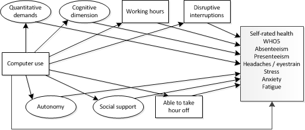

```{r include=FALSE}
library(lavaan)
library(semTools)
library(ggplot2)
```

```{r}
load("data/EWCS_EU28.Rda")
```

#Introduction

The goal is to estimate a model that measures the effect of computer use on health outcomes. We are testing the hypothesis that this effect is mediated through job demands and job resources. From the literature and the job quality framework it follows that from what is available in the EWCS; quantitative demands, working time and frequent disruptive interruptions can be considered relevant job demands. Relevant job resources are autonomy, social support, the ability to take an hour off (working time flexibilty) and skillfull work as measured with the congnitive dimension.

Below, some of these mediators are constructed by means of latent variables. 

#Index check

In this part several indexes or latent variables are created that will feed into the model. These latent variables are checked first to see if they have a good fit and reliability. Sometimes this is not possible when they are to small to be identified in an estimation. 

##Quantiative demands

Quantitative demands index. Following the 6th EWCS overview report. The idea is that computer use will lead to more intensity. It includes the variables working at high speed and tight deadlines. 


```{r}

QD_m <- 'QD =~ y15_Q49a + y15_Q49b '  

```


##Autonomy

Autonomy, based on the EWCS6 overview report, except for having a say because that lowers model fit (not shown). Having a computer would be a resources that allows for more autonomy in the job, which could in turn be associated with better health outcomes. Includes the variables deciding on the order, method and speed of work.

The fit cant be tested because there are no degrees of freedom left. Reliability is looking good however.

```{r}

AUT_m <- 'AUT =~ y15_Q54a + y15_Q54b + y15_Q54c'  

fit <- sem(AUT_m, data=subset(EWCS_EU28,year>=2005))
reliability(fit)
```

##Cognitive dimension

Based on EWCS6 overview report job quality index. It measures the extent to which workers apply their skills in the job and the extent to which they can learn on the job. This would impact their health positively and is seen as a resource. It includes 'solving unforeseen problems on your own', 'complex tasks' and 'learning new things'.

The fit cant be tested in isolation, but when combining it with other models it shows that 'ability to apply own ideas' which is originally part of this index does not fit very well so that item is dropped. The reliability is on the low side. 

```{r}

CD_m <- 'CD =~ y15_Q53c + y15_Q53e + y15_Q53f'  

fit <- sem(CD_m, data=subset(EWCS_EU28,year>=2005))
reliability(fit)

```

##Social support

This index consists of 2 items (support from manager and colleagues), so it cannot be identified in isolation. A priori its not clear what the effect would be of computers on social support. On the one hand, more use of computers could reduce face time and therefore social support. However, it also increases connectivity and communication, which could be benefical for social support. Social support is shown to have a positive connection to health outcomes and is seens as a job resource.

```{r}

SS_m <- 'SS =~ y15_Q61a + y15_Q61b'  

```


##WHO5

WHO-5 is the measurement of mental wellbeing and is considered as an outcome variable in this analysis. 

```{r}
WHO5 <- 'WHO5 =~ y15_Q87a + y15_Q87b + y15_Q87c + y15_Q87d + y15_Q87e'

fit <- sem(WHO5, data=subset(EWCS_EU28,year>=2005))
summary(fit, fit.measures=TRUE, rsquare=TRUE, standardized =TRUE)
reliability(fit)
```

##Overall reliability check

Small model of all the latent variables to check the reliability. Overall the reliabilty looks good (omega >0.7) except for the congnitive dimension. 

```{r}

model <-   'QD   =~ y15_Q49a + y15_Q49b
            AUT  =~ y15_Q54a + y15_Q54b + y15_Q54c
            CD   =~ y15_Q53c + y15_Q53e + y15_Q53f
            SS   =~ y15_Q61a + y15_Q61b
            WHO5 =~ y15_Q87a + y15_Q87b + y15_Q87c + y15_Q87d + y15_Q87e '

fit <- sem(model,data=subset(EWCS_EU28,year>=2010))
reliability(fit)
    
```


#Structural model

##Model estimation

The actual definition of the model is hidden because of the amount of text. The graph shows the struture of the model. The frequency of using computers is hypthesised to have an effect on job demands (above) and job resources (below) which in turn have an effect on a range of health outcomes. Also, we allow for a direct effect of computer use on health outcomes to see if there is still an effect having controlled for all the mediators. 

It includes (not shown) controls for age, gender, ISCO1, education, year and country. These controls are active in the regressions of the effect of computer use on the mediators, as well as the effect of the mediators on the outcomes.  The data are based on 2010 and 2015. 



```{r include=FALSE}

sm1b <- '#Measurement models
           QD   =~ y15_Q49a + y15_Q49b
           AUT  =~ y15_Q54a + y15_Q54b + y15_Q54c
           CD   =~ y15_Q53c + y15_Q53e + y15_Q53f
           SS   =~ y15_Q61a + y15_Q61b
           WHO5 =~ y15_Q87a + y15_Q87b + y15_Q87c + y15_Q87d + y15_Q87e 
    
         #JDR regressions
           QD           ~ a0*computer + age + woman + ISCO_d2 + ISCO_d3 + ISCO_d4 + ISCO_d5 + ISCO_d6 + ISCO_d7 + ISCO_d8 + ISCO_d9 + edu_low + edu_high + w2015 + 
                          countidBulgaria + countidCzech_Republic + countidDenmark + countidGermany + countidEstonia +
                          countidGreece + countidSpain + countidFrance + countidIreland + countidItaly +
                          countidCyprus + countidLatvia + countidLithuania + countidLuxembourg +
                          countidHungary + countidMalta + countidNetherlands + countidAustria +
                          countidPoland + countidPortugal + countidRomania + countidSlovenia +
                          countidSlovakia + countidFinland + countidSweden + countidUnited_Kingdom +
                          countidCroatia 

           AUT          ~ b0*computer + age + woman + ISCO_d2 + ISCO_d3 + ISCO_d4 + ISCO_d5 + ISCO_d6 + ISCO_d7 + ISCO_d8 + ISCO_d9 + edu_low + edu_high + w2015 +
                          countidBulgaria + countidCzech_Republic + countidDenmark + countidGermany + countidEstonia +
                          countidGreece + countidSpain + countidFrance + countidIreland + countidItaly +
                          countidCyprus + countidLatvia + countidLithuania + countidLuxembourg +
                          countidHungary + countidMalta + countidNetherlands + countidAustria +
                          countidPoland + countidPortugal + countidRomania + countidSlovenia +
                          countidSlovakia + countidFinland + countidSweden + countidUnited_Kingdom +
                          countidCroatia 

           CD           ~ c0*computer + age + woman + ISCO_d2 + ISCO_d3 + ISCO_d4 + ISCO_d5 + ISCO_d6 + ISCO_d7 + ISCO_d8 + ISCO_d9 + edu_low + edu_high + w2015 +
                          countidBulgaria + countidCzech_Republic + countidDenmark + countidGermany + countidEstonia +
                          countidGreece + countidSpain + countidFrance + countidIreland + countidItaly +
                          countidCyprus + countidLatvia + countidLithuania + countidLuxembourg +
                          countidHungary + countidMalta + countidNetherlands + countidAustria +
                          countidPoland + countidPortugal + countidRomania + countidSlovenia +
                          countidSlovakia + countidFinland + countidSweden + countidUnited_Kingdom +
                          countidCroatia 

           SS           ~ d0*computer + age + woman + ISCO_d2 + ISCO_d3 + ISCO_d4 + ISCO_d5 + ISCO_d6 + ISCO_d7 + ISCO_d8 + ISCO_d9 + edu_low + edu_high + w2015 +
                          countidBulgaria + countidCzech_Republic + countidDenmark + countidGermany + countidEstonia +
                          countidGreece + countidSpain + countidFrance + countidIreland + countidItaly +
                          countidCyprus + countidLatvia + countidLithuania + countidLuxembourg +
                          countidHungary + countidMalta + countidNetherlands + countidAustria +
                          countidPoland + countidPortugal + countidRomania + countidSlovenia +
                          countidSlovakia + countidFinland + countidSweden + countidUnited_Kingdom +
                          countidCroatia 

           freq_dis_int ~ e0*computer + age + woman + ISCO_d2 + ISCO_d3 + ISCO_d4 + ISCO_d5 + ISCO_d6 + ISCO_d7 + ISCO_d8 + ISCO_d9 + edu_low + edu_high + w2015 +
                          countidBulgaria + countidCzech_Republic + countidDenmark + countidGermany + countidEstonia +
                          countidGreece + countidSpain + countidFrance + countidIreland + countidItaly +
                          countidCyprus + countidLatvia + countidLithuania + countidLuxembourg +
                          countidHungary + countidMalta + countidNetherlands + countidAustria +
                          countidPoland + countidPortugal + countidRomania + countidSlovenia +
                          countidSlovakia + countidFinland + countidSweden + countidUnited_Kingdom +
                          countidCroatia 

           totalhour    ~ f0*computer + age + woman + ISCO_d2 + ISCO_d3 + ISCO_d4 + ISCO_d5 + ISCO_d6 + ISCO_d7 + ISCO_d8 + ISCO_d9 + edu_low + edu_high + w2015 + 
                          countidBulgaria + countidCzech_Republic + countidDenmark + countidGermany + countidEstonia +
                          countidGreece + countidSpain + countidFrance + countidIreland + countidItaly +
                          countidCyprus + countidLatvia + countidLithuania + countidLuxembourg +
                          countidHungary + countidMalta + countidNetherlands + countidAustria +
                          countidPoland + countidPortugal + countidRomania + countidSlovenia +
                          countidSlovakia + countidFinland + countidSweden + countidUnited_Kingdom +
                          countidCroatia 

           y15_Q47      ~ g0*computer + age + woman + ISCO_d2 + ISCO_d3 + ISCO_d4 + ISCO_d5 + ISCO_d6 + ISCO_d7 + ISCO_d8 + ISCO_d9 + edu_low + edu_high + w2015 + 
                          countidBulgaria + countidCzech_Republic + countidDenmark + countidGermany + countidEstonia +
                          countidGreece + countidSpain + countidFrance + countidIreland + countidItaly +
                          countidCyprus + countidLatvia + countidLithuania + countidLuxembourg +
                          countidHungary + countidMalta + countidNetherlands + countidAustria +
                          countidPoland + countidPortugal + countidRomania + countidSlovenia +
                          countidSlovakia + countidFinland + countidSweden + countidUnited_Kingdom +
                          countidCroatia 
    
         #outcome regressions 

           WHO5         ~ a1*QD + b1*AUT + c1*CD + d1*SS + e1*freq_dis_int + f1*totalhour + g1*y15_Q47 + h1*computer + 
                          age + woman + ISCO_d2 + ISCO_d3 + ISCO_d4 + ISCO_d5 + ISCO_d6 + ISCO_d7 + ISCO_d8 + ISCO_d9 + edu_low + edu_high + w2015 +
                          countidBulgaria + countidCzech_Republic + countidDenmark + countidGermany + countidEstonia +
                          countidGreece + countidSpain + countidFrance + countidIreland + countidItaly +
                          countidCyprus + countidLatvia + countidLithuania + countidLuxembourg +
                          countidHungary + countidMalta + countidNetherlands + countidAustria +
                          countidPoland + countidPortugal + countidRomania + countidSlovenia +
                          countidSlovakia + countidFinland + countidSweden + countidUnited_Kingdom +
                          countidCroatia 

           y15_Q75      ~ a2*QD + b2*AUT + c2*CD + d2*SS + e2*freq_dis_int + f2*totalhour + g2*y15_Q47 + h2*computer + 
                          age + woman + ISCO_d2 + ISCO_d3 + ISCO_d4 + ISCO_d5 + ISCO_d6 + ISCO_d7 + ISCO_d8 + ISCO_d9 + edu_low + edu_high + w2015 +
                          countidBulgaria + countidCzech_Republic + countidDenmark + countidGermany + countidEstonia +
                          countidGreece + countidSpain + countidFrance + countidIreland + countidItaly +
                          countidCyprus + countidLatvia + countidLithuania + countidLuxembourg +
                          countidHungary + countidMalta + countidNetherlands + countidAustria +
                          countidPoland + countidPortugal + countidRomania + countidSlovenia +
                          countidSlovakia + countidFinland + countidSweden + countidUnited_Kingdom +
                          countidCroatia 

           anxiety      ~ a3*QD + b3*AUT + c3*CD + d3*SS + e3*freq_dis_int + f3*totalhour + g3*y15_Q47 + h3*computer + 
                          age + woman + ISCO_d2 + ISCO_d3 + ISCO_d4 + ISCO_d5 + ISCO_d6 + ISCO_d7 + ISCO_d8 + ISCO_d9 + edu_low + edu_high + w2015 +
                          countidBulgaria + countidCzech_Republic + countidDenmark + countidGermany + countidEstonia +
                          countidGreece + countidSpain + countidFrance + countidIreland + countidItaly +
                          countidCyprus + countidLatvia + countidLithuania + countidLuxembourg +
                          countidHungary + countidMalta + countidNetherlands + countidAustria +
                          countidPoland + countidPortugal + countidRomania + countidSlovenia +
                          countidSlovakia + countidFinland + countidSweden + countidUnited_Kingdom +
                          countidCroatia 

           fatigue      ~ a4*QD + b4*AUT + c4*CD + d4*SS + e4*freq_dis_int + f4*totalhour + g4*y15_Q47 + h4*computer + 
                          age + woman + ISCO_d2 + ISCO_d3 + ISCO_d4 + ISCO_d5 + ISCO_d6 + ISCO_d7 + ISCO_d8 + ISCO_d9 + edu_low + edu_high + w2015 + 
                          countidBulgaria + countidCzech_Republic + countidDenmark + countidGermany + countidEstonia +
                          countidGreece + countidSpain + countidFrance + countidIreland + countidItaly +
                          countidCyprus + countidLatvia + countidLithuania + countidLuxembourg +
                          countidHungary + countidMalta + countidNetherlands + countidAustria +
                          countidPoland + countidPortugal + countidRomania + countidSlovenia +
                          countidSlovakia + countidFinland + countidSweden + countidUnited_Kingdom +
                          countidCroatia 

           stress       ~ a5*QD + b5*AUT + c5*CD + d5*SS + e5*freq_dis_int + f5*totalhour + g5*y15_Q47 + h5*computer + 
                          age + woman + ISCO_d2 + ISCO_d3 + ISCO_d4 + ISCO_d5 + ISCO_d6 + ISCO_d7 + ISCO_d8 + ISCO_d9 + edu_low + edu_high + w2015 +
                          countidBulgaria + countidCzech_Republic + countidDenmark + countidGermany + countidEstonia +
                          countidGreece + countidSpain + countidFrance + countidIreland + countidItaly +
                          countidCyprus + countidLatvia + countidLithuania + countidLuxembourg +
                          countidHungary + countidMalta + countidNetherlands + countidAustria +
                          countidPoland + countidPortugal + countidRomania + countidSlovenia +
                          countidSlovakia + countidFinland + countidSweden + countidUnited_Kingdom +
                          countidCroatia 

           absenteeism  ~ a6*QD + b6*AUT + c6*CD + d6*SS + e6*freq_dis_int + f6*totalhour + g6*y15_Q47 + h6*computer + 
                          age + woman + ISCO_d2 + ISCO_d3 + ISCO_d4 + ISCO_d5 + ISCO_d6 + ISCO_d7 + ISCO_d8 + ISCO_d9 + edu_low + edu_high + w2015 +
                          countidBulgaria + countidCzech_Republic + countidDenmark + countidGermany + countidEstonia +
                          countidGreece + countidSpain + countidFrance + countidIreland + countidItaly +
                          countidCyprus + countidLatvia + countidLithuania + countidLuxembourg +
                          countidHungary + countidMalta + countidNetherlands + countidAustria +
                          countidPoland + countidPortugal + countidRomania + countidSlovenia +
                          countidSlovakia + countidFinland + countidSweden + countidUnited_Kingdom +
                          countidCroatia 

           presenteeism ~ a7*QD + b7*AUT + c7*CD + d7*SS + e7*freq_dis_int + f7*totalhour + g7*y15_Q47 + h7*computer + 
                          age + woman + ISCO_d2 + ISCO_d3 + ISCO_d4 + ISCO_d5 + ISCO_d6 + ISCO_d7 + ISCO_d8 + ISCO_d9 + edu_low + edu_high + w2015 +
                          countidBulgaria + countidCzech_Republic + countidDenmark + countidGermany + countidEstonia +
                          countidGreece + countidSpain + countidFrance + countidIreland + countidItaly +
                          countidCyprus + countidLatvia + countidLithuania + countidLuxembourg +
                          countidHungary + countidMalta + countidNetherlands + countidAustria +
                          countidPoland + countidPortugal + countidRomania + countidSlovenia +
                          countidSlovakia + countidFinland + countidSweden + countidUnited_Kingdom +
                          countidCroatia 
    
           headeye      ~ a8*QD + b8*AUT + c8*CD + d8*SS + e8*freq_dis_int + f8*totalhour + g8*y15_Q47 + h8*computer + 
                          age + woman + ISCO_d2 + ISCO_d3 + ISCO_d4 + ISCO_d5 + ISCO_d6 + ISCO_d7 + ISCO_d8 + ISCO_d9 + edu_low + edu_high + w2015 +
                          countidBulgaria + countidCzech_Republic + countidDenmark + countidGermany + countidEstonia +
                          countidGreece + countidSpain + countidFrance + countidIreland + countidItaly +
                          countidCyprus + countidLatvia + countidLithuania + countidLuxembourg +
                          countidHungary + countidMalta + countidNetherlands + countidAustria +
                          countidPoland + countidPortugal + countidRomania + countidSlovenia +
                          countidSlovakia + countidFinland + countidSweden + countidUnited_Kingdom +
                          countidCroatia 

         #Covariances
           headeye     ~~ WHO5 + y15_Q75 + anxiety + fatigue + stress + absenteeism + presenteeism        
           WHO5        ~~        y15_Q75 + anxiety + fatigue + stress + absenteeism + presenteeism
           y15_Q75     ~~                  anxiety + fatigue + stress + absenteeism + presenteeism
           anxiety     ~~                            fatigue + stress + absenteeism + presenteeism
           fatigue     ~~                                      stress + absenteeism + presenteeism
           stress      ~~                                               absenteeism + presenteeism
           absenteeism ~~                                                             presenteeism  

         #Indirect effects
           
           QD0_WHO5         := a0*a1
           QD0_y15_Q75      := a0*a2
           QD0_anxiety      := a0*a3
           QD0_fatigue      := a0*a4
           QD0_stress       := a0*a5
           QD0_absenteeism  := a0*a6
           QD0_presenteeism := a0*a7
           QD0_headeye      := a0*a8

           AUT0_WHO5         := b0*b1
           AUT0_y15_Q75      := b0*b2
           AUT0_anxiety      := b0*b3
           AUT0_fatigue      := b0*b4
           AUT0_stress       := b0*b5
           AUT0_absenteeism  := b0*b6
           AUT0_presenteeism := b0*b7
           AUT0_headeye      := b0*b8

           CD0_WHO5         := c0*c1
           CD0_y15_Q75      := c0*c2
           CD0_anxiety      := c0*c3
           CD0_fatigue      := c0*c4
           CD0_stress       := c0*c5
           CD0_absenteeism  := c0*c6
           CD0_presenteeism := c0*c7
           CD0_headeye      := c0*c8

           SS0_WHO5         := d0*d1
           SS0_y15_Q75      := d0*d2
           SS0_anxiety      := d0*d3
           SS0_fatigue      := d0*d4
           SS0_stress       := d0*d5
           SS0_absenteeism  := d0*d6
           SS0_presenteeism := d0*d7
           SS0_headeye      := d0*d8

           freq_dis_int0_WHO5         := e0*e1
           freq_dis_int0_y15_Q75      := e0*e2
           freq_dis_int0_anxiety      := e0*e3
           freq_dis_int0_fatigue      := e0*e4
           freq_dis_int0_stress       := e0*e5
           freq_dis_int0_absenteeism  := e0*e6
           freq_dis_int0_presenteeism := e0*e7
           freq_dis_int0_headeye      := e0*e8

           totalhour0_WHO5         := f0*f1
           totalhour0_y15_Q75      := f0*f2
           totalhour0_anxiety      := f0*f3
           totalhour0_fatigue      := f0*f4
           totalhour0_stress       := f0*f5
           totalhour0_absenteeism  := f0*f6
           totalhour0_presenteeism := f0*f7
           totalhour0_headeye      := f0*f8

           y15_Q470_WHO5         := g0*g1
           y15_Q470_y15_Q75      := g0*g2
           y15_Q470_anxiety      := g0*g3
           y15_Q470_fatigue      := g0*g4
           y15_Q470_stress       := g0*g5
           y15_Q470_absenteeism  := g0*g6
           y15_Q470_presenteeism := g0*g7
           y15_Q470_headeye      := g0*g8

         #Direct effects
           computer0_WHO5         := h1
           computer0_y15_Q75      := h2
           computer0_anxiety      := h3
           computer0_fatigue      := h4
           computer0_stress       := h5
           computer0_absenteeism  := h6
           computer0_presenteeism := h7
           computer0_headeye      := h8

         #Total indirect effects
           T0__totalindirect0_WHO5         := QD0_WHO5         + AUT0_WHO5         + CD0_WHO5         + SS0_WHO5         + freq_dis_int0_WHO5         + totalhour0_WHO5         + y15_Q470_WHO5         
           T0__totalindirect0_y15_Q75      := QD0_y15_Q75      + AUT0_y15_Q75      + CD0_y15_Q75      + SS0_y15_Q75      + freq_dis_int0_y15_Q75      + totalhour0_y15_Q75      + y15_Q470_y15_Q75      
           T0__totalindirect0_anxiety      := QD0_anxiety      + AUT0_anxiety      + CD0_anxiety      + SS0_anxiety      + freq_dis_int0_anxiety      + totalhour0_anxiety      + y15_Q470_anxiety      
           T0__totalindirect0_fatigue      := QD0_fatigue      + AUT0_fatigue      + CD0_fatigue      + SS0_fatigue      + freq_dis_int0_fatigue      + totalhour0_fatigue      + y15_Q470_fatigue      
           T0__totalindirect0_stress       := QD0_stress       + AUT0_stress       + CD0_stress       + SS0_stress       + freq_dis_int0_stress       + totalhour0_stress       + y15_Q470_stress       
           T0__totalindirect0_absenteeism  := QD0_absenteeism  + AUT0_absenteeism  + CD0_absenteeism  + SS0_absenteeism  + freq_dis_int0_absenteeism  + totalhour0_absenteeism  + y15_Q470_absenteeism  
           T0__totalindirect0_presenteeism := QD0_presenteeism + AUT0_presenteeism + CD0_presenteeism + SS0_presenteeism + freq_dis_int0_presenteeism + totalhour0_presenteeism + y15_Q470_presenteeism 
           T0__totalindirect0_headeye      := QD0_headeye      + AUT0_headeye      + CD0_headeye      + SS0_headeye      + freq_dis_int0_headeye      + totalhour0_headeye      + y15_Q470_headeye 

         #Total effects
           T0__total0_WHO5         := T0__totalindirect0_WHO5         + computer0_WHO5         
           T0__total0_y15_Q75      := T0__totalindirect0_y15_Q75      + computer0_y15_Q75      
           T0__total0_anxiety      := T0__totalindirect0_anxiety      + computer0_anxiety      
           T0__total0_fatigue      := T0__totalindirect0_fatigue      + computer0_fatigue      
           T0__total0_stress       := T0__totalindirect0_stress       + computer0_stress       
           T0__total0_absenteeism  := T0__totalindirect0_absenteeism  + computer0_absenteeism  
           T0__total0_presenteeism := T0__totalindirect0_presenteeism + computer0_presenteeism 
           T0__total0_headeye      := T0__totalindirect0_headeye      + computer0_headeye

'

fit1b <- sem(sm1b, data=subset(EWCS_EU28,year>=2010))

```

## Model fit 
From SEM course by Bollen:

* TLI should be >.9 and not too much above 1
* CFI should be >.9 and not too much above 1
* RNI should be >.9 and not too much above 1
* RMSEA should be <0.05. 0.05-0.08 is OK fit and >0.10 is bad fit
* BIC should be < 0. BIC differnence between 0-2: weak evidence, 2-6 is positive, 6-10 strong and >10 very strong

Note: BIC can't be computed with DWLS estimator

The model fit is very good.

```{r}
fitmeasures(fit1b,fit.measures=c("tli","cfi","rni","rmsea"))
```

##Results

The first plot shows the total direct and indirect (mediated) effect of computer use. Generally the effect of computer use is negative for health, although there is no effect for WHO5, and small effects for WHO5 and absenteeism.

For some indicators this is largely cancelled out by the remaining direct effect. For example, the direct negative effect of computer use on fatigue is almost as big as the positive indirect effect through the job demands and resources. This direct effect could signal selection effects, or a job resources in the model. 

```{r}
fit1b_sol <- standardizedsolution(fit1b)

df2 <- subset(fit1b_sol, op==":=")

x <- t(as.data.frame(strsplit(gsub('T0__','', df2$lhs),"0_")))
df2 <- cbind(df2,as.data.frame(x[,1], stringsAsFactors = FALSE))
df2 <- cbind(df2,as.data.frame(x[,2], stringsAsFactors = FALSE))
rm(x)

colnames(df2)[10] <- "Mediator"
colnames(df2)[11] <- "Outcome"

df2$x[grepl("total0",df2$lhs)==TRUE] <- "Total"
df2$x[grepl("totalindirect0",df2$lhs)==TRUE] <- "Indirect"
df2$x[grepl("computer0",df2$lhs)==TRUE] <- "Direct"

df2$Mediator[df2$Mediator=="y15_Q47"] <- "Take hour off"
df2$Mediator[df2$Mediator=="totalhour"] <- "Weekly working hours"
df2$Mediator[df2$Mediator=="SS"] <- "Social support"
df2$Mediator[df2$Mediator=="QD"] <- "Quantitative demands"
df2$Mediator[df2$Mediator=="freq_dis_int"] <- "Frequent disruptive interruptions"
df2$Mediator[df2$Mediator=="CD"] <- "Cognitive dimension"
df2$Mediator[df2$Mediator=="AUT"] <- "Autonomy"

df2$Outcome[df2$Outcome=="y15_Q75"] <- "Self-rated health"
df2$Outcome[df2$Outcome=="anxiety"] <- "Anxiety"
df2$Outcome[df2$Outcome=="fatigue"] <- "Fatigue"
df2$Outcome[df2$Outcome=="stress"] <- "Stress"
df2$Outcome[df2$Outcome=="absenteeism"] <- "Absenteeism"
df2$Outcome[df2$Outcome=="presenteeism"] <- "Presenteeism"
df2$Outcome[df2$Outcome=="headeye"] <- "Headache / eyestrain"

df2$sig[df2$pvalue<0.01] <- "p<0.01"
df2$sig[df2$pvalue>=0.01] <- "p>=0.01"

ggplot(subset(df2,x=="Indirect" | x=="Direct"), aes(x=Outcome, y=est.std, fill=x)) + 
  geom_bar(stat="identity") + 
  geom_errorbar(aes(ymin=ci.lower, ymax=ci.upper), colour="black", width=.1) +
  coord_flip() + 
  theme_minimal()

```

The plot below shows the indirect effect of computer use by mediator and by outcome variable. Looking under the hood we can see that for most indicators the overall indirect effect is the aggregate of both positive and negative effects. Frequent disruptive interruptions, the cognitive dimension and quantitative demands seem to have the strongest effect. Generally, job resources have a positive effect and job demands a negative effect. The cognitive dimension has a negative connotation however, which may reflect the increased responsibility or cognitive demands that come with that. 

```{r}

ggplot(subset(df2,is.na(x)), aes(x=Mediator, y=est.std)) + 
  facet_wrap( ~ Outcome , nrow=2  ) +
  geom_bar(stat="identity", fill="darkblue") + 
  geom_errorbar(aes(ymin=ci.lower, ymax=ci.upper), colour="black", width=.1) +
  coord_flip() + 
  theme_minimal()

```

Final plot shows the effect of the mediator variable on the outcomes in general. They generally behave as expected, except for the cognitive dimension.

```{r}

df3 <- subset(fit1b_sol, op=="~" & 
                (lhs=="absenteeism" | lhs=="presenteeism" | lhs=="anxiety" | lhs=="y15_Q75" | lhs=="WHO5" | lhs=="stress" | lhs=="fatigue" | lhs=="headeye") & 
                (rhs=="QD" | rhs=="AUT" | rhs=="CD" | rhs=="SS" | rhs=="freq_dis_int" | rhs=="totalhour" | rhs=="y15_Q47"))

df3$lhs[df3$lhs=="y15_Q75"] <- "Self-rated health"
df3$lhs[df3$lhs=="anxiety"] <- "Anxiety"
df3$lhs[df3$lhs=="fatigue"] <- "Fatigue"
df3$lhs[df3$lhs=="stress"] <- "Stress"
df3$lhs[df3$lhs=="absenteeism"] <- "Absenteeism"
df3$lhs[df3$lhs=="presenteeism"] <- "Presenteeism"
df3$lhs[df3$lhs=="headeye"] <- "Headache / eyestrain"

df3$rhs[df3$rhs=="y15_Q47"] <- "Take hour off"
df3$rhs[df3$rhs=="totalhour"] <- "Weekly working hours"
df3$rhs[df3$rhs=="SS"] <- "Social support"
df3$rhs[df3$rhs=="QD"] <- "Quantitative demands"
df3$rhs[df3$rhs=="freq_dis_int"] <- "Frequent disruptive interruptions"
df3$rhs[df3$rhs=="CD"] <- "Cognitive dimension"
df3$rhs[df3$rhs=="AUT"] <- "Autonomy"

ggplot(df3, aes(x=rhs, y=est.std)) + 
  facet_wrap(~ lhs, nrow=2) +
  geom_bar(stat="identity", fill="darkblue") + 
  geom_errorbar(aes(ymin=ci.lower, ymax=ci.upper), colour="black", width=.1) +
  coord_flip() + 
  theme_minimal()    

```

