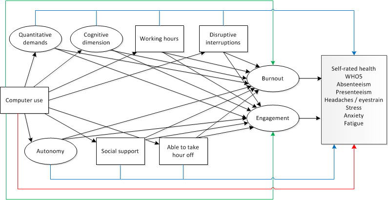

```{r include=FALSE}
library(lavaan)
library(semTools)
library(ggplot2)
library(knitr)
source("EF_colours.R")
```

```{r}
load("data/EWCS_EU28.Rda")
```

#Introduction

Wat is the link between ICT use and health and wellbeing? Some argue that the rise in intensification is due to technological change (e.g. Green, 2002). Chesley (2014) links the ICT use to working to three elements of job strain: working at high speed, interruptions and multitasking. She finds positive associations based on a US sample of employees. Salanova et al. (2013) argue that the use of ICTs is associated with technostrain (anxiety, fatigue, scepticism and inefficacy beliefs) and technoaddition. A systematic review by Berg-Beckhoff et al. (2017) shows that ICT use is associated with stress in cross-sectional studies, although not in intervention studies. Also, they find evidence for a link between ICT and burnout, but no links between ICT use and anxiety or mental health. Stadin et al (2016) use a longitudinal survey to show links between ICT demands with job strain, effort reward imbalance and lower self-rated health. Ter Hoeven et al. (2016) suggest a more nuanced view and focus not only on the negative but also on the positive aspects of ICT use. They analyse the effect of ICT use by estimating a JD-R (job demands - resources) model that hypothesises that ICT use enhances effective communication and accessibilty as well as makes work more unpredictable and causes more interruptions. This model is supported by a sample of Dutch employees and also inlcudes links to burnout and engagement, showing that advantages and disadvantages of ICT use are equally strong with regards to burnout while the positive effects on engagements are bigger than the negative effects. Supporting a more favourable view on the effects of ICT use, Charalampous at al. (2018) show in a systematic review of the literature that teleworking is related to more positive emotions, higher job satisfaction, more autonomy andcommitment and amerioralte feelings of emotional exhaustion. 

As Ter Hoeven et al (2016) point out, focusing on job demands only will show negative links between ICT use and health while focusing on job resources only will show positive links. Therefore, when analying how ICT is associated with health and wellbeing in the EWCS, both positive and negative pathways are taken into account. The goal is to estimate a model that measures the effect of computer use on health outcomes. We are testing the hypothesis that this effect is mediated through both job demands and job resources. From the literature and the job quality framework it follows that from what is available in the EWCS; quantitative demands, working time and frequent disruptive interruptions can be considered relevant job demands. Relevant job resources are autonomy, social support, the ability to take an hour off (working time flexibilty) and skillfull work as measured with the congnitive dimension. Health and wellbeing in the EWCS is measured by general self-rated health, the WHO-5 mental wellbeing scale, fatigue, anxiety, stress, headaches or eyestrain and absenteeism and presenteeism (working while sick).

#Index check

Some of these mediators in the model are constructed by means of latent variables. In this part several indexes or latent variables are created that will feed into the model. These latent variables are checked first to see if they have a good fit and reliability. Sometimes this is not possible when they are to small to be identified in an estimation. 

##Quantiative demands

Quantitative demands index. Following the 6th EWCS overview report. The idea is that computer use will lead to more intensity. It includes the variables working at high speed and tight deadlines. 

Questions included: 

* Q49a: Does your job involve working at high speed? (Never - ... - All of the time)
* Q49b: Does your job involve working to tight deadlines? (Never - ... - All of the time)

The fit of the CFA cannot be tested because there are no degrees of freedom left.

```{r}

QD_m <- 'QD =~ y15_Q49a + y15_Q49b '  

```


##Autonomy

The latent variable measuring autonomy is based on the EWCS6 overview report, except for 'having a say in the choice of colleagues' because that lowers model fit (not shown). Having a computer would be a resources that allows for more autonomy in the job, which could in turn be associated with better health outcomes. 

Questions included:

* Q54a: Are you able to choose or change your order of tasks? (Y/N)
* Q54b: Are you able to choose or change your methods of work? (Y/N)
* Q54c: Are you able to choose or change your speed or rate of work? (Y/N)

The fit of the CFA cannot be tested because there are no degrees of freedom left. Reliability is looking good however.

```{r}

AUT_m <- 'AUT =~ y15_Q54a + y15_Q54b + y15_Q54c'  

fit <- sem(AUT_m, data=subset(EWCS_EU28,year>=2005))
reliability(fit)

```

##Cognitive dimension

Based on EWCS6 overview report job quality index. It measures the extent to which workers apply their skills in the job and the extent to which they can learn on the job. This would impact their health positively and is seen as a resource. 

Questions included:

* Q53c: Generally, does your main paid job involve solving unforeseen problems on your own? (Y/N)
* Q53e: Generally, does your main paid job involve complex tasks? (Y/N)
* Q53f: Generally, does your main paid job involve learning new things? (Y/N)

The fit cant be tested in isolation, but when combining it with other models it shows that 'ability to apply own ideas' which is originally part of this index does not fit very well so that item is dropped. The reliability is on the low side. 

```{r}

CD_m <- 'CD =~ y15_Q53c + y15_Q53e + y15_Q53f'  

fit <- sem(CD_m, data=subset(EWCS_EU28,year>=2005))
reliability(fit)

```

##Social support

Social support is a latent variable that is measured by two questions:

* Q61a: Your colleagues help and support you (Never - ... - Always)
* Q61b: Your manager helps and supports you (Never - ... - Always)

Q61b is the only variable in the analysis asked to employees only. So to be able to include self-employed this item is excluded. 

##WHO5

WHO-5 is the measurement of mental wellbeing and is considered as an outcome variable in this analysis. The data fits the CFA very well and the index shows a high degree of reliability. 

```{r}

WHO5 <- 'WHO5 =~ y15_Q87a + y15_Q87b + y15_Q87c + y15_Q87d + y15_Q87e'

fit <- sem(WHO5, data=subset(EWCS_EU28,year>=2005))
reliability(fit)

```

##Overall reliability check

Most of the latent variables mentioned above cannot be identified in isolation. They can, however, if they are inlcuded in a larger structure. The output below shows that overall the fit as well as the reliabilty looks good (omega >0.7) except for the reliability of the congnitive dimension. 

```{r}

model <-   'QD   =~ y15_Q49a + y15_Q49b
            AUT  =~ y15_Q54a + y15_Q54b + y15_Q54c
            CD   =~ y15_Q53c + y15_Q53e + y15_Q53f
            SS   =~ y15_Q61a + y15_Q61b
            WHO5 =~ y15_Q87a + y15_Q87b + y15_Q87c + y15_Q87d + y15_Q87e '

fit <- sem(model,data=subset(EWCS_EU28,year>=2010))
fitmeasures(fit,fit.measures=c("tli","cfi","rni","rmsea"))
reliability(fit)
    
```

#Structural model 1

##Model estimation

The graph below shows the struture of the model. The frequency of using computers is hypthesised to have an effect on job demands (above) and job resources (below) which in turn have an effect on a range of health outcomes. Also, we allow for a direct effect of computer use on health outcomes to see if there is still an effect having controlled for all the mediators. It includes (not shown) controls for age, gender, ISCO1, education, year and country. These controls are active in the regressions of the effect of computer use on the mediators, as well as the effect of the mediators on the outcomes.  The data are from 2010 and 2015. 

```{r echo=FALSE, out.width = "70%"}
include_graphics("SEM_diagram.png")
```


The actual definition of the model in R is hidden because of the amount of text. 

```{r include=FALSE}

sm1  <- '#Measurement models
           QD   =~ y15_Q49a + y15_Q49b
           AUT  =~ y15_Q54a + y15_Q54b + y15_Q54c
           CD   =~ y15_Q53c + y15_Q53e + y15_Q53f
           WHO5 =~ y15_Q87a + y15_Q87b + y15_Q87c + y15_Q87d + y15_Q87e 
     
         #JDR regressions
           QD           ~ a0*computer + age + woman + ISCO_d2 + ISCO_d3 + ISCO_d4 + ISCO_d5 + ISCO_d6 + ISCO_d7 + ISCO_d8 + ISCO_d9 + edu_low + edu_high + w2015 + 
                          countidBulgaria + countidCzech_Republic + countidDenmark + countidGermany + countidEstonia +
                          countidGreece + countidSpain + countidFrance + countidIreland + countidItaly +
                          countidCyprus + countidLatvia + countidLithuania + countidLuxembourg +
                          countidHungary + countidMalta + countidNetherlands + countidAustria +
                          countidPoland + countidPortugal + countidRomania + countidSlovenia +
                          countidSlovakia + countidFinland + countidSweden + countidUnited_Kingdom +
                          countidCroatia 

           AUT          ~ b0*computer + age + woman + ISCO_d2 + ISCO_d3 + ISCO_d4 + ISCO_d5 + ISCO_d6 + ISCO_d7 + ISCO_d8 + ISCO_d9 + edu_low + edu_high + w2015 +
                          countidBulgaria + countidCzech_Republic + countidDenmark + countidGermany + countidEstonia +
                          countidGreece + countidSpain + countidFrance + countidIreland + countidItaly +
                          countidCyprus + countidLatvia + countidLithuania + countidLuxembourg +
                          countidHungary + countidMalta + countidNetherlands + countidAustria +
                          countidPoland + countidPortugal + countidRomania + countidSlovenia +
                          countidSlovakia + countidFinland + countidSweden + countidUnited_Kingdom +
                          countidCroatia 

           CD           ~ c0*computer + age + woman + ISCO_d2 + ISCO_d3 + ISCO_d4 + ISCO_d5 + ISCO_d6 + ISCO_d7 + ISCO_d8 + ISCO_d9 + edu_low + edu_high + w2015 +
                          countidBulgaria + countidCzech_Republic + countidDenmark + countidGermany + countidEstonia +
                          countidGreece + countidSpain + countidFrance + countidIreland + countidItaly +
                          countidCyprus + countidLatvia + countidLithuania + countidLuxembourg +
                          countidHungary + countidMalta + countidNetherlands + countidAustria +
                          countidPoland + countidPortugal + countidRomania + countidSlovenia +
                          countidSlovakia + countidFinland + countidSweden + countidUnited_Kingdom +
                          countidCroatia 

           SS           ~ d0*computer + age + woman + ISCO_d2 + ISCO_d3 + ISCO_d4 + ISCO_d5 + ISCO_d6 + ISCO_d7 + ISCO_d8 + ISCO_d9 + edu_low + edu_high + w2015 +
                          countidBulgaria + countidCzech_Republic + countidDenmark + countidGermany + countidEstonia +
                          countidGreece + countidSpain + countidFrance + countidIreland + countidItaly +
                          countidCyprus + countidLatvia + countidLithuania + countidLuxembourg +
                          countidHungary + countidMalta + countidNetherlands + countidAustria +
                          countidPoland + countidPortugal + countidRomania + countidSlovenia +
                          countidSlovakia + countidFinland + countidSweden + countidUnited_Kingdom +
                          countidCroatia 

           freq_dis_int ~ e0*computer + age + woman + ISCO_d2 + ISCO_d3 + ISCO_d4 + ISCO_d5 + ISCO_d6 + ISCO_d7 + ISCO_d8 + ISCO_d9 + edu_low + edu_high + w2015 +
                          countidBulgaria + countidCzech_Republic + countidDenmark + countidGermany + countidEstonia +
                          countidGreece + countidSpain + countidFrance + countidIreland + countidItaly +
                          countidCyprus + countidLatvia + countidLithuania + countidLuxembourg +
                          countidHungary + countidMalta + countidNetherlands + countidAustria +
                          countidPoland + countidPortugal + countidRomania + countidSlovenia +
                          countidSlovakia + countidFinland + countidSweden + countidUnited_Kingdom +
                          countidCroatia 

           totalhour    ~ f0*computer + age + woman + ISCO_d2 + ISCO_d3 + ISCO_d4 + ISCO_d5 + ISCO_d6 + ISCO_d7 + ISCO_d8 + ISCO_d9 + edu_low + edu_high + w2015 + 
                          countidBulgaria + countidCzech_Republic + countidDenmark + countidGermany + countidEstonia +
                          countidGreece + countidSpain + countidFrance + countidIreland + countidItaly +
                          countidCyprus + countidLatvia + countidLithuania + countidLuxembourg +
                          countidHungary + countidMalta + countidNetherlands + countidAustria +
                          countidPoland + countidPortugal + countidRomania + countidSlovenia +
                          countidSlovakia + countidFinland + countidSweden + countidUnited_Kingdom +
                          countidCroatia 

           y15_Q47      ~ g0*computer + age + woman + ISCO_d2 + ISCO_d3 + ISCO_d4 + ISCO_d5 + ISCO_d6 + ISCO_d7 + ISCO_d8 + ISCO_d9 + edu_low + edu_high + w2015 + 
                          countidBulgaria + countidCzech_Republic + countidDenmark + countidGermany + countidEstonia +
                          countidGreece + countidSpain + countidFrance + countidIreland + countidItaly +
                          countidCyprus + countidLatvia + countidLithuania + countidLuxembourg +
                          countidHungary + countidMalta + countidNetherlands + countidAustria +
                          countidPoland + countidPortugal + countidRomania + countidSlovenia +
                          countidSlovakia + countidFinland + countidSweden + countidUnited_Kingdom +
                          countidCroatia 
    
         #outcome regressions 

           WHO5         ~ a1*QD + b1*AUT + c1*CD + d1*SS + e1*freq_dis_int + f1*totalhour + g1*y15_Q47 + h1*computer + 
                          age + woman + ISCO_d2 + ISCO_d3 + ISCO_d4 + ISCO_d5 + ISCO_d6 + ISCO_d7 + ISCO_d8 + ISCO_d9 + edu_low + edu_high + w2015 +
                          countidBulgaria + countidCzech_Republic + countidDenmark + countidGermany + countidEstonia +
                          countidGreece + countidSpain + countidFrance + countidIreland + countidItaly +
                          countidCyprus + countidLatvia + countidLithuania + countidLuxembourg +
                          countidHungary + countidMalta + countidNetherlands + countidAustria +
                          countidPoland + countidPortugal + countidRomania + countidSlovenia +
                          countidSlovakia + countidFinland + countidSweden + countidUnited_Kingdom +
                          countidCroatia 

           y15_Q75      ~ a2*QD + b2*AUT + c2*CD + d2*SS + e2*freq_dis_int + f2*totalhour + g2*y15_Q47 + h2*computer + 
                          age + woman + ISCO_d2 + ISCO_d3 + ISCO_d4 + ISCO_d5 + ISCO_d6 + ISCO_d7 + ISCO_d8 + ISCO_d9 + edu_low + edu_high + w2015 +
                          countidBulgaria + countidCzech_Republic + countidDenmark + countidGermany + countidEstonia +
                          countidGreece + countidSpain + countidFrance + countidIreland + countidItaly +
                          countidCyprus + countidLatvia + countidLithuania + countidLuxembourg +
                          countidHungary + countidMalta + countidNetherlands + countidAustria +
                          countidPoland + countidPortugal + countidRomania + countidSlovenia +
                          countidSlovakia + countidFinland + countidSweden + countidUnited_Kingdom +
                          countidCroatia 

           anxiety      ~ a3*QD + b3*AUT + c3*CD + d3*SS + e3*freq_dis_int + f3*totalhour + g3*y15_Q47 + h3*computer + 
                          age + woman + ISCO_d2 + ISCO_d3 + ISCO_d4 + ISCO_d5 + ISCO_d6 + ISCO_d7 + ISCO_d8 + ISCO_d9 + edu_low + edu_high + w2015 +
                          countidBulgaria + countidCzech_Republic + countidDenmark + countidGermany + countidEstonia +
                          countidGreece + countidSpain + countidFrance + countidIreland + countidItaly +
                          countidCyprus + countidLatvia + countidLithuania + countidLuxembourg +
                          countidHungary + countidMalta + countidNetherlands + countidAustria +
                          countidPoland + countidPortugal + countidRomania + countidSlovenia +
                          countidSlovakia + countidFinland + countidSweden + countidUnited_Kingdom +
                          countidCroatia 

           fatigue      ~ a4*QD + b4*AUT + c4*CD + d4*SS + e4*freq_dis_int + f4*totalhour + g4*y15_Q47 + h4*computer + 
                          age + woman + ISCO_d2 + ISCO_d3 + ISCO_d4 + ISCO_d5 + ISCO_d6 + ISCO_d7 + ISCO_d8 + ISCO_d9 + edu_low + edu_high + w2015 + 
                          countidBulgaria + countidCzech_Republic + countidDenmark + countidGermany + countidEstonia +
                          countidGreece + countidSpain + countidFrance + countidIreland + countidItaly +
                          countidCyprus + countidLatvia + countidLithuania + countidLuxembourg +
                          countidHungary + countidMalta + countidNetherlands + countidAustria +
                          countidPoland + countidPortugal + countidRomania + countidSlovenia +
                          countidSlovakia + countidFinland + countidSweden + countidUnited_Kingdom +
                          countidCroatia 

           stress       ~ a5*QD + b5*AUT + c5*CD + d5*SS + e5*freq_dis_int + f5*totalhour + g5*y15_Q47 + h5*computer + 
                          age + woman + ISCO_d2 + ISCO_d3 + ISCO_d4 + ISCO_d5 + ISCO_d6 + ISCO_d7 + ISCO_d8 + ISCO_d9 + edu_low + edu_high + w2015 +
                          countidBulgaria + countidCzech_Republic + countidDenmark + countidGermany + countidEstonia +
                          countidGreece + countidSpain + countidFrance + countidIreland + countidItaly +
                          countidCyprus + countidLatvia + countidLithuania + countidLuxembourg +
                          countidHungary + countidMalta + countidNetherlands + countidAustria +
                          countidPoland + countidPortugal + countidRomania + countidSlovenia +
                          countidSlovakia + countidFinland + countidSweden + countidUnited_Kingdom +
                          countidCroatia 

           absenteeism  ~ a6*QD + b6*AUT + c6*CD + d6*SS + e6*freq_dis_int + f6*totalhour + g6*y15_Q47 + h6*computer + 
                          age + woman + ISCO_d2 + ISCO_d3 + ISCO_d4 + ISCO_d5 + ISCO_d6 + ISCO_d7 + ISCO_d8 + ISCO_d9 + edu_low + edu_high + w2015 +
                          countidBulgaria + countidCzech_Republic + countidDenmark + countidGermany + countidEstonia +
                          countidGreece + countidSpain + countidFrance + countidIreland + countidItaly +
                          countidCyprus + countidLatvia + countidLithuania + countidLuxembourg +
                          countidHungary + countidMalta + countidNetherlands + countidAustria +
                          countidPoland + countidPortugal + countidRomania + countidSlovenia +
                          countidSlovakia + countidFinland + countidSweden + countidUnited_Kingdom +
                          countidCroatia 

           presenteeism ~ a7*QD + b7*AUT + c7*CD + d7*SS + e7*freq_dis_int + f7*totalhour + g7*y15_Q47 + h7*computer + 
                          age + woman + ISCO_d2 + ISCO_d3 + ISCO_d4 + ISCO_d5 + ISCO_d6 + ISCO_d7 + ISCO_d8 + ISCO_d9 + edu_low + edu_high + w2015 +
                          countidBulgaria + countidCzech_Republic + countidDenmark + countidGermany + countidEstonia +
                          countidGreece + countidSpain + countidFrance + countidIreland + countidItaly +
                          countidCyprus + countidLatvia + countidLithuania + countidLuxembourg +
                          countidHungary + countidMalta + countidNetherlands + countidAustria +
                          countidPoland + countidPortugal + countidRomania + countidSlovenia +
                          countidSlovakia + countidFinland + countidSweden + countidUnited_Kingdom +
                          countidCroatia 
    
           headeye      ~ a8*QD + b8*AUT + c8*CD + d8*SS + e8*freq_dis_int + f8*totalhour + g8*y15_Q47 + h8*computer + 
                          age + woman + ISCO_d2 + ISCO_d3 + ISCO_d4 + ISCO_d5 + ISCO_d6 + ISCO_d7 + ISCO_d8 + ISCO_d9 + edu_low + edu_high + w2015 +
                          countidBulgaria + countidCzech_Republic + countidDenmark + countidGermany + countidEstonia +
                          countidGreece + countidSpain + countidFrance + countidIreland + countidItaly +
                          countidCyprus + countidLatvia + countidLithuania + countidLuxembourg +
                          countidHungary + countidMalta + countidNetherlands + countidAustria +
                          countidPoland + countidPortugal + countidRomania + countidSlovenia +
                          countidSlovakia + countidFinland + countidSweden + countidUnited_Kingdom +
                          countidCroatia 

         #Covariances
           #Allow the outcomes to correlate with each other
           headeye     ~~ WHO5 + y15_Q75 + anxiety + fatigue + stress + absenteeism + presenteeism        
           WHO5        ~~        y15_Q75 + anxiety + fatigue + stress + absenteeism + presenteeism
           y15_Q75     ~~                  anxiety + fatigue + stress + absenteeism + presenteeism
           anxiety     ~~                            fatigue + stress + absenteeism + presenteeism
           fatigue     ~~                                      stress + absenteeism + presenteeism
           stress      ~~                                               absenteeism + presenteeism
           absenteeism ~~                                                             presenteeism  

          #Allow the mediators to correlate with each other
           QD           ~~ AUT + CD + SS + freq_dis_int + totalhour + y15_Q47
           AUT          ~~ CD + SS + freq_dis_int + totalhour + y15_Q47
           CD           ~~ SS + freq_dis_int + totalhour + y15_Q47
           SS           ~~ freq_dis_int + totalhour + y15_Q47
           freq_dis_int ~~ totalhour + y15_Q47
           totalhour    ~~ y15_Q47

         #Indirect effects
           
           QD0_WHO5         := a0*a1
           QD0_y15_Q75      := a0*a2
           QD0_anxiety      := a0*a3
           QD0_fatigue      := a0*a4
           QD0_stress       := a0*a5
           QD0_absenteeism  := a0*a6
           QD0_presenteeism := a0*a7
           QD0_headeye      := a0*a8

           AUT0_WHO5         := b0*b1
           AUT0_y15_Q75      := b0*b2
           AUT0_anxiety      := b0*b3
           AUT0_fatigue      := b0*b4
           AUT0_stress       := b0*b5
           AUT0_absenteeism  := b0*b6
           AUT0_presenteeism := b0*b7
           AUT0_headeye      := b0*b8

           CD0_WHO5         := c0*c1
           CD0_y15_Q75      := c0*c2
           CD0_anxiety      := c0*c3
           CD0_fatigue      := c0*c4
           CD0_stress       := c0*c5
           CD0_absenteeism  := c0*c6
           CD0_presenteeism := c0*c7
           CD0_headeye      := c0*c8

           SS0_WHO5         := d0*d1
           SS0_y15_Q75      := d0*d2
           SS0_anxiety      := d0*d3
           SS0_fatigue      := d0*d4
           SS0_stress       := d0*d5
           SS0_absenteeism  := d0*d6
           SS0_presenteeism := d0*d7
           SS0_headeye      := d0*d8

           freq_dis_int0_WHO5         := e0*e1
           freq_dis_int0_y15_Q75      := e0*e2
           freq_dis_int0_anxiety      := e0*e3
           freq_dis_int0_fatigue      := e0*e4
           freq_dis_int0_stress       := e0*e5
           freq_dis_int0_absenteeism  := e0*e6
           freq_dis_int0_presenteeism := e0*e7
           freq_dis_int0_headeye      := e0*e8

           totalhour0_WHO5         := f0*f1
           totalhour0_y15_Q75      := f0*f2
           totalhour0_anxiety      := f0*f3
           totalhour0_fatigue      := f0*f4
           totalhour0_stress       := f0*f5
           totalhour0_absenteeism  := f0*f6
           totalhour0_presenteeism := f0*f7
           totalhour0_headeye      := f0*f8

           y15_Q470_WHO5         := g0*g1
           y15_Q470_y15_Q75      := g0*g2
           y15_Q470_anxiety      := g0*g3
           y15_Q470_fatigue      := g0*g4
           y15_Q470_stress       := g0*g5
           y15_Q470_absenteeism  := g0*g6
           y15_Q470_presenteeism := g0*g7
           y15_Q470_headeye      := g0*g8

         #Direct effects
           computer0_WHO5         := h1
           computer0_y15_Q75      := h2
           computer0_anxiety      := h3
           computer0_fatigue      := h4
           computer0_stress       := h5
           computer0_absenteeism  := h6
           computer0_presenteeism := h7
           computer0_headeye      := h8

         #Total indirect effects
           T0__totalindirect0_WHO5         := QD0_WHO5         + AUT0_WHO5         + CD0_WHO5         + SS0_WHO5         + freq_dis_int0_WHO5         + totalhour0_WHO5         + y15_Q470_WHO5         
           T0__totalindirect0_y15_Q75      := QD0_y15_Q75      + AUT0_y15_Q75      + CD0_y15_Q75      + SS0_y15_Q75      + freq_dis_int0_y15_Q75      + totalhour0_y15_Q75      + y15_Q470_y15_Q75      
           T0__totalindirect0_anxiety      := QD0_anxiety      + AUT0_anxiety      + CD0_anxiety      + SS0_anxiety      + freq_dis_int0_anxiety      + totalhour0_anxiety      + y15_Q470_anxiety      
           T0__totalindirect0_fatigue      := QD0_fatigue      + AUT0_fatigue      + CD0_fatigue      + SS0_fatigue      + freq_dis_int0_fatigue      + totalhour0_fatigue      + y15_Q470_fatigue      
           T0__totalindirect0_stress       := QD0_stress       + AUT0_stress       + CD0_stress       + SS0_stress       + freq_dis_int0_stress       + totalhour0_stress       + y15_Q470_stress       
           T0__totalindirect0_absenteeism  := QD0_absenteeism  + AUT0_absenteeism  + CD0_absenteeism  + SS0_absenteeism  + freq_dis_int0_absenteeism  + totalhour0_absenteeism  + y15_Q470_absenteeism  
           T0__totalindirect0_presenteeism := QD0_presenteeism + AUT0_presenteeism + CD0_presenteeism + SS0_presenteeism + freq_dis_int0_presenteeism + totalhour0_presenteeism + y15_Q470_presenteeism 
           T0__totalindirect0_headeye      := QD0_headeye      + AUT0_headeye      + CD0_headeye      + SS0_headeye      + freq_dis_int0_headeye      + totalhour0_headeye      + y15_Q470_headeye 

         #Total effects
           T0__total0_WHO5         := T0__totalindirect0_WHO5         + computer0_WHO5         
           T0__total0_y15_Q75      := T0__totalindirect0_y15_Q75      + computer0_y15_Q75      
           T0__total0_anxiety      := T0__totalindirect0_anxiety      + computer0_anxiety      
           T0__total0_fatigue      := T0__totalindirect0_fatigue      + computer0_fatigue      
           T0__total0_stress       := T0__totalindirect0_stress       + computer0_stress       
           T0__total0_absenteeism  := T0__totalindirect0_absenteeism  + computer0_absenteeism  
           T0__total0_presenteeism := T0__totalindirect0_presenteeism + computer0_presenteeism 
           T0__total0_headeye      := T0__totalindirect0_headeye      + computer0_headeye

'

fit1 <- sem(sm1, data=subset(EWCS_EU28,year>=2010))
fit1_sol <- standardizedsolution(fit1)

```

## Model fit 
From SEM course by Bollen:

* TLI should be >.9 and not too much above 1
* CFI should be >.9 and not too much above 1
* RNI should be >.9 and not too much above 1
* RMSEA should be <0.05. 0.05-0.08 is OK fit and >0.10 is bad fit
* BIC should be < 0. BIC differnence between 0-2: weak evidence, 2-6 is positive, 6-10 strong and >10 very strong

Note: BIC can't be computed with DWLS estimator

The model fit is very good.

```{r}
fitmeasures(fit1,fit.measures=c("tli","cfi","rni","rmsea"))
```

##Results

The first plot below shows the total direct and indirect (mediated) effect of computer use. The sum of the two would be the total effect. Generally the effect of computer use is unfavourable for the health and wellbeing outcomes, although there is no effect for WHO5, and small effects for self-rated health and absenteeism. Interestingly, the positive effect of computer use on presenteeism is much larger than the effect on absenteeism. This might support the hypothesis that digital work is more prone to presenteeism, i.e. its easier to work while sick the more work is done on a computer. 

The direct negative effect of computer use on fatigue is almost as big as the positive indirect effect through the job demands and resources. Adding these up hardly leaves any total effect. It is not clear, however, what this reflects. It signals selection effects, i.e. despite controls for personal characteristics and occupational groups perhaps those who have are less fatigued tend to use computers more often. Alternatively or additionally, it could also reflect any positive effects of ICT use on job resources not included in the model. 

The strong direct effect of ICT use and headache / eyestrain is to be expected. This may reflect the effect of computers that is not mediated through the other variables; headaches and eyestrain from looking at a screen for example. 

Ter Hoeven et al (2016) find no direct effects of computer use on engagement and burnout, but find evidence for a fully mediated model. Chesley (2014) does find some direct negative effects of ICT use on stress after controlling for the mediation through working at high speed, interruptions and multitasking. 

```{r echo=FALSE, fig.height=3.5, fig.width=8}

df2 <- subset(fit1_sol, op==":=")

x <- t(as.data.frame(strsplit(gsub('T0__','', df2$lhs),"0_")))
df2 <- cbind(df2,as.data.frame(x[,1], stringsAsFactors = FALSE))
df2 <- cbind(df2,as.data.frame(x[,2], stringsAsFactors = FALSE))
rm(x)

colnames(df2)[10] <- "Mediator"
colnames(df2)[11] <- "Outcome"

df2$x[grepl("total0",df2$lhs)==TRUE] <- "Total"
df2$x[grepl("totalindirect0",df2$lhs)==TRUE] <- "Indirect"
df2$x[grepl("computer0",df2$lhs)==TRUE] <- "Direct"

df2$Mediator[df2$Mediator=="y15_Q47"] <- "Take hour off"
df2$Mediator[df2$Mediator=="totalhour"] <- "Weekly working hours"
df2$Mediator[df2$Mediator=="SS"] <- "Social support"
df2$Mediator[df2$Mediator=="QD"] <- "Quantitative demands"
df2$Mediator[df2$Mediator=="freq_dis_int"] <- "Frequent disruptive interruptions"
df2$Mediator[df2$Mediator=="CD"] <- "Cognitive dimension"
df2$Mediator[df2$Mediator=="AUT"] <- "Autonomy"
df2$Mediator[df2$Mediator=="computer"] <- "Computer (direct)"

df2$Mediator <- factor(df2$Mediator, levels=c("Weekly working hours","Quantitative demands","Frequent disruptive interruptions",
                                    "Take hour off","Cognitive dimension","Autonomy","Social support","Computer (direct)"))
df2$Mediator <- factor(df2$Mediator, levels=rev(levels(df2$Mediator)))

df2$Outcome[df2$Outcome=="y15_Q75"] <- "Self-rated health"
df2$Outcome[df2$Outcome=="anxiety"] <- "Anxiety"
df2$Outcome[df2$Outcome=="fatigue"] <- "Fatigue"
df2$Outcome[df2$Outcome=="stress"] <- "Stress"
df2$Outcome[df2$Outcome=="absenteeism"] <- "Absenteeism"
df2$Outcome[df2$Outcome=="presenteeism"] <- "Presenteeism"
df2$Outcome[df2$Outcome=="headeye"] <- "Headache / eyestrain"

df2$sig[df2$pvalue<0.01] <- "p<0.01"
df2$sig[df2$pvalue>=0.01] <- "p>=0.01"

ggplot(subset(df2,x=="Indirect" | x=="Direct"), aes(x=Outcome, y=est.std, fill=x)) + 
  geom_bar(stat="identity") + 
#  geom_errorbar(aes(ymin=ci.lower, ymax=ci.upper), colour="black", width=.1) +
  scale_fill_manual("Effect", values=EF_2c) +
  coord_flip() + 
  labs(title = "Effect of computer use on health indicators",
       subtitle = "Standardised coefficients, direct and mediated through job demands and resources",
       caption = "Source: EWCS 2010 and 2015", 
       x= "Indicator", y = "Standardised coefficient") +
  theme_minimal()

```

The plot below shows the indirect effect of computer use by mediator and by outcome variable. This is thus limited to the effect of computer use mediated through the job demands and resources. Looking under the hood we can see that for most indicators the overall indirect effect is the aggregate of both positive and negative effects. This illustrates that the effect of ICT on health is both positive and negative at the same time. Frequent disruptive interruptions, the cognitive dimension and quantitative demands seem to have the strongest effect on health outcomes. ICT works through the mediators more selectively.  

```{r echo=FALSE, fig.height=4.5, fig.width=8.5}

df2$x2 <- "Direct"
df2$x2[is.na(df2$x)] <- "Indirect"

ggplot(subset(df2,is.na(x) | Mediator== "Computer (direct)"), aes(x=Mediator, y=est.std, fill=x2)) + 
  facet_wrap( ~ Outcome , nrow=2  ) +
  geom_bar(stat="identity") + 
  scale_fill_manual("Effect", values=EF_2c) +
  geom_errorbar(aes(ymin=ci.lower, ymax=ci.upper), colour="black", width=.1) +
  labs(title = "Effect of ICT use mediated through job demands and resources",
       subtitle = "Standardised coefficients, error bar showing 95% confidence interval",
       caption = "Source: EWCS 2010 and 2015", 
       y = "Standardised coefficient") +
  coord_flip() + 
  theme_bw() 

```

The next plot shows the effect of the mediator variable on the outcomes in general, regardless of computer use. All variables are of similar size, except for the effects of autonomy. The indicators behave as expected: job resources have a positive effect and job demands a negative effect, supporting the JD-R theory. The exception is the cognitive dimension. The cognitive dimension has a negative connotation, which may reflect the increased responsibility or cognitive demands that come with that. 


```{r echo=FALSE, fig.height=4, fig.width=8}

df3 <- subset(fit1_sol, op=="~" & 
                (lhs=="absenteeism" | lhs=="presenteeism" | lhs=="anxiety" | lhs=="y15_Q75" | lhs=="WHO5" | lhs=="stress" | lhs=="fatigue" | lhs=="headeye") & 
                (rhs=="QD" | rhs=="AUT" | rhs=="CD" | rhs=="SS" | rhs=="freq_dis_int" | rhs=="totalhour" | rhs=="y15_Q47" ))

df3$lhs[df3$lhs=="y15_Q75"] <- "Self-rated health"
df3$lhs[df3$lhs=="anxiety"] <- "Anxiety"
df3$lhs[df3$lhs=="fatigue"] <- "Fatigue"
df3$lhs[df3$lhs=="stress"] <- "Stress"
df3$lhs[df3$lhs=="absenteeism"] <- "Absenteeism"
df3$lhs[df3$lhs=="presenteeism"] <- "Presenteeism"
df3$lhs[df3$lhs=="headeye"] <- "Headache / eyestrain"

df3$rhs[df3$rhs=="y15_Q47"] <- "Take hour off"
df3$rhs[df3$rhs=="totalhour"] <- "Weekly working hours"
df3$rhs[df3$rhs=="SS"] <- "Social support"
df3$rhs[df3$rhs=="QD"] <- "Quantitative demands"
df3$rhs[df3$rhs=="freq_dis_int"] <- "Frequent disruptive interruptions"
df3$rhs[df3$rhs=="CD"] <- "Cognitive dimension"
df3$rhs[df3$rhs=="AUT"] <- "Autonomy"
df3$rhs[df3$rhs=="computer"] <- "Computer (direct)"

df3$rhs <- factor(df3$rhs, levels=c("Weekly working hours","Quantitative demands","Frequent disruptive interruptions",
                                    "Take hour off","Cognitive dimension","Autonomy","Social support","Computer"))
df3$rhs <- factor(df3$rhs, levels=rev(levels(df3$rhs)))

ggplot(df3, aes(x=rhs, y=est.std)) + 
  facet_wrap(~ lhs, nrow=2) +
  geom_bar(stat="identity", fill=EF_blue) + 
  geom_errorbar(aes(ymin=ci.lower, ymax=ci.upper), colour="black", width=.1) +
  coord_flip() + 
  labs(title = "Job demands and resources and health outcomes",
       subtitle = "Standardised coefficients, error bar showing 95% confidence interval",
       caption = "Source: EWCS 2010 and 2015", 
       y = "Standardised coefficient") +
  theme_bw()  + theme(axis.title.y=element_blank())

```


#Index check 2

JD-R models assume that job demands and resources influence through a motivational process measured by engagement and trough a health impairment process measured by burnout. Measurements of both are available in the EWCS, but only for 2015.

##Engagement

Engagement index, based on the questions:

* Q90a: At my work I feel full of energy (Never - ... - Always)
* Q90b: I am enthusiastic about my job (Never - ... - Always)
* Q90c: Time flies when I am working (Never - ... - Always)

Because there are no degrees of freedom left we cannot compute fit indexes for this latent variable.

```{r}

ENG <- 'ENG =~ y15_Q90a + y15_Q90b + y15_Q90c'

```

##Burnout

Burnout, based on the questions:

* Q90d: I feel exhausted at the end of the working day (Never - ... - Always)
* Q90e: I doubt the importance of my work (Never - ... - Always)

This model cannot be identified in isolation.

```{r}
BURN <- 'BURN =~ y15_Q90d + y15_Q90e'
```

##Overall reliability

To be able to test the fit of the latent variaables for engagement and burnout, we test a model that combines all the latent variables and check its reliability as well. The output below shows that the overall fit is good, but that the reliability of the burnout latent variable is bad. This is consistent with the forthcoming Eurofound report on working conditions and health. 

```{r}

model <-   'QD   =~ y15_Q49a + y15_Q49b
            AUT  =~ y15_Q54a + y15_Q54b + y15_Q54c
            CD   =~ y15_Q53c + y15_Q53e + y15_Q53f
            WHO5 =~ y15_Q87a + y15_Q87b + y15_Q87c + y15_Q87d + y15_Q87e 
            ENG =~ y15_Q90a + y15_Q90b + y15_Q90c
            BURN =~ y15_Q90d + y15_Q90e'

fit <- sem(model,data=subset(EWCS_EU28,year>=2015))
fitmeasures(fit,fit.measures=c("tli","cfi","rni","rmsea"))
reliability(fit)
    
```

#Model with burnout and engagement

## Main model

Despite the reliability of the burnout index not looking great, the first structural model is extended by adding burnout and engagement. This limits the data to 2015. Computer use is hypthesised to have an effect on JDR, which in turn have an effect on burnout and engagement which in turn affect health outcomes. 

Computer use is allowed to have a direct effect on burnout and engagement (green arrows) as well as on the health outcomes (red arrows). In addition, the job demands and resources are allowed to have a direct effect on health outcomes as well (blue arrows). If the effect of computer use would be completely mediated through job demands and resources and burnout and engagement, we would expect this direct relationships to not be significant.

```{r echo=FALSE, out.width = "80%"}

```

```{r include=FALSE}

sm2  <- '#Measurement models
           QD   =~ y15_Q49a + y15_Q49b
           AUT  =~ y15_Q54a + y15_Q54b + y15_Q54c
           CD   =~ y15_Q53c + y15_Q53e + y15_Q53f
           WHO5 =~ y15_Q87a + y15_Q87b + y15_Q87c + y15_Q87d + y15_Q87e 
           ENG  =~ y15_Q90a + y15_Q90b + y15_Q90c
           BURN =~ y15_Q90d + y15_Q90e

         #JDR regressions
           QD           ~ a0*computer + age + woman + ISCO_d2 + ISCO_d3 + ISCO_d4 + ISCO_d5 + ISCO_d6 + ISCO_d7 + ISCO_d8 + ISCO_d9 + edu_low + edu_high + 
                          countidBulgaria + countidCzech_Republic + countidDenmark + countidGermany + countidEstonia +
                          countidGreece + countidSpain + countidFrance + countidIreland + countidItaly +
                          countidCyprus + countidLatvia + countidLithuania + countidLuxembourg +
                          countidHungary + countidMalta + countidNetherlands + countidAustria +
                          countidPoland + countidPortugal + countidRomania + countidSlovenia +
                          countidSlovakia + countidFinland + countidSweden + countidUnited_Kingdom +
                          countidCroatia 

           AUT          ~ b0*computer + age + woman + ISCO_d2 + ISCO_d3 + ISCO_d4 + ISCO_d5 + ISCO_d6 + ISCO_d7 + ISCO_d8 + ISCO_d9 + edu_low + edu_high +
                          countidBulgaria + countidCzech_Republic + countidDenmark + countidGermany + countidEstonia +
                          countidGreece + countidSpain + countidFrance + countidIreland + countidItaly +
                          countidCyprus + countidLatvia + countidLithuania + countidLuxembourg +
                          countidHungary + countidMalta + countidNetherlands + countidAustria +
                          countidPoland + countidPortugal + countidRomania + countidSlovenia +
                          countidSlovakia + countidFinland + countidSweden + countidUnited_Kingdom +
                          countidCroatia 

           CD           ~ c0*computer + age + woman + ISCO_d2 + ISCO_d3 + ISCO_d4 + ISCO_d5 + ISCO_d6 + ISCO_d7 + ISCO_d8 + ISCO_d9 + edu_low + edu_high +
                          countidBulgaria + countidCzech_Republic + countidDenmark + countidGermany + countidEstonia +
                          countidGreece + countidSpain + countidFrance + countidIreland + countidItaly +
                          countidCyprus + countidLatvia + countidLithuania + countidLuxembourg +
                          countidHungary + countidMalta + countidNetherlands + countidAustria +
                          countidPoland + countidPortugal + countidRomania + countidSlovenia +
                          countidSlovakia + countidFinland + countidSweden + countidUnited_Kingdom +
                          countidCroatia 

           SS           ~ d0*computer + age + woman + ISCO_d2 + ISCO_d3 + ISCO_d4 + ISCO_d5 + ISCO_d6 + ISCO_d7 + ISCO_d8 + ISCO_d9 + edu_low + edu_high  +
                          countidBulgaria + countidCzech_Republic + countidDenmark + countidGermany + countidEstonia +
                          countidGreece + countidSpain + countidFrance + countidIreland + countidItaly +
                          countidCyprus + countidLatvia + countidLithuania + countidLuxembourg +
                          countidHungary + countidMalta + countidNetherlands + countidAustria +
                          countidPoland + countidPortugal + countidRomania + countidSlovenia +
                          countidSlovakia + countidFinland + countidSweden + countidUnited_Kingdom +
                          countidCroatia 

           freq_dis_int ~ e0*computer + age + woman + ISCO_d2 + ISCO_d3 + ISCO_d4 + ISCO_d5 + ISCO_d6 + ISCO_d7 + ISCO_d8 + ISCO_d9 + edu_low + edu_high  +
                          countidBulgaria + countidCzech_Republic + countidDenmark + countidGermany + countidEstonia +
                          countidGreece + countidSpain + countidFrance + countidIreland + countidItaly +
                          countidCyprus + countidLatvia + countidLithuania + countidLuxembourg +
                          countidHungary + countidMalta + countidNetherlands + countidAustria +
                          countidPoland + countidPortugal + countidRomania + countidSlovenia +
                          countidSlovakia + countidFinland + countidSweden + countidUnited_Kingdom +
                          countidCroatia 

           totalhour    ~ f0*computer + age + woman + ISCO_d2 + ISCO_d3 + ISCO_d4 + ISCO_d5 + ISCO_d6 + ISCO_d7 + ISCO_d8 + ISCO_d9 + edu_low + edu_high  + 
                          countidBulgaria + countidCzech_Republic + countidDenmark + countidGermany + countidEstonia +
                          countidGreece + countidSpain + countidFrance + countidIreland + countidItaly +
                          countidCyprus + countidLatvia + countidLithuania + countidLuxembourg +
                          countidHungary + countidMalta + countidNetherlands + countidAustria +
                          countidPoland + countidPortugal + countidRomania + countidSlovenia +
                          countidSlovakia + countidFinland + countidSweden + countidUnited_Kingdom +
                          countidCroatia 

           y15_Q47      ~ g0*computer + age + woman + ISCO_d2 + ISCO_d3 + ISCO_d4 + ISCO_d5 + ISCO_d6 + ISCO_d7 + ISCO_d8 + ISCO_d9 + edu_low + edu_high  + 
                          countidBulgaria + countidCzech_Republic + countidDenmark + countidGermany + countidEstonia +
                          countidGreece + countidSpain + countidFrance + countidIreland + countidItaly +
                          countidCyprus + countidLatvia + countidLithuania + countidLuxembourg +
                          countidHungary + countidMalta + countidNetherlands + countidAustria +
                          countidPoland + countidPortugal + countidRomania + countidSlovenia +
                          countidSlovakia + countidFinland + countidSweden + countidUnited_Kingdom +
                          countidCroatia 
    
         #Second mediators  

               ENG      ~ a1*QD + b1*AUT + c1*CD + d1*SS + e1*freq_dis_int + f1*totalhour + g1*y15_Q47 + h1*computer + 
                          age + woman + ISCO_d2 + ISCO_d3 + ISCO_d4 + ISCO_d5 + ISCO_d6 + ISCO_d7 + ISCO_d8 + ISCO_d9 + edu_low + edu_high +
                          countidBulgaria + countidCzech_Republic + countidDenmark + countidGermany + countidEstonia +
                          countidGreece + countidSpain + countidFrance + countidIreland + countidItaly +
                          countidCyprus + countidLatvia + countidLithuania + countidLuxembourg +
                          countidHungary + countidMalta + countidNetherlands + countidAustria +
                          countidPoland + countidPortugal + countidRomania + countidSlovenia +
                          countidSlovakia + countidFinland + countidSweden + countidUnited_Kingdom +
                          countidCroatia 

              BURN      ~ a2*QD + b2*AUT + c2*CD + d2*SS + e2*freq_dis_int + f2*totalhour + g2*y15_Q47 + h2*computer + 
                          age + woman + ISCO_d2 + ISCO_d3 + ISCO_d4 + ISCO_d5 + ISCO_d6 + ISCO_d7 + ISCO_d8 + ISCO_d9 + edu_low + edu_high +
                          countidBulgaria + countidCzech_Republic + countidDenmark + countidGermany + countidEstonia +
                          countidGreece + countidSpain + countidFrance + countidIreland + countidItaly +
                          countidCyprus + countidLatvia + countidLithuania + countidLuxembourg +
                          countidHungary + countidMalta + countidNetherlands + countidAustria +
                          countidPoland + countidPortugal + countidRomania + countidSlovenia +
                          countidSlovakia + countidFinland + countidSweden + countidUnited_Kingdom +
                          countidCroatia 

         #outcome regressions 

          headeye       ~ yy1*ENG + zz1*BURN + aa1*QD + bb1*AUT + cc1*CD + dd1*SS + ee1*freq_dis_int + ff1*totalhour + gg1*y15_Q47 + x1*computer + 
                          age + woman + ISCO_d2 + ISCO_d3 + ISCO_d4 + ISCO_d5 + ISCO_d6 + ISCO_d7 + ISCO_d8 + ISCO_d9 + edu_low + edu_high +
                          countidBulgaria + countidCzech_Republic + countidDenmark + countidGermany + countidEstonia +
                          countidGreece + countidSpain + countidFrance + countidIreland + countidItaly +
                          countidCyprus + countidLatvia + countidLithuania + countidLuxembourg +
                          countidHungary + countidMalta + countidNetherlands + countidAustria +
                          countidPoland + countidPortugal + countidRomania + countidSlovenia +
                          countidSlovakia + countidFinland + countidSweden + countidUnited_Kingdom +
                          countidCroatia 

          WHO5          ~ yy2*ENG + zz2*BURN + aa2*QD + bb2*AUT + cc2*CD + dd2*SS + ee2*freq_dis_int + ff2*totalhour + gg2*y15_Q47 + x2*computer + 
                          age + woman + ISCO_d2 + ISCO_d3 + ISCO_d4 + ISCO_d5 + ISCO_d6 + ISCO_d7 + ISCO_d8 + ISCO_d9 + edu_low + edu_high +
                          countidBulgaria + countidCzech_Republic + countidDenmark + countidGermany + countidEstonia +
                          countidGreece + countidSpain + countidFrance + countidIreland + countidItaly +
                          countidCyprus + countidLatvia + countidLithuania + countidLuxembourg +
                          countidHungary + countidMalta + countidNetherlands + countidAustria +
                          countidPoland + countidPortugal + countidRomania + countidSlovenia +
                          countidSlovakia + countidFinland + countidSweden + countidUnited_Kingdom +
                          countidCroatia 
          y15_Q75       ~ yy3*ENG + zz3*BURN + aa3*QD + bb3*AUT + cc3*CD + dd3*SS + ee3*freq_dis_int + ff3*totalhour + gg3*y15_Q47 + x3*computer + 
                          age + woman + ISCO_d2 + ISCO_d3 + ISCO_d4 + ISCO_d5 + ISCO_d6 + ISCO_d7 + ISCO_d8 + ISCO_d9 + edu_low + edu_high +
                          countidBulgaria + countidCzech_Republic + countidDenmark + countidGermany + countidEstonia +
                          countidGreece + countidSpain + countidFrance + countidIreland + countidItaly +
                          countidCyprus + countidLatvia + countidLithuania + countidLuxembourg +
                          countidHungary + countidMalta + countidNetherlands + countidAustria +
                          countidPoland + countidPortugal + countidRomania + countidSlovenia +
                          countidSlovakia + countidFinland + countidSweden + countidUnited_Kingdom +
                          countidCroatia 
          anxiety       ~ yy4*ENG + zz4*BURN + aa4*QD + bb4*AUT + cc4*CD + dd4*SS + ee4*freq_dis_int + ff4*totalhour + gg4*y15_Q47 + x4*computer + 
                          age + woman + ISCO_d2 + ISCO_d3 + ISCO_d4 + ISCO_d5 + ISCO_d6 + ISCO_d7 + ISCO_d8 + ISCO_d9 + edu_low + edu_high +
                          countidBulgaria + countidCzech_Republic + countidDenmark + countidGermany + countidEstonia +
                          countidGreece + countidSpain + countidFrance + countidIreland + countidItaly +
                          countidCyprus + countidLatvia + countidLithuania + countidLuxembourg +
                          countidHungary + countidMalta + countidNetherlands + countidAustria +
                          countidPoland + countidPortugal + countidRomania + countidSlovenia +
                          countidSlovakia + countidFinland + countidSweden + countidUnited_Kingdom +
                          countidCroatia 
          fatigue       ~ yy5*ENG + zz5*BURN + aa5*QD + bb5*AUT + cc5*CD + dd5*SS + ee5*freq_dis_int + ff5*totalhour + gg5*y15_Q47 + x5*computer + 
                          age + woman + ISCO_d2 + ISCO_d3 + ISCO_d4 + ISCO_d5 + ISCO_d6 + ISCO_d7 + ISCO_d8 + ISCO_d9 + edu_low + edu_high +
                          countidBulgaria + countidCzech_Republic + countidDenmark + countidGermany + countidEstonia +
                          countidGreece + countidSpain + countidFrance + countidIreland + countidItaly +
                          countidCyprus + countidLatvia + countidLithuania + countidLuxembourg +
                          countidHungary + countidMalta + countidNetherlands + countidAustria +
                          countidPoland + countidPortugal + countidRomania + countidSlovenia +
                          countidSlovakia + countidFinland + countidSweden + countidUnited_Kingdom +
                          countidCroatia 
          stress        ~ yy6*ENG + zz6*BURN + aa6*QD + bb6*AUT + cc6*CD + dd6*SS + ee6*freq_dis_int + ff6*totalhour + gg6*y15_Q47 + x6*computer + 
                          age + woman + ISCO_d2 + ISCO_d3 + ISCO_d4 + ISCO_d5 + ISCO_d6 + ISCO_d7 + ISCO_d8 + ISCO_d9 + edu_low + edu_high +
                          countidBulgaria + countidCzech_Republic + countidDenmark + countidGermany + countidEstonia +
                          countidGreece + countidSpain + countidFrance + countidIreland + countidItaly +
                          countidCyprus + countidLatvia + countidLithuania + countidLuxembourg +
                          countidHungary + countidMalta + countidNetherlands + countidAustria +
                          countidPoland + countidPortugal + countidRomania + countidSlovenia +
                          countidSlovakia + countidFinland + countidSweden + countidUnited_Kingdom +
                          countidCroatia  
          absenteeism   ~ yy7*ENG + zz7*BURN + aa7*QD + bb7*AUT + cc7*CD + dd7*SS + ee7*freq_dis_int + ff7*totalhour + gg7*y15_Q47 + x7*computer + 
                          age + woman + ISCO_d2 + ISCO_d3 + ISCO_d4 + ISCO_d5 + ISCO_d6 + ISCO_d7 + ISCO_d8 + ISCO_d9 + edu_low + edu_high +
                          countidBulgaria + countidCzech_Republic + countidDenmark + countidGermany + countidEstonia +
                          countidGreece + countidSpain + countidFrance + countidIreland + countidItaly +
                          countidCyprus + countidLatvia + countidLithuania + countidLuxembourg +
                          countidHungary + countidMalta + countidNetherlands + countidAustria +
                          countidPoland + countidPortugal + countidRomania + countidSlovenia +
                          countidSlovakia + countidFinland + countidSweden + countidUnited_Kingdom +
                          countidCroatia  
          presenteeism  ~ yy8*ENG + zz8*BURN + aa8*QD + bb8*AUT + cc8*CD + dd8*SS + ee8*freq_dis_int + ff8*totalhour + gg8*y15_Q47 + x8*computer + 
                          age + woman + ISCO_d2 + ISCO_d3 + ISCO_d4 + ISCO_d5 + ISCO_d6 + ISCO_d7 + ISCO_d8 + ISCO_d9 + edu_low + edu_high +
                          countidBulgaria + countidCzech_Republic + countidDenmark + countidGermany + countidEstonia +
                          countidGreece + countidSpain + countidFrance + countidIreland + countidItaly +
                          countidCyprus + countidLatvia + countidLithuania + countidLuxembourg +
                          countidHungary + countidMalta + countidNetherlands + countidAustria +
                          countidPoland + countidPortugal + countidRomania + countidSlovenia +
                          countidSlovakia + countidFinland + countidSweden + countidUnited_Kingdom +
                          countidCroatia  
  
         #Covariances
           headeye     ~~ WHO5 + y15_Q75 + anxiety + fatigue + stress + absenteeism + presenteeism        
           WHO5        ~~        y15_Q75 + anxiety + fatigue + stress + absenteeism + presenteeism
           y15_Q75     ~~                  anxiety + fatigue + stress + absenteeism + presenteeism
           anxiety     ~~                            fatigue + stress + absenteeism + presenteeism
           fatigue     ~~                                      stress + absenteeism + presenteeism
           stress      ~~                                               absenteeism + presenteeism
           absenteeism ~~                                                             presenteeism  

          #Allow the mediators to correlate with each other
           QD           ~~ AUT + CD + SS + freq_dis_int + totalhour + y15_Q47
           AUT          ~~ CD + SS + freq_dis_int + totalhour + y15_Q47
           CD           ~~ SS + freq_dis_int + totalhour + y15_Q47
           SS           ~~ freq_dis_int + totalhour + y15_Q47
           freq_dis_int ~~ totalhour + y15_Q47
           totalhour    ~~ y15_Q47

           ENG ~~ BURN


         #Defined parameters
           
                  headeye__DIR__QD := a0*aa1
                     WHO5__DIR__QD := a0*aa2
                  y15_Q75__DIR__QD := a0*aa3
                  anxiety__DIR__QD := a0*aa4
                  fatigue__DIR__QD := a0*aa5
                   stress__DIR__QD := a0*aa6
              absenteeism__DIR__QD := a0*aa7
             presenteeism__DIR__QD := a0*aa8
                     
                  headeye__DIR__AUT := b0*bb1
                     WHO5__DIR__AUT := b0*bb2
                  y15_Q75__DIR__AUT := b0*bb3
                  anxiety__DIR__AUT := b0*bb4
                  fatigue__DIR__AUT := b0*bb5
                   stress__DIR__AUT := b0*bb6
              absenteeism__DIR__AUT := b0*bb7
             presenteeism__DIR__AUT := b0*bb8

                  headeye__DIR__CD := c0*cc1
                     WHO5__DIR__CD := c0*cc2
                  y15_Q75__DIR__CD := c0*cc3
                  anxiety__DIR__CD := c0*cc4
                  fatigue__DIR__CD := c0*cc5
                   stress__DIR__CD := c0*cc6
              absenteeism__DIR__CD := c0*cc7
             presenteeism__DIR__CD := c0*cc8

                  headeye__DIR__SS := d0*dd1
                     WHO5__DIR__SS := d0*dd2
                  y15_Q75__DIR__SS := d0*dd3
                  anxiety__DIR__SS := d0*dd4
                  fatigue__DIR__SS := d0*dd5
                   stress__DIR__SS := d0*dd6
              absenteeism__DIR__SS := d0*dd7
             presenteeism__DIR__SS := d0*dd8

                  headeye__DIR__freq_dis_int := e0*ee1
                     WHO5__DIR__freq_dis_int := e0*ee2
                  y15_Q75__DIR__freq_dis_int := e0*ee3
                  anxiety__DIR__freq_dis_int := e0*ee4
                  fatigue__DIR__freq_dis_int := e0*ee5
                   stress__DIR__freq_dis_int := e0*ee6
              absenteeism__DIR__freq_dis_int := e0*ee7
             presenteeism__DIR__freq_dis_int := e0*ee8

                  headeye__DIR__totalhour := f0*ff1
                     WHO5__DIR__totalhour := f0*ff2
                  y15_Q75__DIR__totalhour := f0*ff3
                  anxiety__DIR__totalhour := f0*ff4
                  fatigue__DIR__totalhour := f0*ff5
                   stress__DIR__totalhour := f0*ff6
              absenteeism__DIR__totalhour := f0*ff7
             presenteeism__DIR__totalhour := f0*ff8

                  headeye__DIR__y15_Q47 := g0*gg1
                     WHO5__DIR__y15_Q47 := g0*gg2
                  y15_Q75__DIR__y15_Q47 := g0*gg3
                  anxiety__DIR__y15_Q47 := g0*gg4
                  fatigue__DIR__y15_Q47 := g0*gg5
                   stress__DIR__y15_Q47 := g0*gg6
              absenteeism__DIR__y15_Q47 := g0*gg7
             presenteeism__DIR__y15_Q47 := g0*gg8

                  headeye__ENG__QD := a0*a1*yy1
                  headeye__BUR__QD := a0*a2*zz1
                     WHO5__ENG__QD := a0*a1*yy2
                     WHO5__BUR__QD := a0*a2*zz2
                  y15_Q75__ENG__QD := a0*a1*yy3
                  y15_Q75__BUR__QD := a0*a2*zz3
                  anxiety__ENG__QD := a0*a1*yy4
                  anxiety__BUR__QD := a0*a2*zz4
                  fatigue__ENG__QD := a0*a1*yy5
                  fatigue__BUR__QD := a0*a2*zz5
                   stress__ENG__QD := a0*a1*yy6
                   stress__BUR__QD := a0*a2*zz6
              absenteeism__ENG__QD := a0*a1*yy7
              absenteeism__BUR__QD := a0*a2*zz7
             presenteeism__ENG__QD := a0*a1*yy8
             presenteeism__BUR__QD := a0*a2*zz8
          
                  headeye__ENG__AUT := b0*b1*yy1
                  headeye__BUR__AUT := b0*b2*zz1
                     WHO5__ENG__AUT := b0*b1*yy2
                     WHO5__BUR__AUT := b0*b2*zz2
                  y15_Q75__ENG__AUT := b0*b1*yy3
                  y15_Q75__BUR__AUT := b0*b2*zz3
                  anxiety__ENG__AUT := b0*b1*yy4
                  anxiety__BUR__AUT := b0*b2*zz4
                  fatigue__ENG__AUT := b0*b1*yy5
                  fatigue__BUR__AUT := b0*b2*zz5
                   stress__ENG__AUT := b0*b1*yy6
                   stress__BUR__AUT := b0*b2*zz6
              absenteeism__ENG__AUT := b0*b1*yy7
              absenteeism__BUR__AUT := b0*b2*zz7
             presenteeism__ENG__AUT := b0*b1*yy8
             presenteeism__BUR__AUT := b0*b2*zz8

                  headeye__ENG__CD  := c0*c1*yy1
                  headeye__BUR__CD  := c0*c2*zz1
                     WHO5__ENG__CD  := c0*c1*yy2
                     WHO5__BUR__CD  := c0*c2*zz2
                  y15_Q75__ENG__CD  := c0*c1*yy3
                  y15_Q75__BUR__CD  := c0*c2*zz3
                  anxiety__ENG__CD  := c0*c1*yy4
                  anxiety__BUR__CD  := c0*c2*zz4
                  fatigue__ENG__CD  := c0*c1*yy5
                  fatigue__BUR__CD  := c0*c2*zz5
                   stress__ENG__CD  := c0*c1*yy6
                   stress__BUR__CD  := c0*c2*zz6
              absenteeism__ENG__CD  := c0*c1*yy7
              absenteeism__BUR__CD  := c0*c2*zz7
             presenteeism__ENG__CD  := c0*c1*yy8
             presenteeism__BUR__CD  := c0*c2*zz8

                  headeye__ENG__SS  := d0*d1*yy1
                  headeye__BUR__SS  := d0*d2*zz1
                     WHO5__ENG__SS  := d0*d1*yy2
                     WHO5__BUR__SS  := d0*d2*zz2
                  y15_Q75__ENG__SS  := d0*d1*yy3
                  y15_Q75__BUR__SS  := d0*d2*zz3
                  anxiety__ENG__SS  := d0*d1*yy4
                  anxiety__BUR__SS  := d0*d2*zz4
                  fatigue__ENG__SS  := d0*d1*yy5
                  fatigue__BUR__SS  := d0*d2*zz5
                   stress__ENG__SS  := d0*d1*yy6
                   stress__BUR__SS  := d0*d2*zz6
              absenteeism__ENG__SS  := d0*d1*yy7
              absenteeism__BUR__SS  := d0*d2*zz7
             presenteeism__ENG__SS  := d0*d1*yy8
             presenteeism__BUR__SS  := d0*d2*zz8

                  headeye__ENG__freq_dis_int  := e0*e1*yy1
                  headeye__BUR__freq_dis_int  := e0*e2*zz1
                     WHO5__ENG__freq_dis_int  := e0*e1*yy2
                     WHO5__BUR__freq_dis_int  := e0*e2*zz2
                  y15_Q75__ENG__freq_dis_int  := e0*e1*yy3
                  y15_Q75__BUR__freq_dis_int  := e0*e2*zz3
                  anxiety__ENG__freq_dis_int  := e0*e1*yy4
                  anxiety__BUR__freq_dis_int  := e0*e2*zz4
                  fatigue__ENG__freq_dis_int  := e0*e1*yy5
                  fatigue__BUR__freq_dis_int  := e0*e2*zz5
                   stress__ENG__freq_dis_int  := e0*e1*yy6
                   stress__BUR__freq_dis_int  := e0*e2*zz6
              absenteeism__ENG__freq_dis_int  := e0*e1*yy7
              absenteeism__BUR__freq_dis_int  := e0*e2*zz7
             presenteeism__ENG__freq_dis_int  := e0*e1*yy8
             presenteeism__BUR__freq_dis_int  := e0*e2*zz8

                  headeye__ENG__totalhour  := f0*f1*yy1
                  headeye__BUR__totalhour  := f0*f2*zz1
                     WHO5__ENG__totalhour  := f0*f1*yy2
                     WHO5__BUR__totalhour  := f0*f2*zz2
                  y15_Q75__ENG__totalhour  := f0*f1*yy3
                  y15_Q75__BUR__totalhour  := f0*f2*zz3
                  anxiety__ENG__totalhour  := f0*f1*yy4
                  anxiety__BUR__totalhour  := f0*f2*zz4
                  fatigue__ENG__totalhour  := f0*f1*yy5
                  fatigue__BUR__totalhour  := f0*f2*zz5
                   stress__ENG__totalhour  := f0*f1*yy6
                   stress__BUR__totalhour  := f0*f2*zz6
              absenteeism__ENG__totalhour  := f0*f1*yy7
              absenteeism__BUR__totalhour  := f0*f2*zz7
             presenteeism__ENG__totalhour  := f0*f1*yy8
             presenteeism__BUR__totalhour  := f0*f2*zz8

                  headeye__ENG__y15_Q47  := g0*g1*yy1
                  headeye__BUR__y15_Q47  := g0*g2*zz1
                     WHO5__ENG__y15_Q47  := g0*g1*yy2
                     WHO5__BUR__y15_Q47  := g0*g2*zz2
                  y15_Q75__ENG__y15_Q47  := g0*g1*yy3
                  y15_Q75__BUR__y15_Q47  := g0*g2*zz3
                  anxiety__ENG__y15_Q47  := g0*g1*yy4
                  anxiety__BUR__y15_Q47  := g0*g2*zz4
                  fatigue__ENG__y15_Q47  := g0*g1*yy5
                  fatigue__BUR__y15_Q47  := g0*g2*zz5
                   stress__ENG__y15_Q47  := g0*g1*yy6
                   stress__BUR__y15_Q47  := g0*g2*zz6
              absenteeism__ENG__y15_Q47  := g0*g1*yy7
              absenteeism__BUR__y15_Q47  := g0*g2*zz7
             presenteeism__ENG__y15_Q47  := g0*g1*yy8
             presenteeism__BUR__y15_Q47  := g0*g2*zz8


                  headeye__ENG__COMP  := h1*yy1
                  headeye__BUR__COMP  := h2*zz1
                     WHO5__ENG__COMP  := h1*yy2
                     WHO5__BUR__COMP  := h2*zz2
                  y15_Q75__ENG__COMP  := h1*yy3
                  y15_Q75__BUR__COMP  := h2*zz3
                  anxiety__ENG__COMP  := h1*yy4
                  anxiety__BUR__COMP  := h2*zz4
                  fatigue__ENG__COMP  := h1*yy5
                  fatigue__BUR__COMP  := h2*zz5
                   stress__ENG__COMP  := h1*yy6
                   stress__BUR__COMP  := h2*zz6
              absenteeism__ENG__COMP  := h1*yy7
              absenteeism__BUR__COMP  := h2*zz7
             presenteeism__ENG__COMP  := h1*yy8
             presenteeism__BUR__COMP  := h2*zz8

                  headeye__DIR__COMP  := x1
                     WHO5__DIR__COMP  := x2
                  y15_Q75__DIR__COMP  := x3
                  anxiety__DIR__COMP  := x4
                  fatigue__DIR__COMP  := x5
                   stress__DIR__COMP  := x6
              absenteeism__DIR__COMP  := x7
             presenteeism__DIR__COMP  := x8
         
              headeye0__ENG := a0*a1*yy1 + b0*b1*yy1 + c0*c1*yy1 + d0*d1*yy1 + e0*e1*yy1 + f0*f1*yy1 + g0*g1*yy1 + h1*yy1
              headeye0__BUR := a0*a2*zz1 + b0*b2*zz1 + c0*c2*zz1 + d0*d2*zz1 + e0*e2*zz1 + f0*f2*zz1 + g0*g2*zz1 + h2*zz1
                 WHO50__ENG := a0*a1*yy2 + b0*b1*yy2 + c0*c1*yy2 + d0*d1*yy2 + e0*e1*yy2 + f0*f1*yy2 + g0*g1*yy2 + h1*yy2
                 WHO50__BUR := a0*a2*zz2 + b0*b2*zz2 + c0*c2*zz2 + d0*d2*zz2 + e0*e2*zz2 + f0*f2*zz2 + g0*g2*zz2 + h2*zz2
              y15_Q750__ENG := a0*a1*yy3 + b0*b1*yy3 + c0*c1*yy3 + d0*d1*yy3 + e0*e1*yy3 + f0*f1*yy3 + g0*g1*yy3 + h1*yy3
              y15_Q750__BUR := a0*a2*zz3 + b0*b2*zz3 + c0*c2*zz3 + d0*d2*zz3 + e0*e2*zz3 + f0*f2*zz3 + g0*g2*zz3 + h2*zz3
              anxiety0__ENG := a0*a1*yy4 + b0*b1*yy4 + c0*c1*yy4 + d0*d1*yy4 + e0*e1*yy4 + f0*f1*yy4 + g0*g1*yy4 + h1*yy4
              anxiety0__BUR := a0*a2*zz4 + b0*b2*zz4 + c0*c2*zz4 + d0*d2*zz4 + e0*e2*zz4 + f0*f2*zz4 + g0*g2*zz4 + h2*zz4
              fatigue0__ENG := a0*a1*yy5 + b0*b1*yy5 + c0*c1*yy5 + d0*d1*yy5 + e0*e1*yy5 + f0*f1*yy5 + g0*g1*yy5 + h1*yy5
              fatigue0__BUR := a0*a2*zz5 + b0*b2*zz5 + c0*c2*zz5 + d0*d2*zz5 + e0*e2*zz5 + f0*f2*zz5 + g0*g2*zz5 + h2*zz5
               stress0__ENG := a0*a1*yy6 + b0*b1*yy6 + c0*c1*yy6 + d0*d1*yy6 + e0*e1*yy6 + f0*f1*yy6 + g0*g1*yy6 + h1*yy6
               stress0__BUR := a0*a2*zz6 + b0*b2*zz6 + c0*c2*zz6 + d0*d2*zz6 + e0*e2*zz6 + f0*f2*zz6 + g0*g2*zz6 + h2*zz6
          absenteeism0__ENG := a0*a1*yy7 + b0*b1*yy7 + c0*c1*yy7 + d0*d1*yy7 + e0*e1*yy7 + f0*f1*yy7 + g0*g1*yy7 + h1*yy7
          absenteeism0__BUR := a0*a2*zz7 + b0*b2*zz7 + c0*c2*zz7 + d0*d2*zz7 + e0*e2*zz7 + f0*f2*zz7 + g0*g2*zz7 + h2*zz7
         presenteeism0__ENG := a0*a1*yy8 + b0*b1*yy8 + c0*c1*yy8 + d0*d1*yy8 + e0*e1*yy8 + f0*f1*yy8 + g0*g1*yy8 + h1*yy8
         presenteeism0__BUR := a0*a2*zz8 + b0*b2*zz8 + c0*c2*zz8 + d0*d2*zz8 + e0*e2*zz8 + f0*f2*zz8 + g0*g2*zz8 + h2*zz8


'

fit2 <- sem(sm2, data=subset(EWCS_EU28,year>=2015))
fit2_sol <- standardizedsolution(fit2)

```

The fit of this model is good.

```{r}

fitmeasures(fit2,fit.measures=c("tli","cfi","rni","rmsea"))

```

The figure below shows the following

* The direct effect of computer use on health outcomes, the orange bar in the 'computer' panel is quite large.
* The direct effects of job demands and resources on health - so not mediated through burnout and engagement - are relatively large as well, especially for the cognitive dimension.
* Relatively little is mediated through engagement.

The first two bullets imply that the data do not fit the hypothesised model very well; i.e. the effects of computer use on health outcomes are for the most part direct, and not mediated through burnout and engagement. 

```{r echo=FALSE, fig.height=4, fig.width=9}

df4 <- subset(fit2_sol, op==":=" & grepl( "0__",fit2_sol$lhs)==FALSE)

x <- t(as.data.frame(strsplit(df4$lhs,"__")))

df4 <- cbind(df4,as.data.frame(x[,1], stringsAsFactors = FALSE))
df4 <- cbind(df4,as.data.frame(x[,2], stringsAsFactors = FALSE))
df4 <- cbind(df4,as.data.frame(x[,3], stringsAsFactors = FALSE))
rm(x)

colnames(df4)[10] <- "Outcome"
colnames(df4)[11] <- "Path"
colnames(df4)[12] <- "Mediator"

df4$Outcome[df4$Outcome=="y15_Q75"] <- "Self-rated health"
df4$Outcome[df4$Outcome=="anxiety"] <- "Anxiety"
df4$Outcome[df4$Outcome=="fatigue"] <- "Fatigue"
df4$Outcome[df4$Outcome=="stress"] <- "Stress"
df4$Outcome[df4$Outcome=="absenteeism"] <- "Absenteeism"
df4$Outcome[df4$Outcome=="presenteeism"] <- "Presenteeism"
df4$Outcome[df4$Outcome=="headeye"] <- "Headache / eyestrain"

df4$Path[df4$Path=="BUR"] <- "Burnout"
df4$Path[df4$Path=="ENG"] <- "Engagement"
df4$Path[df4$Path=="DIR"] <- "Direct"

df4$Mediator[df4$Mediator=="y15_Q47"] <- "Take hour off"
df4$Mediator[df4$Mediator=="totalhour"] <- "Weekly working hours"
df4$Mediator[df4$Mediator=="SS"] <- "Social support"
df4$Mediator[df4$Mediator=="QD"] <- "Quantitative demands"
df4$Mediator[df4$Mediator=="freq_dis_int"] <- "Frequent disruptive interruptions"
df4$Mediator[df4$Mediator=="CD"] <- "Cognitive dimension"
df4$Mediator[df4$Mediator=="AUT"] <- "Autonomy"
df4$Mediator[df4$Mediator=="COMP"] <- "Computer (direct)"

ggplot(df4, aes(x=Outcome, y=est.std, fill=Path)) +
  facet_wrap( ~ Mediator , nrow=2) +
  geom_bar(stat="identity") + 
  scale_fill_manual("Path", values=EF_3c) +
  coord_flip() + 
  theme_bw()    

```

##Testing alternatives

The next step is more formally comparing the fit between a model that is allows for all direct effects (model 2 above), to 

* Model 3: computer use has a direct effect on burnout and engagement (green line), but not on health outcomes (no red line). Job demands and resources have a direct effect on health outcomes (blue line).
* Model 4: computer use has a direct effect on burnout and engagement (green line), but not on health outcomes (no red line). Job demands and resources do not have a direct effect on health outcomes (no blue line).
* Model 5: computer use has no direct effect on burnout and engagement (no green line), but it does have a direct effect on health outcomes (red line). Job demands and resources do not have a direct effect on health outcomes (no blue line).
* Model 6: computer use has no direct effect on burnout and engagement (no green line), no direct effect on health outcomes (no red line). Job demands and resources do have a direct effect on health outcomes (blue line).
* Model 7: computer use has no direct effect on burnout and engagement (no green line), but it does have a direct effect on health outcomes (red line). Job demands and resources do have a direct effect on health outcomes (blue line).
* Model 8: Fully mediated model (no green, no red,no blue line)

```{r include=FALSE}

sm3  <- '#Measurement models
           QD   =~ y15_Q49a + y15_Q49b
           AUT  =~ y15_Q54a + y15_Q54b + y15_Q54c
           CD   =~ y15_Q53c + y15_Q53e + y15_Q53f
           WHO5 =~ y15_Q87a + y15_Q87b + y15_Q87c + y15_Q87d + y15_Q87e 
           ENG  =~ y15_Q90a + y15_Q90b + y15_Q90c
           BURN =~ y15_Q90d + y15_Q90e

         #JDR regressions
           QD           ~ a0*computer + age + woman + ISCO_d2 + ISCO_d3 + ISCO_d4 + ISCO_d5 + ISCO_d6 + ISCO_d7 + ISCO_d8 + ISCO_d9 + edu_low + edu_high + 
                          countidBulgaria + countidCzech_Republic + countidDenmark + countidGermany + countidEstonia +
                          countidGreece + countidSpain + countidFrance + countidIreland + countidItaly +
                          countidCyprus + countidLatvia + countidLithuania + countidLuxembourg +
                          countidHungary + countidMalta + countidNetherlands + countidAustria +
                          countidPoland + countidPortugal + countidRomania + countidSlovenia +
                          countidSlovakia + countidFinland + countidSweden + countidUnited_Kingdom +
                          countidCroatia 

           AUT          ~ b0*computer + age + woman + ISCO_d2 + ISCO_d3 + ISCO_d4 + ISCO_d5 + ISCO_d6 + ISCO_d7 + ISCO_d8 + ISCO_d9 + edu_low + edu_high +
                          countidBulgaria + countidCzech_Republic + countidDenmark + countidGermany + countidEstonia +
                          countidGreece + countidSpain + countidFrance + countidIreland + countidItaly +
                          countidCyprus + countidLatvia + countidLithuania + countidLuxembourg +
                          countidHungary + countidMalta + countidNetherlands + countidAustria +
                          countidPoland + countidPortugal + countidRomania + countidSlovenia +
                          countidSlovakia + countidFinland + countidSweden + countidUnited_Kingdom +
                          countidCroatia 

           CD           ~ c0*computer + age + woman + ISCO_d2 + ISCO_d3 + ISCO_d4 + ISCO_d5 + ISCO_d6 + ISCO_d7 + ISCO_d8 + ISCO_d9 + edu_low + edu_high +
                          countidBulgaria + countidCzech_Republic + countidDenmark + countidGermany + countidEstonia +
                          countidGreece + countidSpain + countidFrance + countidIreland + countidItaly +
                          countidCyprus + countidLatvia + countidLithuania + countidLuxembourg +
                          countidHungary + countidMalta + countidNetherlands + countidAustria +
                          countidPoland + countidPortugal + countidRomania + countidSlovenia +
                          countidSlovakia + countidFinland + countidSweden + countidUnited_Kingdom +
                          countidCroatia 

           SS           ~ d0*computer + age + woman + ISCO_d2 + ISCO_d3 + ISCO_d4 + ISCO_d5 + ISCO_d6 + ISCO_d7 + ISCO_d8 + ISCO_d9 + edu_low + edu_high  +
                          countidBulgaria + countidCzech_Republic + countidDenmark + countidGermany + countidEstonia +
                          countidGreece + countidSpain + countidFrance + countidIreland + countidItaly +
                          countidCyprus + countidLatvia + countidLithuania + countidLuxembourg +
                          countidHungary + countidMalta + countidNetherlands + countidAustria +
                          countidPoland + countidPortugal + countidRomania + countidSlovenia +
                          countidSlovakia + countidFinland + countidSweden + countidUnited_Kingdom +
                          countidCroatia 

           freq_dis_int ~ e0*computer + age + woman + ISCO_d2 + ISCO_d3 + ISCO_d4 + ISCO_d5 + ISCO_d6 + ISCO_d7 + ISCO_d8 + ISCO_d9 + edu_low + edu_high  +
                          countidBulgaria + countidCzech_Republic + countidDenmark + countidGermany + countidEstonia +
                          countidGreece + countidSpain + countidFrance + countidIreland + countidItaly +
                          countidCyprus + countidLatvia + countidLithuania + countidLuxembourg +
                          countidHungary + countidMalta + countidNetherlands + countidAustria +
                          countidPoland + countidPortugal + countidRomania + countidSlovenia +
                          countidSlovakia + countidFinland + countidSweden + countidUnited_Kingdom +
                          countidCroatia 

           totalhour    ~ f0*computer + age + woman + ISCO_d2 + ISCO_d3 + ISCO_d4 + ISCO_d5 + ISCO_d6 + ISCO_d7 + ISCO_d8 + ISCO_d9 + edu_low + edu_high  + 
                          countidBulgaria + countidCzech_Republic + countidDenmark + countidGermany + countidEstonia +
                          countidGreece + countidSpain + countidFrance + countidIreland + countidItaly +
                          countidCyprus + countidLatvia + countidLithuania + countidLuxembourg +
                          countidHungary + countidMalta + countidNetherlands + countidAustria +
                          countidPoland + countidPortugal + countidRomania + countidSlovenia +
                          countidSlovakia + countidFinland + countidSweden + countidUnited_Kingdom +
                          countidCroatia 

           y15_Q47      ~ g0*computer + age + woman + ISCO_d2 + ISCO_d3 + ISCO_d4 + ISCO_d5 + ISCO_d6 + ISCO_d7 + ISCO_d8 + ISCO_d9 + edu_low + edu_high  + 
                          countidBulgaria + countidCzech_Republic + countidDenmark + countidGermany + countidEstonia +
                          countidGreece + countidSpain + countidFrance + countidIreland + countidItaly +
                          countidCyprus + countidLatvia + countidLithuania + countidLuxembourg +
                          countidHungary + countidMalta + countidNetherlands + countidAustria +
                          countidPoland + countidPortugal + countidRomania + countidSlovenia +
                          countidSlovakia + countidFinland + countidSweden + countidUnited_Kingdom +
                          countidCroatia 
    
         #Second mediators  

               ENG      ~ a1*QD + b1*AUT + c1*CD + d1*SS + e1*freq_dis_int + f1*totalhour + g1*y15_Q47 + h1*computer + 
                          age + woman + ISCO_d2 + ISCO_d3 + ISCO_d4 + ISCO_d5 + ISCO_d6 + ISCO_d7 + ISCO_d8 + ISCO_d9 + edu_low + edu_high +
                          countidBulgaria + countidCzech_Republic + countidDenmark + countidGermany + countidEstonia +
                          countidGreece + countidSpain + countidFrance + countidIreland + countidItaly +
                          countidCyprus + countidLatvia + countidLithuania + countidLuxembourg +
                          countidHungary + countidMalta + countidNetherlands + countidAustria +
                          countidPoland + countidPortugal + countidRomania + countidSlovenia +
                          countidSlovakia + countidFinland + countidSweden + countidUnited_Kingdom +
                          countidCroatia 

              BURN      ~ a2*QD + b2*AUT + c2*CD + d2*SS + e2*freq_dis_int + f2*totalhour + g2*y15_Q47 + h2*computer + 
                          age + woman + ISCO_d2 + ISCO_d3 + ISCO_d4 + ISCO_d5 + ISCO_d6 + ISCO_d7 + ISCO_d8 + ISCO_d9 + edu_low + edu_high +
                          countidBulgaria + countidCzech_Republic + countidDenmark + countidGermany + countidEstonia +
                          countidGreece + countidSpain + countidFrance + countidIreland + countidItaly +
                          countidCyprus + countidLatvia + countidLithuania + countidLuxembourg +
                          countidHungary + countidMalta + countidNetherlands + countidAustria +
                          countidPoland + countidPortugal + countidRomania + countidSlovenia +
                          countidSlovakia + countidFinland + countidSweden + countidUnited_Kingdom +
                          countidCroatia 

         #outcome regressions 

                  headeye       ~ yy1*ENG + zz1*BURN + aa1*QD + bb1*AUT + cc1*CD + dd1*SS + ee1*freq_dis_int + ff1*totalhour + gg1*y15_Q47 + 
                          age + woman + ISCO_d2 + ISCO_d3 + ISCO_d4 + ISCO_d5 + ISCO_d6 + ISCO_d7 + ISCO_d8 + ISCO_d9 + edu_low + edu_high +
                          countidBulgaria + countidCzech_Republic + countidDenmark + countidGermany + countidEstonia +
                          countidGreece + countidSpain + countidFrance + countidIreland + countidItaly +
                          countidCyprus + countidLatvia + countidLithuania + countidLuxembourg +
                          countidHungary + countidMalta + countidNetherlands + countidAustria +
                          countidPoland + countidPortugal + countidRomania + countidSlovenia +
                          countidSlovakia + countidFinland + countidSweden + countidUnited_Kingdom +
                          countidCroatia 

          WHO5          ~ yy2*ENG + zz2*BURN + aa2*QD + bb2*AUT + cc2*CD + dd2*SS + ee2*freq_dis_int + ff2*totalhour + gg2*y15_Q47  + 
                          age + woman + ISCO_d2 + ISCO_d3 + ISCO_d4 + ISCO_d5 + ISCO_d6 + ISCO_d7 + ISCO_d8 + ISCO_d9 + edu_low + edu_high +
                          countidBulgaria + countidCzech_Republic + countidDenmark + countidGermany + countidEstonia +
                          countidGreece + countidSpain + countidFrance + countidIreland + countidItaly +
                          countidCyprus + countidLatvia + countidLithuania + countidLuxembourg +
                          countidHungary + countidMalta + countidNetherlands + countidAustria +
                          countidPoland + countidPortugal + countidRomania + countidSlovenia +
                          countidSlovakia + countidFinland + countidSweden + countidUnited_Kingdom +
                          countidCroatia 
          y15_Q75       ~ yy3*ENG + zz3*BURN + aa3*QD + bb3*AUT + cc3*CD + dd3*SS + ee3*freq_dis_int + ff3*totalhour + gg3*y15_Q47  + 
                          age + woman + ISCO_d2 + ISCO_d3 + ISCO_d4 + ISCO_d5 + ISCO_d6 + ISCO_d7 + ISCO_d8 + ISCO_d9 + edu_low + edu_high +
                          countidBulgaria + countidCzech_Republic + countidDenmark + countidGermany + countidEstonia +
                          countidGreece + countidSpain + countidFrance + countidIreland + countidItaly +
                          countidCyprus + countidLatvia + countidLithuania + countidLuxembourg +
                          countidHungary + countidMalta + countidNetherlands + countidAustria +
                          countidPoland + countidPortugal + countidRomania + countidSlovenia +
                          countidSlovakia + countidFinland + countidSweden + countidUnited_Kingdom +
                          countidCroatia 
          anxiety       ~ yy4*ENG + zz4*BURN + aa4*QD + bb4*AUT + cc4*CD + dd4*SS + ee4*freq_dis_int + ff4*totalhour + gg4*y15_Q47  + 
                          age + woman + ISCO_d2 + ISCO_d3 + ISCO_d4 + ISCO_d5 + ISCO_d6 + ISCO_d7 + ISCO_d8 + ISCO_d9 + edu_low + edu_high +
                          countidBulgaria + countidCzech_Republic + countidDenmark + countidGermany + countidEstonia +
                          countidGreece + countidSpain + countidFrance + countidIreland + countidItaly +
                          countidCyprus + countidLatvia + countidLithuania + countidLuxembourg +
                          countidHungary + countidMalta + countidNetherlands + countidAustria +
                          countidPoland + countidPortugal + countidRomania + countidSlovenia +
                          countidSlovakia + countidFinland + countidSweden + countidUnited_Kingdom +
                          countidCroatia 
          fatigue       ~ yy5*ENG + zz5*BURN + aa5*QD + bb5*AUT + cc5*CD + dd5*SS + ee5*freq_dis_int + ff5*totalhour + gg5*y15_Q47 + 
                          age + woman + ISCO_d2 + ISCO_d3 + ISCO_d4 + ISCO_d5 + ISCO_d6 + ISCO_d7 + ISCO_d8 + ISCO_d9 + edu_low + edu_high +
                          countidBulgaria + countidCzech_Republic + countidDenmark + countidGermany + countidEstonia +
                          countidGreece + countidSpain + countidFrance + countidIreland + countidItaly +
                          countidCyprus + countidLatvia + countidLithuania + countidLuxembourg +
                          countidHungary + countidMalta + countidNetherlands + countidAustria +
                          countidPoland + countidPortugal + countidRomania + countidSlovenia +
                          countidSlovakia + countidFinland + countidSweden + countidUnited_Kingdom +
                          countidCroatia 
          stress        ~ yy6*ENG + zz6*BURN + aa6*QD + bb6*AUT + cc6*CD + dd6*SS + ee6*freq_dis_int + ff6*totalhour + gg6*y15_Q47  + 
                          age + woman + ISCO_d2 + ISCO_d3 + ISCO_d4 + ISCO_d5 + ISCO_d6 + ISCO_d7 + ISCO_d8 + ISCO_d9 + edu_low + edu_high +
                          countidBulgaria + countidCzech_Republic + countidDenmark + countidGermany + countidEstonia +
                          countidGreece + countidSpain + countidFrance + countidIreland + countidItaly +
                          countidCyprus + countidLatvia + countidLithuania + countidLuxembourg +
                          countidHungary + countidMalta + countidNetherlands + countidAustria +
                          countidPoland + countidPortugal + countidRomania + countidSlovenia +
                          countidSlovakia + countidFinland + countidSweden + countidUnited_Kingdom +
                          countidCroatia  
          absenteeism   ~ yy7*ENG + zz7*BURN + aa7*QD + bb7*AUT + cc7*CD + dd7*SS + ee7*freq_dis_int + ff7*totalhour + gg7*y15_Q47 + 
                          age + woman + ISCO_d2 + ISCO_d3 + ISCO_d4 + ISCO_d5 + ISCO_d6 + ISCO_d7 + ISCO_d8 + ISCO_d9 + edu_low + edu_high +
                          countidBulgaria + countidCzech_Republic + countidDenmark + countidGermany + countidEstonia +
                          countidGreece + countidSpain + countidFrance + countidIreland + countidItaly +
                          countidCyprus + countidLatvia + countidLithuania + countidLuxembourg +
                          countidHungary + countidMalta + countidNetherlands + countidAustria +
                          countidPoland + countidPortugal + countidRomania + countidSlovenia +
                          countidSlovakia + countidFinland + countidSweden + countidUnited_Kingdom +
                          countidCroatia  
          presenteeism  ~ yy8*ENG + zz8*BURN + aa8*QD + bb8*AUT + cc8*CD + dd8*SS + ee8*freq_dis_int + ff8*totalhour + gg8*y15_Q47 + 
                          age + woman + ISCO_d2 + ISCO_d3 + ISCO_d4 + ISCO_d5 + ISCO_d6 + ISCO_d7 + ISCO_d8 + ISCO_d9 + edu_low + edu_high +
                          countidBulgaria + countidCzech_Republic + countidDenmark + countidGermany + countidEstonia +
                          countidGreece + countidSpain + countidFrance + countidIreland + countidItaly +
                          countidCyprus + countidLatvia + countidLithuania + countidLuxembourg +
                          countidHungary + countidMalta + countidNetherlands + countidAustria +
                          countidPoland + countidPortugal + countidRomania + countidSlovenia +
                          countidSlovakia + countidFinland + countidSweden + countidUnited_Kingdom +
                          countidCroatia  

         #Covariances
           headeye     ~~ WHO5 + y15_Q75 + anxiety + fatigue + stress + absenteeism + presenteeism        
           WHO5        ~~        y15_Q75 + anxiety + fatigue + stress + absenteeism + presenteeism
           y15_Q75     ~~                  anxiety + fatigue + stress + absenteeism + presenteeism
           anxiety     ~~                            fatigue + stress + absenteeism + presenteeism
           fatigue     ~~                                      stress + absenteeism + presenteeism
           stress      ~~                                               absenteeism + presenteeism
           absenteeism ~~                                                             presenteeism  

          #Allow the mediators to correlate with each other
           QD           ~~ AUT + CD + SS + freq_dis_int + totalhour + y15_Q47
           AUT          ~~ CD + SS + freq_dis_int + totalhour + y15_Q47
           CD           ~~ SS + freq_dis_int + totalhour + y15_Q47
           SS           ~~ freq_dis_int + totalhour + y15_Q47
           freq_dis_int ~~ totalhour + y15_Q47
           totalhour    ~~ y15_Q47

           ENG ~~ BURN


         #Defined parameters
           
                  headeye__DIR__QD := a0*aa1
                     WHO5__DIR__QD := a0*aa2
                  y15_Q75__DIR__QD := a0*aa3
                  anxiety__DIR__QD := a0*aa4
                  fatigue__DIR__QD := a0*aa5
                   stress__DIR__QD := a0*aa6
              absenteeism__DIR__QD := a0*aa7
             presenteeism__DIR__QD := a0*aa8
                     
                  headeye__DIR__AUT := b0*bb1
                     WHO5__DIR__AUT := b0*bb2
                  y15_Q75__DIR__AUT := b0*bb3
                  anxiety__DIR__AUT := b0*bb4
                  fatigue__DIR__AUT := b0*bb5
                   stress__DIR__AUT := b0*bb6
              absenteeism__DIR__AUT := b0*bb7
             presenteeism__DIR__AUT := b0*bb8

                  headeye__DIR__CD := c0*cc1
                     WHO5__DIR__CD := c0*cc2
                  y15_Q75__DIR__CD := c0*cc3
                  anxiety__DIR__CD := c0*cc4
                  fatigue__DIR__CD := c0*cc5
                   stress__DIR__CD := c0*cc6
              absenteeism__DIR__CD := c0*cc7
             presenteeism__DIR__CD := c0*cc8

                  headeye__DIR__SS := d0*dd1
                     WHO5__DIR__SS := d0*dd2
                  y15_Q75__DIR__SS := d0*dd3
                  anxiety__DIR__SS := d0*dd4
                  fatigue__DIR__SS := d0*dd5
                   stress__DIR__SS := d0*dd6
              absenteeism__DIR__SS := d0*dd7
             presenteeism__DIR__SS := d0*dd8

                  headeye__DIR__freq_dis_int := e0*ee1
                     WHO5__DIR__freq_dis_int := e0*ee2
                  y15_Q75__DIR__freq_dis_int := e0*ee3
                  anxiety__DIR__freq_dis_int := e0*ee4
                  fatigue__DIR__freq_dis_int := e0*ee5
                   stress__DIR__freq_dis_int := e0*ee6
              absenteeism__DIR__freq_dis_int := e0*ee7
             presenteeism__DIR__freq_dis_int := e0*ee8

                  headeye__DIR__totalhour := f0*ff1
                     WHO5__DIR__totalhour := f0*ff2
                  y15_Q75__DIR__totalhour := f0*ff3
                  anxiety__DIR__totalhour := f0*ff4
                  fatigue__DIR__totalhour := f0*ff5
                   stress__DIR__totalhour := f0*ff6
              absenteeism__DIR__totalhour := f0*ff7
             presenteeism__DIR__totalhour := f0*ff8

                  headeye__DIR__y15_Q47 := g0*gg1
                     WHO5__DIR__y15_Q47 := g0*gg2
                  y15_Q75__DIR__y15_Q47 := g0*gg3
                  anxiety__DIR__y15_Q47 := g0*gg4
                  fatigue__DIR__y15_Q47 := g0*gg5
                   stress__DIR__y15_Q47 := g0*gg6
              absenteeism__DIR__y15_Q47 := g0*gg7
             presenteeism__DIR__y15_Q47 := g0*gg8


                  headeye__ENG__QD := a0*a1*yy1
                  headeye__BUR__QD := a0*a2*zz1
                     WHO5__ENG__QD := a0*a1*yy2
                     WHO5__BUR__QD := a0*a2*zz2
                  y15_Q75__ENG__QD := a0*a1*yy3
                  y15_Q75__BUR__QD := a0*a2*zz3
                  anxiety__ENG__QD := a0*a1*yy4
                  anxiety__BUR__QD := a0*a2*zz4
                  fatigue__ENG__QD := a0*a1*yy5
                  fatigue__BUR__QD := a0*a2*zz5
                   stress__ENG__QD := a0*a1*yy6
                   stress__BUR__QD := a0*a2*zz6
              absenteeism__ENG__QD := a0*a1*yy7
              absenteeism__BUR__QD := a0*a2*zz7
             presenteeism__ENG__QD := a0*a1*yy8
             presenteeism__BUR__QD := a0*a2*zz8
          
                  headeye__ENG__AUT := b0*b1*yy1
                  headeye__BUR__AUT := b0*b2*zz1
                     WHO5__ENG__AUT := b0*b1*yy2
                     WHO5__BUR__AUT := b0*b2*zz2
                  y15_Q75__ENG__AUT := b0*b1*yy3
                  y15_Q75__BUR__AUT := b0*b2*zz3
                  anxiety__ENG__AUT := b0*b1*yy4
                  anxiety__BUR__AUT := b0*b2*zz4
                  fatigue__ENG__AUT := b0*b1*yy5
                  fatigue__BUR__AUT := b0*b2*zz5
                   stress__ENG__AUT := b0*b1*yy6
                   stress__BUR__AUT := b0*b2*zz6
              absenteeism__ENG__AUT := b0*b1*yy7
              absenteeism__BUR__AUT := b0*b2*zz7
             presenteeism__ENG__AUT := b0*b1*yy8
             presenteeism__BUR__AUT := b0*b2*zz8

                  headeye__ENG__CD  := c0*c1*yy1
                  headeye__BUR__CD  := c0*c2*zz1
                     WHO5__ENG__CD  := c0*c1*yy2
                     WHO5__BUR__CD  := c0*c2*zz2
                  y15_Q75__ENG__CD  := c0*c1*yy3
                  y15_Q75__BUR__CD  := c0*c2*zz3
                  anxiety__ENG__CD  := c0*c1*yy4
                  anxiety__BUR__CD  := c0*c2*zz4
                  fatigue__ENG__CD  := c0*c1*yy5
                  fatigue__BUR__CD  := c0*c2*zz5
                   stress__ENG__CD  := c0*c1*yy6
                   stress__BUR__CD  := c0*c2*zz6
              absenteeism__ENG__CD  := c0*c1*yy7
              absenteeism__BUR__CD  := c0*c2*zz7
             presenteeism__ENG__CD  := c0*c1*yy8
             presenteeism__BUR__CD  := c0*c2*zz8

                  headeye__ENG__SS  := d0*d1*yy1
                  headeye__BUR__SS  := d0*d2*zz1
                     WHO5__ENG__SS  := d0*d1*yy2
                     WHO5__BUR__SS  := d0*d2*zz2
                  y15_Q75__ENG__SS  := d0*d1*yy3
                  y15_Q75__BUR__SS  := d0*d2*zz3
                  anxiety__ENG__SS  := d0*d1*yy4
                  anxiety__BUR__SS  := d0*d2*zz4
                  fatigue__ENG__SS  := d0*d1*yy5
                  fatigue__BUR__SS  := d0*d2*zz5
                   stress__ENG__SS  := d0*d1*yy6
                   stress__BUR__SS  := d0*d2*zz6
              absenteeism__ENG__SS  := d0*d1*yy7
              absenteeism__BUR__SS  := d0*d2*zz7
             presenteeism__ENG__SS  := d0*d1*yy8
             presenteeism__BUR__SS  := d0*d2*zz8

                  headeye__ENG__freq_dis_int  := e0*e1*yy1
                  headeye__BUR__freq_dis_int  := e0*e2*zz1
                     WHO5__ENG__freq_dis_int  := e0*e1*yy2
                     WHO5__BUR__freq_dis_int  := e0*e2*zz2
                  y15_Q75__ENG__freq_dis_int  := e0*e1*yy3
                  y15_Q75__BUR__freq_dis_int  := e0*e2*zz3
                  anxiety__ENG__freq_dis_int  := e0*e1*yy4
                  anxiety__BUR__freq_dis_int  := e0*e2*zz4
                  fatigue__ENG__freq_dis_int  := e0*e1*yy5
                  fatigue__BUR__freq_dis_int  := e0*e2*zz5
                   stress__ENG__freq_dis_int  := e0*e1*yy6
                   stress__BUR__freq_dis_int  := e0*e2*zz6
              absenteeism__ENG__freq_dis_int  := e0*e1*yy7
              absenteeism__BUR__freq_dis_int  := e0*e2*zz7
             presenteeism__ENG__freq_dis_int  := e0*e1*yy8
             presenteeism__BUR__freq_dis_int  := e0*e2*zz8

                  headeye__ENG__totalhour  := f0*f1*yy1
                  headeye__BUR__totalhour  := f0*f2*zz1
                     WHO5__ENG__totalhour  := f0*f1*yy2
                     WHO5__BUR__totalhour  := f0*f2*zz2
                  y15_Q75__ENG__totalhour  := f0*f1*yy3
                  y15_Q75__BUR__totalhour  := f0*f2*zz3
                  anxiety__ENG__totalhour  := f0*f1*yy4
                  anxiety__BUR__totalhour  := f0*f2*zz4
                  fatigue__ENG__totalhour  := f0*f1*yy5
                  fatigue__BUR__totalhour  := f0*f2*zz5
                   stress__ENG__totalhour  := f0*f1*yy6
                   stress__BUR__totalhour  := f0*f2*zz6
              absenteeism__ENG__totalhour  := f0*f1*yy7
              absenteeism__BUR__totalhour  := f0*f2*zz7
             presenteeism__ENG__totalhour  := f0*f1*yy8
             presenteeism__BUR__totalhour  := f0*f2*zz8

                  headeye__ENG__y15_Q47  := g0*g1*yy1
                  headeye__BUR__y15_Q47  := g0*g2*zz1
                     WHO5__ENG__y15_Q47  := g0*g1*yy2
                     WHO5__BUR__y15_Q47  := g0*g2*zz2
                  y15_Q75__ENG__y15_Q47  := g0*g1*yy3
                  y15_Q75__BUR__y15_Q47  := g0*g2*zz3
                  anxiety__ENG__y15_Q47  := g0*g1*yy4
                  anxiety__BUR__y15_Q47  := g0*g2*zz4
                  fatigue__ENG__y15_Q47  := g0*g1*yy5
                  fatigue__BUR__y15_Q47  := g0*g2*zz5
                   stress__ENG__y15_Q47  := g0*g1*yy6
                   stress__BUR__y15_Q47  := g0*g2*zz6
              absenteeism__ENG__y15_Q47  := g0*g1*yy7
              absenteeism__BUR__y15_Q47  := g0*g2*zz7
             presenteeism__ENG__y15_Q47  := g0*g1*yy8
             presenteeism__BUR__y15_Q47  := g0*g2*zz8


                  headeye__ENG__COMP  := h1*yy1
                  headeye__BUR__COMP  := h2*zz1
                     WHO5__ENG__COMP  := h1*yy2
                     WHO5__BUR__COMP  := h2*zz2
                  y15_Q75__ENG__COMP  := h1*yy3
                  y15_Q75__BUR__COMP  := h2*zz3
                  anxiety__ENG__COMP  := h1*yy4
                  anxiety__BUR__COMP  := h2*zz4
                  fatigue__ENG__COMP  := h1*yy5
                  fatigue__BUR__COMP  := h2*zz5
                   stress__ENG__COMP  := h1*yy6
                   stress__BUR__COMP  := h2*zz6
              absenteeism__ENG__COMP  := h1*yy7
              absenteeism__BUR__COMP  := h2*zz7
             presenteeism__ENG__COMP  := h1*yy8
             presenteeism__BUR__COMP  := h2*zz8

              headeye0__ENG := a0*a1*yy1 + b0*b1*yy1 + c0*c1*yy1 + d0*d1*yy1 + e0*e1*yy1 + f0*f1*yy1 + g0*g1*yy1 + h1*yy1
              headeye0__BUR := a0*a2*zz1 + b0*b2*zz1 + c0*c2*zz1 + d0*d2*zz1 + e0*e2*zz1 + f0*f2*zz1 + g0*g2*zz1 + h2*zz1
                 WHO50__ENG := a0*a1*yy2 + b0*b1*yy2 + c0*c1*yy2 + d0*d1*yy2 + e0*e1*yy2 + f0*f1*yy2 + g0*g1*yy2 + h1*yy2
                 WHO50__BUR := a0*a2*zz2 + b0*b2*zz2 + c0*c2*zz2 + d0*d2*zz2 + e0*e2*zz2 + f0*f2*zz2 + g0*g2*zz2 + h2*zz2
              y15_Q750__ENG := a0*a1*yy3 + b0*b1*yy3 + c0*c1*yy3 + d0*d1*yy3 + e0*e1*yy3 + f0*f1*yy3 + g0*g1*yy3 + h1*yy3
              y15_Q750__BUR := a0*a2*zz3 + b0*b2*zz3 + c0*c2*zz3 + d0*d2*zz3 + e0*e2*zz3 + f0*f2*zz3 + g0*g2*zz3 + h2*zz3
              anxiety0__ENG := a0*a1*yy4 + b0*b1*yy4 + c0*c1*yy4 + d0*d1*yy4 + e0*e1*yy4 + f0*f1*yy4 + g0*g1*yy4 + h1*yy4
              anxiety0__BUR := a0*a2*zz4 + b0*b2*zz4 + c0*c2*zz4 + d0*d2*zz4 + e0*e2*zz4 + f0*f2*zz4 + g0*g2*zz4 + h2*zz4
              fatigue0__ENG := a0*a1*yy5 + b0*b1*yy5 + c0*c1*yy5 + d0*d1*yy5 + e0*e1*yy5 + f0*f1*yy5 + g0*g1*yy5 + h1*yy5
              fatigue0__BUR := a0*a2*zz5 + b0*b2*zz5 + c0*c2*zz5 + d0*d2*zz5 + e0*e2*zz5 + f0*f2*zz5 + g0*g2*zz5 + h2*zz5
               stress0__ENG := a0*a1*yy6 + b0*b1*yy6 + c0*c1*yy6 + d0*d1*yy6 + e0*e1*yy6 + f0*f1*yy6 + g0*g1*yy6 + h1*yy6
               stress0__BUR := a0*a2*zz6 + b0*b2*zz6 + c0*c2*zz6 + d0*d2*zz6 + e0*e2*zz6 + f0*f2*zz6 + g0*g2*zz6 + h2*zz6
          absenteeism0__ENG := a0*a1*yy7 + b0*b1*yy7 + c0*c1*yy7 + d0*d1*yy7 + e0*e1*yy7 + f0*f1*yy7 + g0*g1*yy7 + h1*yy7
          absenteeism0__BUR := a0*a2*zz7 + b0*b2*zz7 + c0*c2*zz7 + d0*d2*zz7 + e0*e2*zz7 + f0*f2*zz7 + g0*g2*zz7 + h2*zz7
         presenteeism0__ENG := a0*a1*yy8 + b0*b1*yy8 + c0*c1*yy8 + d0*d1*yy8 + e0*e1*yy8 + f0*f1*yy8 + g0*g1*yy8 + h1*yy8
         presenteeism0__BUR := a0*a2*zz8 + b0*b2*zz8 + c0*c2*zz8 + d0*d2*zz8 + e0*e2*zz8 + f0*f2*zz8 + g0*g2*zz8 + h2*zz8

'

fit3 <- sem(sm3, data=subset(EWCS_EU28,year>=2015))
fit3_sol <- standardizedsolution(fit3)

```

```{r include=FALSE}
sm4  <- '#Measurement models
           QD   =~ y15_Q49a + y15_Q49b
           AUT  =~ y15_Q54a + y15_Q54b + y15_Q54c
           CD   =~ y15_Q53c + y15_Q53e + y15_Q53f
           WHO5 =~ y15_Q87a + y15_Q87b + y15_Q87c + y15_Q87d + y15_Q87e 
           ENG  =~ y15_Q90a + y15_Q90b + y15_Q90c
           BURN =~ y15_Q90d + y15_Q90e

         #JDR regressions
           QD           ~ a0*computer + age + woman + ISCO_d2 + ISCO_d3 + ISCO_d4 + ISCO_d5 + ISCO_d6 + ISCO_d7 + ISCO_d8 + ISCO_d9 + edu_low + edu_high + 
                          countidBulgaria + countidCzech_Republic + countidDenmark + countidGermany + countidEstonia +
                          countidGreece + countidSpain + countidFrance + countidIreland + countidItaly +
                          countidCyprus + countidLatvia + countidLithuania + countidLuxembourg +
                          countidHungary + countidMalta + countidNetherlands + countidAustria +
                          countidPoland + countidPortugal + countidRomania + countidSlovenia +
                          countidSlovakia + countidFinland + countidSweden + countidUnited_Kingdom +
                          countidCroatia 

           AUT          ~ b0*computer + age + woman + ISCO_d2 + ISCO_d3 + ISCO_d4 + ISCO_d5 + ISCO_d6 + ISCO_d7 + ISCO_d8 + ISCO_d9 + edu_low + edu_high +
                          countidBulgaria + countidCzech_Republic + countidDenmark + countidGermany + countidEstonia +
                          countidGreece + countidSpain + countidFrance + countidIreland + countidItaly +
                          countidCyprus + countidLatvia + countidLithuania + countidLuxembourg +
                          countidHungary + countidMalta + countidNetherlands + countidAustria +
                          countidPoland + countidPortugal + countidRomania + countidSlovenia +
                          countidSlovakia + countidFinland + countidSweden + countidUnited_Kingdom +
                          countidCroatia 

           CD           ~ c0*computer + age + woman + ISCO_d2 + ISCO_d3 + ISCO_d4 + ISCO_d5 + ISCO_d6 + ISCO_d7 + ISCO_d8 + ISCO_d9 + edu_low + edu_high +
                          countidBulgaria + countidCzech_Republic + countidDenmark + countidGermany + countidEstonia +
                          countidGreece + countidSpain + countidFrance + countidIreland + countidItaly +
                          countidCyprus + countidLatvia + countidLithuania + countidLuxembourg +
                          countidHungary + countidMalta + countidNetherlands + countidAustria +
                          countidPoland + countidPortugal + countidRomania + countidSlovenia +
                          countidSlovakia + countidFinland + countidSweden + countidUnited_Kingdom +
                          countidCroatia 

           SS           ~ d0*computer + age + woman + ISCO_d2 + ISCO_d3 + ISCO_d4 + ISCO_d5 + ISCO_d6 + ISCO_d7 + ISCO_d8 + ISCO_d9 + edu_low + edu_high  +
                          countidBulgaria + countidCzech_Republic + countidDenmark + countidGermany + countidEstonia +
                          countidGreece + countidSpain + countidFrance + countidIreland + countidItaly +
                          countidCyprus + countidLatvia + countidLithuania + countidLuxembourg +
                          countidHungary + countidMalta + countidNetherlands + countidAustria +
                          countidPoland + countidPortugal + countidRomania + countidSlovenia +
                          countidSlovakia + countidFinland + countidSweden + countidUnited_Kingdom +
                          countidCroatia 

           freq_dis_int ~ e0*computer + age + woman + ISCO_d2 + ISCO_d3 + ISCO_d4 + ISCO_d5 + ISCO_d6 + ISCO_d7 + ISCO_d8 + ISCO_d9 + edu_low + edu_high  +
                          countidBulgaria + countidCzech_Republic + countidDenmark + countidGermany + countidEstonia +
                          countidGreece + countidSpain + countidFrance + countidIreland + countidItaly +
                          countidCyprus + countidLatvia + countidLithuania + countidLuxembourg +
                          countidHungary + countidMalta + countidNetherlands + countidAustria +
                          countidPoland + countidPortugal + countidRomania + countidSlovenia +
                          countidSlovakia + countidFinland + countidSweden + countidUnited_Kingdom +
                          countidCroatia 

           totalhour    ~ f0*computer + age + woman + ISCO_d2 + ISCO_d3 + ISCO_d4 + ISCO_d5 + ISCO_d6 + ISCO_d7 + ISCO_d8 + ISCO_d9 + edu_low + edu_high  + 
                          countidBulgaria + countidCzech_Republic + countidDenmark + countidGermany + countidEstonia +
                          countidGreece + countidSpain + countidFrance + countidIreland + countidItaly +
                          countidCyprus + countidLatvia + countidLithuania + countidLuxembourg +
                          countidHungary + countidMalta + countidNetherlands + countidAustria +
                          countidPoland + countidPortugal + countidRomania + countidSlovenia +
                          countidSlovakia + countidFinland + countidSweden + countidUnited_Kingdom +
                          countidCroatia 

           y15_Q47      ~ g0*computer + age + woman + ISCO_d2 + ISCO_d3 + ISCO_d4 + ISCO_d5 + ISCO_d6 + ISCO_d7 + ISCO_d8 + ISCO_d9 + edu_low + edu_high  + 
                          countidBulgaria + countidCzech_Republic + countidDenmark + countidGermany + countidEstonia +
                          countidGreece + countidSpain + countidFrance + countidIreland + countidItaly +
                          countidCyprus + countidLatvia + countidLithuania + countidLuxembourg +
                          countidHungary + countidMalta + countidNetherlands + countidAustria +
                          countidPoland + countidPortugal + countidRomania + countidSlovenia +
                          countidSlovakia + countidFinland + countidSweden + countidUnited_Kingdom +
                          countidCroatia 
    
         #Second mediators  

               ENG      ~ a1*QD + b1*AUT + c1*CD + d1*SS + e1*freq_dis_int + f1*totalhour + g1*y15_Q47 + h1*computer + 
                          age + woman + ISCO_d2 + ISCO_d3 + ISCO_d4 + ISCO_d5 + ISCO_d6 + ISCO_d7 + ISCO_d8 + ISCO_d9 + edu_low + edu_high +
                          countidBulgaria + countidCzech_Republic + countidDenmark + countidGermany + countidEstonia +
                          countidGreece + countidSpain + countidFrance + countidIreland + countidItaly +
                          countidCyprus + countidLatvia + countidLithuania + countidLuxembourg +
                          countidHungary + countidMalta + countidNetherlands + countidAustria +
                          countidPoland + countidPortugal + countidRomania + countidSlovenia +
                          countidSlovakia + countidFinland + countidSweden + countidUnited_Kingdom +
                          countidCroatia 

              BURN      ~ a2*QD + b2*AUT + c2*CD + d2*SS + e2*freq_dis_int + f2*totalhour + g2*y15_Q47 + h2*computer + 
                          age + woman + ISCO_d2 + ISCO_d3 + ISCO_d4 + ISCO_d5 + ISCO_d6 + ISCO_d7 + ISCO_d8 + ISCO_d9 + edu_low + edu_high +
                          countidBulgaria + countidCzech_Republic + countidDenmark + countidGermany + countidEstonia +
                          countidGreece + countidSpain + countidFrance + countidIreland + countidItaly +
                          countidCyprus + countidLatvia + countidLithuania + countidLuxembourg +
                          countidHungary + countidMalta + countidNetherlands + countidAustria +
                          countidPoland + countidPortugal + countidRomania + countidSlovenia +
                          countidSlovakia + countidFinland + countidSweden + countidUnited_Kingdom +
                          countidCroatia 

         #outcome regressions 

          headeye       ~ yy1*ENG + zz1*BURN  + 
                          age + woman + ISCO_d2 + ISCO_d3 + ISCO_d4 + ISCO_d5 + ISCO_d6 + ISCO_d7 + ISCO_d8 + ISCO_d9 + edu_low + edu_high +
                          countidBulgaria + countidCzech_Republic + countidDenmark + countidGermany + countidEstonia +
                          countidGreece + countidSpain + countidFrance + countidIreland + countidItaly +
                          countidCyprus + countidLatvia + countidLithuania + countidLuxembourg +
                          countidHungary + countidMalta + countidNetherlands + countidAustria +
                          countidPoland + countidPortugal + countidRomania + countidSlovenia +
                          countidSlovakia + countidFinland + countidSweden + countidUnited_Kingdom +
                          countidCroatia 

          WHO5          ~ yy2*ENG + zz2*BURN  + 
                          age + woman + ISCO_d2 + ISCO_d3 + ISCO_d4 + ISCO_d5 + ISCO_d6 + ISCO_d7 + ISCO_d8 + ISCO_d9 + edu_low + edu_high +
                          countidBulgaria + countidCzech_Republic + countidDenmark + countidGermany + countidEstonia +
                          countidGreece + countidSpain + countidFrance + countidIreland + countidItaly +
                          countidCyprus + countidLatvia + countidLithuania + countidLuxembourg +
                          countidHungary + countidMalta + countidNetherlands + countidAustria +
                          countidPoland + countidPortugal + countidRomania + countidSlovenia +
                          countidSlovakia + countidFinland + countidSweden + countidUnited_Kingdom +
                          countidCroatia 
          y15_Q75       ~ yy3*ENG + zz3*BURN  + 
                          age + woman + ISCO_d2 + ISCO_d3 + ISCO_d4 + ISCO_d5 + ISCO_d6 + ISCO_d7 + ISCO_d8 + ISCO_d9 + edu_low + edu_high +
                          countidBulgaria + countidCzech_Republic + countidDenmark + countidGermany + countidEstonia +
                          countidGreece + countidSpain + countidFrance + countidIreland + countidItaly +
                          countidCyprus + countidLatvia + countidLithuania + countidLuxembourg +
                          countidHungary + countidMalta + countidNetherlands + countidAustria +
                          countidPoland + countidPortugal + countidRomania + countidSlovenia +
                          countidSlovakia + countidFinland + countidSweden + countidUnited_Kingdom +
                          countidCroatia 
          anxiety       ~ yy4*ENG + zz4*BURN  + 
                          age + woman + ISCO_d2 + ISCO_d3 + ISCO_d4 + ISCO_d5 + ISCO_d6 + ISCO_d7 + ISCO_d8 + ISCO_d9 + edu_low + edu_high +
                          countidBulgaria + countidCzech_Republic + countidDenmark + countidGermany + countidEstonia +
                          countidGreece + countidSpain + countidFrance + countidIreland + countidItaly +
                          countidCyprus + countidLatvia + countidLithuania + countidLuxembourg +
                          countidHungary + countidMalta + countidNetherlands + countidAustria +
                          countidPoland + countidPortugal + countidRomania + countidSlovenia +
                          countidSlovakia + countidFinland + countidSweden + countidUnited_Kingdom +
                          countidCroatia 
          fatigue       ~ yy5*ENG + zz5*BURN  + 
                          age + woman + ISCO_d2 + ISCO_d3 + ISCO_d4 + ISCO_d5 + ISCO_d6 + ISCO_d7 + ISCO_d8 + ISCO_d9 + edu_low + edu_high +
                          countidBulgaria + countidCzech_Republic + countidDenmark + countidGermany + countidEstonia +
                          countidGreece + countidSpain + countidFrance + countidIreland + countidItaly +
                          countidCyprus + countidLatvia + countidLithuania + countidLuxembourg +
                          countidHungary + countidMalta + countidNetherlands + countidAustria +
                          countidPoland + countidPortugal + countidRomania + countidSlovenia +
                          countidSlovakia + countidFinland + countidSweden + countidUnited_Kingdom +
                          countidCroatia 
          stress        ~ yy6*ENG + zz6*BURN + 
                          age + woman + ISCO_d2 + ISCO_d3 + ISCO_d4 + ISCO_d5 + ISCO_d6 + ISCO_d7 + ISCO_d8 + ISCO_d9 + edu_low + edu_high +
                          countidBulgaria + countidCzech_Republic + countidDenmark + countidGermany + countidEstonia +
                          countidGreece + countidSpain + countidFrance + countidIreland + countidItaly +
                          countidCyprus + countidLatvia + countidLithuania + countidLuxembourg +
                          countidHungary + countidMalta + countidNetherlands + countidAustria +
                          countidPoland + countidPortugal + countidRomania + countidSlovenia +
                          countidSlovakia + countidFinland + countidSweden + countidUnited_Kingdom +
                          countidCroatia  
          absenteeism   ~ yy7*ENG + zz7*BURN + 
                          age + woman + ISCO_d2 + ISCO_d3 + ISCO_d4 + ISCO_d5 + ISCO_d6 + ISCO_d7 + ISCO_d8 + ISCO_d9 + edu_low + edu_high +
                          countidBulgaria + countidCzech_Republic + countidDenmark + countidGermany + countidEstonia +
                          countidGreece + countidSpain + countidFrance + countidIreland + countidItaly +
                          countidCyprus + countidLatvia + countidLithuania + countidLuxembourg +
                          countidHungary + countidMalta + countidNetherlands + countidAustria +
                          countidPoland + countidPortugal + countidRomania + countidSlovenia +
                          countidSlovakia + countidFinland + countidSweden + countidUnited_Kingdom +
                          countidCroatia  
          presenteeism  ~ yy8*ENG + zz8*BURN + 
                          age + woman + ISCO_d2 + ISCO_d3 + ISCO_d4 + ISCO_d5 + ISCO_d6 + ISCO_d7 + ISCO_d8 + ISCO_d9 + edu_low + edu_high +
                          countidBulgaria + countidCzech_Republic + countidDenmark + countidGermany + countidEstonia +
                          countidGreece + countidSpain + countidFrance + countidIreland + countidItaly +
                          countidCyprus + countidLatvia + countidLithuania + countidLuxembourg +
                          countidHungary + countidMalta + countidNetherlands + countidAustria +
                          countidPoland + countidPortugal + countidRomania + countidSlovenia +
                          countidSlovakia + countidFinland + countidSweden + countidUnited_Kingdom +
                          countidCroatia  
  
         #Covariances
           headeye     ~~ WHO5 + y15_Q75 + anxiety + fatigue + stress + absenteeism + presenteeism        
           WHO5        ~~        y15_Q75 + anxiety + fatigue + stress + absenteeism + presenteeism
           y15_Q75     ~~                  anxiety + fatigue + stress + absenteeism + presenteeism
           anxiety     ~~                            fatigue + stress + absenteeism + presenteeism
           fatigue     ~~                                      stress + absenteeism + presenteeism
           stress      ~~                                               absenteeism + presenteeism
           absenteeism ~~                                                             presenteeism  

          #Allow the mediators to correlate with each other
           QD           ~~ AUT + CD + SS + freq_dis_int + totalhour + y15_Q47
           AUT          ~~ CD + SS + freq_dis_int + totalhour + y15_Q47
           CD           ~~ SS + freq_dis_int + totalhour + y15_Q47
           SS           ~~ freq_dis_int + totalhour + y15_Q47
           freq_dis_int ~~ totalhour + y15_Q47
           totalhour    ~~ y15_Q47

           ENG ~~ BURN


         #Defined parameters
           
                  headeye__ENG__QD := a0*a1*yy1
                  headeye__BUR__QD := a0*a2*zz1
                     WHO5__ENG__QD := a0*a1*yy2
                     WHO5__BUR__QD := a0*a2*zz2
                  y15_Q75__ENG__QD := a0*a1*yy3
                  y15_Q75__BUR__QD := a0*a2*zz3
                  anxiety__ENG__QD := a0*a1*yy4
                  anxiety__BUR__QD := a0*a2*zz4
                  fatigue__ENG__QD := a0*a1*yy5
                  fatigue__BUR__QD := a0*a2*zz5
                   stress__ENG__QD := a0*a1*yy6
                   stress__BUR__QD := a0*a2*zz6
              absenteeism__ENG__QD := a0*a1*yy7
              absenteeism__BUR__QD := a0*a2*zz7
             presenteeism__ENG__QD := a0*a1*yy8
             presenteeism__BUR__QD := a0*a2*zz8
          
                  headeye__ENG__AUT := b0*b1*yy1
                  headeye__BUR__AUT := b0*b2*zz1
                     WHO5__ENG__AUT := b0*b1*yy2
                     WHO5__BUR__AUT := b0*b2*zz2
                  y15_Q75__ENG__AUT := b0*b1*yy3
                  y15_Q75__BUR__AUT := b0*b2*zz3
                  anxiety__ENG__AUT := b0*b1*yy4
                  anxiety__BUR__AUT := b0*b2*zz4
                  fatigue__ENG__AUT := b0*b1*yy5
                  fatigue__BUR__AUT := b0*b2*zz5
                   stress__ENG__AUT := b0*b1*yy6
                   stress__BUR__AUT := b0*b2*zz6
              absenteeism__ENG__AUT := b0*b1*yy7
              absenteeism__BUR__AUT := b0*b2*zz7
             presenteeism__ENG__AUT := b0*b1*yy8
             presenteeism__BUR__AUT := b0*b2*zz8

                  headeye__ENG__CD  := c0*c1*yy1
                  headeye__BUR__CD  := c0*c2*zz1
                     WHO5__ENG__CD  := c0*c1*yy2
                     WHO5__BUR__CD  := c0*c2*zz2
                  y15_Q75__ENG__CD  := c0*c1*yy3
                  y15_Q75__BUR__CD  := c0*c2*zz3
                  anxiety__ENG__CD  := c0*c1*yy4
                  anxiety__BUR__CD  := c0*c2*zz4
                  fatigue__ENG__CD  := c0*c1*yy5
                  fatigue__BUR__CD  := c0*c2*zz5
                   stress__ENG__CD  := c0*c1*yy6
                   stress__BUR__CD  := c0*c2*zz6
              absenteeism__ENG__CD  := c0*c1*yy7
              absenteeism__BUR__CD  := c0*c2*zz7
             presenteeism__ENG__CD  := c0*c1*yy8
             presenteeism__BUR__CD  := c0*c2*zz8

                  headeye__ENG__SS  := d0*d1*yy1
                  headeye__BUR__SS  := d0*d2*zz1
                     WHO5__ENG__SS  := d0*d1*yy2
                     WHO5__BUR__SS  := d0*d2*zz2
                  y15_Q75__ENG__SS  := d0*d1*yy3
                  y15_Q75__BUR__SS  := d0*d2*zz3
                  anxiety__ENG__SS  := d0*d1*yy4
                  anxiety__BUR__SS  := d0*d2*zz4
                  fatigue__ENG__SS  := d0*d1*yy5
                  fatigue__BUR__SS  := d0*d2*zz5
                   stress__ENG__SS  := d0*d1*yy6
                   stress__BUR__SS  := d0*d2*zz6
              absenteeism__ENG__SS  := d0*d1*yy7
              absenteeism__BUR__SS  := d0*d2*zz7
             presenteeism__ENG__SS  := d0*d1*yy8
             presenteeism__BUR__SS  := d0*d2*zz8

                  headeye__ENG__freq_dis_int  := e0*e1*yy1
                  headeye__BUR__freq_dis_int  := e0*e2*zz1
                     WHO5__ENG__freq_dis_int  := e0*e1*yy2
                     WHO5__BUR__freq_dis_int  := e0*e2*zz2
                  y15_Q75__ENG__freq_dis_int  := e0*e1*yy3
                  y15_Q75__BUR__freq_dis_int  := e0*e2*zz3
                  anxiety__ENG__freq_dis_int  := e0*e1*yy4
                  anxiety__BUR__freq_dis_int  := e0*e2*zz4
                  fatigue__ENG__freq_dis_int  := e0*e1*yy5
                  fatigue__BUR__freq_dis_int  := e0*e2*zz5
                   stress__ENG__freq_dis_int  := e0*e1*yy6
                   stress__BUR__freq_dis_int  := e0*e2*zz6
              absenteeism__ENG__freq_dis_int  := e0*e1*yy7
              absenteeism__BUR__freq_dis_int  := e0*e2*zz7
             presenteeism__ENG__freq_dis_int  := e0*e1*yy8
             presenteeism__BUR__freq_dis_int  := e0*e2*zz8

                  headeye__ENG__totalhour  := f0*f1*yy1
                  headeye__BUR__totalhour  := f0*f2*zz1
                     WHO5__ENG__totalhour  := f0*f1*yy2
                     WHO5__BUR__totalhour  := f0*f2*zz2
                  y15_Q75__ENG__totalhour  := f0*f1*yy3
                  y15_Q75__BUR__totalhour  := f0*f2*zz3
                  anxiety__ENG__totalhour  := f0*f1*yy4
                  anxiety__BUR__totalhour  := f0*f2*zz4
                  fatigue__ENG__totalhour  := f0*f1*yy5
                  fatigue__BUR__totalhour  := f0*f2*zz5
                   stress__ENG__totalhour  := f0*f1*yy6
                   stress__BUR__totalhour  := f0*f2*zz6
              absenteeism__ENG__totalhour  := f0*f1*yy7
              absenteeism__BUR__totalhour  := f0*f2*zz7
             presenteeism__ENG__totalhour  := f0*f1*yy8
             presenteeism__BUR__totalhour  := f0*f2*zz8

                  headeye__ENG__y15_Q47  := g0*g1*yy1
                  headeye__BUR__y15_Q47  := g0*g2*zz1
                     WHO5__ENG__y15_Q47  := g0*g1*yy2
                     WHO5__BUR__y15_Q47  := g0*g2*zz2
                  y15_Q75__ENG__y15_Q47  := g0*g1*yy3
                  y15_Q75__BUR__y15_Q47  := g0*g2*zz3
                  anxiety__ENG__y15_Q47  := g0*g1*yy4
                  anxiety__BUR__y15_Q47  := g0*g2*zz4
                  fatigue__ENG__y15_Q47  := g0*g1*yy5
                  fatigue__BUR__y15_Q47  := g0*g2*zz5
                   stress__ENG__y15_Q47  := g0*g1*yy6
                   stress__BUR__y15_Q47  := g0*g2*zz6
              absenteeism__ENG__y15_Q47  := g0*g1*yy7
              absenteeism__BUR__y15_Q47  := g0*g2*zz7
             presenteeism__ENG__y15_Q47  := g0*g1*yy8
             presenteeism__BUR__y15_Q47  := g0*g2*zz8


                  headeye__ENG__COMP  := h1*yy1
                  headeye__BUR__COMP  := h2*zz1
                     WHO5__ENG__COMP  := h1*yy2
                     WHO5__BUR__COMP  := h2*zz2
                  y15_Q75__ENG__COMP  := h1*yy3
                  y15_Q75__BUR__COMP  := h2*zz3
                  anxiety__ENG__COMP  := h1*yy4
                  anxiety__BUR__COMP  := h2*zz4
                  fatigue__ENG__COMP  := h1*yy5
                  fatigue__BUR__COMP  := h2*zz5
                   stress__ENG__COMP  := h1*yy6
                   stress__BUR__COMP  := h2*zz6
              absenteeism__ENG__COMP  := h1*yy7
              absenteeism__BUR__COMP  := h2*zz7
             presenteeism__ENG__COMP  := h1*yy8
             presenteeism__BUR__COMP  := h2*zz8

              headeye0__ENG := a0*a1*yy1 + b0*b1*yy1 + c0*c1*yy1 + d0*d1*yy1 + e0*e1*yy1 + f0*f1*yy1 + g0*g1*yy1 + h1*yy1
              headeye0__BUR := a0*a2*zz1 + b0*b2*zz1 + c0*c2*zz1 + d0*d2*zz1 + e0*e2*zz1 + f0*f2*zz1 + g0*g2*zz1 + h2*zz1
                 WHO50__ENG := a0*a1*yy2 + b0*b1*yy2 + c0*c1*yy2 + d0*d1*yy2 + e0*e1*yy2 + f0*f1*yy2 + g0*g1*yy2 + h1*yy2
                 WHO50__BUR := a0*a2*zz2 + b0*b2*zz2 + c0*c2*zz2 + d0*d2*zz2 + e0*e2*zz2 + f0*f2*zz2 + g0*g2*zz2 + h2*zz2
              y15_Q750__ENG := a0*a1*yy3 + b0*b1*yy3 + c0*c1*yy3 + d0*d1*yy3 + e0*e1*yy3 + f0*f1*yy3 + g0*g1*yy3 + h1*yy3
              y15_Q750__BUR := a0*a2*zz3 + b0*b2*zz3 + c0*c2*zz3 + d0*d2*zz3 + e0*e2*zz3 + f0*f2*zz3 + g0*g2*zz3 + h2*zz3
              anxiety0__ENG := a0*a1*yy4 + b0*b1*yy4 + c0*c1*yy4 + d0*d1*yy4 + e0*e1*yy4 + f0*f1*yy4 + g0*g1*yy4 + h1*yy4
              anxiety0__BUR := a0*a2*zz4 + b0*b2*zz4 + c0*c2*zz4 + d0*d2*zz4 + e0*e2*zz4 + f0*f2*zz4 + g0*g2*zz4 + h2*zz4
              fatigue0__ENG := a0*a1*yy5 + b0*b1*yy5 + c0*c1*yy5 + d0*d1*yy5 + e0*e1*yy5 + f0*f1*yy5 + g0*g1*yy5 + h1*yy5
              fatigue0__BUR := a0*a2*zz5 + b0*b2*zz5 + c0*c2*zz5 + d0*d2*zz5 + e0*e2*zz5 + f0*f2*zz5 + g0*g2*zz5 + h2*zz5
               stress0__ENG := a0*a1*yy6 + b0*b1*yy6 + c0*c1*yy6 + d0*d1*yy6 + e0*e1*yy6 + f0*f1*yy6 + g0*g1*yy6 + h1*yy6
               stress0__BUR := a0*a2*zz6 + b0*b2*zz6 + c0*c2*zz6 + d0*d2*zz6 + e0*e2*zz6 + f0*f2*zz6 + g0*g2*zz6 + h2*zz6
          absenteeism0__ENG := a0*a1*yy7 + b0*b1*yy7 + c0*c1*yy7 + d0*d1*yy7 + e0*e1*yy7 + f0*f1*yy7 + g0*g1*yy7 + h1*yy7
          absenteeism0__BUR := a0*a2*zz7 + b0*b2*zz7 + c0*c2*zz7 + d0*d2*zz7 + e0*e2*zz7 + f0*f2*zz7 + g0*g2*zz7 + h2*zz7
         presenteeism0__ENG := a0*a1*yy8 + b0*b1*yy8 + c0*c1*yy8 + d0*d1*yy8 + e0*e1*yy8 + f0*f1*yy8 + g0*g1*yy8 + h1*yy8
         presenteeism0__BUR := a0*a2*zz8 + b0*b2*zz8 + c0*c2*zz8 + d0*d2*zz8 + e0*e2*zz8 + f0*f2*zz8 + g0*g2*zz8 + h2*zz8

'

fit4 <- sem(sm4, data=subset(EWCS_EU28,year>=2015))
fit4_sol <- standardizedsolution(fit4)
```

```{r include=FALSE}
sm5  <- '#Measurement models
           QD   =~ y15_Q49a + y15_Q49b
           AUT  =~ y15_Q54a + y15_Q54b + y15_Q54c
           CD   =~ y15_Q53c + y15_Q53e + y15_Q53f
           WHO5 =~ y15_Q87a + y15_Q87b + y15_Q87c + y15_Q87d + y15_Q87e 
           ENG  =~ y15_Q90a + y15_Q90b + y15_Q90c
           BURN =~ y15_Q90d + y15_Q90e

         #JDR regressions
           QD           ~ a0*computer + age + woman + ISCO_d2 + ISCO_d3 + ISCO_d4 + ISCO_d5 + ISCO_d6 + ISCO_d7 + ISCO_d8 + ISCO_d9 + edu_low + edu_high + 
                          countidBulgaria + countidCzech_Republic + countidDenmark + countidGermany + countidEstonia +
                          countidGreece + countidSpain + countidFrance + countidIreland + countidItaly +
                          countidCyprus + countidLatvia + countidLithuania + countidLuxembourg +
                          countidHungary + countidMalta + countidNetherlands + countidAustria +
                          countidPoland + countidPortugal + countidRomania + countidSlovenia +
                          countidSlovakia + countidFinland + countidSweden + countidUnited_Kingdom +
                          countidCroatia 

           AUT          ~ b0*computer + age + woman + ISCO_d2 + ISCO_d3 + ISCO_d4 + ISCO_d5 + ISCO_d6 + ISCO_d7 + ISCO_d8 + ISCO_d9 + edu_low + edu_high +
                          countidBulgaria + countidCzech_Republic + countidDenmark + countidGermany + countidEstonia +
                          countidGreece + countidSpain + countidFrance + countidIreland + countidItaly +
                          countidCyprus + countidLatvia + countidLithuania + countidLuxembourg +
                          countidHungary + countidMalta + countidNetherlands + countidAustria +
                          countidPoland + countidPortugal + countidRomania + countidSlovenia +
                          countidSlovakia + countidFinland + countidSweden + countidUnited_Kingdom +
                          countidCroatia 

           CD           ~ c0*computer + age + woman + ISCO_d2 + ISCO_d3 + ISCO_d4 + ISCO_d5 + ISCO_d6 + ISCO_d7 + ISCO_d8 + ISCO_d9 + edu_low + edu_high +
                          countidBulgaria + countidCzech_Republic + countidDenmark + countidGermany + countidEstonia +
                          countidGreece + countidSpain + countidFrance + countidIreland + countidItaly +
                          countidCyprus + countidLatvia + countidLithuania + countidLuxembourg +
                          countidHungary + countidMalta + countidNetherlands + countidAustria +
                          countidPoland + countidPortugal + countidRomania + countidSlovenia +
                          countidSlovakia + countidFinland + countidSweden + countidUnited_Kingdom +
                          countidCroatia 

           SS           ~ d0*computer + age + woman + ISCO_d2 + ISCO_d3 + ISCO_d4 + ISCO_d5 + ISCO_d6 + ISCO_d7 + ISCO_d8 + ISCO_d9 + edu_low + edu_high  +
                          countidBulgaria + countidCzech_Republic + countidDenmark + countidGermany + countidEstonia +
                          countidGreece + countidSpain + countidFrance + countidIreland + countidItaly +
                          countidCyprus + countidLatvia + countidLithuania + countidLuxembourg +
                          countidHungary + countidMalta + countidNetherlands + countidAustria +
                          countidPoland + countidPortugal + countidRomania + countidSlovenia +
                          countidSlovakia + countidFinland + countidSweden + countidUnited_Kingdom +
                          countidCroatia 

           freq_dis_int ~ e0*computer + age + woman + ISCO_d2 + ISCO_d3 + ISCO_d4 + ISCO_d5 + ISCO_d6 + ISCO_d7 + ISCO_d8 + ISCO_d9 + edu_low + edu_high  +
                          countidBulgaria + countidCzech_Republic + countidDenmark + countidGermany + countidEstonia +
                          countidGreece + countidSpain + countidFrance + countidIreland + countidItaly +
                          countidCyprus + countidLatvia + countidLithuania + countidLuxembourg +
                          countidHungary + countidMalta + countidNetherlands + countidAustria +
                          countidPoland + countidPortugal + countidRomania + countidSlovenia +
                          countidSlovakia + countidFinland + countidSweden + countidUnited_Kingdom +
                          countidCroatia 

           totalhour    ~ f0*computer + age + woman + ISCO_d2 + ISCO_d3 + ISCO_d4 + ISCO_d5 + ISCO_d6 + ISCO_d7 + ISCO_d8 + ISCO_d9 + edu_low + edu_high  + 
                          countidBulgaria + countidCzech_Republic + countidDenmark + countidGermany + countidEstonia +
                          countidGreece + countidSpain + countidFrance + countidIreland + countidItaly +
                          countidCyprus + countidLatvia + countidLithuania + countidLuxembourg +
                          countidHungary + countidMalta + countidNetherlands + countidAustria +
                          countidPoland + countidPortugal + countidRomania + countidSlovenia +
                          countidSlovakia + countidFinland + countidSweden + countidUnited_Kingdom +
                          countidCroatia 

           y15_Q47      ~ g0*computer + age + woman + ISCO_d2 + ISCO_d3 + ISCO_d4 + ISCO_d5 + ISCO_d6 + ISCO_d7 + ISCO_d8 + ISCO_d9 + edu_low + edu_high  + 
                          countidBulgaria + countidCzech_Republic + countidDenmark + countidGermany + countidEstonia +
                          countidGreece + countidSpain + countidFrance + countidIreland + countidItaly +
                          countidCyprus + countidLatvia + countidLithuania + countidLuxembourg +
                          countidHungary + countidMalta + countidNetherlands + countidAustria +
                          countidPoland + countidPortugal + countidRomania + countidSlovenia +
                          countidSlovakia + countidFinland + countidSweden + countidUnited_Kingdom +
                          countidCroatia 
    
         #Second mediators  

               ENG      ~ a1*QD + b1*AUT + c1*CD + d1*SS + e1*freq_dis_int + f1*totalhour + g1*y15_Q47 + 
                          age + woman + ISCO_d2 + ISCO_d3 + ISCO_d4 + ISCO_d5 + ISCO_d6 + ISCO_d7 + ISCO_d8 + ISCO_d9 + edu_low + edu_high +
                          countidBulgaria + countidCzech_Republic + countidDenmark + countidGermany + countidEstonia +
                          countidGreece + countidSpain + countidFrance + countidIreland + countidItaly +
                          countidCyprus + countidLatvia + countidLithuania + countidLuxembourg +
                          countidHungary + countidMalta + countidNetherlands + countidAustria +
                          countidPoland + countidPortugal + countidRomania + countidSlovenia +
                          countidSlovakia + countidFinland + countidSweden + countidUnited_Kingdom +
                          countidCroatia 

              BURN      ~ a2*QD + b2*AUT + c2*CD + d2*SS + e2*freq_dis_int + f2*totalhour + g2*y15_Q47 + 
                          age + woman + ISCO_d2 + ISCO_d3 + ISCO_d4 + ISCO_d5 + ISCO_d6 + ISCO_d7 + ISCO_d8 + ISCO_d9 + edu_low + edu_high +
                          countidBulgaria + countidCzech_Republic + countidDenmark + countidGermany + countidEstonia +
                          countidGreece + countidSpain + countidFrance + countidIreland + countidItaly +
                          countidCyprus + countidLatvia + countidLithuania + countidLuxembourg +
                          countidHungary + countidMalta + countidNetherlands + countidAustria +
                          countidPoland + countidPortugal + countidRomania + countidSlovenia +
                          countidSlovakia + countidFinland + countidSweden + countidUnited_Kingdom +
                          countidCroatia 

         #outcome regressions 

          headeye       ~ yy1*ENG + zz1*BURN  + x1*computer + 
                          age + woman + ISCO_d2 + ISCO_d3 + ISCO_d4 + ISCO_d5 + ISCO_d6 + ISCO_d7 + ISCO_d8 + ISCO_d9 + edu_low + edu_high +
                          countidBulgaria + countidCzech_Republic + countidDenmark + countidGermany + countidEstonia +
                          countidGreece + countidSpain + countidFrance + countidIreland + countidItaly +
                          countidCyprus + countidLatvia + countidLithuania + countidLuxembourg +
                          countidHungary + countidMalta + countidNetherlands + countidAustria +
                          countidPoland + countidPortugal + countidRomania + countidSlovenia +
                          countidSlovakia + countidFinland + countidSweden + countidUnited_Kingdom +
                          countidCroatia 

          WHO5          ~ yy2*ENG + zz2*BURN  + x2*computer + 
                          age + woman + ISCO_d2 + ISCO_d3 + ISCO_d4 + ISCO_d5 + ISCO_d6 + ISCO_d7 + ISCO_d8 + ISCO_d9 + edu_low + edu_high +
                          countidBulgaria + countidCzech_Republic + countidDenmark + countidGermany + countidEstonia +
                          countidGreece + countidSpain + countidFrance + countidIreland + countidItaly +
                          countidCyprus + countidLatvia + countidLithuania + countidLuxembourg +
                          countidHungary + countidMalta + countidNetherlands + countidAustria +
                          countidPoland + countidPortugal + countidRomania + countidSlovenia +
                          countidSlovakia + countidFinland + countidSweden + countidUnited_Kingdom +
                          countidCroatia 
          y15_Q75       ~ yy3*ENG + zz3*BURN  + x3*computer + 
                          age + woman + ISCO_d2 + ISCO_d3 + ISCO_d4 + ISCO_d5 + ISCO_d6 + ISCO_d7 + ISCO_d8 + ISCO_d9 + edu_low + edu_high +
                          countidBulgaria + countidCzech_Republic + countidDenmark + countidGermany + countidEstonia +
                          countidGreece + countidSpain + countidFrance + countidIreland + countidItaly +
                          countidCyprus + countidLatvia + countidLithuania + countidLuxembourg +
                          countidHungary + countidMalta + countidNetherlands + countidAustria +
                          countidPoland + countidPortugal + countidRomania + countidSlovenia +
                          countidSlovakia + countidFinland + countidSweden + countidUnited_Kingdom +
                          countidCroatia 
          anxiety       ~ yy4*ENG + zz4*BURN  + x4*computer + 
                          age + woman + ISCO_d2 + ISCO_d3 + ISCO_d4 + ISCO_d5 + ISCO_d6 + ISCO_d7 + ISCO_d8 + ISCO_d9 + edu_low + edu_high +
                          countidBulgaria + countidCzech_Republic + countidDenmark + countidGermany + countidEstonia +
                          countidGreece + countidSpain + countidFrance + countidIreland + countidItaly +
                          countidCyprus + countidLatvia + countidLithuania + countidLuxembourg +
                          countidHungary + countidMalta + countidNetherlands + countidAustria +
                          countidPoland + countidPortugal + countidRomania + countidSlovenia +
                          countidSlovakia + countidFinland + countidSweden + countidUnited_Kingdom +
                          countidCroatia 
          fatigue       ~ yy5*ENG + zz5*BURN  + x5*computer + 
                          age + woman + ISCO_d2 + ISCO_d3 + ISCO_d4 + ISCO_d5 + ISCO_d6 + ISCO_d7 + ISCO_d8 + ISCO_d9 + edu_low + edu_high +
                          countidBulgaria + countidCzech_Republic + countidDenmark + countidGermany + countidEstonia +
                          countidGreece + countidSpain + countidFrance + countidIreland + countidItaly +
                          countidCyprus + countidLatvia + countidLithuania + countidLuxembourg +
                          countidHungary + countidMalta + countidNetherlands + countidAustria +
                          countidPoland + countidPortugal + countidRomania + countidSlovenia +
                          countidSlovakia + countidFinland + countidSweden + countidUnited_Kingdom +
                          countidCroatia 
          stress        ~ yy6*ENG + zz6*BURN + x6*computer + 
                          age + woman + ISCO_d2 + ISCO_d3 + ISCO_d4 + ISCO_d5 + ISCO_d6 + ISCO_d7 + ISCO_d8 + ISCO_d9 + edu_low + edu_high +
                          countidBulgaria + countidCzech_Republic + countidDenmark + countidGermany + countidEstonia +
                          countidGreece + countidSpain + countidFrance + countidIreland + countidItaly +
                          countidCyprus + countidLatvia + countidLithuania + countidLuxembourg +
                          countidHungary + countidMalta + countidNetherlands + countidAustria +
                          countidPoland + countidPortugal + countidRomania + countidSlovenia +
                          countidSlovakia + countidFinland + countidSweden + countidUnited_Kingdom +
                          countidCroatia  
          absenteeism   ~ yy7*ENG + zz7*BURN + x7*computer + 
                          age + woman + ISCO_d2 + ISCO_d3 + ISCO_d4 + ISCO_d5 + ISCO_d6 + ISCO_d7 + ISCO_d8 + ISCO_d9 + edu_low + edu_high +
                          countidBulgaria + countidCzech_Republic + countidDenmark + countidGermany + countidEstonia +
                          countidGreece + countidSpain + countidFrance + countidIreland + countidItaly +
                          countidCyprus + countidLatvia + countidLithuania + countidLuxembourg +
                          countidHungary + countidMalta + countidNetherlands + countidAustria +
                          countidPoland + countidPortugal + countidRomania + countidSlovenia +
                          countidSlovakia + countidFinland + countidSweden + countidUnited_Kingdom +
                          countidCroatia  
          presenteeism  ~ yy8*ENG + zz8*BURN + x8*computer + 
                          age + woman + ISCO_d2 + ISCO_d3 + ISCO_d4 + ISCO_d5 + ISCO_d6 + ISCO_d7 + ISCO_d8 + ISCO_d9 + edu_low + edu_high +
                          countidBulgaria + countidCzech_Republic + countidDenmark + countidGermany + countidEstonia +
                          countidGreece + countidSpain + countidFrance + countidIreland + countidItaly +
                          countidCyprus + countidLatvia + countidLithuania + countidLuxembourg +
                          countidHungary + countidMalta + countidNetherlands + countidAustria +
                          countidPoland + countidPortugal + countidRomania + countidSlovenia +
                          countidSlovakia + countidFinland + countidSweden + countidUnited_Kingdom +
                          countidCroatia  
  
         #Covariances
           headeye     ~~ WHO5 + y15_Q75 + anxiety + fatigue + stress + absenteeism + presenteeism        
           WHO5        ~~        y15_Q75 + anxiety + fatigue + stress + absenteeism + presenteeism
           y15_Q75     ~~                  anxiety + fatigue + stress + absenteeism + presenteeism
           anxiety     ~~                            fatigue + stress + absenteeism + presenteeism
           fatigue     ~~                                      stress + absenteeism + presenteeism
           stress      ~~                                               absenteeism + presenteeism
           absenteeism ~~                                                             presenteeism  

          #Allow the mediators to correlate with each other
           QD           ~~ AUT + CD + SS + freq_dis_int + totalhour + y15_Q47
           AUT          ~~ CD + SS + freq_dis_int + totalhour + y15_Q47
           CD           ~~ SS + freq_dis_int + totalhour + y15_Q47
           SS           ~~ freq_dis_int + totalhour + y15_Q47
           freq_dis_int ~~ totalhour + y15_Q47
           totalhour    ~~ y15_Q47

           ENG ~~ BURN


         #Defined parameters
           
                  headeye__ENG__QD := a0*a1*yy1
                  headeye__BUR__QD := a0*a2*zz1
                     WHO5__ENG__QD := a0*a1*yy2
                     WHO5__BUR__QD := a0*a2*zz2
                  y15_Q75__ENG__QD := a0*a1*yy3
                  y15_Q75__BUR__QD := a0*a2*zz3
                  anxiety__ENG__QD := a0*a1*yy4
                  anxiety__BUR__QD := a0*a2*zz4
                  fatigue__ENG__QD := a0*a1*yy5
                  fatigue__BUR__QD := a0*a2*zz5
                   stress__ENG__QD := a0*a1*yy6
                   stress__BUR__QD := a0*a2*zz6
              absenteeism__ENG__QD := a0*a1*yy7
              absenteeism__BUR__QD := a0*a2*zz7
             presenteeism__ENG__QD := a0*a1*yy8
             presenteeism__BUR__QD := a0*a2*zz8
          
                  headeye__ENG__AUT := b0*b1*yy1
                  headeye__BUR__AUT := b0*b2*zz1
                     WHO5__ENG__AUT := b0*b1*yy2
                     WHO5__BUR__AUT := b0*b2*zz2
                  y15_Q75__ENG__AUT := b0*b1*yy3
                  y15_Q75__BUR__AUT := b0*b2*zz3
                  anxiety__ENG__AUT := b0*b1*yy4
                  anxiety__BUR__AUT := b0*b2*zz4
                  fatigue__ENG__AUT := b0*b1*yy5
                  fatigue__BUR__AUT := b0*b2*zz5
                   stress__ENG__AUT := b0*b1*yy6
                   stress__BUR__AUT := b0*b2*zz6
              absenteeism__ENG__AUT := b0*b1*yy7
              absenteeism__BUR__AUT := b0*b2*zz7
             presenteeism__ENG__AUT := b0*b1*yy8
             presenteeism__BUR__AUT := b0*b2*zz8

                  headeye__ENG__CD  := c0*c1*yy1
                  headeye__BUR__CD  := c0*c2*zz1
                     WHO5__ENG__CD  := c0*c1*yy2
                     WHO5__BUR__CD  := c0*c2*zz2
                  y15_Q75__ENG__CD  := c0*c1*yy3
                  y15_Q75__BUR__CD  := c0*c2*zz3
                  anxiety__ENG__CD  := c0*c1*yy4
                  anxiety__BUR__CD  := c0*c2*zz4
                  fatigue__ENG__CD  := c0*c1*yy5
                  fatigue__BUR__CD  := c0*c2*zz5
                   stress__ENG__CD  := c0*c1*yy6
                   stress__BUR__CD  := c0*c2*zz6
              absenteeism__ENG__CD  := c0*c1*yy7
              absenteeism__BUR__CD  := c0*c2*zz7
             presenteeism__ENG__CD  := c0*c1*yy8
             presenteeism__BUR__CD  := c0*c2*zz8

                  headeye__ENG__SS  := d0*d1*yy1
                  headeye__BUR__SS  := d0*d2*zz1
                     WHO5__ENG__SS  := d0*d1*yy2
                     WHO5__BUR__SS  := d0*d2*zz2
                  y15_Q75__ENG__SS  := d0*d1*yy3
                  y15_Q75__BUR__SS  := d0*d2*zz3
                  anxiety__ENG__SS  := d0*d1*yy4
                  anxiety__BUR__SS  := d0*d2*zz4
                  fatigue__ENG__SS  := d0*d1*yy5
                  fatigue__BUR__SS  := d0*d2*zz5
                   stress__ENG__SS  := d0*d1*yy6
                   stress__BUR__SS  := d0*d2*zz6
              absenteeism__ENG__SS  := d0*d1*yy7
              absenteeism__BUR__SS  := d0*d2*zz7
             presenteeism__ENG__SS  := d0*d1*yy8
             presenteeism__BUR__SS  := d0*d2*zz8

                  headeye__ENG__freq_dis_int  := e0*e1*yy1
                  headeye__BUR__freq_dis_int  := e0*e2*zz1
                     WHO5__ENG__freq_dis_int  := e0*e1*yy2
                     WHO5__BUR__freq_dis_int  := e0*e2*zz2
                  y15_Q75__ENG__freq_dis_int  := e0*e1*yy3
                  y15_Q75__BUR__freq_dis_int  := e0*e2*zz3
                  anxiety__ENG__freq_dis_int  := e0*e1*yy4
                  anxiety__BUR__freq_dis_int  := e0*e2*zz4
                  fatigue__ENG__freq_dis_int  := e0*e1*yy5
                  fatigue__BUR__freq_dis_int  := e0*e2*zz5
                   stress__ENG__freq_dis_int  := e0*e1*yy6
                   stress__BUR__freq_dis_int  := e0*e2*zz6
              absenteeism__ENG__freq_dis_int  := e0*e1*yy7
              absenteeism__BUR__freq_dis_int  := e0*e2*zz7
             presenteeism__ENG__freq_dis_int  := e0*e1*yy8
             presenteeism__BUR__freq_dis_int  := e0*e2*zz8

                  headeye__ENG__totalhour  := f0*f1*yy1
                  headeye__BUR__totalhour  := f0*f2*zz1
                     WHO5__ENG__totalhour  := f0*f1*yy2
                     WHO5__BUR__totalhour  := f0*f2*zz2
                  y15_Q75__ENG__totalhour  := f0*f1*yy3
                  y15_Q75__BUR__totalhour  := f0*f2*zz3
                  anxiety__ENG__totalhour  := f0*f1*yy4
                  anxiety__BUR__totalhour  := f0*f2*zz4
                  fatigue__ENG__totalhour  := f0*f1*yy5
                  fatigue__BUR__totalhour  := f0*f2*zz5
                   stress__ENG__totalhour  := f0*f1*yy6
                   stress__BUR__totalhour  := f0*f2*zz6
              absenteeism__ENG__totalhour  := f0*f1*yy7
              absenteeism__BUR__totalhour  := f0*f2*zz7
             presenteeism__ENG__totalhour  := f0*f1*yy8
             presenteeism__BUR__totalhour  := f0*f2*zz8

                  headeye__ENG__y15_Q47  := g0*g1*yy1
                  headeye__BUR__y15_Q47  := g0*g2*zz1
                     WHO5__ENG__y15_Q47  := g0*g1*yy2
                     WHO5__BUR__y15_Q47  := g0*g2*zz2
                  y15_Q75__ENG__y15_Q47  := g0*g1*yy3
                  y15_Q75__BUR__y15_Q47  := g0*g2*zz3
                  anxiety__ENG__y15_Q47  := g0*g1*yy4
                  anxiety__BUR__y15_Q47  := g0*g2*zz4
                  fatigue__ENG__y15_Q47  := g0*g1*yy5
                  fatigue__BUR__y15_Q47  := g0*g2*zz5
                   stress__ENG__y15_Q47  := g0*g1*yy6
                   stress__BUR__y15_Q47  := g0*g2*zz6
              absenteeism__ENG__y15_Q47  := g0*g1*yy7
              absenteeism__BUR__y15_Q47  := g0*g2*zz7
             presenteeism__ENG__y15_Q47  := g0*g1*yy8
             presenteeism__BUR__y15_Q47  := g0*g2*zz8

                  headeye__DIR__COMP  := x1
                     WHO5__DIR__COMP  := x2
                  y15_Q75__DIR__COMP  := x3
                  anxiety__DIR__COMP  := x4
                  fatigue__DIR__COMP  := x5
                   stress__DIR__COMP  := x6
              absenteeism__DIR__COMP  := x7
             presenteeism__DIR__COMP  := x8

              headeye0__ENG := a0*a1*yy1 + b0*b1*yy1 + c0*c1*yy1 + d0*d1*yy1 + e0*e1*yy1 + f0*f1*yy1 + g0*g1*yy1
              headeye0__BUR := a0*a2*zz1 + b0*b2*zz1 + c0*c2*zz1 + d0*d2*zz1 + e0*e2*zz1 + f0*f2*zz1 + g0*g2*zz1
                 WHO50__ENG := a0*a1*yy2 + b0*b1*yy2 + c0*c1*yy2 + d0*d1*yy2 + e0*e1*yy2 + f0*f1*yy2 + g0*g1*yy2
                 WHO50__BUR := a0*a2*zz2 + b0*b2*zz2 + c0*c2*zz2 + d0*d2*zz2 + e0*e2*zz2 + f0*f2*zz2 + g0*g2*zz2
              y15_Q750__ENG := a0*a1*yy3 + b0*b1*yy3 + c0*c1*yy3 + d0*d1*yy3 + e0*e1*yy3 + f0*f1*yy3 + g0*g1*yy3
              y15_Q750__BUR := a0*a2*zz3 + b0*b2*zz3 + c0*c2*zz3 + d0*d2*zz3 + e0*e2*zz3 + f0*f2*zz3 + g0*g2*zz3
              anxiety0__ENG := a0*a1*yy4 + b0*b1*yy4 + c0*c1*yy4 + d0*d1*yy4 + e0*e1*yy4 + f0*f1*yy4 + g0*g1*yy4
              anxiety0__BUR := a0*a2*zz4 + b0*b2*zz4 + c0*c2*zz4 + d0*d2*zz4 + e0*e2*zz4 + f0*f2*zz4 + g0*g2*zz4
              fatigue0__ENG := a0*a1*yy5 + b0*b1*yy5 + c0*c1*yy5 + d0*d1*yy5 + e0*e1*yy5 + f0*f1*yy5 + g0*g1*yy5
              fatigue0__BUR := a0*a2*zz5 + b0*b2*zz5 + c0*c2*zz5 + d0*d2*zz5 + e0*e2*zz5 + f0*f2*zz5 + g0*g2*zz5
               stress0__ENG := a0*a1*yy6 + b0*b1*yy6 + c0*c1*yy6 + d0*d1*yy6 + e0*e1*yy6 + f0*f1*yy6 + g0*g1*yy6
               stress0__BUR := a0*a2*zz6 + b0*b2*zz6 + c0*c2*zz6 + d0*d2*zz6 + e0*e2*zz6 + f0*f2*zz6 + g0*g2*zz6
          absenteeism0__ENG := a0*a1*yy7 + b0*b1*yy7 + c0*c1*yy7 + d0*d1*yy7 + e0*e1*yy7 + f0*f1*yy7 + g0*g1*yy7
          absenteeism0__BUR := a0*a2*zz7 + b0*b2*zz7 + c0*c2*zz7 + d0*d2*zz7 + e0*e2*zz7 + f0*f2*zz7 + g0*g2*zz7
         presenteeism0__ENG := a0*a1*yy8 + b0*b1*yy8 + c0*c1*yy8 + d0*d1*yy8 + e0*e1*yy8 + f0*f1*yy8 + g0*g1*yy8
         presenteeism0__BUR := a0*a2*zz8 + b0*b2*zz8 + c0*c2*zz8 + d0*d2*zz8 + e0*e2*zz8 + f0*f2*zz8 + g0*g2*zz8

'

fit5 <- sem(sm5, data=subset(EWCS_EU28,year>=2015))
fit5_sol <- standardizedsolution(fit5)
```

```{r include=FALSE}

sm6  <- '#Measurement models
           QD   =~ y15_Q49a + y15_Q49b
           AUT  =~ y15_Q54a + y15_Q54b + y15_Q54c
           CD   =~ y15_Q53c + y15_Q53e + y15_Q53f
           WHO5 =~ y15_Q87a + y15_Q87b + y15_Q87c + y15_Q87d + y15_Q87e 
           ENG  =~ y15_Q90a + y15_Q90b + y15_Q90c
           BURN =~ y15_Q90d + y15_Q90e

         #JDR regressions
           QD           ~ a0*computer + age + woman + ISCO_d2 + ISCO_d3 + ISCO_d4 + ISCO_d5 + ISCO_d6 + ISCO_d7 + ISCO_d8 + ISCO_d9 + edu_low + edu_high + 
                          countidBulgaria + countidCzech_Republic + countidDenmark + countidGermany + countidEstonia +
                          countidGreece + countidSpain + countidFrance + countidIreland + countidItaly +
                          countidCyprus + countidLatvia + countidLithuania + countidLuxembourg +
                          countidHungary + countidMalta + countidNetherlands + countidAustria +
                          countidPoland + countidPortugal + countidRomania + countidSlovenia +
                          countidSlovakia + countidFinland + countidSweden + countidUnited_Kingdom +
                          countidCroatia 

           AUT          ~ b0*computer + age + woman + ISCO_d2 + ISCO_d3 + ISCO_d4 + ISCO_d5 + ISCO_d6 + ISCO_d7 + ISCO_d8 + ISCO_d9 + edu_low + edu_high +
                          countidBulgaria + countidCzech_Republic + countidDenmark + countidGermany + countidEstonia +
                          countidGreece + countidSpain + countidFrance + countidIreland + countidItaly +
                          countidCyprus + countidLatvia + countidLithuania + countidLuxembourg +
                          countidHungary + countidMalta + countidNetherlands + countidAustria +
                          countidPoland + countidPortugal + countidRomania + countidSlovenia +
                          countidSlovakia + countidFinland + countidSweden + countidUnited_Kingdom +
                          countidCroatia 

           CD           ~ c0*computer + age + woman + ISCO_d2 + ISCO_d3 + ISCO_d4 + ISCO_d5 + ISCO_d6 + ISCO_d7 + ISCO_d8 + ISCO_d9 + edu_low + edu_high +
                          countidBulgaria + countidCzech_Republic + countidDenmark + countidGermany + countidEstonia +
                          countidGreece + countidSpain + countidFrance + countidIreland + countidItaly +
                          countidCyprus + countidLatvia + countidLithuania + countidLuxembourg +
                          countidHungary + countidMalta + countidNetherlands + countidAustria +
                          countidPoland + countidPortugal + countidRomania + countidSlovenia +
                          countidSlovakia + countidFinland + countidSweden + countidUnited_Kingdom +
                          countidCroatia 

           SS           ~ d0*computer + age + woman + ISCO_d2 + ISCO_d3 + ISCO_d4 + ISCO_d5 + ISCO_d6 + ISCO_d7 + ISCO_d8 + ISCO_d9 + edu_low + edu_high  +
                          countidBulgaria + countidCzech_Republic + countidDenmark + countidGermany + countidEstonia +
                          countidGreece + countidSpain + countidFrance + countidIreland + countidItaly +
                          countidCyprus + countidLatvia + countidLithuania + countidLuxembourg +
                          countidHungary + countidMalta + countidNetherlands + countidAustria +
                          countidPoland + countidPortugal + countidRomania + countidSlovenia +
                          countidSlovakia + countidFinland + countidSweden + countidUnited_Kingdom +
                          countidCroatia 

           freq_dis_int ~ e0*computer + age + woman + ISCO_d2 + ISCO_d3 + ISCO_d4 + ISCO_d5 + ISCO_d6 + ISCO_d7 + ISCO_d8 + ISCO_d9 + edu_low + edu_high  +
                          countidBulgaria + countidCzech_Republic + countidDenmark + countidGermany + countidEstonia +
                          countidGreece + countidSpain + countidFrance + countidIreland + countidItaly +
                          countidCyprus + countidLatvia + countidLithuania + countidLuxembourg +
                          countidHungary + countidMalta + countidNetherlands + countidAustria +
                          countidPoland + countidPortugal + countidRomania + countidSlovenia +
                          countidSlovakia + countidFinland + countidSweden + countidUnited_Kingdom +
                          countidCroatia 

           totalhour    ~ f0*computer + age + woman + ISCO_d2 + ISCO_d3 + ISCO_d4 + ISCO_d5 + ISCO_d6 + ISCO_d7 + ISCO_d8 + ISCO_d9 + edu_low + edu_high  + 
                          countidBulgaria + countidCzech_Republic + countidDenmark + countidGermany + countidEstonia +
                          countidGreece + countidSpain + countidFrance + countidIreland + countidItaly +
                          countidCyprus + countidLatvia + countidLithuania + countidLuxembourg +
                          countidHungary + countidMalta + countidNetherlands + countidAustria +
                          countidPoland + countidPortugal + countidRomania + countidSlovenia +
                          countidSlovakia + countidFinland + countidSweden + countidUnited_Kingdom +
                          countidCroatia 

           y15_Q47      ~ g0*computer + age + woman + ISCO_d2 + ISCO_d3 + ISCO_d4 + ISCO_d5 + ISCO_d6 + ISCO_d7 + ISCO_d8 + ISCO_d9 + edu_low + edu_high  + 
                          countidBulgaria + countidCzech_Republic + countidDenmark + countidGermany + countidEstonia +
                          countidGreece + countidSpain + countidFrance + countidIreland + countidItaly +
                          countidCyprus + countidLatvia + countidLithuania + countidLuxembourg +
                          countidHungary + countidMalta + countidNetherlands + countidAustria +
                          countidPoland + countidPortugal + countidRomania + countidSlovenia +
                          countidSlovakia + countidFinland + countidSweden + countidUnited_Kingdom +
                          countidCroatia 
    
         #Second mediators  

               ENG      ~ a1*QD + b1*AUT + c1*CD + d1*SS + e1*freq_dis_int + f1*totalhour + g1*y15_Q47 + 
                          age + woman + ISCO_d2 + ISCO_d3 + ISCO_d4 + ISCO_d5 + ISCO_d6 + ISCO_d7 + ISCO_d8 + ISCO_d9 + edu_low + edu_high +
                          countidBulgaria + countidCzech_Republic + countidDenmark + countidGermany + countidEstonia +
                          countidGreece + countidSpain + countidFrance + countidIreland + countidItaly +
                          countidCyprus + countidLatvia + countidLithuania + countidLuxembourg +
                          countidHungary + countidMalta + countidNetherlands + countidAustria +
                          countidPoland + countidPortugal + countidRomania + countidSlovenia +
                          countidSlovakia + countidFinland + countidSweden + countidUnited_Kingdom +
                          countidCroatia 

              BURN      ~ a2*QD + b2*AUT + c2*CD + d2*SS + e2*freq_dis_int + f2*totalhour + g2*y15_Q47 + 
                          age + woman + ISCO_d2 + ISCO_d3 + ISCO_d4 + ISCO_d5 + ISCO_d6 + ISCO_d7 + ISCO_d8 + ISCO_d9 + edu_low + edu_high +
                          countidBulgaria + countidCzech_Republic + countidDenmark + countidGermany + countidEstonia +
                          countidGreece + countidSpain + countidFrance + countidIreland + countidItaly +
                          countidCyprus + countidLatvia + countidLithuania + countidLuxembourg +
                          countidHungary + countidMalta + countidNetherlands + countidAustria +
                          countidPoland + countidPortugal + countidRomania + countidSlovenia +
                          countidSlovakia + countidFinland + countidSweden + countidUnited_Kingdom +
                          countidCroatia 

         #outcome regressions 

                 headeye       ~ yy1*ENG + zz1*BURN + aa1*QD + bb1*AUT + cc1*CD + dd1*SS + ee1*freq_dis_int + ff1*totalhour + gg1*y15_Q47 + 
                          age + woman + ISCO_d2 + ISCO_d3 + ISCO_d4 + ISCO_d5 + ISCO_d6 + ISCO_d7 + ISCO_d8 + ISCO_d9 + edu_low + edu_high +
                          countidBulgaria + countidCzech_Republic + countidDenmark + countidGermany + countidEstonia +
                          countidGreece + countidSpain + countidFrance + countidIreland + countidItaly +
                          countidCyprus + countidLatvia + countidLithuania + countidLuxembourg +
                          countidHungary + countidMalta + countidNetherlands + countidAustria +
                          countidPoland + countidPortugal + countidRomania + countidSlovenia +
                          countidSlovakia + countidFinland + countidSweden + countidUnited_Kingdom +
                          countidCroatia 

          WHO5          ~ yy2*ENG + zz2*BURN + aa2*QD + bb2*AUT + cc2*CD + dd2*SS + ee2*freq_dis_int + ff2*totalhour + gg2*y15_Q47  + 
                          age + woman + ISCO_d2 + ISCO_d3 + ISCO_d4 + ISCO_d5 + ISCO_d6 + ISCO_d7 + ISCO_d8 + ISCO_d9 + edu_low + edu_high +
                          countidBulgaria + countidCzech_Republic + countidDenmark + countidGermany + countidEstonia +
                          countidGreece + countidSpain + countidFrance + countidIreland + countidItaly +
                          countidCyprus + countidLatvia + countidLithuania + countidLuxembourg +
                          countidHungary + countidMalta + countidNetherlands + countidAustria +
                          countidPoland + countidPortugal + countidRomania + countidSlovenia +
                          countidSlovakia + countidFinland + countidSweden + countidUnited_Kingdom +
                          countidCroatia 
          y15_Q75       ~ yy3*ENG + zz3*BURN + aa3*QD + bb3*AUT + cc3*CD + dd3*SS + ee3*freq_dis_int + ff3*totalhour + gg3*y15_Q47 + 
                          age + woman + ISCO_d2 + ISCO_d3 + ISCO_d4 + ISCO_d5 + ISCO_d6 + ISCO_d7 + ISCO_d8 + ISCO_d9 + edu_low + edu_high +
                          countidBulgaria + countidCzech_Republic + countidDenmark + countidGermany + countidEstonia +
                          countidGreece + countidSpain + countidFrance + countidIreland + countidItaly +
                          countidCyprus + countidLatvia + countidLithuania + countidLuxembourg +
                          countidHungary + countidMalta + countidNetherlands + countidAustria +
                          countidPoland + countidPortugal + countidRomania + countidSlovenia +
                          countidSlovakia + countidFinland + countidSweden + countidUnited_Kingdom +
                          countidCroatia 
          anxiety       ~ yy4*ENG + zz4*BURN + aa4*QD + bb4*AUT + cc4*CD + dd4*SS + ee4*freq_dis_int + ff4*totalhour + gg4*y15_Q47 + 
                          age + woman + ISCO_d2 + ISCO_d3 + ISCO_d4 + ISCO_d5 + ISCO_d6 + ISCO_d7 + ISCO_d8 + ISCO_d9 + edu_low + edu_high +
                          countidBulgaria + countidCzech_Republic + countidDenmark + countidGermany + countidEstonia +
                          countidGreece + countidSpain + countidFrance + countidIreland + countidItaly +
                          countidCyprus + countidLatvia + countidLithuania + countidLuxembourg +
                          countidHungary + countidMalta + countidNetherlands + countidAustria +
                          countidPoland + countidPortugal + countidRomania + countidSlovenia +
                          countidSlovakia + countidFinland + countidSweden + countidUnited_Kingdom +
                          countidCroatia 
          fatigue       ~ yy5*ENG + zz5*BURN + aa5*QD + bb5*AUT + cc5*CD + dd5*SS + ee5*freq_dis_int + ff5*totalhour + gg5*y15_Q47 + 
                          age + woman + ISCO_d2 + ISCO_d3 + ISCO_d4 + ISCO_d5 + ISCO_d6 + ISCO_d7 + ISCO_d8 + ISCO_d9 + edu_low + edu_high +
                          countidBulgaria + countidCzech_Republic + countidDenmark + countidGermany + countidEstonia +
                          countidGreece + countidSpain + countidFrance + countidIreland + countidItaly +
                          countidCyprus + countidLatvia + countidLithuania + countidLuxembourg +
                          countidHungary + countidMalta + countidNetherlands + countidAustria +
                          countidPoland + countidPortugal + countidRomania + countidSlovenia +
                          countidSlovakia + countidFinland + countidSweden + countidUnited_Kingdom +
                          countidCroatia 
          stress        ~ yy6*ENG + zz6*BURN + aa6*QD + bb6*AUT + cc6*CD + dd6*SS + ee6*freq_dis_int + ff6*totalhour + gg6*y15_Q47  + 
                          age + woman + ISCO_d2 + ISCO_d3 + ISCO_d4 + ISCO_d5 + ISCO_d6 + ISCO_d7 + ISCO_d8 + ISCO_d9 + edu_low + edu_high +
                          countidBulgaria + countidCzech_Republic + countidDenmark + countidGermany + countidEstonia +
                          countidGreece + countidSpain + countidFrance + countidIreland + countidItaly +
                          countidCyprus + countidLatvia + countidLithuania + countidLuxembourg +
                          countidHungary + countidMalta + countidNetherlands + countidAustria +
                          countidPoland + countidPortugal + countidRomania + countidSlovenia +
                          countidSlovakia + countidFinland + countidSweden + countidUnited_Kingdom +
                          countidCroatia  
          absenteeism   ~ yy7*ENG + zz7*BURN + aa7*QD + bb7*AUT + cc7*CD + dd7*SS + ee7*freq_dis_int + ff7*totalhour + gg7*y15_Q47 + 
                          age + woman + ISCO_d2 + ISCO_d3 + ISCO_d4 + ISCO_d5 + ISCO_d6 + ISCO_d7 + ISCO_d8 + ISCO_d9 + edu_low + edu_high +
                          countidBulgaria + countidCzech_Republic + countidDenmark + countidGermany + countidEstonia +
                          countidGreece + countidSpain + countidFrance + countidIreland + countidItaly +
                          countidCyprus + countidLatvia + countidLithuania + countidLuxembourg +
                          countidHungary + countidMalta + countidNetherlands + countidAustria +
                          countidPoland + countidPortugal + countidRomania + countidSlovenia +
                          countidSlovakia + countidFinland + countidSweden + countidUnited_Kingdom +
                          countidCroatia  
          presenteeism  ~ yy8*ENG + zz8*BURN + aa8*QD + bb8*AUT + cc8*CD + dd8*SS + ee8*freq_dis_int + ff8*totalhour + gg8*y15_Q47  + 
                          age + woman + ISCO_d2 + ISCO_d3 + ISCO_d4 + ISCO_d5 + ISCO_d6 + ISCO_d7 + ISCO_d8 + ISCO_d9 + edu_low + edu_high +
                          countidBulgaria + countidCzech_Republic + countidDenmark + countidGermany + countidEstonia +
                          countidGreece + countidSpain + countidFrance + countidIreland + countidItaly +
                          countidCyprus + countidLatvia + countidLithuania + countidLuxembourg +
                          countidHungary + countidMalta + countidNetherlands + countidAustria +
                          countidPoland + countidPortugal + countidRomania + countidSlovenia +
                          countidSlovakia + countidFinland + countidSweden + countidUnited_Kingdom +
                          countidCroatia  

         #Covariances
           headeye     ~~ WHO5 + y15_Q75 + anxiety + fatigue + stress + absenteeism + presenteeism        
           WHO5        ~~        y15_Q75 + anxiety + fatigue + stress + absenteeism + presenteeism
           y15_Q75     ~~                  anxiety + fatigue + stress + absenteeism + presenteeism
           anxiety     ~~                            fatigue + stress + absenteeism + presenteeism
           fatigue     ~~                                      stress + absenteeism + presenteeism
           stress      ~~                                               absenteeism + presenteeism
           absenteeism ~~                                                             presenteeism  

          #Allow the mediators to correlate with each other
           QD           ~~ AUT + CD + SS + freq_dis_int + totalhour + y15_Q47
           AUT          ~~ CD + SS + freq_dis_int + totalhour + y15_Q47
           CD           ~~ SS + freq_dis_int + totalhour + y15_Q47
           SS           ~~ freq_dis_int + totalhour + y15_Q47
           freq_dis_int ~~ totalhour + y15_Q47
           totalhour    ~~ y15_Q47

           ENG ~~ BURN


         #Defined parameters
           
                  headeye__DIR__QD := a0*aa1
                     WHO5__DIR__QD := a0*aa2
                  y15_Q75__DIR__QD := a0*aa3
                  anxiety__DIR__QD := a0*aa4
                  fatigue__DIR__QD := a0*aa5
                   stress__DIR__QD := a0*aa6
              absenteeism__DIR__QD := a0*aa7
             presenteeism__DIR__QD := a0*aa8
                     
                  headeye__DIR__AUT := b0*bb1
                     WHO5__DIR__AUT := b0*bb2
                  y15_Q75__DIR__AUT := b0*bb3
                  anxiety__DIR__AUT := b0*bb4
                  fatigue__DIR__AUT := b0*bb5
                   stress__DIR__AUT := b0*bb6
              absenteeism__DIR__AUT := b0*bb7
             presenteeism__DIR__AUT := b0*bb8

                  headeye__DIR__CD := c0*cc1
                     WHO5__DIR__CD := c0*cc2
                  y15_Q75__DIR__CD := c0*cc3
                  anxiety__DIR__CD := c0*cc4
                  fatigue__DIR__CD := c0*cc5
                   stress__DIR__CD := c0*cc6
              absenteeism__DIR__CD := c0*cc7
             presenteeism__DIR__CD := c0*cc8

                  headeye__DIR__SS := d0*dd1
                     WHO5__DIR__SS := d0*dd2
                  y15_Q75__DIR__SS := d0*dd3
                  anxiety__DIR__SS := d0*dd4
                  fatigue__DIR__SS := d0*dd5
                   stress__DIR__SS := d0*dd6
              absenteeism__DIR__SS := d0*dd7
             presenteeism__DIR__SS := d0*dd8

                  headeye__DIR__freq_dis_int := e0*ee1
                     WHO5__DIR__freq_dis_int := e0*ee2
                  y15_Q75__DIR__freq_dis_int := e0*ee3
                  anxiety__DIR__freq_dis_int := e0*ee4
                  fatigue__DIR__freq_dis_int := e0*ee5
                   stress__DIR__freq_dis_int := e0*ee6
              absenteeism__DIR__freq_dis_int := e0*ee7
             presenteeism__DIR__freq_dis_int := e0*ee8

                  headeye__DIR__totalhour := f0*ff1
                     WHO5__DIR__totalhour := f0*ff2
                  y15_Q75__DIR__totalhour := f0*ff3
                  anxiety__DIR__totalhour := f0*ff4
                  fatigue__DIR__totalhour := f0*ff5
                   stress__DIR__totalhour := f0*ff6
              absenteeism__DIR__totalhour := f0*ff7
             presenteeism__DIR__totalhour := f0*ff8

                  headeye__DIR__y15_Q47 := g0*gg1
                     WHO5__DIR__y15_Q47 := g0*gg2
                  y15_Q75__DIR__y15_Q47 := g0*gg3
                  anxiety__DIR__y15_Q47 := g0*gg4
                  fatigue__DIR__y15_Q47 := g0*gg5
                   stress__DIR__y15_Q47 := g0*gg6
              absenteeism__DIR__y15_Q47 := g0*gg7
             presenteeism__DIR__y15_Q47 := g0*gg8


                  headeye__ENG__QD := a0*a1*yy1
                  headeye__BUR__QD := a0*a2*zz1
                     WHO5__ENG__QD := a0*a1*yy2
                     WHO5__BUR__QD := a0*a2*zz2
                  y15_Q75__ENG__QD := a0*a1*yy3
                  y15_Q75__BUR__QD := a0*a2*zz3
                  anxiety__ENG__QD := a0*a1*yy4
                  anxiety__BUR__QD := a0*a2*zz4
                  fatigue__ENG__QD := a0*a1*yy5
                  fatigue__BUR__QD := a0*a2*zz5
                   stress__ENG__QD := a0*a1*yy6
                   stress__BUR__QD := a0*a2*zz6
              absenteeism__ENG__QD := a0*a1*yy7
              absenteeism__BUR__QD := a0*a2*zz7
             presenteeism__ENG__QD := a0*a1*yy8
             presenteeism__BUR__QD := a0*a2*zz8
          
                  headeye__ENG__AUT := b0*b1*yy1
                  headeye__BUR__AUT := b0*b2*zz1
                     WHO5__ENG__AUT := b0*b1*yy2
                     WHO5__BUR__AUT := b0*b2*zz2
                  y15_Q75__ENG__AUT := b0*b1*yy3
                  y15_Q75__BUR__AUT := b0*b2*zz3
                  anxiety__ENG__AUT := b0*b1*yy4
                  anxiety__BUR__AUT := b0*b2*zz4
                  fatigue__ENG__AUT := b0*b1*yy5
                  fatigue__BUR__AUT := b0*b2*zz5
                   stress__ENG__AUT := b0*b1*yy6
                   stress__BUR__AUT := b0*b2*zz6
              absenteeism__ENG__AUT := b0*b1*yy7
              absenteeism__BUR__AUT := b0*b2*zz7
             presenteeism__ENG__AUT := b0*b1*yy8
             presenteeism__BUR__AUT := b0*b2*zz8

                  headeye__ENG__CD  := c0*c1*yy1
                  headeye__BUR__CD  := c0*c2*zz1
                     WHO5__ENG__CD  := c0*c1*yy2
                     WHO5__BUR__CD  := c0*c2*zz2
                  y15_Q75__ENG__CD  := c0*c1*yy3
                  y15_Q75__BUR__CD  := c0*c2*zz3
                  anxiety__ENG__CD  := c0*c1*yy4
                  anxiety__BUR__CD  := c0*c2*zz4
                  fatigue__ENG__CD  := c0*c1*yy5
                  fatigue__BUR__CD  := c0*c2*zz5
                   stress__ENG__CD  := c0*c1*yy6
                   stress__BUR__CD  := c0*c2*zz6
              absenteeism__ENG__CD  := c0*c1*yy7
              absenteeism__BUR__CD  := c0*c2*zz7
             presenteeism__ENG__CD  := c0*c1*yy8
             presenteeism__BUR__CD  := c0*c2*zz8

                  headeye__ENG__SS  := d0*d1*yy1
                  headeye__BUR__SS  := d0*d2*zz1
                     WHO5__ENG__SS  := d0*d1*yy2
                     WHO5__BUR__SS  := d0*d2*zz2
                  y15_Q75__ENG__SS  := d0*d1*yy3
                  y15_Q75__BUR__SS  := d0*d2*zz3
                  anxiety__ENG__SS  := d0*d1*yy4
                  anxiety__BUR__SS  := d0*d2*zz4
                  fatigue__ENG__SS  := d0*d1*yy5
                  fatigue__BUR__SS  := d0*d2*zz5
                   stress__ENG__SS  := d0*d1*yy6
                   stress__BUR__SS  := d0*d2*zz6
              absenteeism__ENG__SS  := d0*d1*yy7
              absenteeism__BUR__SS  := d0*d2*zz7
             presenteeism__ENG__SS  := d0*d1*yy8
             presenteeism__BUR__SS  := d0*d2*zz8

                  headeye__ENG__freq_dis_int  := e0*e1*yy1
                  headeye__BUR__freq_dis_int  := e0*e2*zz1
                     WHO5__ENG__freq_dis_int  := e0*e1*yy2
                     WHO5__BUR__freq_dis_int  := e0*e2*zz2
                  y15_Q75__ENG__freq_dis_int  := e0*e1*yy3
                  y15_Q75__BUR__freq_dis_int  := e0*e2*zz3
                  anxiety__ENG__freq_dis_int  := e0*e1*yy4
                  anxiety__BUR__freq_dis_int  := e0*e2*zz4
                  fatigue__ENG__freq_dis_int  := e0*e1*yy5
                  fatigue__BUR__freq_dis_int  := e0*e2*zz5
                   stress__ENG__freq_dis_int  := e0*e1*yy6
                   stress__BUR__freq_dis_int  := e0*e2*zz6
              absenteeism__ENG__freq_dis_int  := e0*e1*yy7
              absenteeism__BUR__freq_dis_int  := e0*e2*zz7
             presenteeism__ENG__freq_dis_int  := e0*e1*yy8
             presenteeism__BUR__freq_dis_int  := e0*e2*zz8

                  headeye__ENG__totalhour  := f0*f1*yy1
                  headeye__BUR__totalhour  := f0*f2*zz1
                     WHO5__ENG__totalhour  := f0*f1*yy2
                     WHO5__BUR__totalhour  := f0*f2*zz2
                  y15_Q75__ENG__totalhour  := f0*f1*yy3
                  y15_Q75__BUR__totalhour  := f0*f2*zz3
                  anxiety__ENG__totalhour  := f0*f1*yy4
                  anxiety__BUR__totalhour  := f0*f2*zz4
                  fatigue__ENG__totalhour  := f0*f1*yy5
                  fatigue__BUR__totalhour  := f0*f2*zz5
                   stress__ENG__totalhour  := f0*f1*yy6
                   stress__BUR__totalhour  := f0*f2*zz6
              absenteeism__ENG__totalhour  := f0*f1*yy7
              absenteeism__BUR__totalhour  := f0*f2*zz7
             presenteeism__ENG__totalhour  := f0*f1*yy8
             presenteeism__BUR__totalhour  := f0*f2*zz8

                  headeye__ENG__y15_Q47  := g0*g1*yy1
                  headeye__BUR__y15_Q47  := g0*g2*zz1
                     WHO5__ENG__y15_Q47  := g0*g1*yy2
                     WHO5__BUR__y15_Q47  := g0*g2*zz2
                  y15_Q75__ENG__y15_Q47  := g0*g1*yy3
                  y15_Q75__BUR__y15_Q47  := g0*g2*zz3
                  anxiety__ENG__y15_Q47  := g0*g1*yy4
                  anxiety__BUR__y15_Q47  := g0*g2*zz4
                  fatigue__ENG__y15_Q47  := g0*g1*yy5
                  fatigue__BUR__y15_Q47  := g0*g2*zz5
                   stress__ENG__y15_Q47  := g0*g1*yy6
                   stress__BUR__y15_Q47  := g0*g2*zz6
              absenteeism__ENG__y15_Q47  := g0*g1*yy7
              absenteeism__BUR__y15_Q47  := g0*g2*zz7
             presenteeism__ENG__y15_Q47  := g0*g1*yy8
             presenteeism__BUR__y15_Q47  := g0*g2*zz8


         
              headeye0__ENG := a0*a1*yy1 + b0*b1*yy1 + c0*c1*yy1 + d0*d1*yy1 + e0*e1*yy1 + f0*f1*yy1 + g0*g1*yy1 
              headeye0__BUR := a0*a2*zz1 + b0*b2*zz1 + c0*c2*zz1 + d0*d2*zz1 + e0*e2*zz1 + f0*f2*zz1 + g0*g2*zz1 
                 WHO50__ENG := a0*a1*yy2 + b0*b1*yy2 + c0*c1*yy2 + d0*d1*yy2 + e0*e1*yy2 + f0*f1*yy2 + g0*g1*yy2 
                 WHO50__BUR := a0*a2*zz2 + b0*b2*zz2 + c0*c2*zz2 + d0*d2*zz2 + e0*e2*zz2 + f0*f2*zz2 + g0*g2*zz2 
              y15_Q750__ENG := a0*a1*yy3 + b0*b1*yy3 + c0*c1*yy3 + d0*d1*yy3 + e0*e1*yy3 + f0*f1*yy3 + g0*g1*yy3 
              y15_Q750__BUR := a0*a2*zz3 + b0*b2*zz3 + c0*c2*zz3 + d0*d2*zz3 + e0*e2*zz3 + f0*f2*zz3 + g0*g2*zz3 
              anxiety0__ENG := a0*a1*yy4 + b0*b1*yy4 + c0*c1*yy4 + d0*d1*yy4 + e0*e1*yy4 + f0*f1*yy4 + g0*g1*yy4 
              anxiety0__BUR := a0*a2*zz4 + b0*b2*zz4 + c0*c2*zz4 + d0*d2*zz4 + e0*e2*zz4 + f0*f2*zz4 + g0*g2*zz4 
              fatigue0__ENG := a0*a1*yy5 + b0*b1*yy5 + c0*c1*yy5 + d0*d1*yy5 + e0*e1*yy5 + f0*f1*yy5 + g0*g1*yy5 
              fatigue0__BUR := a0*a2*zz5 + b0*b2*zz5 + c0*c2*zz5 + d0*d2*zz5 + e0*e2*zz5 + f0*f2*zz5 + g0*g2*zz5 
               stress0__ENG := a0*a1*yy6 + b0*b1*yy6 + c0*c1*yy6 + d0*d1*yy6 + e0*e1*yy6 + f0*f1*yy6 + g0*g1*yy6 
               stress0__BUR := a0*a2*zz6 + b0*b2*zz6 + c0*c2*zz6 + d0*d2*zz6 + e0*e2*zz6 + f0*f2*zz6 + g0*g2*zz6 
          absenteeism0__ENG := a0*a1*yy7 + b0*b1*yy7 + c0*c1*yy7 + d0*d1*yy7 + e0*e1*yy7 + f0*f1*yy7 + g0*g1*yy7 
          absenteeism0__BUR := a0*a2*zz7 + b0*b2*zz7 + c0*c2*zz7 + d0*d2*zz7 + e0*e2*zz7 + f0*f2*zz7 + g0*g2*zz7 
         presenteeism0__ENG := a0*a1*yy8 + b0*b1*yy8 + c0*c1*yy8 + d0*d1*yy8 + e0*e1*yy8 + f0*f1*yy8 + g0*g1*yy8 
         presenteeism0__BUR := a0*a2*zz8 + b0*b2*zz8 + c0*c2*zz8 + d0*d2*zz8 + e0*e2*zz8 + f0*f2*zz8 + g0*g2*zz8 


'

fit6 <- sem(sm6, data=subset(EWCS_EU28,year>=2015))
fit6_sol <- standardizedsolution(fit2)

```

```{r include=FALSE}

sm7  <- '#Measurement models
           QD   =~ y15_Q49a + y15_Q49b
           AUT  =~ y15_Q54a + y15_Q54b + y15_Q54c
           CD   =~ y15_Q53c + y15_Q53e + y15_Q53f
           WHO5 =~ y15_Q87a + y15_Q87b + y15_Q87c + y15_Q87d + y15_Q87e 
           ENG  =~ y15_Q90a + y15_Q90b + y15_Q90c
           BURN =~ y15_Q90d + y15_Q90e

         #JDR regressions
           QD           ~ a0*computer + age + woman + ISCO_d2 + ISCO_d3 + ISCO_d4 + ISCO_d5 + ISCO_d6 + ISCO_d7 + ISCO_d8 + ISCO_d9 + edu_low + edu_high + 
                          countidBulgaria + countidCzech_Republic + countidDenmark + countidGermany + countidEstonia +
                          countidGreece + countidSpain + countidFrance + countidIreland + countidItaly +
                          countidCyprus + countidLatvia + countidLithuania + countidLuxembourg +
                          countidHungary + countidMalta + countidNetherlands + countidAustria +
                          countidPoland + countidPortugal + countidRomania + countidSlovenia +
                          countidSlovakia + countidFinland + countidSweden + countidUnited_Kingdom +
                          countidCroatia 

           AUT          ~ b0*computer + age + woman + ISCO_d2 + ISCO_d3 + ISCO_d4 + ISCO_d5 + ISCO_d6 + ISCO_d7 + ISCO_d8 + ISCO_d9 + edu_low + edu_high +
                          countidBulgaria + countidCzech_Republic + countidDenmark + countidGermany + countidEstonia +
                          countidGreece + countidSpain + countidFrance + countidIreland + countidItaly +
                          countidCyprus + countidLatvia + countidLithuania + countidLuxembourg +
                          countidHungary + countidMalta + countidNetherlands + countidAustria +
                          countidPoland + countidPortugal + countidRomania + countidSlovenia +
                          countidSlovakia + countidFinland + countidSweden + countidUnited_Kingdom +
                          countidCroatia 

           CD           ~ c0*computer + age + woman + ISCO_d2 + ISCO_d3 + ISCO_d4 + ISCO_d5 + ISCO_d6 + ISCO_d7 + ISCO_d8 + ISCO_d9 + edu_low + edu_high +
                          countidBulgaria + countidCzech_Republic + countidDenmark + countidGermany + countidEstonia +
                          countidGreece + countidSpain + countidFrance + countidIreland + countidItaly +
                          countidCyprus + countidLatvia + countidLithuania + countidLuxembourg +
                          countidHungary + countidMalta + countidNetherlands + countidAustria +
                          countidPoland + countidPortugal + countidRomania + countidSlovenia +
                          countidSlovakia + countidFinland + countidSweden + countidUnited_Kingdom +
                          countidCroatia 

           SS           ~ d0*computer + age + woman + ISCO_d2 + ISCO_d3 + ISCO_d4 + ISCO_d5 + ISCO_d6 + ISCO_d7 + ISCO_d8 + ISCO_d9 + edu_low + edu_high  +
                          countidBulgaria + countidCzech_Republic + countidDenmark + countidGermany + countidEstonia +
                          countidGreece + countidSpain + countidFrance + countidIreland + countidItaly +
                          countidCyprus + countidLatvia + countidLithuania + countidLuxembourg +
                          countidHungary + countidMalta + countidNetherlands + countidAustria +
                          countidPoland + countidPortugal + countidRomania + countidSlovenia +
                          countidSlovakia + countidFinland + countidSweden + countidUnited_Kingdom +
                          countidCroatia 

           freq_dis_int ~ e0*computer + age + woman + ISCO_d2 + ISCO_d3 + ISCO_d4 + ISCO_d5 + ISCO_d6 + ISCO_d7 + ISCO_d8 + ISCO_d9 + edu_low + edu_high  +
                          countidBulgaria + countidCzech_Republic + countidDenmark + countidGermany + countidEstonia +
                          countidGreece + countidSpain + countidFrance + countidIreland + countidItaly +
                          countidCyprus + countidLatvia + countidLithuania + countidLuxembourg +
                          countidHungary + countidMalta + countidNetherlands + countidAustria +
                          countidPoland + countidPortugal + countidRomania + countidSlovenia +
                          countidSlovakia + countidFinland + countidSweden + countidUnited_Kingdom +
                          countidCroatia 

           totalhour    ~ f0*computer + age + woman + ISCO_d2 + ISCO_d3 + ISCO_d4 + ISCO_d5 + ISCO_d6 + ISCO_d7 + ISCO_d8 + ISCO_d9 + edu_low + edu_high  + 
                          countidBulgaria + countidCzech_Republic + countidDenmark + countidGermany + countidEstonia +
                          countidGreece + countidSpain + countidFrance + countidIreland + countidItaly +
                          countidCyprus + countidLatvia + countidLithuania + countidLuxembourg +
                          countidHungary + countidMalta + countidNetherlands + countidAustria +
                          countidPoland + countidPortugal + countidRomania + countidSlovenia +
                          countidSlovakia + countidFinland + countidSweden + countidUnited_Kingdom +
                          countidCroatia 

           y15_Q47      ~ g0*computer + age + woman + ISCO_d2 + ISCO_d3 + ISCO_d4 + ISCO_d5 + ISCO_d6 + ISCO_d7 + ISCO_d8 + ISCO_d9 + edu_low + edu_high  + 
                          countidBulgaria + countidCzech_Republic + countidDenmark + countidGermany + countidEstonia +
                          countidGreece + countidSpain + countidFrance + countidIreland + countidItaly +
                          countidCyprus + countidLatvia + countidLithuania + countidLuxembourg +
                          countidHungary + countidMalta + countidNetherlands + countidAustria +
                          countidPoland + countidPortugal + countidRomania + countidSlovenia +
                          countidSlovakia + countidFinland + countidSweden + countidUnited_Kingdom +
                          countidCroatia 
    
         #Second mediators  

               ENG      ~ a1*QD + b1*AUT + c1*CD + d1*SS + e1*freq_dis_int + f1*totalhour + g1*y15_Q47  + 
                          age + woman + ISCO_d2 + ISCO_d3 + ISCO_d4 + ISCO_d5 + ISCO_d6 + ISCO_d7 + ISCO_d8 + ISCO_d9 + edu_low + edu_high +
                          countidBulgaria + countidCzech_Republic + countidDenmark + countidGermany + countidEstonia +
                          countidGreece + countidSpain + countidFrance + countidIreland + countidItaly +
                          countidCyprus + countidLatvia + countidLithuania + countidLuxembourg +
                          countidHungary + countidMalta + countidNetherlands + countidAustria +
                          countidPoland + countidPortugal + countidRomania + countidSlovenia +
                          countidSlovakia + countidFinland + countidSweden + countidUnited_Kingdom +
                          countidCroatia 

              BURN      ~ a2*QD + b2*AUT + c2*CD + d2*SS + e2*freq_dis_int + f2*totalhour + g2*y15_Q47  + 
                          age + woman + ISCO_d2 + ISCO_d3 + ISCO_d4 + ISCO_d5 + ISCO_d6 + ISCO_d7 + ISCO_d8 + ISCO_d9 + edu_low + edu_high +
                          countidBulgaria + countidCzech_Republic + countidDenmark + countidGermany + countidEstonia +
                          countidGreece + countidSpain + countidFrance + countidIreland + countidItaly +
                          countidCyprus + countidLatvia + countidLithuania + countidLuxembourg +
                          countidHungary + countidMalta + countidNetherlands + countidAustria +
                          countidPoland + countidPortugal + countidRomania + countidSlovenia +
                          countidSlovakia + countidFinland + countidSweden + countidUnited_Kingdom +
                          countidCroatia 

         #outcome regressions 

          headeye       ~ yy1*ENG + zz1*BURN + aa1*QD + bb1*AUT + cc1*CD + dd1*SS + ee1*freq_dis_int + ff1*totalhour + gg1*y15_Q47 + x1*computer + 
                          age + woman + ISCO_d2 + ISCO_d3 + ISCO_d4 + ISCO_d5 + ISCO_d6 + ISCO_d7 + ISCO_d8 + ISCO_d9 + edu_low + edu_high +
                          countidBulgaria + countidCzech_Republic + countidDenmark + countidGermany + countidEstonia +
                          countidGreece + countidSpain + countidFrance + countidIreland + countidItaly +
                          countidCyprus + countidLatvia + countidLithuania + countidLuxembourg +
                          countidHungary + countidMalta + countidNetherlands + countidAustria +
                          countidPoland + countidPortugal + countidRomania + countidSlovenia +
                          countidSlovakia + countidFinland + countidSweden + countidUnited_Kingdom +
                          countidCroatia 

          WHO5          ~ yy2*ENG + zz2*BURN + aa2*QD + bb2*AUT + cc2*CD + dd2*SS + ee2*freq_dis_int + ff2*totalhour + gg2*y15_Q47 + x2*computer + 
                          age + woman + ISCO_d2 + ISCO_d3 + ISCO_d4 + ISCO_d5 + ISCO_d6 + ISCO_d7 + ISCO_d8 + ISCO_d9 + edu_low + edu_high +
                          countidBulgaria + countidCzech_Republic + countidDenmark + countidGermany + countidEstonia +
                          countidGreece + countidSpain + countidFrance + countidIreland + countidItaly +
                          countidCyprus + countidLatvia + countidLithuania + countidLuxembourg +
                          countidHungary + countidMalta + countidNetherlands + countidAustria +
                          countidPoland + countidPortugal + countidRomania + countidSlovenia +
                          countidSlovakia + countidFinland + countidSweden + countidUnited_Kingdom +
                          countidCroatia 
          y15_Q75       ~ yy3*ENG + zz3*BURN + aa3*QD + bb3*AUT + cc3*CD + dd3*SS + ee3*freq_dis_int + ff3*totalhour + gg3*y15_Q47 + x3*computer + 
                          age + woman + ISCO_d2 + ISCO_d3 + ISCO_d4 + ISCO_d5 + ISCO_d6 + ISCO_d7 + ISCO_d8 + ISCO_d9 + edu_low + edu_high +
                          countidBulgaria + countidCzech_Republic + countidDenmark + countidGermany + countidEstonia +
                          countidGreece + countidSpain + countidFrance + countidIreland + countidItaly +
                          countidCyprus + countidLatvia + countidLithuania + countidLuxembourg +
                          countidHungary + countidMalta + countidNetherlands + countidAustria +
                          countidPoland + countidPortugal + countidRomania + countidSlovenia +
                          countidSlovakia + countidFinland + countidSweden + countidUnited_Kingdom +
                          countidCroatia 
          anxiety       ~ yy4*ENG + zz4*BURN + aa4*QD + bb4*AUT + cc4*CD + dd4*SS + ee4*freq_dis_int + ff4*totalhour + gg4*y15_Q47 + x4*computer + 
                          age + woman + ISCO_d2 + ISCO_d3 + ISCO_d4 + ISCO_d5 + ISCO_d6 + ISCO_d7 + ISCO_d8 + ISCO_d9 + edu_low + edu_high +
                          countidBulgaria + countidCzech_Republic + countidDenmark + countidGermany + countidEstonia +
                          countidGreece + countidSpain + countidFrance + countidIreland + countidItaly +
                          countidCyprus + countidLatvia + countidLithuania + countidLuxembourg +
                          countidHungary + countidMalta + countidNetherlands + countidAustria +
                          countidPoland + countidPortugal + countidRomania + countidSlovenia +
                          countidSlovakia + countidFinland + countidSweden + countidUnited_Kingdom +
                          countidCroatia 
          fatigue       ~ yy5*ENG + zz5*BURN + aa5*QD + bb5*AUT + cc5*CD + dd5*SS + ee5*freq_dis_int + ff5*totalhour + gg5*y15_Q47 + x5*computer + 
                          age + woman + ISCO_d2 + ISCO_d3 + ISCO_d4 + ISCO_d5 + ISCO_d6 + ISCO_d7 + ISCO_d8 + ISCO_d9 + edu_low + edu_high +
                          countidBulgaria + countidCzech_Republic + countidDenmark + countidGermany + countidEstonia +
                          countidGreece + countidSpain + countidFrance + countidIreland + countidItaly +
                          countidCyprus + countidLatvia + countidLithuania + countidLuxembourg +
                          countidHungary + countidMalta + countidNetherlands + countidAustria +
                          countidPoland + countidPortugal + countidRomania + countidSlovenia +
                          countidSlovakia + countidFinland + countidSweden + countidUnited_Kingdom +
                          countidCroatia 
          stress        ~ yy6*ENG + zz6*BURN + aa6*QD + bb6*AUT + cc6*CD + dd6*SS + ee6*freq_dis_int + ff6*totalhour + gg6*y15_Q47 + x6*computer + 
                          age + woman + ISCO_d2 + ISCO_d3 + ISCO_d4 + ISCO_d5 + ISCO_d6 + ISCO_d7 + ISCO_d8 + ISCO_d9 + edu_low + edu_high +
                          countidBulgaria + countidCzech_Republic + countidDenmark + countidGermany + countidEstonia +
                          countidGreece + countidSpain + countidFrance + countidIreland + countidItaly +
                          countidCyprus + countidLatvia + countidLithuania + countidLuxembourg +
                          countidHungary + countidMalta + countidNetherlands + countidAustria +
                          countidPoland + countidPortugal + countidRomania + countidSlovenia +
                          countidSlovakia + countidFinland + countidSweden + countidUnited_Kingdom +
                          countidCroatia  
          absenteeism   ~ yy7*ENG + zz7*BURN + aa7*QD + bb7*AUT + cc7*CD + dd7*SS + ee7*freq_dis_int + ff7*totalhour + gg7*y15_Q47 + x7*computer + 
                          age + woman + ISCO_d2 + ISCO_d3 + ISCO_d4 + ISCO_d5 + ISCO_d6 + ISCO_d7 + ISCO_d8 + ISCO_d9 + edu_low + edu_high +
                          countidBulgaria + countidCzech_Republic + countidDenmark + countidGermany + countidEstonia +
                          countidGreece + countidSpain + countidFrance + countidIreland + countidItaly +
                          countidCyprus + countidLatvia + countidLithuania + countidLuxembourg +
                          countidHungary + countidMalta + countidNetherlands + countidAustria +
                          countidPoland + countidPortugal + countidRomania + countidSlovenia +
                          countidSlovakia + countidFinland + countidSweden + countidUnited_Kingdom +
                          countidCroatia  
          presenteeism  ~ yy8*ENG + zz8*BURN + aa8*QD + bb8*AUT + cc8*CD + dd8*SS + ee8*freq_dis_int + ff8*totalhour + gg8*y15_Q47 + x8*computer + 
                          age + woman + ISCO_d2 + ISCO_d3 + ISCO_d4 + ISCO_d5 + ISCO_d6 + ISCO_d7 + ISCO_d8 + ISCO_d9 + edu_low + edu_high +
                          countidBulgaria + countidCzech_Republic + countidDenmark + countidGermany + countidEstonia +
                          countidGreece + countidSpain + countidFrance + countidIreland + countidItaly +
                          countidCyprus + countidLatvia + countidLithuania + countidLuxembourg +
                          countidHungary + countidMalta + countidNetherlands + countidAustria +
                          countidPoland + countidPortugal + countidRomania + countidSlovenia +
                          countidSlovakia + countidFinland + countidSweden + countidUnited_Kingdom +
                          countidCroatia  

  
         #Covariances
           headeye     ~~ WHO5 + y15_Q75 + anxiety + fatigue + stress + absenteeism + presenteeism        
           WHO5        ~~        y15_Q75 + anxiety + fatigue + stress + absenteeism + presenteeism
           y15_Q75     ~~                  anxiety + fatigue + stress + absenteeism + presenteeism
           anxiety     ~~                            fatigue + stress + absenteeism + presenteeism
           fatigue     ~~                                      stress + absenteeism + presenteeism
           stress      ~~                                               absenteeism + presenteeism
           absenteeism ~~                                                             presenteeism  

          #Allow the mediators to correlate with each other
           QD           ~~ AUT + CD + SS + freq_dis_int + totalhour + y15_Q47
           AUT          ~~ CD + SS + freq_dis_int + totalhour + y15_Q47
           CD           ~~ SS + freq_dis_int + totalhour + y15_Q47
           SS           ~~ freq_dis_int + totalhour + y15_Q47
           freq_dis_int ~~ totalhour + y15_Q47
           totalhour    ~~ y15_Q47

           ENG ~~ BURN


         #Defined parameters
           
                  headeye__DIR__QD := a0*aa1
                     WHO5__DIR__QD := a0*aa2
                  y15_Q75__DIR__QD := a0*aa3
                  anxiety__DIR__QD := a0*aa4
                  fatigue__DIR__QD := a0*aa5
                   stress__DIR__QD := a0*aa6
              absenteeism__DIR__QD := a0*aa7
             presenteeism__DIR__QD := a0*aa8
                     
                  headeye__DIR__AUT := b0*bb1
                     WHO5__DIR__AUT := b0*bb2
                  y15_Q75__DIR__AUT := b0*bb3
                  anxiety__DIR__AUT := b0*bb4
                  fatigue__DIR__AUT := b0*bb5
                   stress__DIR__AUT := b0*bb6
              absenteeism__DIR__AUT := b0*bb7
             presenteeism__DIR__AUT := b0*bb8

                  headeye__DIR__CD := c0*cc1
                     WHO5__DIR__CD := c0*cc2
                  y15_Q75__DIR__CD := c0*cc3
                  anxiety__DIR__CD := c0*cc4
                  fatigue__DIR__CD := c0*cc5
                   stress__DIR__CD := c0*cc6
              absenteeism__DIR__CD := c0*cc7
             presenteeism__DIR__CD := c0*cc8

                  headeye__DIR__SS := d0*dd1
                     WHO5__DIR__SS := d0*dd2
                  y15_Q75__DIR__SS := d0*dd3
                  anxiety__DIR__SS := d0*dd4
                  fatigue__DIR__SS := d0*dd5
                   stress__DIR__SS := d0*dd6
              absenteeism__DIR__SS := d0*dd7
             presenteeism__DIR__SS := d0*dd8

                  headeye__DIR__freq_dis_int := e0*ee1
                     WHO5__DIR__freq_dis_int := e0*ee2
                  y15_Q75__DIR__freq_dis_int := e0*ee3
                  anxiety__DIR__freq_dis_int := e0*ee4
                  fatigue__DIR__freq_dis_int := e0*ee5
                   stress__DIR__freq_dis_int := e0*ee6
              absenteeism__DIR__freq_dis_int := e0*ee7
             presenteeism__DIR__freq_dis_int := e0*ee8

                  headeye__DIR__totalhour := f0*ff1
                     WHO5__DIR__totalhour := f0*ff2
                  y15_Q75__DIR__totalhour := f0*ff3
                  anxiety__DIR__totalhour := f0*ff4
                  fatigue__DIR__totalhour := f0*ff5
                   stress__DIR__totalhour := f0*ff6
              absenteeism__DIR__totalhour := f0*ff7
             presenteeism__DIR__totalhour := f0*ff8

                  headeye__DIR__y15_Q47 := g0*gg1
                     WHO5__DIR__y15_Q47 := g0*gg2
                  y15_Q75__DIR__y15_Q47 := g0*gg3
                  anxiety__DIR__y15_Q47 := g0*gg4
                  fatigue__DIR__y15_Q47 := g0*gg5
                   stress__DIR__y15_Q47 := g0*gg6
              absenteeism__DIR__y15_Q47 := g0*gg7
             presenteeism__DIR__y15_Q47 := g0*gg8


                  headeye__ENG__QD := a0*a1*yy1
                  headeye__BUR__QD := a0*a2*zz1
                     WHO5__ENG__QD := a0*a1*yy2
                     WHO5__BUR__QD := a0*a2*zz2
                  y15_Q75__ENG__QD := a0*a1*yy3
                  y15_Q75__BUR__QD := a0*a2*zz3
                  anxiety__ENG__QD := a0*a1*yy4
                  anxiety__BUR__QD := a0*a2*zz4
                  fatigue__ENG__QD := a0*a1*yy5
                  fatigue__BUR__QD := a0*a2*zz5
                   stress__ENG__QD := a0*a1*yy6
                   stress__BUR__QD := a0*a2*zz6
              absenteeism__ENG__QD := a0*a1*yy7
              absenteeism__BUR__QD := a0*a2*zz7
             presenteeism__ENG__QD := a0*a1*yy8
             presenteeism__BUR__QD := a0*a2*zz8
          
                  headeye__ENG__AUT := b0*b1*yy1
                  headeye__BUR__AUT := b0*b2*zz1
                     WHO5__ENG__AUT := b0*b1*yy2
                     WHO5__BUR__AUT := b0*b2*zz2
                  y15_Q75__ENG__AUT := b0*b1*yy3
                  y15_Q75__BUR__AUT := b0*b2*zz3
                  anxiety__ENG__AUT := b0*b1*yy4
                  anxiety__BUR__AUT := b0*b2*zz4
                  fatigue__ENG__AUT := b0*b1*yy5
                  fatigue__BUR__AUT := b0*b2*zz5
                   stress__ENG__AUT := b0*b1*yy6
                   stress__BUR__AUT := b0*b2*zz6
              absenteeism__ENG__AUT := b0*b1*yy7
              absenteeism__BUR__AUT := b0*b2*zz7
             presenteeism__ENG__AUT := b0*b1*yy8
             presenteeism__BUR__AUT := b0*b2*zz8

                  headeye__ENG__CD  := c0*c1*yy1
                  headeye__BUR__CD  := c0*c2*zz1
                     WHO5__ENG__CD  := c0*c1*yy2
                     WHO5__BUR__CD  := c0*c2*zz2
                  y15_Q75__ENG__CD  := c0*c1*yy3
                  y15_Q75__BUR__CD  := c0*c2*zz3
                  anxiety__ENG__CD  := c0*c1*yy4
                  anxiety__BUR__CD  := c0*c2*zz4
                  fatigue__ENG__CD  := c0*c1*yy5
                  fatigue__BUR__CD  := c0*c2*zz5
                   stress__ENG__CD  := c0*c1*yy6
                   stress__BUR__CD  := c0*c2*zz6
              absenteeism__ENG__CD  := c0*c1*yy7
              absenteeism__BUR__CD  := c0*c2*zz7
             presenteeism__ENG__CD  := c0*c1*yy8
             presenteeism__BUR__CD  := c0*c2*zz8

                  headeye__ENG__SS  := d0*d1*yy1
                  headeye__BUR__SS  := d0*d2*zz1
                     WHO5__ENG__SS  := d0*d1*yy2
                     WHO5__BUR__SS  := d0*d2*zz2
                  y15_Q75__ENG__SS  := d0*d1*yy3
                  y15_Q75__BUR__SS  := d0*d2*zz3
                  anxiety__ENG__SS  := d0*d1*yy4
                  anxiety__BUR__SS  := d0*d2*zz4
                  fatigue__ENG__SS  := d0*d1*yy5
                  fatigue__BUR__SS  := d0*d2*zz5
                   stress__ENG__SS  := d0*d1*yy6
                   stress__BUR__SS  := d0*d2*zz6
              absenteeism__ENG__SS  := d0*d1*yy7
              absenteeism__BUR__SS  := d0*d2*zz7
             presenteeism__ENG__SS  := d0*d1*yy8
             presenteeism__BUR__SS  := d0*d2*zz8

                  headeye__ENG__freq_dis_int  := e0*e1*yy1
                  headeye__BUR__freq_dis_int  := e0*e2*zz1
                     WHO5__ENG__freq_dis_int  := e0*e1*yy2
                     WHO5__BUR__freq_dis_int  := e0*e2*zz2
                  y15_Q75__ENG__freq_dis_int  := e0*e1*yy3
                  y15_Q75__BUR__freq_dis_int  := e0*e2*zz3
                  anxiety__ENG__freq_dis_int  := e0*e1*yy4
                  anxiety__BUR__freq_dis_int  := e0*e2*zz4
                  fatigue__ENG__freq_dis_int  := e0*e1*yy5
                  fatigue__BUR__freq_dis_int  := e0*e2*zz5
                   stress__ENG__freq_dis_int  := e0*e1*yy6
                   stress__BUR__freq_dis_int  := e0*e2*zz6
              absenteeism__ENG__freq_dis_int  := e0*e1*yy7
              absenteeism__BUR__freq_dis_int  := e0*e2*zz7
             presenteeism__ENG__freq_dis_int  := e0*e1*yy8
             presenteeism__BUR__freq_dis_int  := e0*e2*zz8

                  headeye__ENG__totalhour  := f0*f1*yy1
                  headeye__BUR__totalhour  := f0*f2*zz1
                     WHO5__ENG__totalhour  := f0*f1*yy2
                     WHO5__BUR__totalhour  := f0*f2*zz2
                  y15_Q75__ENG__totalhour  := f0*f1*yy3
                  y15_Q75__BUR__totalhour  := f0*f2*zz3
                  anxiety__ENG__totalhour  := f0*f1*yy4
                  anxiety__BUR__totalhour  := f0*f2*zz4
                  fatigue__ENG__totalhour  := f0*f1*yy5
                  fatigue__BUR__totalhour  := f0*f2*zz5
                   stress__ENG__totalhour  := f0*f1*yy6
                   stress__BUR__totalhour  := f0*f2*zz6
              absenteeism__ENG__totalhour  := f0*f1*yy7
              absenteeism__BUR__totalhour  := f0*f2*zz7
             presenteeism__ENG__totalhour  := f0*f1*yy8
             presenteeism__BUR__totalhour  := f0*f2*zz8

                  headeye__ENG__y15_Q47  := g0*g1*yy1
                  headeye__BUR__y15_Q47  := g0*g2*zz1
                     WHO5__ENG__y15_Q47  := g0*g1*yy2
                     WHO5__BUR__y15_Q47  := g0*g2*zz2
                  y15_Q75__ENG__y15_Q47  := g0*g1*yy3
                  y15_Q75__BUR__y15_Q47  := g0*g2*zz3
                  anxiety__ENG__y15_Q47  := g0*g1*yy4
                  anxiety__BUR__y15_Q47  := g0*g2*zz4
                  fatigue__ENG__y15_Q47  := g0*g1*yy5
                  fatigue__BUR__y15_Q47  := g0*g2*zz5
                   stress__ENG__y15_Q47  := g0*g1*yy6
                   stress__BUR__y15_Q47  := g0*g2*zz6
              absenteeism__ENG__y15_Q47  := g0*g1*yy7
              absenteeism__BUR__y15_Q47  := g0*g2*zz7
             presenteeism__ENG__y15_Q47  := g0*g1*yy8
             presenteeism__BUR__y15_Q47  := g0*g2*zz8

                  headeye__DIR__COMP  := x1
                     WHO5__DIR__COMP  := x2
                  y15_Q75__DIR__COMP  := x3
                  anxiety__DIR__COMP  := x4
                  fatigue__DIR__COMP  := x5
                   stress__DIR__COMP  := x6
              absenteeism__DIR__COMP  := x7
             presenteeism__DIR__COMP  := x8
         
              headeye0__ENG := a0*a1*yy1 + b0*b1*yy1 + c0*c1*yy1 + d0*d1*yy1 + e0*e1*yy1 + f0*f1*yy1 + g0*g1*yy1
              headeye0__BUR := a0*a2*zz1 + b0*b2*zz1 + c0*c2*zz1 + d0*d2*zz1 + e0*e2*zz1 + f0*f2*zz1 + g0*g2*zz1
                 WHO50__ENG := a0*a1*yy2 + b0*b1*yy2 + c0*c1*yy2 + d0*d1*yy2 + e0*e1*yy2 + f0*f1*yy2 + g0*g1*yy2
                 WHO50__BUR := a0*a2*zz2 + b0*b2*zz2 + c0*c2*zz2 + d0*d2*zz2 + e0*e2*zz2 + f0*f2*zz2 + g0*g2*zz2
              y15_Q750__ENG := a0*a1*yy3 + b0*b1*yy3 + c0*c1*yy3 + d0*d1*yy3 + e0*e1*yy3 + f0*f1*yy3 + g0*g1*yy3
              y15_Q750__BUR := a0*a2*zz3 + b0*b2*zz3 + c0*c2*zz3 + d0*d2*zz3 + e0*e2*zz3 + f0*f2*zz3 + g0*g2*zz3
              anxiety0__ENG := a0*a1*yy4 + b0*b1*yy4 + c0*c1*yy4 + d0*d1*yy4 + e0*e1*yy4 + f0*f1*yy4 + g0*g1*yy4
              anxiety0__BUR := a0*a2*zz4 + b0*b2*zz4 + c0*c2*zz4 + d0*d2*zz4 + e0*e2*zz4 + f0*f2*zz4 + g0*g2*zz4
              fatigue0__ENG := a0*a1*yy5 + b0*b1*yy5 + c0*c1*yy5 + d0*d1*yy5 + e0*e1*yy5 + f0*f1*yy5 + g0*g1*yy5
              fatigue0__BUR := a0*a2*zz5 + b0*b2*zz5 + c0*c2*zz5 + d0*d2*zz5 + e0*e2*zz5 + f0*f2*zz5 + g0*g2*zz5
               stress0__ENG := a0*a1*yy6 + b0*b1*yy6 + c0*c1*yy6 + d0*d1*yy6 + e0*e1*yy6 + f0*f1*yy6 + g0*g1*yy6
               stress0__BUR := a0*a2*zz6 + b0*b2*zz6 + c0*c2*zz6 + d0*d2*zz6 + e0*e2*zz6 + f0*f2*zz6 + g0*g2*zz6
          absenteeism0__ENG := a0*a1*yy7 + b0*b1*yy7 + c0*c1*yy7 + d0*d1*yy7 + e0*e1*yy7 + f0*f1*yy7 + g0*g1*yy7
          absenteeism0__BUR := a0*a2*zz7 + b0*b2*zz7 + c0*c2*zz7 + d0*d2*zz7 + e0*e2*zz7 + f0*f2*zz7 + g0*g2*zz7
         presenteeism0__ENG := a0*a1*yy8 + b0*b1*yy8 + c0*c1*yy8 + d0*d1*yy8 + e0*e1*yy8 + f0*f1*yy8 + g0*g1*yy8
         presenteeism0__BUR := a0*a2*zz8 + b0*b2*zz8 + c0*c2*zz8 + d0*d2*zz8 + e0*e2*zz8 + f0*f2*zz8 + g0*g2*zz8


'

fit7 <- sem(sm7, data=subset(EWCS_EU28,year>=2015))
fit7_sol <- standardizedsolution(fit7)

```

```{r include=FALSE}
sm8  <- '#Measurement models
           QD   =~ y15_Q49a + y15_Q49b
           AUT  =~ y15_Q54a + y15_Q54b + y15_Q54c
           CD   =~ y15_Q53c + y15_Q53e + y15_Q53f
           WHO5 =~ y15_Q87a + y15_Q87b + y15_Q87c + y15_Q87d + y15_Q87e 
           ENG  =~ y15_Q90a + y15_Q90b + y15_Q90c
           BURN =~ y15_Q90d + y15_Q90e

         #JDR regressions
           QD           ~ a0*computer + age + woman + ISCO_d2 + ISCO_d3 + ISCO_d4 + ISCO_d5 + ISCO_d6 + ISCO_d7 + ISCO_d8 + ISCO_d9 + edu_low + edu_high + 
                          countidBulgaria + countidCzech_Republic + countidDenmark + countidGermany + countidEstonia +
                          countidGreece + countidSpain + countidFrance + countidIreland + countidItaly +
                          countidCyprus + countidLatvia + countidLithuania + countidLuxembourg +
                          countidHungary + countidMalta + countidNetherlands + countidAustria +
                          countidPoland + countidPortugal + countidRomania + countidSlovenia +
                          countidSlovakia + countidFinland + countidSweden + countidUnited_Kingdom +
                          countidCroatia 

           AUT          ~ b0*computer + age + woman + ISCO_d2 + ISCO_d3 + ISCO_d4 + ISCO_d5 + ISCO_d6 + ISCO_d7 + ISCO_d8 + ISCO_d9 + edu_low + edu_high +
                          countidBulgaria + countidCzech_Republic + countidDenmark + countidGermany + countidEstonia +
                          countidGreece + countidSpain + countidFrance + countidIreland + countidItaly +
                          countidCyprus + countidLatvia + countidLithuania + countidLuxembourg +
                          countidHungary + countidMalta + countidNetherlands + countidAustria +
                          countidPoland + countidPortugal + countidRomania + countidSlovenia +
                          countidSlovakia + countidFinland + countidSweden + countidUnited_Kingdom +
                          countidCroatia 

           CD           ~ c0*computer + age + woman + ISCO_d2 + ISCO_d3 + ISCO_d4 + ISCO_d5 + ISCO_d6 + ISCO_d7 + ISCO_d8 + ISCO_d9 + edu_low + edu_high +
                          countidBulgaria + countidCzech_Republic + countidDenmark + countidGermany + countidEstonia +
                          countidGreece + countidSpain + countidFrance + countidIreland + countidItaly +
                          countidCyprus + countidLatvia + countidLithuania + countidLuxembourg +
                          countidHungary + countidMalta + countidNetherlands + countidAustria +
                          countidPoland + countidPortugal + countidRomania + countidSlovenia +
                          countidSlovakia + countidFinland + countidSweden + countidUnited_Kingdom +
                          countidCroatia 

           SS           ~ d0*computer + age + woman + ISCO_d2 + ISCO_d3 + ISCO_d4 + ISCO_d5 + ISCO_d6 + ISCO_d7 + ISCO_d8 + ISCO_d9 + edu_low + edu_high  +
                          countidBulgaria + countidCzech_Republic + countidDenmark + countidGermany + countidEstonia +
                          countidGreece + countidSpain + countidFrance + countidIreland + countidItaly +
                          countidCyprus + countidLatvia + countidLithuania + countidLuxembourg +
                          countidHungary + countidMalta + countidNetherlands + countidAustria +
                          countidPoland + countidPortugal + countidRomania + countidSlovenia +
                          countidSlovakia + countidFinland + countidSweden + countidUnited_Kingdom +
                          countidCroatia 

           freq_dis_int ~ e0*computer + age + woman + ISCO_d2 + ISCO_d3 + ISCO_d4 + ISCO_d5 + ISCO_d6 + ISCO_d7 + ISCO_d8 + ISCO_d9 + edu_low + edu_high  +
                          countidBulgaria + countidCzech_Republic + countidDenmark + countidGermany + countidEstonia +
                          countidGreece + countidSpain + countidFrance + countidIreland + countidItaly +
                          countidCyprus + countidLatvia + countidLithuania + countidLuxembourg +
                          countidHungary + countidMalta + countidNetherlands + countidAustria +
                          countidPoland + countidPortugal + countidRomania + countidSlovenia +
                          countidSlovakia + countidFinland + countidSweden + countidUnited_Kingdom +
                          countidCroatia 

           totalhour    ~ f0*computer + age + woman + ISCO_d2 + ISCO_d3 + ISCO_d4 + ISCO_d5 + ISCO_d6 + ISCO_d7 + ISCO_d8 + ISCO_d9 + edu_low + edu_high  + 
                          countidBulgaria + countidCzech_Republic + countidDenmark + countidGermany + countidEstonia +
                          countidGreece + countidSpain + countidFrance + countidIreland + countidItaly +
                          countidCyprus + countidLatvia + countidLithuania + countidLuxembourg +
                          countidHungary + countidMalta + countidNetherlands + countidAustria +
                          countidPoland + countidPortugal + countidRomania + countidSlovenia +
                          countidSlovakia + countidFinland + countidSweden + countidUnited_Kingdom +
                          countidCroatia 

           y15_Q47      ~ g0*computer + age + woman + ISCO_d2 + ISCO_d3 + ISCO_d4 + ISCO_d5 + ISCO_d6 + ISCO_d7 + ISCO_d8 + ISCO_d9 + edu_low + edu_high  + 
                          countidBulgaria + countidCzech_Republic + countidDenmark + countidGermany + countidEstonia +
                          countidGreece + countidSpain + countidFrance + countidIreland + countidItaly +
                          countidCyprus + countidLatvia + countidLithuania + countidLuxembourg +
                          countidHungary + countidMalta + countidNetherlands + countidAustria +
                          countidPoland + countidPortugal + countidRomania + countidSlovenia +
                          countidSlovakia + countidFinland + countidSweden + countidUnited_Kingdom +
                          countidCroatia 
    
         #Second mediators  

               ENG      ~ a1*QD + b1*AUT + c1*CD + d1*SS + e1*freq_dis_int + f1*totalhour + g1*y15_Q47  + 
                          age + woman + ISCO_d2 + ISCO_d3 + ISCO_d4 + ISCO_d5 + ISCO_d6 + ISCO_d7 + ISCO_d8 + ISCO_d9 + edu_low + edu_high +
                          countidBulgaria + countidCzech_Republic + countidDenmark + countidGermany + countidEstonia +
                          countidGreece + countidSpain + countidFrance + countidIreland + countidItaly +
                          countidCyprus + countidLatvia + countidLithuania + countidLuxembourg +
                          countidHungary + countidMalta + countidNetherlands + countidAustria +
                          countidPoland + countidPortugal + countidRomania + countidSlovenia +
                          countidSlovakia + countidFinland + countidSweden + countidUnited_Kingdom +
                          countidCroatia 

              BURN      ~ a2*QD + b2*AUT + c2*CD + d2*SS + e2*freq_dis_int + f2*totalhour + g2*y15_Q47 + 
                          age + woman + ISCO_d2 + ISCO_d3 + ISCO_d4 + ISCO_d5 + ISCO_d6 + ISCO_d7 + ISCO_d8 + ISCO_d9 + edu_low + edu_high +
                          countidBulgaria + countidCzech_Republic + countidDenmark + countidGermany + countidEstonia +
                          countidGreece + countidSpain + countidFrance + countidIreland + countidItaly +
                          countidCyprus + countidLatvia + countidLithuania + countidLuxembourg +
                          countidHungary + countidMalta + countidNetherlands + countidAustria +
                          countidPoland + countidPortugal + countidRomania + countidSlovenia +
                          countidSlovakia + countidFinland + countidSweden + countidUnited_Kingdom +
                          countidCroatia 

         #outcome regressions 

          headeye       ~ yy1*ENG + zz1*BURN  + 
                          age + woman + ISCO_d2 + ISCO_d3 + ISCO_d4 + ISCO_d5 + ISCO_d6 + ISCO_d7 + ISCO_d8 + ISCO_d9 + edu_low + edu_high +
                          countidBulgaria + countidCzech_Republic + countidDenmark + countidGermany + countidEstonia +
                          countidGreece + countidSpain + countidFrance + countidIreland + countidItaly +
                          countidCyprus + countidLatvia + countidLithuania + countidLuxembourg +
                          countidHungary + countidMalta + countidNetherlands + countidAustria +
                          countidPoland + countidPortugal + countidRomania + countidSlovenia +
                          countidSlovakia + countidFinland + countidSweden + countidUnited_Kingdom +
                          countidCroatia 

          WHO5          ~ yy2*ENG + zz2*BURN  + 
                          age + woman + ISCO_d2 + ISCO_d3 + ISCO_d4 + ISCO_d5 + ISCO_d6 + ISCO_d7 + ISCO_d8 + ISCO_d9 + edu_low + edu_high +
                          countidBulgaria + countidCzech_Republic + countidDenmark + countidGermany + countidEstonia +
                          countidGreece + countidSpain + countidFrance + countidIreland + countidItaly +
                          countidCyprus + countidLatvia + countidLithuania + countidLuxembourg +
                          countidHungary + countidMalta + countidNetherlands + countidAustria +
                          countidPoland + countidPortugal + countidRomania + countidSlovenia +
                          countidSlovakia + countidFinland + countidSweden + countidUnited_Kingdom +
                          countidCroatia 
          y15_Q75       ~ yy3*ENG + zz3*BURN  + 
                          age + woman + ISCO_d2 + ISCO_d3 + ISCO_d4 + ISCO_d5 + ISCO_d6 + ISCO_d7 + ISCO_d8 + ISCO_d9 + edu_low + edu_high +
                          countidBulgaria + countidCzech_Republic + countidDenmark + countidGermany + countidEstonia +
                          countidGreece + countidSpain + countidFrance + countidIreland + countidItaly +
                          countidCyprus + countidLatvia + countidLithuania + countidLuxembourg +
                          countidHungary + countidMalta + countidNetherlands + countidAustria +
                          countidPoland + countidPortugal + countidRomania + countidSlovenia +
                          countidSlovakia + countidFinland + countidSweden + countidUnited_Kingdom +
                          countidCroatia 
          anxiety       ~ yy4*ENG + zz4*BURN  + 
                          age + woman + ISCO_d2 + ISCO_d3 + ISCO_d4 + ISCO_d5 + ISCO_d6 + ISCO_d7 + ISCO_d8 + ISCO_d9 + edu_low + edu_high +
                          countidBulgaria + countidCzech_Republic + countidDenmark + countidGermany + countidEstonia +
                          countidGreece + countidSpain + countidFrance + countidIreland + countidItaly +
                          countidCyprus + countidLatvia + countidLithuania + countidLuxembourg +
                          countidHungary + countidMalta + countidNetherlands + countidAustria +
                          countidPoland + countidPortugal + countidRomania + countidSlovenia +
                          countidSlovakia + countidFinland + countidSweden + countidUnited_Kingdom +
                          countidCroatia 
          fatigue       ~ yy5*ENG + zz5*BURN  + 
                          age + woman + ISCO_d2 + ISCO_d3 + ISCO_d4 + ISCO_d5 + ISCO_d6 + ISCO_d7 + ISCO_d8 + ISCO_d9 + edu_low + edu_high +
                          countidBulgaria + countidCzech_Republic + countidDenmark + countidGermany + countidEstonia +
                          countidGreece + countidSpain + countidFrance + countidIreland + countidItaly +
                          countidCyprus + countidLatvia + countidLithuania + countidLuxembourg +
                          countidHungary + countidMalta + countidNetherlands + countidAustria +
                          countidPoland + countidPortugal + countidRomania + countidSlovenia +
                          countidSlovakia + countidFinland + countidSweden + countidUnited_Kingdom +
                          countidCroatia 
          stress        ~ yy6*ENG + zz6*BURN + 
                          age + woman + ISCO_d2 + ISCO_d3 + ISCO_d4 + ISCO_d5 + ISCO_d6 + ISCO_d7 + ISCO_d8 + ISCO_d9 + edu_low + edu_high +
                          countidBulgaria + countidCzech_Republic + countidDenmark + countidGermany + countidEstonia +
                          countidGreece + countidSpain + countidFrance + countidIreland + countidItaly +
                          countidCyprus + countidLatvia + countidLithuania + countidLuxembourg +
                          countidHungary + countidMalta + countidNetherlands + countidAustria +
                          countidPoland + countidPortugal + countidRomania + countidSlovenia +
                          countidSlovakia + countidFinland + countidSweden + countidUnited_Kingdom +
                          countidCroatia  
          absenteeism   ~ yy7*ENG + zz7*BURN + 
                          age + woman + ISCO_d2 + ISCO_d3 + ISCO_d4 + ISCO_d5 + ISCO_d6 + ISCO_d7 + ISCO_d8 + ISCO_d9 + edu_low + edu_high +
                          countidBulgaria + countidCzech_Republic + countidDenmark + countidGermany + countidEstonia +
                          countidGreece + countidSpain + countidFrance + countidIreland + countidItaly +
                          countidCyprus + countidLatvia + countidLithuania + countidLuxembourg +
                          countidHungary + countidMalta + countidNetherlands + countidAustria +
                          countidPoland + countidPortugal + countidRomania + countidSlovenia +
                          countidSlovakia + countidFinland + countidSweden + countidUnited_Kingdom +
                          countidCroatia  
          presenteeism  ~ yy8*ENG + zz8*BURN + 
                          age + woman + ISCO_d2 + ISCO_d3 + ISCO_d4 + ISCO_d5 + ISCO_d6 + ISCO_d7 + ISCO_d8 + ISCO_d9 + edu_low + edu_high +
                          countidBulgaria + countidCzech_Republic + countidDenmark + countidGermany + countidEstonia +
                          countidGreece + countidSpain + countidFrance + countidIreland + countidItaly +
                          countidCyprus + countidLatvia + countidLithuania + countidLuxembourg +
                          countidHungary + countidMalta + countidNetherlands + countidAustria +
                          countidPoland + countidPortugal + countidRomania + countidSlovenia +
                          countidSlovakia + countidFinland + countidSweden + countidUnited_Kingdom +
                          countidCroatia  
  
         #Covariances
           headeye     ~~ WHO5 + y15_Q75 + anxiety + fatigue + stress + absenteeism + presenteeism        
           WHO5        ~~        y15_Q75 + anxiety + fatigue + stress + absenteeism + presenteeism
           y15_Q75     ~~                  anxiety + fatigue + stress + absenteeism + presenteeism
           anxiety     ~~                            fatigue + stress + absenteeism + presenteeism
           fatigue     ~~                                      stress + absenteeism + presenteeism
           stress      ~~                                               absenteeism + presenteeism
           absenteeism ~~                                                             presenteeism  

          #Allow the mediators to correlate with each other
           QD           ~~ AUT + CD + SS + freq_dis_int + totalhour + y15_Q47
           AUT          ~~ CD + SS + freq_dis_int + totalhour + y15_Q47
           CD           ~~ SS + freq_dis_int + totalhour + y15_Q47
           SS           ~~ freq_dis_int + totalhour + y15_Q47
           freq_dis_int ~~ totalhour + y15_Q47
           totalhour    ~~ y15_Q47

           ENG ~~ BURN


         #Defined parameters
           
                  headeye__ENG__QD := a0*a1*yy1
                  headeye__BUR__QD := a0*a2*zz1
                     WHO5__ENG__QD := a0*a1*yy2
                     WHO5__BUR__QD := a0*a2*zz2
                  y15_Q75__ENG__QD := a0*a1*yy3
                  y15_Q75__BUR__QD := a0*a2*zz3
                  anxiety__ENG__QD := a0*a1*yy4
                  anxiety__BUR__QD := a0*a2*zz4
                  fatigue__ENG__QD := a0*a1*yy5
                  fatigue__BUR__QD := a0*a2*zz5
                   stress__ENG__QD := a0*a1*yy6
                   stress__BUR__QD := a0*a2*zz6
              absenteeism__ENG__QD := a0*a1*yy7
              absenteeism__BUR__QD := a0*a2*zz7
             presenteeism__ENG__QD := a0*a1*yy8
             presenteeism__BUR__QD := a0*a2*zz8
          
                  headeye__ENG__AUT := b0*b1*yy1
                  headeye__BUR__AUT := b0*b2*zz1
                     WHO5__ENG__AUT := b0*b1*yy2
                     WHO5__BUR__AUT := b0*b2*zz2
                  y15_Q75__ENG__AUT := b0*b1*yy3
                  y15_Q75__BUR__AUT := b0*b2*zz3
                  anxiety__ENG__AUT := b0*b1*yy4
                  anxiety__BUR__AUT := b0*b2*zz4
                  fatigue__ENG__AUT := b0*b1*yy5
                  fatigue__BUR__AUT := b0*b2*zz5
                   stress__ENG__AUT := b0*b1*yy6
                   stress__BUR__AUT := b0*b2*zz6
              absenteeism__ENG__AUT := b0*b1*yy7
              absenteeism__BUR__AUT := b0*b2*zz7
             presenteeism__ENG__AUT := b0*b1*yy8
             presenteeism__BUR__AUT := b0*b2*zz8

                  headeye__ENG__CD  := c0*c1*yy1
                  headeye__BUR__CD  := c0*c2*zz1
                     WHO5__ENG__CD  := c0*c1*yy2
                     WHO5__BUR__CD  := c0*c2*zz2
                  y15_Q75__ENG__CD  := c0*c1*yy3
                  y15_Q75__BUR__CD  := c0*c2*zz3
                  anxiety__ENG__CD  := c0*c1*yy4
                  anxiety__BUR__CD  := c0*c2*zz4
                  fatigue__ENG__CD  := c0*c1*yy5
                  fatigue__BUR__CD  := c0*c2*zz5
                   stress__ENG__CD  := c0*c1*yy6
                   stress__BUR__CD  := c0*c2*zz6
              absenteeism__ENG__CD  := c0*c1*yy7
              absenteeism__BUR__CD  := c0*c2*zz7
             presenteeism__ENG__CD  := c0*c1*yy8
             presenteeism__BUR__CD  := c0*c2*zz8

                  headeye__ENG__SS  := d0*d1*yy1
                  headeye__BUR__SS  := d0*d2*zz1
                     WHO5__ENG__SS  := d0*d1*yy2
                     WHO5__BUR__SS  := d0*d2*zz2
                  y15_Q75__ENG__SS  := d0*d1*yy3
                  y15_Q75__BUR__SS  := d0*d2*zz3
                  anxiety__ENG__SS  := d0*d1*yy4
                  anxiety__BUR__SS  := d0*d2*zz4
                  fatigue__ENG__SS  := d0*d1*yy5
                  fatigue__BUR__SS  := d0*d2*zz5
                   stress__ENG__SS  := d0*d1*yy6
                   stress__BUR__SS  := d0*d2*zz6
              absenteeism__ENG__SS  := d0*d1*yy7
              absenteeism__BUR__SS  := d0*d2*zz7
             presenteeism__ENG__SS  := d0*d1*yy8
             presenteeism__BUR__SS  := d0*d2*zz8

                  headeye__ENG__freq_dis_int  := e0*e1*yy1
                  headeye__BUR__freq_dis_int  := e0*e2*zz1
                     WHO5__ENG__freq_dis_int  := e0*e1*yy2
                     WHO5__BUR__freq_dis_int  := e0*e2*zz2
                  y15_Q75__ENG__freq_dis_int  := e0*e1*yy3
                  y15_Q75__BUR__freq_dis_int  := e0*e2*zz3
                  anxiety__ENG__freq_dis_int  := e0*e1*yy4
                  anxiety__BUR__freq_dis_int  := e0*e2*zz4
                  fatigue__ENG__freq_dis_int  := e0*e1*yy5
                  fatigue__BUR__freq_dis_int  := e0*e2*zz5
                   stress__ENG__freq_dis_int  := e0*e1*yy6
                   stress__BUR__freq_dis_int  := e0*e2*zz6
              absenteeism__ENG__freq_dis_int  := e0*e1*yy7
              absenteeism__BUR__freq_dis_int  := e0*e2*zz7
             presenteeism__ENG__freq_dis_int  := e0*e1*yy8
             presenteeism__BUR__freq_dis_int  := e0*e2*zz8

                  headeye__ENG__totalhour  := f0*f1*yy1
                  headeye__BUR__totalhour  := f0*f2*zz1
                     WHO5__ENG__totalhour  := f0*f1*yy2
                     WHO5__BUR__totalhour  := f0*f2*zz2
                  y15_Q75__ENG__totalhour  := f0*f1*yy3
                  y15_Q75__BUR__totalhour  := f0*f2*zz3
                  anxiety__ENG__totalhour  := f0*f1*yy4
                  anxiety__BUR__totalhour  := f0*f2*zz4
                  fatigue__ENG__totalhour  := f0*f1*yy5
                  fatigue__BUR__totalhour  := f0*f2*zz5
                   stress__ENG__totalhour  := f0*f1*yy6
                   stress__BUR__totalhour  := f0*f2*zz6
              absenteeism__ENG__totalhour  := f0*f1*yy7
              absenteeism__BUR__totalhour  := f0*f2*zz7
             presenteeism__ENG__totalhour  := f0*f1*yy8
             presenteeism__BUR__totalhour  := f0*f2*zz8

                  headeye__ENG__y15_Q47  := g0*g1*yy1
                  headeye__BUR__y15_Q47  := g0*g2*zz1
                     WHO5__ENG__y15_Q47  := g0*g1*yy2
                     WHO5__BUR__y15_Q47  := g0*g2*zz2
                  y15_Q75__ENG__y15_Q47  := g0*g1*yy3
                  y15_Q75__BUR__y15_Q47  := g0*g2*zz3
                  anxiety__ENG__y15_Q47  := g0*g1*yy4
                  anxiety__BUR__y15_Q47  := g0*g2*zz4
                  fatigue__ENG__y15_Q47  := g0*g1*yy5
                  fatigue__BUR__y15_Q47  := g0*g2*zz5
                   stress__ENG__y15_Q47  := g0*g1*yy6
                   stress__BUR__y15_Q47  := g0*g2*zz6
              absenteeism__ENG__y15_Q47  := g0*g1*yy7
              absenteeism__BUR__y15_Q47  := g0*g2*zz7
             presenteeism__ENG__y15_Q47  := g0*g1*yy8
             presenteeism__BUR__y15_Q47  := g0*g2*zz8

              headeye0__ENG := a0*a1*yy1 + b0*b1*yy1 + c0*c1*yy1 + d0*d1*yy1 + e0*e1*yy1 + f0*f1*yy1 + g0*g1*yy1 
              headeye0__BUR := a0*a2*zz1 + b0*b2*zz1 + c0*c2*zz1 + d0*d2*zz1 + e0*e2*zz1 + f0*f2*zz1 + g0*g2*zz1 
                 WHO50__ENG := a0*a1*yy2 + b0*b1*yy2 + c0*c1*yy2 + d0*d1*yy2 + e0*e1*yy2 + f0*f1*yy2 + g0*g1*yy2 
                 WHO50__BUR := a0*a2*zz2 + b0*b2*zz2 + c0*c2*zz2 + d0*d2*zz2 + e0*e2*zz2 + f0*f2*zz2 + g0*g2*zz2 
              y15_Q750__ENG := a0*a1*yy3 + b0*b1*yy3 + c0*c1*yy3 + d0*d1*yy3 + e0*e1*yy3 + f0*f1*yy3 + g0*g1*yy3 
              y15_Q750__BUR := a0*a2*zz3 + b0*b2*zz3 + c0*c2*zz3 + d0*d2*zz3 + e0*e2*zz3 + f0*f2*zz3 + g0*g2*zz3 
              anxiety0__ENG := a0*a1*yy4 + b0*b1*yy4 + c0*c1*yy4 + d0*d1*yy4 + e0*e1*yy4 + f0*f1*yy4 + g0*g1*yy4 
              anxiety0__BUR := a0*a2*zz4 + b0*b2*zz4 + c0*c2*zz4 + d0*d2*zz4 + e0*e2*zz4 + f0*f2*zz4 + g0*g2*zz4 
              fatigue0__ENG := a0*a1*yy5 + b0*b1*yy5 + c0*c1*yy5 + d0*d1*yy5 + e0*e1*yy5 + f0*f1*yy5 + g0*g1*yy5 
              fatigue0__BUR := a0*a2*zz5 + b0*b2*zz5 + c0*c2*zz5 + d0*d2*zz5 + e0*e2*zz5 + f0*f2*zz5 + g0*g2*zz5 
               stress0__ENG := a0*a1*yy6 + b0*b1*yy6 + c0*c1*yy6 + d0*d1*yy6 + e0*e1*yy6 + f0*f1*yy6 + g0*g1*yy6 
               stress0__BUR := a0*a2*zz6 + b0*b2*zz6 + c0*c2*zz6 + d0*d2*zz6 + e0*e2*zz6 + f0*f2*zz6 + g0*g2*zz6 
          absenteeism0__ENG := a0*a1*yy7 + b0*b1*yy7 + c0*c1*yy7 + d0*d1*yy7 + e0*e1*yy7 + f0*f1*yy7 + g0*g1*yy7 
          absenteeism0__BUR := a0*a2*zz7 + b0*b2*zz7 + c0*c2*zz7 + d0*d2*zz7 + e0*e2*zz7 + f0*f2*zz7 + g0*g2*zz7 
         presenteeism0__ENG := a0*a1*yy8 + b0*b1*yy8 + c0*c1*yy8 + d0*d1*yy8 + e0*e1*yy8 + f0*f1*yy8 + g0*g1*yy8 
         presenteeism0__BUR := a0*a2*zz8 + b0*b2*zz8 + c0*c2*zz8 + d0*d2*zz8 + e0*e2*zz8 + f0*f2*zz8 + g0*g2*zz8 

'

fit8 <- sem(sm8, data=subset(EWCS_EU28,year>=2015))
fit8_sol <- standardizedsolution(fit8)
```

The output below shows that the fit of all the models is good. When comparing the fit indexes, model 1 has the best fit based on all indexes. Model 1 does not include burnout and engagement and is based on 2010 as well as 2015, however, so its unclear how comparable it is. Among models 2-8, which all include engagement and burnout, we see that model 8 has the worst fit (full mediation model). THe differences are small. Arguably, they are so small that we would accept model 8 because its more parsimoneous. 

```{r echo=FALSE}
fm1 <- as.data.frame(fitmeasures(fit1,fit.measures=c("tli","cfi","rni","rmsea")))
fm2 <- as.data.frame(fitmeasures(fit2,fit.measures=c("tli","cfi","rni","rmsea")))
fm3 <- as.data.frame(fitmeasures(fit3,fit.measures=c("tli","cfi","rni","rmsea")))
fm4 <- as.data.frame(fitmeasures(fit4,fit.measures=c("tli","cfi","rni","rmsea")))
fm5 <- as.data.frame(fitmeasures(fit5,fit.measures=c("tli","cfi","rni","rmsea")))
fm6 <- as.data.frame(fitmeasures(fit6,fit.measures=c("tli","cfi","rni","rmsea")))
fm7 <- as.data.frame(fitmeasures(fit7,fit.measures=c("tli","cfi","rni","rmsea")))
fm8 <- as.data.frame(fitmeasures(fit8,fit.measures=c("tli","cfi","rni","rmsea")))

fits <- cbind(fm1,fm2)
fits <- cbind(fits,fm3)
fits <- cbind(fits,fm4)
fits <- cbind(fits,fm5)
fits <- cbind(fits,fm6)
fits <- cbind(fits,fm7)
fits <- cbind(fits,fm8)

colnames(fits) <- c("Model1","Model2","Model3","Model4","Model5","Model6","Model7","Model8")

t(fits)
```

The plot below shows the effect of computer use, mediated through job demands and resources, mediated through burnout and engagement on health indicators (from model 8). Note that model 8 does not allow any direct effects at all, its completely through mediation. This shows that burnout is more important than engagement, in line with model 2. The cognitive dimension, frequent disruptive interruptions and quantitative demands are the most important job demands and resources for computer use. The resources do not seem to have much of a favourable effect on burnout or engagement. 

```{r echo=FALSE, fig.height=4, fig.width=9}

df4 <- subset(fit8_sol, op==":=" & grepl( "0__",fit8_sol$lhs)==FALSE)

x <- t(as.data.frame(strsplit(df4$lhs,"__")))

df4 <- cbind(df4,as.data.frame(x[,1], stringsAsFactors = FALSE))
df4 <- cbind(df4,as.data.frame(x[,2], stringsAsFactors = FALSE))
df4 <- cbind(df4,as.data.frame(x[,3], stringsAsFactors = FALSE))
rm(x)

colnames(df4)[10] <- "Outcome"
colnames(df4)[11] <- "Path"
colnames(df4)[12] <- "Mediator"

df4$Outcome[df4$Outcome=="y15_Q75"] <- "Self-rated health"
df4$Outcome[df4$Outcome=="anxiety"] <- "Anxiety"
df4$Outcome[df4$Outcome=="fatigue"] <- "Fatigue"
df4$Outcome[df4$Outcome=="stress"] <- "Stress"
df4$Outcome[df4$Outcome=="absenteeism"] <- "Absenteeism"
df4$Outcome[df4$Outcome=="presenteeism"] <- "Presenteeism"
df4$Outcome[df4$Outcome=="headeye"] <- "Headache / eyestrain"

df4$Path[df4$Path=="BUR"] <- "Burnout"
df4$Path[df4$Path=="ENG"] <- "Engagement"
df4$Path[df4$Path=="DIR"] <- "Direct"

df4$Mediator[df4$Mediator=="y15_Q47"] <- "Take hour off"
df4$Mediator[df4$Mediator=="totalhour"] <- "Weekly working hours"
df4$Mediator[df4$Mediator=="SS"] <- "Social support"
df4$Mediator[df4$Mediator=="QD"] <- "Quantitative demands"
df4$Mediator[df4$Mediator=="freq_dis_int"] <- "Frequent disruptive interruptions"
df4$Mediator[df4$Mediator=="CD"] <- "Cognitive dimension"
df4$Mediator[df4$Mediator=="AUT"] <- "Autonomy"
df4$Mediator[df4$Mediator=="COMP"] <- "Computer (direct)"

ggplot(df4, aes(x=Outcome, y=est.std, fill=Path)) +
  facet_wrap( ~ Mediator , nrow=2) +
  geom_bar(stat="identity") + 
  scale_fill_manual("Path", values=EF_3c) +
  coord_flip() + 
  theme_bw()    

```

The plot below shows the same, but than for model 5, allowing a direct effect from computer use on health outcomes. This shows that, although the model fit is quite similar between the models, the direct effects are quite large and it would be questionable to ignore these.

```{r echo=FALSE, fig.height=4, fig.width=9}

df4 <- subset(fit5_sol, op==":=" & grepl( "0__",fit5_sol$lhs)==FALSE)

x <- t(as.data.frame(strsplit(df4$lhs,"__")))

df4 <- cbind(df4,as.data.frame(x[,1], stringsAsFactors = FALSE))
df4 <- cbind(df4,as.data.frame(x[,2], stringsAsFactors = FALSE))
df4 <- cbind(df4,as.data.frame(x[,3], stringsAsFactors = FALSE))
rm(x)

colnames(df4)[10] <- "Outcome"
colnames(df4)[11] <- "Path"
colnames(df4)[12] <- "Mediator"

df4$Outcome[df4$Outcome=="y15_Q75"] <- "Self-rated health"
df4$Outcome[df4$Outcome=="anxiety"] <- "Anxiety"
df4$Outcome[df4$Outcome=="fatigue"] <- "Fatigue"
df4$Outcome[df4$Outcome=="stress"] <- "Stress"
df4$Outcome[df4$Outcome=="absenteeism"] <- "Absenteeism"
df4$Outcome[df4$Outcome=="presenteeism"] <- "Presenteeism"
df4$Outcome[df4$Outcome=="headeye"] <- "Headache / eyestrain"

df4$Path[df4$Path=="BUR"] <- "Burnout"
df4$Path[df4$Path=="ENG"] <- "Engagement"
df4$Path[df4$Path=="DIR"] <- "Direct"

df4$Mediator[df4$Mediator=="y15_Q47"] <- "Take hour off"
df4$Mediator[df4$Mediator=="totalhour"] <- "Weekly working hours"
df4$Mediator[df4$Mediator=="SS"] <- "Social support"
df4$Mediator[df4$Mediator=="QD"] <- "Quantitative demands"
df4$Mediator[df4$Mediator=="freq_dis_int"] <- "Frequent disruptive interruptions"
df4$Mediator[df4$Mediator=="CD"] <- "Cognitive dimension"
df4$Mediator[df4$Mediator=="AUT"] <- "Autonomy"
df4$Mediator[df4$Mediator=="COMP"] <- "Computer (direct)"

ggplot(df4, aes(x=Outcome, y=est.std, fill=Path)) +
  facet_wrap( ~ Mediator , nrow=2) +
  geom_bar(stat="identity") + 
  scale_fill_manual("Path", values=EF_3c) +
  coord_flip() + 
  theme_bw()    

```

The final plot shows the coefficients of model 7, where we allow for the job demands and resources to have a direct effect on health outcomes (bypassing burnout and engagement). Also, we allow a direct effect of computer use on the health outcomes. This shows quite large effects from job demands and resources directly on health outcomes, which would vouch against mediation through burnout and engagement. 

```{r echo=FALSE, fig.height=4, fig.width=9}

df4 <- subset(fit7_sol, op==":=" & grepl( "0__",fit7_sol$lhs)==FALSE)

x <- t(as.data.frame(strsplit(df4$lhs,"__")))

df4 <- cbind(df4,as.data.frame(x[,1], stringsAsFactors = FALSE))
df4 <- cbind(df4,as.data.frame(x[,2], stringsAsFactors = FALSE))
df4 <- cbind(df4,as.data.frame(x[,3], stringsAsFactors = FALSE))
rm(x)

colnames(df4)[10] <- "Outcome"
colnames(df4)[11] <- "Path"
colnames(df4)[12] <- "Mediator"

df4$Outcome[df4$Outcome=="y15_Q75"] <- "Self-rated health"
df4$Outcome[df4$Outcome=="anxiety"] <- "Anxiety"
df4$Outcome[df4$Outcome=="fatigue"] <- "Fatigue"
df4$Outcome[df4$Outcome=="stress"] <- "Stress"
df4$Outcome[df4$Outcome=="absenteeism"] <- "Absenteeism"
df4$Outcome[df4$Outcome=="presenteeism"] <- "Presenteeism"
df4$Outcome[df4$Outcome=="headeye"] <- "Headache / eyestrain"

df4$Path[df4$Path=="BUR"] <- "Burnout"
df4$Path[df4$Path=="ENG"] <- "Engagement"
df4$Path[df4$Path=="DIR"] <- "Direct"

df4$Mediator[df4$Mediator=="y15_Q47"] <- "Take hour off"
df4$Mediator[df4$Mediator=="totalhour"] <- "Weekly working hours"
df4$Mediator[df4$Mediator=="SS"] <- "Social support"
df4$Mediator[df4$Mediator=="QD"] <- "Quantitative demands"
df4$Mediator[df4$Mediator=="freq_dis_int"] <- "Frequent disruptive interruptions"
df4$Mediator[df4$Mediator=="CD"] <- "Cognitive dimension"
df4$Mediator[df4$Mediator=="AUT"] <- "Autonomy"
df4$Mediator[df4$Mediator=="COMP"] <- "Computer (direct)"

ggplot(df4, aes(x=Outcome, y=est.std, fill=Path)) +
  facet_wrap( ~ Mediator , nrow=2) +
  geom_bar(stat="identity") + 
  scale_fill_manual("Path", values=EF_3c) +
  coord_flip() + 
  theme_bw()    

```

All in all, model 1 appears to better fit the data, for the following reasons

* The burnout scale has a low reliability, but most of the mediation in the models goes through burnout.
* There is evidence that a lot of the effects of job demands and resources are not mediated through burnout or engagement. This is in line with the findings from the Eurofound work on working conditions and health

#Model with ICT mobile workers

This model takes structural model 1, but then replaces ICT use with the categories of ICT mobile workers. So we are hypothesising that ICT mobile worker categories have an effect on mediators, which in trun have an effect on health outcomes. Also, we hypothesise a direct effect of ICT mobile worker on health in addition. 

```{r echo=FALSE, out.width = "70%"}

```


```{r}
EWCS_EU28$alwaysoffice_1 <- as.numeric((EWCS_EU28$cat_ictmob=="Always Office, self-employed" & EWCS_EU28$computer<=5) | EWCS_EU28$cat_ictmob=="Always at employers premise w/o ICT, employee")
EWCS_EU28$alwaysofficeICT_1 <- as.numeric((EWCS_EU28$cat_ictmob=="Always Office, self-employed" & EWCS_EU28$computer>5) | EWCS_EU28$cat_ictmob=="Always at employers premise with ICT, employee")
EWCS_EU28$teleworker_1 <- as.numeric((EWCS_EU28$cat_ictmob=="Home-based ICT, self-employed") | EWCS_EU28$cat_ictmob=="Home-based teleworker, employee")
EWCS_EU28$highmob_1 <- as.numeric((EWCS_EU28$cat_ictmob=="High mobile ICT, self-employed") | EWCS_EU28$cat_ictmob=="High mobile T/ICTM, employee")
EWCS_EU28$lowmob_1 <- as.numeric((EWCS_EU28$cat_ictmob=="Occasional T/ICTM, employee") | EWCS_EU28$cat_ictmob=="High mobile T/ICTM, employee")
```


```{r include=FALSE}

sm9  <- '#Measurement models
           QD   =~ y15_Q49a + y15_Q49b
           AUT  =~ y15_Q54a + y15_Q54b + y15_Q54c
           CD   =~ y15_Q53c + y15_Q53e + y15_Q53f
           WHO5 =~ y15_Q87a + y15_Q87b + y15_Q87c + y15_Q87d + y15_Q87e 
     
         #JDR regressions
           QD           ~ a0i0*alwaysoffice_1 +
                          a0i1*alwaysofficeICT_1 +
                          a0i2*teleworker_1 +
                          a0i3*highmob_1 +
                          a0i4*lowmob_1 +
                          age + woman + ISCO_d2 + ISCO_d3 + ISCO_d4 + ISCO_d5 + ISCO_d6 + ISCO_d7 + ISCO_d8 + ISCO_d9 + edu_low + edu_high + 
                          countidBulgaria + countidCzech_Republic + countidDenmark + countidGermany + countidEstonia +
                          countidGreece + countidSpain + countidFrance + countidIreland + countidItaly +
                          countidCyprus + countidLatvia + countidLithuania + countidLuxembourg +
                          countidHungary + countidMalta + countidNetherlands + countidAustria +
                          countidPoland + countidPortugal + countidRomania + countidSlovenia +
                          countidSlovakia + countidFinland + countidSweden + countidUnited_Kingdom +
                          countidCroatia 

           AUT          ~ b0i0*alwaysoffice_1 +
                          b0i1*alwaysofficeICT_1 +
                          b0i2*teleworker_1 +
                          b0i3*highmob_1 +
                          b0i4*lowmob_1 +
                          age + woman + ISCO_d2 + ISCO_d3 + ISCO_d4 + ISCO_d5 + ISCO_d6 + ISCO_d7 + ISCO_d8 + ISCO_d9 + edu_low + edu_high  +
                          countidBulgaria + countidCzech_Republic + countidDenmark + countidGermany + countidEstonia +
                          countidGreece + countidSpain + countidFrance + countidIreland + countidItaly +
                          countidCyprus + countidLatvia + countidLithuania + countidLuxembourg +
                          countidHungary + countidMalta + countidNetherlands + countidAustria +
                          countidPoland + countidPortugal + countidRomania + countidSlovenia +
                          countidSlovakia + countidFinland + countidSweden + countidUnited_Kingdom +
                          countidCroatia 

           CD           ~ c0i0*alwaysoffice_1 +
                          c0i1*alwaysofficeICT_1 +
                          c0i2*teleworker_1 +
                          c0i3*highmob_1 +
                          c0i4*lowmob_1 + 
                          age + woman + ISCO_d2 + ISCO_d3 + ISCO_d4 + ISCO_d5 + ISCO_d6 + ISCO_d7 + ISCO_d8 + ISCO_d9 + edu_low + edu_high  +
                          countidBulgaria + countidCzech_Republic + countidDenmark + countidGermany + countidEstonia +
                          countidGreece + countidSpain + countidFrance + countidIreland + countidItaly +
                          countidCyprus + countidLatvia + countidLithuania + countidLuxembourg +
                          countidHungary + countidMalta + countidNetherlands + countidAustria +
                          countidPoland + countidPortugal + countidRomania + countidSlovenia +
                          countidSlovakia + countidFinland + countidSweden + countidUnited_Kingdom +
                          countidCroatia 

           SS           ~ d0i0*alwaysoffice_1 +
                          d0i1*alwaysofficeICT_1 +
                          d0i2*teleworker_1 +
                          d0i3*highmob_1 +
                          d0i4*lowmob_1 +
                          age + woman + ISCO_d2 + ISCO_d3 + ISCO_d4 + ISCO_d5 + ISCO_d6 + ISCO_d7 + ISCO_d8 + ISCO_d9 + edu_low + edu_high +
                          countidBulgaria + countidCzech_Republic + countidDenmark + countidGermany + countidEstonia +
                          countidGreece + countidSpain + countidFrance + countidIreland + countidItaly +
                          countidCyprus + countidLatvia + countidLithuania + countidLuxembourg +
                          countidHungary + countidMalta + countidNetherlands + countidAustria +
                          countidPoland + countidPortugal + countidRomania + countidSlovenia +
                          countidSlovakia + countidFinland + countidSweden + countidUnited_Kingdom +
                          countidCroatia 

           freq_dis_int ~ e0i0*alwaysoffice_1 +
                          e0i1*alwaysofficeICT_1 +
                          e0i2*teleworker_1 +
                          e0i3*highmob_1 +
                          e0i4*lowmob_1 +
                          age + woman + ISCO_d2 + ISCO_d3 + ISCO_d4 + ISCO_d5 + ISCO_d6 + ISCO_d7 + ISCO_d8 + ISCO_d9 + edu_low + edu_high  +
                          countidBulgaria + countidCzech_Republic + countidDenmark + countidGermany + countidEstonia +
                          countidGreece + countidSpain + countidFrance + countidIreland + countidItaly +
                          countidCyprus + countidLatvia + countidLithuania + countidLuxembourg +
                          countidHungary + countidMalta + countidNetherlands + countidAustria +
                          countidPoland + countidPortugal + countidRomania + countidSlovenia +
                          countidSlovakia + countidFinland + countidSweden + countidUnited_Kingdom +
                          countidCroatia 

           totalhour    ~ f0i0*alwaysoffice_1 +
                          f0i1*alwaysofficeICT_1 +
                          f0i2*teleworker_1 +
                          f0i3*highmob_1 +
                          f0i4*lowmob_1 +
                          f0i8*LowMobSE + age + woman + ISCO_d2 + ISCO_d3 + ISCO_d4 + ISCO_d5 + ISCO_d6 + ISCO_d7 + ISCO_d8 + ISCO_d9 + edu_low + edu_high + 
                          countidBulgaria + countidCzech_Republic + countidDenmark + countidGermany + countidEstonia +
                          countidGreece + countidSpain + countidFrance + countidIreland + countidItaly +
                          countidCyprus + countidLatvia + countidLithuania + countidLuxembourg +
                          countidHungary + countidMalta + countidNetherlands + countidAustria +
                          countidPoland + countidPortugal + countidRomania + countidSlovenia +
                          countidSlovakia + countidFinland + countidSweden + countidUnited_Kingdom +
                          countidCroatia 

           y15_Q47      ~ g0i0*alwaysoffice_1 +
                          g0i1*alwaysofficeICT_1 +
                          g0i2*teleworker_1 +
                          g0i3*highmob_1 +
                          g0i4*lowmob_1 +
                          age + woman + ISCO_d2 + ISCO_d3 + ISCO_d4 + ISCO_d5 + ISCO_d6 + ISCO_d7 + ISCO_d8 + ISCO_d9 + edu_low + edu_high + 
                          countidBulgaria + countidCzech_Republic + countidDenmark + countidGermany + countidEstonia +
                          countidGreece + countidSpain + countidFrance + countidIreland + countidItaly +
                          countidCyprus + countidLatvia + countidLithuania + countidLuxembourg +
                          countidHungary + countidMalta + countidNetherlands + countidAustria +
                          countidPoland + countidPortugal + countidRomania + countidSlovenia +
                          countidSlovakia + countidFinland + countidSweden + countidUnited_Kingdom +
                          countidCroatia 
    
         #outcome regressions 

           WHO5         ~ a1*QD + b1*AUT + c1*CD + d1*SS + e1*freq_dis_int + f1*totalhour + g1*y15_Q47 + 
                          h1i0*alwaysoffice_1 +
                          h1i1*alwaysofficeICT_1 +
                          h1i2*teleworker_1 +
                          h1i3*highmob_1 +
                          h1i4*lowmob_1 +
                          age + woman + ISCO_d2 + ISCO_d3 + ISCO_d4 + ISCO_d5 + ISCO_d6 + ISCO_d7 + ISCO_d8 + ISCO_d9 + edu_low + edu_high +
                          countidBulgaria + countidCzech_Republic + countidDenmark + countidGermany + countidEstonia +
                          countidGreece + countidSpain + countidFrance + countidIreland + countidItaly +
                          countidCyprus + countidLatvia + countidLithuania + countidLuxembourg +
                          countidHungary + countidMalta + countidNetherlands + countidAustria +
                          countidPoland + countidPortugal + countidRomania + countidSlovenia +
                          countidSlovakia + countidFinland + countidSweden + countidUnited_Kingdom +
                          countidCroatia 

           y15_Q75      ~ a2*QD + b2*AUT + c2*CD + d2*SS + e2*freq_dis_int + f2*totalhour + g2*y15_Q47 + 
                          h2i0*alwaysoffice_1 +
                          h2i1*alwaysofficeICT_1 +
                          h2i2*teleworker_1 +
                          h2i3*highmob_1 +
                          h2i4*lowmob_1 +
                          age + woman + ISCO_d2 + ISCO_d3 + ISCO_d4 + ISCO_d5 + ISCO_d6 + ISCO_d7 + ISCO_d8 + ISCO_d9 + edu_low + edu_high  +
                          countidBulgaria + countidCzech_Republic + countidDenmark + countidGermany + countidEstonia +
                          countidGreece + countidSpain + countidFrance + countidIreland + countidItaly +
                          countidCyprus + countidLatvia + countidLithuania + countidLuxembourg +
                          countidHungary + countidMalta + countidNetherlands + countidAustria +
                          countidPoland + countidPortugal + countidRomania + countidSlovenia +
                          countidSlovakia + countidFinland + countidSweden + countidUnited_Kingdom +
                          countidCroatia 

           anxiety      ~ a3*QD + b3*AUT + c3*CD + d3*SS + e3*freq_dis_int + f3*totalhour + g3*y15_Q47 + 
                          h3i0*alwaysoffice_1 +
                          h3i1*alwaysofficeICT_1 +
                          h3i2*teleworker_1 +
                          h3i3*highmob_1 +
                          h3i4*lowmob_1 +
                          age + woman + ISCO_d2 + ISCO_d3 + ISCO_d4 + ISCO_d5 + ISCO_d6 + ISCO_d7 + ISCO_d8 + ISCO_d9 + edu_low + edu_high  +
                          countidBulgaria + countidCzech_Republic + countidDenmark + countidGermany + countidEstonia +
                          countidGreece + countidSpain + countidFrance + countidIreland + countidItaly +
                          countidCyprus + countidLatvia + countidLithuania + countidLuxembourg +
                          countidHungary + countidMalta + countidNetherlands + countidAustria +
                          countidPoland + countidPortugal + countidRomania + countidSlovenia +
                          countidSlovakia + countidFinland + countidSweden + countidUnited_Kingdom +
                          countidCroatia 

           fatigue      ~ a4*QD + b4*AUT + c4*CD + d4*SS + e4*freq_dis_int + f4*totalhour + g4*y15_Q47 + 
                          h4i0*alwaysoffice_1 +
                          h4i1*alwaysofficeICT_1 +
                          h4i2*teleworker_1 +
                          h4i3*highmob_1 +
                          h4i4*lowmob_1 +
                          age + woman + ISCO_d2 + ISCO_d3 + ISCO_d4 + ISCO_d5 + ISCO_d6 + ISCO_d7 + ISCO_d8 + ISCO_d9 + edu_low + edu_high + 
                          countidBulgaria + countidCzech_Republic + countidDenmark + countidGermany + countidEstonia +
                          countidGreece + countidSpain + countidFrance + countidIreland + countidItaly +
                          countidCyprus + countidLatvia + countidLithuania + countidLuxembourg +
                          countidHungary + countidMalta + countidNetherlands + countidAustria +
                          countidPoland + countidPortugal + countidRomania + countidSlovenia +
                          countidSlovakia + countidFinland + countidSweden + countidUnited_Kingdom +
                          countidCroatia 

           stress       ~ a5*QD + b5*AUT + c5*CD + d5*SS + e5*freq_dis_int + f5*totalhour + g5*y15_Q47 + 
                          h5i0*alwaysoffice_1 +
                          h5i1*alwaysofficeICT_1 +
                          h5i2*teleworker_1 +
                          h5i3*highmob_1 +
                          h5i4*lowmob_1 +
                          age + woman + ISCO_d2 + ISCO_d3 + ISCO_d4 + ISCO_d5 + ISCO_d6 + ISCO_d7 + ISCO_d8 + ISCO_d9 + edu_low + edu_high  +
                          countidBulgaria + countidCzech_Republic + countidDenmark + countidGermany + countidEstonia +
                          countidGreece + countidSpain + countidFrance + countidIreland + countidItaly +
                          countidCyprus + countidLatvia + countidLithuania + countidLuxembourg +
                          countidHungary + countidMalta + countidNetherlands + countidAustria +
                          countidPoland + countidPortugal + countidRomania + countidSlovenia +
                          countidSlovakia + countidFinland + countidSweden + countidUnited_Kingdom +
                          countidCroatia 

           absenteeism  ~ a6*QD + b6*AUT + c6*CD + d6*SS + e6*freq_dis_int + f6*totalhour + g6*y15_Q47 + 
                          h6i0*alwaysoffice_1 +
                          h6i1*alwaysofficeICT_1 +
                          h6i2*teleworker_1 +
                          h6i3*highmob_1 +
                          h6i4*lowmob_1 +
                          age + woman + ISCO_d2 + ISCO_d3 + ISCO_d4 + ISCO_d5 + ISCO_d6 + ISCO_d7 + ISCO_d8 + ISCO_d9 + edu_low + edu_high  +
                          countidBulgaria + countidCzech_Republic + countidDenmark + countidGermany + countidEstonia +
                          countidGreece + countidSpain + countidFrance + countidIreland + countidItaly +
                          countidCyprus + countidLatvia + countidLithuania + countidLuxembourg +
                          countidHungary + countidMalta + countidNetherlands + countidAustria +
                          countidPoland + countidPortugal + countidRomania + countidSlovenia +
                          countidSlovakia + countidFinland + countidSweden + countidUnited_Kingdom +
                          countidCroatia 

           presenteeism ~ a7*QD + b7*AUT + c7*CD + d7*SS + e7*freq_dis_int + f7*totalhour + g7*y15_Q47 + 
                          h7i0*alwaysoffice_1 +
                          h7i1*alwaysofficeICT_1 +
                          h7i2*teleworker_1 +
                          h7i3*highmob_1 +
                          h7i4*lowmob_1 + 
                          age + woman + ISCO_d2 + ISCO_d3 + ISCO_d4 + ISCO_d5 + ISCO_d6 + ISCO_d7 + ISCO_d8 + ISCO_d9 + edu_low + edu_high  +
                          countidBulgaria + countidCzech_Republic + countidDenmark + countidGermany + countidEstonia +
                          countidGreece + countidSpain + countidFrance + countidIreland + countidItaly +
                          countidCyprus + countidLatvia + countidLithuania + countidLuxembourg +
                          countidHungary + countidMalta + countidNetherlands + countidAustria +
                          countidPoland + countidPortugal + countidRomania + countidSlovenia +
                          countidSlovakia + countidFinland + countidSweden + countidUnited_Kingdom +
                          countidCroatia 
    
           headeye      ~ a8*QD + b8*AUT + c8*CD + d8*SS + e8*freq_dis_int + f8*totalhour + g8*y15_Q47 + 
                          h8i0*alwaysoffice_1 +
                          h8i1*alwaysofficeICT_1 +
                          h8i2*teleworker_1 +
                          h8i3*highmob_1 +
                          h8i4*lowmob_1 +
                          age + woman + ISCO_d2 + ISCO_d3 + ISCO_d4 + ISCO_d5 + ISCO_d6 + ISCO_d7 + ISCO_d8 + ISCO_d9 + edu_low + edu_high +
                          countidBulgaria + countidCzech_Republic + countidDenmark + countidGermany + countidEstonia +
                          countidGreece + countidSpain + countidFrance + countidIreland + countidItaly +
                          countidCyprus + countidLatvia + countidLithuania + countidLuxembourg +
                          countidHungary + countidMalta + countidNetherlands + countidAustria +
                          countidPoland + countidPortugal + countidRomania + countidSlovenia +
                          countidSlovakia + countidFinland + countidSweden + countidUnited_Kingdom +
                          countidCroatia 

         #Covariances
           #Allow the outcomes to correlate with each other
           headeye     ~~ WHO5 + y15_Q75 + anxiety + fatigue + stress + absenteeism + presenteeism        
           WHO5        ~~        y15_Q75 + anxiety + fatigue + stress + absenteeism + presenteeism
           y15_Q75     ~~                  anxiety + fatigue + stress + absenteeism + presenteeism
           anxiety     ~~                            fatigue + stress + absenteeism + presenteeism
           fatigue     ~~                                      stress + absenteeism + presenteeism
           stress      ~~                                               absenteeism + presenteeism
           absenteeism ~~                                                             presenteeism  

          #Allow the mediators to correlate with each other
           QD           ~~ AUT + CD + SS + freq_dis_int + totalhour + y15_Q47
           AUT          ~~ CD + SS + freq_dis_int + totalhour + y15_Q47
           CD           ~~ SS + freq_dis_int + totalhour + y15_Q47
           SS           ~~ freq_dis_int + totalhour + y15_Q47
           freq_dis_int ~~ totalhour + y15_Q47
           totalhour    ~~ y15_Q47

         #Indirect effects
           
           QD0_WHO5         := a0i0*a1 + a0i1*a1 + a0i2*a1 + a0i3*a1 + a0i4*a1
           QD0_y15_Q75      := a0i0*a2 + a0i1*a2 + a0i2*a2 + a0i3*a2 + a0i4*a2
           QD0_anxiety      := a0i0*a3 + a0i1*a3 + a0i2*a3 + a0i3*a3 + a0i4*a3
           QD0_fatigue      := a0i0*a4 + a0i1*a4 + a0i2*a4 + a0i3*a4 + a0i4*a4
           QD0_stress       := a0i0*a5 + a0i1*a5 + a0i2*a5 + a0i3*a5 + a0i4*a5
           QD0_absenteeism  := a0i0*a6 + a0i1*a6 + a0i2*a6 + a0i3*a6 + a0i4*a6
           QD0_presenteeism := a0i0*a7 + a0i1*a7 + a0i2*a7 + a0i3*a7 + a0i4*a7
           QD0_headeye      := a0i0*a8 + a0i1*a8 + a0i2*a8 + a0i3*a8 + a0i4*a8

           AUT0_WHO5         := b0i0*b1 + b0i1*b1 + b0i2*b1 + b0i3*b1 + b0i4*b1
           AUT0_y15_Q75      := b0i0*b2 + b0i1*b2 + b0i2*b2 + b0i3*b2 + b0i4*b2
           AUT0_anxiety      := b0i0*b3 + b0i1*b3 + b0i2*b3 + b0i3*b3 + b0i4*b3
           AUT0_fatigue      := b0i0*b4 + b0i1*b4 + b0i2*b4 + b0i3*b4 + b0i4*b4
           AUT0_stress       := b0i0*b5 + b0i1*b5 + b0i2*b5 + b0i3*b5 + b0i4*b5
           AUT0_absenteeism  := b0i0*b6 + b0i1*b6 + b0i2*b6 + b0i3*b6 + b0i4*b6
           AUT0_presenteeism := b0i0*b7 + b0i1*b7 + b0i2*b7 + b0i3*b7 + b0i4*b7
           AUT0_headeye      := b0i0*b8 + b0i1*b8 + b0i2*b8 + b0i3*b8 + b0i4*b8

           CD0_WHO5         := c0i0*c1 + c0i1*c1 + c0i2*c1 + c0i3*c1 + c0i4*c1
           CD0_y15_Q75      := c0i0*c2 + c0i1*c2 + c0i2*c2 + c0i3*c2 + c0i4*c2
           CD0_anxiety      := c0i0*c3 + c0i1*c3 + c0i2*c3 + c0i3*c3 + c0i4*c3
           CD0_fatigue      := c0i0*c4 + c0i1*c4 + c0i2*c4 + c0i3*c4 + c0i4*c4
           CD0_stress       := c0i0*c5 + c0i1*c5 + c0i2*c5 + c0i3*c5 + c0i4*c5
           CD0_absenteeism  := c0i0*c6 + c0i1*c6 + c0i2*c6 + c0i3*c6 + c0i4*c6
           CD0_presenteeism := c0i0*c7 + c0i1*c7 + c0i2*c7 + c0i3*c7 + c0i4*c7
           CD0_headeye      := c0i0*c8 + c0i1*c8 + c0i2*c8 + c0i3*c8 + c0i4*c8

           SS0_WHO5         := d0i0*d1 + d0i1*d1 + d0i2*d1 + d0i3*d1 + d0i4*d1
           SS0_y15_Q75      := d0i0*d2 + d0i1*d2 + d0i2*d2 + d0i3*d2 + d0i4*d2
           SS0_anxiety      := d0i0*d3 + d0i1*d3 + d0i2*d3 + d0i3*d3 + d0i4*d3
           SS0_fatigue      := d0i0*d4 + d0i1*d4 + d0i2*d4 + d0i3*d4 + d0i4*d4
           SS0_stress       := d0i0*d5 + d0i1*d5 + d0i2*d5 + d0i3*d5 + d0i4*d5
           SS0_absenteeism  := d0i0*d6 + d0i1*d6 + d0i2*d6 + d0i3*d6 + d0i4*d6
           SS0_presenteeism := d0i0*d7 + d0i1*d7 + d0i2*d7 + d0i3*d7 + d0i4*d7
           SS0_headeye      := d0i0*d8 + d0i1*d8 + d0i2*d8 + d0i3*d8 + d0i4*d8

           freq_dis_int0_WHO5         := e0i0*e1 + e0i1*e1 + e0i2*e1 + e0i3*e1 + e0i4*e1
           freq_dis_int0_y15_Q75      := e0i0*e2 + e0i1*e2 + e0i2*e2 + e0i3*e2 + e0i4*e2
           freq_dis_int0_anxiety      := e0i0*e3 + e0i1*e3 + e0i2*e3 + e0i3*e3 + e0i4*e3
           freq_dis_int0_fatigue      := e0i0*e4 + e0i1*e4 + e0i2*e4 + e0i3*e4 + e0i4*e4
           freq_dis_int0_stress       := e0i0*e5 + e0i1*e5 + e0i2*e5 + e0i3*e5 + e0i4*e5
           freq_dis_int0_absenteeism  := e0i0*e6 + e0i1*e6 + e0i2*e6 + e0i3*e6 + e0i4*e6
           freq_dis_int0_presenteeism := e0i0*e7 + e0i1*e7 + e0i2*e7 + e0i3*e7 + e0i4*e7
           freq_dis_int0_headeye      := e0i0*e8 + e0i1*e8 + e0i2*e8 + e0i3*e8 + e0i4*e8

           totalhour0_WHO5         := f0i0*f1 + f0i1*f1 + f0i2*f1 + f0i3*f1 + f0i4*f1
           totalhour0_y15_Q75      := f0i0*f2 + f0i1*f2 + f0i2*f2 + f0i3*f2 + f0i4*f2
           totalhour0_anxiety      := f0i0*f3 + f0i1*f3 + f0i2*f3 + f0i3*f3 + f0i4*f3
           totalhour0_fatigue      := f0i0*f4 + f0i1*f4 + f0i2*f4 + f0i3*f4 + f0i4*f4
           totalhour0_stress       := f0i0*f5 + f0i1*f5 + f0i2*f5 + f0i3*f5 + f0i4*f5
           totalhour0_absenteeism  := f0i0*f6 + f0i1*f6 + f0i2*f6 + f0i3*f6 + f0i4*f6
           totalhour0_presenteeism := f0i0*f7 + f0i1*f7 + f0i2*f7 + f0i3*f7 + f0i4*f7
           totalhour0_headeye      := f0i0*f8 + f0i1*f8 + f0i2*f8 + f0i3*f8 + f0i4*f8

           y15_Q470_WHO5         := g0i0*g1 + g0i1*g1 + g0i2*g1 + g0i3*g1 + g0i4*g1
           y15_Q470_y15_Q75      := g0i0*g2 + g0i1*g2 + g0i2*g2 + g0i3*g2 + g0i4*g2
           y15_Q470_anxiety      := g0i0*g3 + g0i1*g3 + g0i2*g3 + g0i3*g3 + g0i4*g3
           y15_Q470_fatigue      := g0i0*g4 + g0i1*g4 + g0i2*g4 + g0i3*g4 + g0i4*g4
           y15_Q470_stress       := g0i0*g5 + g0i1*g5 + g0i2*g5 + g0i3*g5 + g0i4*g5
           y15_Q470_absenteeism  := g0i0*g6 + g0i1*g6 + g0i2*g6 + g0i3*g6 + g0i4*g6
           y15_Q470_presenteeism := g0i0*g7 + g0i1*g7 + g0i2*g7 + g0i3*g7 + g0i4*g7
           y15_Q470_headeye      := g0i0*g8 + g0i1*g8 + g0i2*g8 + g0i3*g8 + g0i4*g8

         #Direct effects
           computer0_WHO5         := h1i0 + h1i1 + h1i2 + h1i3 + h1i4
           computer0_y15_Q75      := h2i0 + h2i1 + h2i2 + h2i3 + h2i4
           computer0_anxiety      := h3i0 + h3i1 + h3i2 + h3i3 + h3i4
           computer0_fatigue      := h4i0 + h4i1 + h4i2 + h4i3 + h4i4
           computer0_stress       := h5i0 + h5i1 + h5i2 + h5i3 + h5i4
           computer0_absenteeism  := h6i0 + h6i1 + h6i2 + h6i3 + h6i4
           computer0_presenteeism := h7i0 + h7i1 + h7i2 + h7i3 + h7i4
           computer0_headeye      := h8i0 + h8i1 + h8i2 + h8i3 + h8i4

         #Total indirect effects
           T0__totalindirect0_WHO5         := QD0_WHO5         + AUT0_WHO5         + CD0_WHO5         + SS0_WHO5         + freq_dis_int0_WHO5         + totalhour0_WHO5         + y15_Q470_WHO5         
           T0__totalindirect0_y15_Q75      := QD0_y15_Q75      + AUT0_y15_Q75      + CD0_y15_Q75      + SS0_y15_Q75      + freq_dis_int0_y15_Q75      + totalhour0_y15_Q75      + y15_Q470_y15_Q75      
           T0__totalindirect0_anxiety      := QD0_anxiety      + AUT0_anxiety      + CD0_anxiety      + SS0_anxiety      + freq_dis_int0_anxiety      + totalhour0_anxiety      + y15_Q470_anxiety      
           T0__totalindirect0_fatigue      := QD0_fatigue      + AUT0_fatigue      + CD0_fatigue      + SS0_fatigue      + freq_dis_int0_fatigue      + totalhour0_fatigue      + y15_Q470_fatigue      
           T0__totalindirect0_stress       := QD0_stress       + AUT0_stress       + CD0_stress       + SS0_stress       + freq_dis_int0_stress       + totalhour0_stress       + y15_Q470_stress       
           T0__totalindirect0_absenteeism  := QD0_absenteeism  + AUT0_absenteeism  + CD0_absenteeism  + SS0_absenteeism  + freq_dis_int0_absenteeism  + totalhour0_absenteeism  + y15_Q470_absenteeism  
           T0__totalindirect0_presenteeism := QD0_presenteeism + AUT0_presenteeism + CD0_presenteeism + SS0_presenteeism + freq_dis_int0_presenteeism + totalhour0_presenteeism + y15_Q470_presenteeism 
           T0__totalindirect0_headeye      := QD0_headeye      + AUT0_headeye      + CD0_headeye      + SS0_headeye      + freq_dis_int0_headeye      + totalhour0_headeye      + y15_Q470_headeye 

         #Total effects
           T0__total0_WHO5         := T0__totalindirect0_WHO5         + computer0_WHO5         
           T0__total0_y15_Q75      := T0__totalindirect0_y15_Q75      + computer0_y15_Q75      
           T0__total0_anxiety      := T0__totalindirect0_anxiety      + computer0_anxiety      
           T0__total0_fatigue      := T0__totalindirect0_fatigue      + computer0_fatigue      
           T0__total0_stress       := T0__totalindirect0_stress       + computer0_stress       
           T0__total0_absenteeism  := T0__totalindirect0_absenteeism  + computer0_absenteeism  
           T0__total0_presenteeism := T0__totalindirect0_presenteeism + computer0_presenteeism 
           T0__total0_headeye      := T0__totalindirect0_headeye      + computer0_headeye


          #By ICT mobile group
           indirect_alwaysoffice0_WHO5         := a0i0*a1 + b0i0*b1 + c0i0*c1 + d0i0*d1 + e0i0*e1 + f0i0*f1 + g0i0*g1
           indirect_alwaysoffice0_y15_Q75      := a0i0*a2 + b0i0*b2 + c0i0*c2 + d0i0*d2 + e0i0*e2 + f0i0*f2 + g0i0*g2
           indirect_alwaysoffice0_anxiety      := a0i0*a3 + b0i0*b3 + c0i0*c3 + d0i0*d3 + e0i0*e3 + f0i0*f3 + g0i0*g3
           indirect_alwaysoffice0_fatigue      := a0i0*a4 + b0i0*b4 + c0i0*c4 + d0i0*d4 + e0i0*e4 + f0i0*f4 + g0i0*g4
           indirect_alwaysoffice0_stress       := a0i0*a5 + b0i0*b5 + c0i0*c5 + d0i0*d5 + e0i0*e5 + f0i0*f5 + g0i0*g5
           indirect_alwaysoffice0_absenteeism  := a0i0*a6 + b0i0*b6 + c0i0*c6 + d0i0*d6 + e0i0*e6 + f0i0*f6 + g0i0*g6
           indirect_alwaysoffice0_presenteeism := a0i0*a7 + b0i0*b7 + c0i0*c7 + d0i0*d7 + e0i0*e7 + f0i0*f7 + g0i0*g7
           indirect_alwaysoffice0_headeye      := a0i0*a8 + b0i0*b8 + c0i0*c8 + d0i0*d8 + e0i0*e8 + f0i0*f8 + g0i0*g8

           indirect_alwaysofficeICT0_WHO5         := a0i1*a1 + b0i1*b1 + c0i1*c1 + d0i1*d1 + e0i1*e1 + f0i1*f1 + g0i1*g1
           indirect_alwaysofficeICT0_y15_Q75      := a0i1*a2 + b0i1*b2 + c0i1*c2 + d0i1*d2 + e0i1*e2 + f0i1*f2 + g0i1*g2
           indirect_alwaysofficeICT0_anxiety      := a0i1*a3 + b0i1*b3 + c0i1*c3 + d0i1*d3 + e0i1*e3 + f0i1*f3 + g0i1*g3
           indirect_alwaysofficeICT0_fatigue      := a0i1*a4 + b0i1*b4 + c0i1*c4 + d0i1*d4 + e0i1*e4 + f0i1*f4 + g0i1*g4
           indirect_alwaysofficeICT0_stress       := a0i1*a5 + b0i1*b5 + c0i1*c5 + d0i1*d5 + e0i1*e5 + f0i1*f5 + g0i1*g5
           indirect_alwaysofficeICT0_absenteeism  := a0i1*a6 + b0i1*b6 + c0i1*c6 + d0i1*d6 + e0i1*e6 + f0i1*f6 + g0i1*g6
           indirect_alwaysofficeICT0_presenteeism := a0i1*a7 + b0i1*b7 + c0i1*c7 + d0i1*d7 + e0i1*e7 + f0i1*f7 + g0i1*g7
           indirect_alwaysofficeICT0_headeye      := a0i1*a8 + b0i1*b8 + c0i1*c8 + d0i1*d8 + e0i1*e8 + f0i1*f8 + g0i1*g8

           indirect_teleworker0_WHO5         := a0i2*a1 + b0i2*b1 + c0i2*c1 + d0i2*d1 + e0i2*e1 + f0i2*f1 + g0i2*g1
           indirect_teleworker0_y15_Q75      := a0i2*a2 + b0i2*b2 + c0i2*c2 + d0i2*d2 + e0i2*e2 + f0i2*f2 + g0i2*g2
           indirect_teleworker0_anxiety      := a0i2*a3 + b0i2*b3 + c0i2*c3 + d0i2*d3 + e0i2*e3 + f0i2*f3 + g0i2*g3
           indirect_teleworker0_fatigue      := a0i2*a4 + b0i2*b4 + c0i2*c4 + d0i2*d4 + e0i2*e4 + f0i2*f4 + g0i2*g4
           indirect_teleworker0_stress       := a0i2*a5 + b0i2*b5 + c0i2*c5 + d0i2*d5 + e0i2*e5 + f0i2*f5 + g0i2*g5
           indirect_teleworker0_absenteeism  := a0i2*a6 + b0i2*b6 + c0i2*c6 + d0i2*d6 + e0i2*e6 + f0i2*f6 + g0i2*g6
           indirect_teleworker0_presenteeism := a0i2*a7 + b0i2*b7 + c0i2*c7 + d0i2*d7 + e0i2*e7 + f0i2*f7 + g0i2*g7
           indirect_teleworker0_headeye      := a0i2*a8 + b0i2*b8 + c0i2*c8 + d0i2*d8 + e0i2*e8 + f0i2*f8 + g0i2*g8

           indirect_highmob0_WHO5         := a0i3*a1 + b0i3*b1 + c0i3*c1 + d0i3*d1 + e0i3*e1 + f0i3*f1 + g0i3*g1
           indirect_highmob0_y15_Q75      := a0i3*a2 + b0i3*b2 + c0i3*c2 + d0i3*d2 + e0i3*e2 + f0i3*f2 + g0i3*g2
           indirect_highmob0_anxiety      := a0i3*a3 + b0i3*b3 + c0i3*c3 + d0i3*d3 + e0i3*e3 + f0i3*f3 + g0i3*g3
           indirect_highmob0_fatigue      := a0i3*a4 + b0i3*b4 + c0i3*c4 + d0i3*d4 + e0i3*e4 + f0i3*f4 + g0i3*g4
           indirect_highmob0_stress       := a0i3*a5 + b0i3*b5 + c0i3*c5 + d0i3*d5 + e0i3*e5 + f0i3*f5 + g0i3*g5
           indirect_highmob0_absenteeism  := a0i3*a6 + b0i3*b6 + c0i3*c6 + d0i3*d6 + e0i3*e6 + f0i3*f6 + g0i3*g6
           indirect_highmob0_presenteeism := a0i3*a7 + b0i3*b7 + c0i3*c7 + d0i3*d7 + e0i3*e7 + f0i3*f7 + g0i3*g7
           indirect_highmob0_headeye      := a0i3*a8 + b0i3*b8 + c0i3*c8 + d0i3*d8 + e0i3*e8 + f0i3*f8 + g0i3*g8

           indirect_lowmob0_WHO5         := a0i4*a1 + b0i4*b1 + c0i4*c1 + d0i4*d1 + e0i4*e1 + f0i4*f1 + g0i4*g1
           indirect_lowmob0_y15_Q75      := a0i4*a2 + b0i4*b2 + c0i4*c2 + d0i4*d2 + e0i4*e2 + f0i4*f2 + g0i4*g2
           indirect_lowmob0_anxiety      := a0i4*a3 + b0i4*b3 + c0i4*c3 + d0i4*d3 + e0i4*e3 + f0i4*f3 + g0i4*g3
           indirect_lowmob0_fatigue      := a0i4*a4 + b0i4*b4 + c0i4*c4 + d0i4*d4 + e0i4*e4 + f0i4*f4 + g0i4*g4
           indirect_lowmob0_stress       := a0i4*a5 + b0i4*b5 + c0i4*c5 + d0i4*d5 + e0i4*e5 + f0i4*f5 + g0i4*g5
           indirect_lowmob0_absenteeism  := a0i4*a6 + b0i4*b6 + c0i4*c6 + d0i4*d6 + e0i4*e6 + f0i4*f6 + g0i4*g6
           indirect_lowmob0_presenteeism := a0i4*a7 + b0i4*b7 + c0i4*c7 + d0i4*d7 + e0i4*e7 + f0i4*f7 + g0i4*g7
           indirect_lowmob0_headeye      := a0i4*a8 + b0i4*b8 + c0i4*c8 + d0i4*d8 + e0i4*e8 + f0i4*f8 + g0i4*g8

           direct_alwaysoffice0_WHO5          := h1i0
           direct_alwaysoffice0_y15_Q75       := h2i0
           direct_alwaysoffice0_anxiety       := h3i0
           direct_alwaysoffice0_fatigue       := h4i0
           direct_alwaysoffice0_stress        := h5i0
           direct_alwaysoffice0_absenteeism   := h6i0
           direct_alwaysoffice0_presenteeism  := h7i0
           direct_alwaysoffice0_headeye       := h8i0
           
           direct_alwaysofficeICT0_WHO5          := h1i1
           direct_alwaysofficeICT0_y15_Q75       := h2i1
           direct_alwaysofficeICT0_anxiety       := h3i1
           direct_alwaysofficeICT0_fatigue       := h4i1
           direct_alwaysofficeICT0_stress        := h5i1
           direct_alwaysofficeICT0_absenteeism   := h6i1
           direct_alwaysofficeICT0_presenteeism  := h7i1
           direct_alwaysofficeICT0_headeye       := h8i1
           
           direct_teleworker0_WHO5          := h1i2
           direct_teleworker0_y15_Q75       := h2i2
           direct_teleworker0_anxiety       := h3i2
           direct_teleworker0_fatigue       := h4i2
           direct_teleworker0_stress        := h5i2
           direct_teleworker0_absenteeism   := h6i2
           direct_teleworker0_presenteeism  := h7i2
           direct_teleworker0_headeye       := h8i2
          
           direct_highmob0_WHO5          := h1i3
           direct_highmob0_y15_Q75       := h2i3
           direct_highmob0_anxiety       := h3i3
           direct_highmob0_fatigue       := h4i3
           direct_highmob0_stress        := h5i3
           direct_highmob0_absenteeism   := h6i3
           direct_highmob0_presenteeism  := h7i3
           direct_highmob0_headeye       := h8i3
          
           direct_lowmob0_WHO5          := h1i4
           direct_lowmob0_y15_Q75       := h2i4
           direct_lowmob0_anxiety       := h3i4
           direct_lowmob0_fatigue       := h4i4
           direct_lowmob0_stress        := h5i4
           direct_lowmob0_absenteeism   := h6i4
           direct_lowmob0_presenteeism  := h7i4
           direct_lowmob0_headeye       := h8i4

'

fit9 <- sem(sm9, data=subset(EWCS_EU28,year>=2015))
fit9_sol <- standardizedsolution(fit9)

```

##Model fit

Model fit is good.

```{r}
fitmeasures(fit9,fit.measures=c("tli","cfi","rni","rmsea"))
```

##Results

The figure below shows the effect of all ICT mobile worker categories taken together relative to the reference category 'other'. Generally the picture looks similar to the chart of the model that was just based on computer use. 

```{r echo=FALSE, fig.height=3.5, fig.width=8}

df2 <- subset(fit9_sol, op==":=")

x <- t(as.data.frame(strsplit(gsub('T0__','', df2$lhs),"0_")))
df2 <- cbind(df2,as.data.frame(x[,1], stringsAsFactors = FALSE))
df2 <- cbind(df2,as.data.frame(x[,2], stringsAsFactors = FALSE))
rm(x)

df2 <- subset(df2, (grepl("indirect_",df2$`x[, 1]`) | grepl("direct_",df2$`x[, 1]`))==FALSE)

colnames(df2)[10] <- "Mediator"
colnames(df2)[11] <- "Outcome"

df2$x[grepl("total0",df2$lhs)==TRUE] <- "Total"
df2$x[grepl("totalindirect0",df2$lhs)==TRUE] <- "Indirect"
df2$x[grepl("computer0",df2$lhs)==TRUE] <- "Direct"

df2$Mediator[df2$Mediator=="y15_Q47"] <- "Take hour off"
df2$Mediator[df2$Mediator=="totalhour"] <- "Weekly working hours"
df2$Mediator[df2$Mediator=="SS"] <- "Social support"
df2$Mediator[df2$Mediator=="QD"] <- "Quantitative demands"
df2$Mediator[df2$Mediator=="freq_dis_int"] <- "Frequent disruptive interruptions"
df2$Mediator[df2$Mediator=="CD"] <- "Cognitive dimension"
df2$Mediator[df2$Mediator=="computer"] <- "Computer (direct)"

df2$Mediator <- factor(df2$Mediator, levels=c("Weekly working hours","Quantitative demands","Frequent disruptive interruptions",
                                    "Take hour off","Cognitive dimension","Autonomy","Social support","Computer (direct)"))
df2$Mediator <- factor(df2$Mediator, levels=rev(levels(df2$Mediator)))

df2$Outcome[df2$Outcome=="y15_Q75"] <- "Self-rated health"
df2$Outcome[df2$Outcome=="anxiety"] <- "Anxiety"
df2$Outcome[df2$Outcome=="fatigue"] <- "Fatigue"
df2$Outcome[df2$Outcome=="stress"] <- "Stress"
df2$Outcome[df2$Outcome=="absenteeism"] <- "Absenteeism"
df2$Outcome[df2$Outcome=="presenteeism"] <- "Presenteeism"
df2$Outcome[df2$Outcome=="headeye"] <- "Headache / eyestrain"

df2$sig[df2$pvalue<0.01] <- "p<0.01"
df2$sig[df2$pvalue>=0.01] <- "p>=0.01"

ggplot(subset(df2,x=="Indirect" | x=="Direct"), aes(x=Outcome, y=est.std, fill=x)) + 
  geom_bar(stat="identity") + 
#  geom_errorbar(aes(ymin=ci.lower, ymax=ci.upper), colour="black", width=.1) +
  scale_fill_manual("Effect", values=EF_2c) +
  coord_flip() + 
  labs(title = "Effect of ICT-mobile work use on health indicators",
       subtitle = "Standardised coefficients, direct and mediated through job demands and resources",
       caption = "Source: EWCS 2015", 
       x= "Indicator", y = "Standardised coefficient") +
  theme_minimal()

```

This chart breaks it down by the different groups 

```{r echo=FALSE, fig.height=4, fig.width=8}
df3 <- subset(fit9_sol, op==":=")

x <- t(as.data.frame(strsplit(gsub('T0__','', df3$lhs),"0_")))
df3 <- cbind(df3,as.data.frame(x[,1], stringsAsFactors = FALSE))
df3 <- cbind(df3,as.data.frame(x[,2], stringsAsFactors = FALSE))
rm(x)

df3 <- subset(df3, (grepl("indirect_",df3$`x[, 1]`) | grepl("direct_",df3$`x[, 1]`))==TRUE)

df3$group  <- gsub('indirect_','', df3$`x[, 1]`)
df3$group  <- gsub('direct_','', df3$group)
df3$group[df3$group=="teleworker"] <- "Teleworker"
df3$group[df3$group=="lowmob"] <- "Low mobile TICTM"
df3$group[df3$group=="highmob"] <- "High mobile TICTM"
df3$group[df3$group=="alwaysofficeICT"] <- "Always at the office with ICT"
df3$group[df3$group=="alwaysoffice"] <- "Always at the office without ICT"

df3$effect <- ""
df3$effect[grepl("indirect_",df3$`x[, 1]`)==TRUE] <- "Indirect"
df3$effect[grepl("direct_",df3$`x[, 1]`)==TRUE & df3$effect!="Indirect"] <- "Direct"

colnames(df3)[11] <- "Outcome"
df3$Outcome[df3$Outcome=="y15_Q75"] <- "Self-rated health"
df3$Outcome[df3$Outcome=="anxiety"] <- "Anxiety"
df3$Outcome[df3$Outcome=="fatigue"] <- "Fatigue"
df3$Outcome[df3$Outcome=="stress"] <- "Stress"
df3$Outcome[df3$Outcome=="absenteeism"] <- "Absenteeism"
df3$Outcome[df3$Outcome=="presenteeism"] <- "Presenteeism"
df3$Outcome[df3$Outcome=="headeye"] <- "Headache / eyestrain"

ggplot(df3, aes(x=group, y=est.std, fill=effect)) + 
  facet_wrap( ~ Outcome , nrow=2  ) +
  geom_bar(stat="identity") + 
  scale_fill_manual("Effect", values=EF_2c) +
  labs(title = "Effect of ICT mobile work",
       subtitle = "Standardised coefficients, error bar showing 95% confidence interval",
       caption = "Source: EWCS 2015", 
       y = "Standardised coefficient") +
  coord_flip() + 
  theme_bw() 

```

Chart below shows the effect of the groups taken together, by their mediation variables. 

```{r echo=FALSE, fig.height=4, fig.width=8}

df2$x2 <- "Direct"
df2$x2[is.na(df2$x)] <- "Indirect"

ggplot(subset(df2,is.na(x)), aes(x=Mediator, y=est.std, fill=x2)) + 
  facet_wrap( ~ Outcome , nrow=2  ) +
  geom_bar(stat="identity") + 
  scale_fill_manual("Effect", values=EF_2c) +
  geom_errorbar(aes(ymin=ci.lower, ymax=ci.upper), colour="black", width=.1) +
  labs(title = "Effect of ICT mobile work mediated through job demands and resources",
       subtitle = "Standardised coefficients, error bar showing 95% confidence interval",
       caption = "Source: EWCS 2015", 
       y = "Standardised coefficient") +
  coord_flip() + 
  theme_bw() 

```

#Model with mobility

The final model does not really on the groups of ICT mobile workers, but instead looks at computer use and at mobility as a seperate variable. Mobility is actually measured by 3 binary variables: low mobility, high mobility and homebased. The idea of this analysis is to disentangle the effect of computer use from mobility. 

```{r echo=FALSE, out.width = "70%"}

```

```{r}

sm10  <- '#Measurement models
           QD   =~ y15_Q49a + y15_Q49b
           AUT  =~ y15_Q54a + y15_Q54b + y15_Q54c
           CD   =~ y15_Q53c + y15_Q53e + y15_Q53f
           WHO5 =~ y15_Q87a + y15_Q87b + y15_Q87c + y15_Q87d + y15_Q87e 
     
         #JDR regressions
           QD           ~ a0*computer + am1*mob1 + am2*mob2 + am3*mob3 + 
                          age + woman + ISCO_d2 + ISCO_d3 + ISCO_d4 + ISCO_d5 + ISCO_d6 + ISCO_d7 + ISCO_d8 + ISCO_d9 + edu_low + edu_high + 
                          countidBulgaria + countidCzech_Republic + countidDenmark + countidGermany + countidEstonia +
                          countidGreece + countidSpain + countidFrance + countidIreland + countidItaly +
                          countidCyprus + countidLatvia + countidLithuania + countidLuxembourg +
                          countidHungary + countidMalta + countidNetherlands + countidAustria +
                          countidPoland + countidPortugal + countidRomania + countidSlovenia +
                          countidSlovakia + countidFinland + countidSweden + countidUnited_Kingdom +
                          countidCroatia 

           AUT          ~ b0*computer + bm1*mob1 + bm2*mob2 + bm3*mob3 + 
                          age + woman + ISCO_d2 + ISCO_d3 + ISCO_d4 + ISCO_d5 + ISCO_d6 + ISCO_d7 + ISCO_d8 + ISCO_d9 + edu_low + edu_high +
                          countidBulgaria + countidCzech_Republic + countidDenmark + countidGermany + countidEstonia +
                          countidGreece + countidSpain + countidFrance + countidIreland + countidItaly +
                          countidCyprus + countidLatvia + countidLithuania + countidLuxembourg +
                          countidHungary + countidMalta + countidNetherlands + countidAustria +
                          countidPoland + countidPortugal + countidRomania + countidSlovenia +
                          countidSlovakia + countidFinland + countidSweden + countidUnited_Kingdom +
                          countidCroatia 

           CD           ~ c0*computer + cm1*mob1 + cm2*mob2 + cm3*mob3 + 
                          age + woman + ISCO_d2 + ISCO_d3 + ISCO_d4 + ISCO_d5 + ISCO_d6 + ISCO_d7 + ISCO_d8 + ISCO_d9 + edu_low + edu_high +
                          countidBulgaria + countidCzech_Republic + countidDenmark + countidGermany + countidEstonia +
                          countidGreece + countidSpain + countidFrance + countidIreland + countidItaly +
                          countidCyprus + countidLatvia + countidLithuania + countidLuxembourg +
                          countidHungary + countidMalta + countidNetherlands + countidAustria +
                          countidPoland + countidPortugal + countidRomania + countidSlovenia +
                          countidSlovakia + countidFinland + countidSweden + countidUnited_Kingdom +
                          countidCroatia 

           SS           ~ d0*computer + dm1*mob1 + dm2*mob2 + dm3*mob3 + 
                          age + woman + ISCO_d2 + ISCO_d3 + ISCO_d4 + ISCO_d5 + ISCO_d6 + ISCO_d7 + ISCO_d8 + ISCO_d9 + edu_low + edu_high +
                          countidBulgaria + countidCzech_Republic + countidDenmark + countidGermany + countidEstonia +
                          countidGreece + countidSpain + countidFrance + countidIreland + countidItaly +
                          countidCyprus + countidLatvia + countidLithuania + countidLuxembourg +
                          countidHungary + countidMalta + countidNetherlands + countidAustria +
                          countidPoland + countidPortugal + countidRomania + countidSlovenia +
                          countidSlovakia + countidFinland + countidSweden + countidUnited_Kingdom +
                          countidCroatia 

           freq_dis_int ~ e0*computer + em1*mob1 + em2*mob2 + em3*mob3 + 
                          age + woman + ISCO_d2 + ISCO_d3 + ISCO_d4 + ISCO_d5 + ISCO_d6 + ISCO_d7 + ISCO_d8 + ISCO_d9 + edu_low + edu_high +
                          countidBulgaria + countidCzech_Republic + countidDenmark + countidGermany + countidEstonia +
                          countidGreece + countidSpain + countidFrance + countidIreland + countidItaly +
                          countidCyprus + countidLatvia + countidLithuania + countidLuxembourg +
                          countidHungary + countidMalta + countidNetherlands + countidAustria +
                          countidPoland + countidPortugal + countidRomania + countidSlovenia +
                          countidSlovakia + countidFinland + countidSweden + countidUnited_Kingdom +
                          countidCroatia 

           totalhour    ~ f0*computer + fm1*mob1 + fm2*mob2 + fm3*mob3 + 
                          age + woman + ISCO_d2 + ISCO_d3 + ISCO_d4 + ISCO_d5 + ISCO_d6 + ISCO_d7 + ISCO_d8 + ISCO_d9 + edu_low + edu_high + 
                          countidBulgaria + countidCzech_Republic + countidDenmark + countidGermany + countidEstonia +
                          countidGreece + countidSpain + countidFrance + countidIreland + countidItaly +
                          countidCyprus + countidLatvia + countidLithuania + countidLuxembourg +
                          countidHungary + countidMalta + countidNetherlands + countidAustria +
                          countidPoland + countidPortugal + countidRomania + countidSlovenia +
                          countidSlovakia + countidFinland + countidSweden + countidUnited_Kingdom +
                          countidCroatia 

           y15_Q47      ~ g0*computer + + gm1*mob1 + gm2*mob2 + gm3*mob3 + 
                          age + woman + ISCO_d2 + ISCO_d3 + ISCO_d4 + ISCO_d5 + ISCO_d6 + ISCO_d7 + ISCO_d8 + ISCO_d9 + edu_low + edu_high + 
                          countidBulgaria + countidCzech_Republic + countidDenmark + countidGermany + countidEstonia +
                          countidGreece + countidSpain + countidFrance + countidIreland + countidItaly +
                          countidCyprus + countidLatvia + countidLithuania + countidLuxembourg +
                          countidHungary + countidMalta + countidNetherlands + countidAustria +
                          countidPoland + countidPortugal + countidRomania + countidSlovenia +
                          countidSlovakia + countidFinland + countidSweden + countidUnited_Kingdom +
                          countidCroatia 
    
         #outcome regressions 

           WHO5         ~ a1*QD + b1*AUT + c1*CD + d1*SS + e1*freq_dis_int + f1*totalhour + g1*y15_Q47 + h1*computer + i1*mob1 + j1*mob2 + k1*mob3 +
                          age + woman + ISCO_d2 + ISCO_d3 + ISCO_d4 + ISCO_d5 + ISCO_d6 + ISCO_d7 + ISCO_d8 + ISCO_d9 + edu_low + edu_high  +
                          countidBulgaria + countidCzech_Republic + countidDenmark + countidGermany + countidEstonia +
                          countidGreece + countidSpain + countidFrance + countidIreland + countidItaly +
                          countidCyprus + countidLatvia + countidLithuania + countidLuxembourg +
                          countidHungary + countidMalta + countidNetherlands + countidAustria +
                          countidPoland + countidPortugal + countidRomania + countidSlovenia +
                          countidSlovakia + countidFinland + countidSweden + countidUnited_Kingdom +
                          countidCroatia 

           y15_Q75      ~ a2*QD + b2*AUT + c2*CD + d2*SS + e2*freq_dis_int + f2*totalhour + g2*y15_Q47 + h2*computer + i2*mob1 + j2*mob2 + k2*mob3 +
                          age + woman + ISCO_d2 + ISCO_d3 + ISCO_d4 + ISCO_d5 + ISCO_d6 + ISCO_d7 + ISCO_d8 + ISCO_d9 + edu_low + edu_high  +
                          countidBulgaria + countidCzech_Republic + countidDenmark + countidGermany + countidEstonia +
                          countidGreece + countidSpain + countidFrance + countidIreland + countidItaly +
                          countidCyprus + countidLatvia + countidLithuania + countidLuxembourg +
                          countidHungary + countidMalta + countidNetherlands + countidAustria +
                          countidPoland + countidPortugal + countidRomania + countidSlovenia +
                          countidSlovakia + countidFinland + countidSweden + countidUnited_Kingdom +
                          countidCroatia 

           anxiety      ~ a3*QD + b3*AUT + c3*CD + d3*SS + e3*freq_dis_int + f3*totalhour + g3*y15_Q47 + h3*computer + i3*mob1 + j3*mob2 + k3*mob3 +
                          age + woman + ISCO_d2 + ISCO_d3 + ISCO_d4 + ISCO_d5 + ISCO_d6 + ISCO_d7 + ISCO_d8 + ISCO_d9 + edu_low + edu_high  +
                          countidBulgaria + countidCzech_Republic + countidDenmark + countidGermany + countidEstonia +
                          countidGreece + countidSpain + countidFrance + countidIreland + countidItaly +
                          countidCyprus + countidLatvia + countidLithuania + countidLuxembourg +
                          countidHungary + countidMalta + countidNetherlands + countidAustria +
                          countidPoland + countidPortugal + countidRomania + countidSlovenia +
                          countidSlovakia + countidFinland + countidSweden + countidUnited_Kingdom +
                          countidCroatia 

           fatigue      ~ a4*QD + b4*AUT + c4*CD + d4*SS + e4*freq_dis_int + f4*totalhour + g4*y15_Q47 + h4*computer + i4*mob1 + j4*mob2 + k4*mob3 + 
                          age + woman + ISCO_d2 + ISCO_d3 + ISCO_d4 + ISCO_d5 + ISCO_d6 + ISCO_d7 + ISCO_d8 + ISCO_d9 + edu_low + edu_high  + 
                          countidBulgaria + countidCzech_Republic + countidDenmark + countidGermany + countidEstonia +
                          countidGreece + countidSpain + countidFrance + countidIreland + countidItaly +
                          countidCyprus + countidLatvia + countidLithuania + countidLuxembourg +
                          countidHungary + countidMalta + countidNetherlands + countidAustria +
                          countidPoland + countidPortugal + countidRomania + countidSlovenia +
                          countidSlovakia + countidFinland + countidSweden + countidUnited_Kingdom +
                          countidCroatia 

           stress       ~ a5*QD + b5*AUT + c5*CD + d5*SS + e5*freq_dis_int + f5*totalhour + g5*y15_Q47 + h5*computer + i5*mob1 + j5*mob2 + k5*mob3 + 
                          age + woman + ISCO_d2 + ISCO_d3 + ISCO_d4 + ISCO_d5 + ISCO_d6 + ISCO_d7 + ISCO_d8 + ISCO_d9 + edu_low + edu_high +
                          countidBulgaria + countidCzech_Republic + countidDenmark + countidGermany + countidEstonia +
                          countidGreece + countidSpain + countidFrance + countidIreland + countidItaly +
                          countidCyprus + countidLatvia + countidLithuania + countidLuxembourg +
                          countidHungary + countidMalta + countidNetherlands + countidAustria +
                          countidPoland + countidPortugal + countidRomania + countidSlovenia +
                          countidSlovakia + countidFinland + countidSweden + countidUnited_Kingdom +
                          countidCroatia 

           absenteeism  ~ a6*QD + b6*AUT + c6*CD + d6*SS + e6*freq_dis_int + f6*totalhour + g6*y15_Q47 + h6*computer + i6*mob1 + j6*mob2 + k6*mob3 +
                          age + woman + ISCO_d2 + ISCO_d3 + ISCO_d4 + ISCO_d5 + ISCO_d6 + ISCO_d7 + ISCO_d8 + ISCO_d9 + edu_low + edu_high +
                          countidBulgaria + countidCzech_Republic + countidDenmark + countidGermany + countidEstonia +
                          countidGreece + countidSpain + countidFrance + countidIreland + countidItaly +
                          countidCyprus + countidLatvia + countidLithuania + countidLuxembourg +
                          countidHungary + countidMalta + countidNetherlands + countidAustria +
                          countidPoland + countidPortugal + countidRomania + countidSlovenia +
                          countidSlovakia + countidFinland + countidSweden + countidUnited_Kingdom +
                          countidCroatia 

           presenteeism ~ a7*QD + b7*AUT + c7*CD + d7*SS + e7*freq_dis_int + f7*totalhour + g7*y15_Q47 + h7*computer + i7*mob1 + j7*mob2 + k7*mob3 +
                          age + woman + ISCO_d2 + ISCO_d3 + ISCO_d4 + ISCO_d5 + ISCO_d6 + ISCO_d7 + ISCO_d8 + ISCO_d9 + edu_low + edu_high +
                          countidBulgaria + countidCzech_Republic + countidDenmark + countidGermany + countidEstonia +
                          countidGreece + countidSpain + countidFrance + countidIreland + countidItaly +
                          countidCyprus + countidLatvia + countidLithuania + countidLuxembourg +
                          countidHungary + countidMalta + countidNetherlands + countidAustria +
                          countidPoland + countidPortugal + countidRomania + countidSlovenia +
                          countidSlovakia + countidFinland + countidSweden + countidUnited_Kingdom +
                          countidCroatia 
    
           headeye      ~ a8*QD + b8*AUT + c8*CD + d8*SS + e8*freq_dis_int + f8*totalhour + g8*y15_Q47 + h8*computer + i8*mob1 + j8*mob2 + k8*mob3 +
                          age + woman + ISCO_d2 + ISCO_d3 + ISCO_d4 + ISCO_d5 + ISCO_d6 + ISCO_d7 + ISCO_d8 + ISCO_d9 + edu_low + edu_high +
                          countidBulgaria + countidCzech_Republic + countidDenmark + countidGermany + countidEstonia +
                          countidGreece + countidSpain + countidFrance + countidIreland + countidItaly +
                          countidCyprus + countidLatvia + countidLithuania + countidLuxembourg +
                          countidHungary + countidMalta + countidNetherlands + countidAustria +
                          countidPoland + countidPortugal + countidRomania + countidSlovenia +
                          countidSlovakia + countidFinland + countidSweden + countidUnited_Kingdom +
                          countidCroatia 

         #Covariances
           #Allow the outcomes to correlate with each other
           headeye     ~~ WHO5 + y15_Q75 + anxiety + fatigue + stress + absenteeism + presenteeism        
           WHO5        ~~        y15_Q75 + anxiety + fatigue + stress + absenteeism + presenteeism
           y15_Q75     ~~                  anxiety + fatigue + stress + absenteeism + presenteeism
           anxiety     ~~                            fatigue + stress + absenteeism + presenteeism
           fatigue     ~~                                      stress + absenteeism + presenteeism
           stress      ~~                                               absenteeism + presenteeism
           absenteeism ~~                                                             presenteeism  

          #Allow the mediators to correlate with each other
           QD           ~~ AUT + CD + SS + freq_dis_int + totalhour + y15_Q47
           AUT          ~~ CD + SS + freq_dis_int + totalhour + y15_Q47
           CD           ~~ SS + freq_dis_int + totalhour + y15_Q47
           SS           ~~ freq_dis_int + totalhour + y15_Q47
           freq_dis_int ~~ totalhour + y15_Q47
           totalhour    ~~ y15_Q47

          #Allow computer use and mobility to correlate
           computer ~~ mob1 + mob2 + mob3
           mob1 ~~ mob2 + mob3
           mob2 ~~ mob3

         #Indirect effects
           
           comp_QD0_WHO5         := a0*a1
           comp_QD0_y15_Q75      := a0*a2
           comp_QD0_anxiety      := a0*a3
           comp_QD0_fatigue      := a0*a4
           comp_QD0_stress       := a0*a5
           comp_QD0_absenteeism  := a0*a6
           comp_QD0_presenteeism := a0*a7
           comp_QD0_headeye      := a0*a8

           mob1_QD0_WHO5         := am1*a1
           mob1_QD0_y15_Q75      := am1*a2
           mob1_QD0_anxiety      := am1*a3
           mob1_QD0_fatigue      := am1*a4
           mob1_QD0_stress       := am1*a5
           mob1_QD0_absenteeism  := am1*a6
           mob1_QD0_presenteeism := am1*a7
           mob1_QD0_headeye      := am1*a8

           mob2_QD0_WHO5         := am2*a1
           mob2_QD0_y15_Q75      := am2*a2
           mob2_QD0_anxiety      := am2*a3
           mob2_QD0_fatigue      := am2*a4
           mob2_QD0_stress       := am2*a5
           mob2_QD0_absenteeism  := am2*a6
           mob2_QD0_presenteeism := am2*a7
           mob2_QD0_headeye      := am2*a8

           mob3_QD0_WHO5         := am3*a1
           mob3_QD0_y15_Q75      := am3*a2
           mob3_QD0_anxiety      := am3*a3
           mob3_QD0_fatigue      := am3*a4
           mob3_QD0_stress       := am3*a5
           mob3_QD0_absenteeism  := am3*a6
           mob3_QD0_presenteeism := am3*a7
           mob3_QD0_headeye      := am3*a8

           comp_AUT0_WHO5         := b0*b1
           comp_AUT0_y15_Q75      := b0*b2
           comp_AUT0_anxiety      := b0*b3
           comp_AUT0_fatigue      := b0*b4
           comp_AUT0_stress       := b0*b5
           comp_AUT0_absenteeism  := b0*b6
           comp_AUT0_presenteeism := b0*b7
           comp_AUT0_headeye      := b0*b8

           mob1_AUT0_WHO5         := bm1*b1
           mob1_AUT0_y15_Q75      := bm1*b2
           mob1_AUT0_anxiety      := bm1*b3
           mob1_AUT0_fatigue      := bm1*b4
           mob1_AUT0_stress       := bm1*b5
           mob1_AUT0_absenteeism  := bm1*b6
           mob1_AUT0_presenteeism := bm1*b7
           mob1_AUT0_headeye      := bm1*b8

           mob2_AUT0_WHO5         := bm2*b1
           mob2_AUT0_y15_Q75      := bm2*b2
           mob2_AUT0_anxiety      := bm2*b3
           mob2_AUT0_fatigue      := bm2*b4
           mob2_AUT0_stress       := bm2*b5
           mob2_AUT0_absenteeism  := bm2*b6
           mob2_AUT0_presenteeism := bm2*b7
           mob2_AUT0_headeye      := bm2*b8

           mob3_AUT0_WHO5         := bm3*b1
           mob3_AUT0_y15_Q75      := bm3*b2
           mob3_AUT0_anxiety      := bm3*b3
           mob3_AUT0_fatigue      := bm3*b4
           mob3_AUT0_stress       := bm3*b5
           mob3_AUT0_absenteeism  := bm3*b6
           mob3_AUT0_presenteeism := bm3*b7
           mob3_AUT0_headeye      := bm3*b8

           comp_CD0_WHO5         := c0*c1
           comp_CD0_y15_Q75      := c0*c2
           comp_CD0_anxiety      := c0*c3
           comp_CD0_fatigue      := c0*c4
           comp_CD0_stress       := c0*c5
           comp_CD0_absenteeism  := c0*c6
           comp_CD0_presenteeism := c0*c7
           comp_CD0_headeye      := c0*c8

           mob1_CD0_WHO5         := cm1*c1
           mob1_CD0_y15_Q75      := cm1*c2
           mob1_CD0_anxiety      := cm1*c3
           mob1_CD0_fatigue      := cm1*c4
           mob1_CD0_stress       := cm1*c5
           mob1_CD0_absenteeism  := cm1*c6
           mob1_CD0_presenteeism := cm1*c7
           mob1_CD0_headeye      := cm1*c8

           mob2_CD0_WHO5         := cm2*c1
           mob2_CD0_y15_Q75      := cm2*c2
           mob2_CD0_anxiety      := cm2*c3
           mob2_CD0_fatigue      := cm2*c4
           mob2_CD0_stress       := cm2*c5
           mob2_CD0_absenteeism  := cm2*c6
           mob2_CD0_presenteeism := cm2*c7
           mob2_CD0_headeye      := cm2*c8

           mob3_CD0_WHO5         := cm3*c1
           mob3_CD0_y15_Q75      := cm3*c2
           mob3_CD0_anxiety      := cm3*c3
           mob3_CD0_fatigue      := cm3*c4
           mob3_CD0_stress       := cm3*c5
           mob3_CD0_absenteeism  := cm3*c6
           mob3_CD0_presenteeism := cm3*c7
           mob3_CD0_headeye      := cm3*c8

           comp_SS0_WHO5         := d0*d1
           comp_SS0_y15_Q75      := d0*d2
           comp_SS0_anxiety      := d0*d3
           comp_SS0_fatigue      := d0*d4
           comp_SS0_stress       := d0*d5
           comp_SS0_absenteeism  := d0*d6
           comp_SS0_presenteeism := d0*d7
           comp_SS0_headeye      := d0*d8

           mob1_SS0_WHO5         := dm1*d1
           mob1_SS0_y15_Q75      := dm1*d2
           mob1_SS0_anxiety      := dm1*d3
           mob1_SS0_fatigue      := dm1*d4
           mob1_SS0_stress       := dm1*d5
           mob1_SS0_absenteeism  := dm1*d6
           mob1_SS0_presenteeism := dm1*d7
           mob1_SS0_headeye      := dm1*d8

           mob2_SS0_WHO5         := dm2*d1
           mob2_SS0_y15_Q75      := dm2*d2
           mob2_SS0_anxiety      := dm2*d3
           mob2_SS0_fatigue      := dm2*d4
           mob2_SS0_stress       := dm2*d5
           mob2_SS0_absenteeism  := dm2*d6
           mob2_SS0_presenteeism := dm2*d7
           mob2_SS0_headeye      := dm2*d8

           mob3_SS0_WHO5         := dm3*d1
           mob3_SS0_y15_Q75      := dm3*d2
           mob3_SS0_anxiety      := dm3*d3
           mob3_SS0_fatigue      := dm3*d4
           mob3_SS0_stress       := dm3*d5
           mob3_SS0_absenteeism  := dm3*d6
           mob3_SS0_presenteeism := dm3*d7
           mob3_SS0_headeye      := dm3*d8

           comp_freq_dis_int0_WHO5         := e0*e1
           comp_freq_dis_int0_y15_Q75      := e0*e2
           comp_freq_dis_int0_anxiety      := e0*e3
           comp_freq_dis_int0_fatigue      := e0*e4
           comp_freq_dis_int0_stress       := e0*e5
           comp_freq_dis_int0_absenteeism  := e0*e6
           comp_freq_dis_int0_presenteeism := e0*e7
           comp_freq_dis_int0_headeye      := e0*e8

           mob1_freq_dis_int0_WHO5         := em1*e1
           mob1_freq_dis_int0_y15_Q75      := em1*e2
           mob1_freq_dis_int0_anxiety      := em1*e3
           mob1_freq_dis_int0_fatigue      := em1*e4
           mob1_freq_dis_int0_stress       := em1*e5
           mob1_freq_dis_int0_absenteeism  := em1*e6
           mob1_freq_dis_int0_presenteeism := em1*e7
           mob1_freq_dis_int0_headeye      := em1*e8

           mob2_freq_dis_int0_WHO5         := em2*e1
           mob2_freq_dis_int0_y15_Q75      := em2*e2
           mob2_freq_dis_int0_anxiety      := em2*e3
           mob2_freq_dis_int0_fatigue      := em2*e4
           mob2_freq_dis_int0_stress       := em2*e5
           mob2_freq_dis_int0_absenteeism  := em2*e6
           mob2_freq_dis_int0_presenteeism := em2*e7
           mob2_freq_dis_int0_headeye      := em2*e8

           mob3_freq_dis_int0_WHO5         := em3*e1
           mob3_freq_dis_int0_y15_Q75      := em3*e2
           mob3_freq_dis_int0_anxiety      := em3*e3
           mob3_freq_dis_int0_fatigue      := em3*e4
           mob3_freq_dis_int0_stress       := em3*e5
           mob3_freq_dis_int0_absenteeism  := em3*e6
           mob3_freq_dis_int0_presenteeism := em3*e7
           mob3_freq_dis_int0_headeye      := em3*e8

           comp_totalhour0_WHO5         := f0*f1
           comp_totalhour0_y15_Q75      := f0*f2
           comp_totalhour0_anxiety      := f0*f3
           comp_totalhour0_fatigue      := f0*f4
           comp_totalhour0_stress       := f0*f5
           comp_totalhour0_absenteeism  := f0*f6
           comp_totalhour0_presenteeism := f0*f7
           comp_totalhour0_headeye      := f0*f8

           mob1_totalhour0_WHO5         := fm1*f1
           mob1_totalhour0_y15_Q75      := fm1*f2
           mob1_totalhour0_anxiety      := fm1*f3
           mob1_totalhour0_fatigue      := fm1*f4
           mob1_totalhour0_stress       := fm1*f5
           mob1_totalhour0_absenteeism  := fm1*f6
           mob1_totalhour0_presenteeism := fm1*f7
           mob1_totalhour0_headeye      := fm1*f8

           mob2_totalhour0_WHO5         := fm2*f1
           mob2_totalhour0_y15_Q75      := fm2*f2
           mob2_totalhour0_anxiety      := fm2*f3
           mob2_totalhour0_fatigue      := fm2*f4
           mob2_totalhour0_stress       := fm2*f5
           mob2_totalhour0_absenteeism  := fm2*f6
           mob2_totalhour0_presenteeism := fm2*f7
           mob2_totalhour0_headeye      := fm2*f8

           mob3_totalhour0_WHO5         := fm3*f1
           mob3_totalhour0_y15_Q75      := fm3*f2
           mob3_totalhour0_anxiety      := fm3*f3
           mob3_totalhour0_fatigue      := fm3*f4
           mob3_totalhour0_stress       := fm3*f5
           mob3_totalhour0_absenteeism  := fm3*f6
           mob3_totalhour0_presenteeism := fm3*f7
           mob3_totalhour0_headeye      := fm3*f8

           comp_y15_Q470_WHO5         := g0*g1
           comp_y15_Q470_y15_Q75      := g0*g2
           comp_y15_Q470_anxiety      := g0*g3
           comp_y15_Q470_fatigue      := g0*g4
           comp_y15_Q470_stress       := g0*g5
           comp_y15_Q470_absenteeism  := g0*g6
           comp_y15_Q470_presenteeism := g0*g7
           comp_y15_Q470_headeye      := g0*g8

           mob1_y15_Q470_WHO5         := gm1*g1
           mob1_y15_Q470_y15_Q75      := gm1*g2
           mob1_y15_Q470_anxiety      := gm1*g3
           mob1_y15_Q470_fatigue      := gm1*g4
           mob1_y15_Q470_stress       := gm1*g5
           mob1_y15_Q470_absenteeism  := gm1*g6
           mob1_y15_Q470_presenteeism := gm1*g7
           mob1_y15_Q470_headeye      := gm1*g8

           mob2_y15_Q470_WHO5         := gm2*g1
           mob2_y15_Q470_y15_Q75      := gm2*g2
           mob2_y15_Q470_anxiety      := gm2*g3
           mob2_y15_Q470_fatigue      := gm2*g4
           mob2_y15_Q470_stress       := gm2*g5
           mob2_y15_Q470_absenteeism  := gm2*g6
           mob2_y15_Q470_presenteeism := gm2*g7
           mob2_y15_Q470_headeye      := gm2*g8

           mob3_y15_Q470_WHO5         := gm3*g1
           mob3_y15_Q470_y15_Q75      := gm3*g2
           mob3_y15_Q470_anxiety      := gm3*g3
           mob3_y15_Q470_fatigue      := gm3*g4
           mob3_y15_Q470_stress       := gm3*g5
           mob3_y15_Q470_absenteeism  := gm3*g6
           mob3_y15_Q470_presenteeism := gm3*g7
           mob3_y15_Q470_headeye      := gm3*g8

         #Direct effects
           computer0_WHO5         := h1
           computer0_y15_Q75      := h2
           computer0_anxiety      := h3
           computer0_fatigue      := h4
           computer0_stress       := h5
           computer0_absenteeism  := h6
           computer0_presenteeism := h7
           computer0_headeye      := h8

           mob10_WHO5         := i1
           mob10_y15_Q75      := i2
           mob10_anxiety      := i3
           mob10_fatigue      := i4
           mob10_stress       := i5
           mob10_absenteeism  := i6
           mob10_presenteeism := i7
           mob10_headeye      := i8

           mob20_WHO5         := j1
           mob20_y15_Q75      := j2
           mob20_anxiety      := j3
           mob20_fatigue      := j4
           mob20_stress       := j5
           mob20_absenteeism  := j6
           mob20_presenteeism := j7
           mob20_headeye      := j8

           mob30_WHO5         := k1
           mob30_y15_Q75      := k2
           mob30_anxiety      := k3
           mob30_fatigue      := k4
           mob30_stress       := k5
           mob30_absenteeism  := k6
           mob30_presenteeism := k7
           mob30_headeye      := k8

'

fit10 <- sem(sm10, data=subset(EWCS_EU28,year>=2015))
fit10_sol <- standardizedsolution(fit10)

```

##Model fit

The fit is again very good. 

```{r}
fitmeasures(fit10,fit.measures=c("tli","cfi","rni","rmsea"))
```

##Results

The chart below shows that generally computer usage seems to be more strongly associated with healt outcomes than mobility. The indirect effects of computer use are stronger than for mobility, indicating that the hypothesised model fits better for computer use than for mobility. There are still quite some strong direct effects of mobility, however. Especially presenteeism is interesting. The total (indirect + direct) effect of computer use on presenteeism is stronger, but the direct effect of mobility on presenteeism is very strong. 

```{r echo=FALSE, fig.height=8, fig.width=14 }
df3 <- subset(fit10_sol, op==":=")

x <- t(as.data.frame(strsplit(gsub('T0__','', df3$lhs),"0_")))
df3 <- cbind(df3,as.data.frame(x[,1], stringsAsFactors = FALSE))
df3 <- cbind(df3,as.data.frame(x[,2], stringsAsFactors = FALSE))
rm(x)

df3$x[grepl("mob1_",df3$`x[, 1]`)==TRUE | grepl("mob2_",df3$`x[, 1]`)==TRUE | grepl("mob3_",df3$`x[, 1]`)==TRUE | grepl("comp_",df3$`x[, 1]`)==TRUE] <- "Indirect"
df3$x[is.na(df3$x)] <- "Direct"

df3$`x[, 1]` <- gsub('comp_','', df3$`x[, 1]`)
df3$`x[, 1]` <- gsub('mob1_','', df3$`x[, 1]`)
df3$`x[, 1]` <- gsub('mob2_','', df3$`x[, 1]`)
df3$`x[, 1]` <- gsub('mob3_','', df3$`x[, 1]`)

df3$group[grepl("comp",df3$lhs)==TRUE] <- "Computer"
df3$group[grepl("mob1",df3$lhs)==TRUE] <- "Low mobile"
df3$group[grepl("mob2",df3$lhs)==TRUE] <- "High mobile"
df3$group[grepl("mob3",df3$lhs)==TRUE] <- "Homebased"

colnames(df3)[10] <- "Mediator"
df3$Mediator[df3$Mediator=="y15_Q47"] <- "Take hour off"
df3$Mediator[df3$Mediator=="totalhour"] <- "Weekly working hours"
df3$Mediator[df3$Mediator=="SS"] <- "Social support"
df3$Mediator[df3$Mediator=="QD"] <- "Quantitative demands"
df3$Mediator[df3$Mediator=="freq_dis_int"] <- "Frequent disruptive interruptions"
df3$Mediator[df3$Mediator=="CD"] <- "Cognitive dimension"
df3$Mediator[df3$Mediator=="AUT"] <- "Autonomy"
df3$Mediator[df3$Mediator=="computer"] <- "Direct effect"
df3$Mediator[df3$Mediator=="mob1"] <- "Direct effect"
df3$Mediator[df3$Mediator=="mob2"] <- "Direct effect"
df3$Mediator[df3$Mediator=="mob3"] <- "Direct effect"

df3$Mediator <- factor(df3$Mediator, levels=c("Weekly working hours","Quantitative demands","Frequent disruptive interruptions",
                                    "Take hour off","Cognitive dimension","Autonomy","Social support","Direct effect"))
df3$Mediator <- factor(df3$Mediator, levels=rev(levels(df3$Mediator)))

colnames(df3)[11] <- "Outcome"
df3$Outcome[df3$Outcome=="y15_Q75"] <- "Self-rated health"
df3$Outcome[df3$Outcome=="anxiety"] <- "Anxiety"
df3$Outcome[df3$Outcome=="fatigue"] <- "Fatigue"
df3$Outcome[df3$Outcome=="stress"] <- "Stress"
df3$Outcome[df3$Outcome=="absenteeism"] <- "Absenteeism"
df3$Outcome[df3$Outcome=="presenteeism"] <- "Presenteeism"
df3$Outcome[df3$Outcome=="headeye"] <- "Headache / eyestrain"


ggplot(df3, aes(x=Mediator, y=est.std, fill=x)) + 
  facet_wrap(group ~ Outcome , ncol=8) +
  geom_bar(stat="identity") + 
  scale_fill_manual("Effect", values=EF_2c) +
  labs(title = "Effect of computer use and mobility on health indicators",
       subtitle = "Standardised coefficients",
       caption = "Source: EWCS 2015", 
       y = "Standardised coefficient") +
  coord_flip() + 
  theme_bw() 

```

#Literature

* Berg-Beckhoff, G., Nielsen, G., & Ladekjr Larsen, E. (2017). Use of information communication technology and stress, burnout, and mental health in older, middle-aged, and younger workersresults from a systematic review. International journal of occupational and environmental health, 23(2), 160-171.
* Charalampous, M., Grant, C. A., Tramontano, C., & Michailidis, E. (2018). Systematically reviewing remote e-workers well-being at work: a multidimensional approach. European Journal of Work and Organizational Psychology, 1-23.
* Chesley, N. (2014). Information and communication technology use, work intensification and employee strain and distress. Work, employment and society, 28(4), 589-610.
* Green, F. (2004). Why has work effort become more intense?. Industrial Relations: A Journal of Economy and Society, 43(4), 709-741.
* Salanova, M., Llorens, S., & Cifre, E. (2013). The dark side of technologies: Technostress among users of information and communication technologies. International journal of psychology, 48(3), 422-436.
* Stadin, M., Nordin, M., Brostrm, A., Hanson, L. L. M., Westerlund, H., & Fransson, E. I. (2016). Information and communication technology demands at work: the association with job strain, effort-reward imbalance and self-rated health in different socio-economic strata. International archives of occupational and environmental health, 89(7), 1049-1058.
* Ter Hoeven, C. L., van Zoonen, W., & Fonner, K. L. (2016). The practical paradox of technology: The influence of communication technology use on employee burnout and engagement. Communication monographs, 83(2), 239-263.